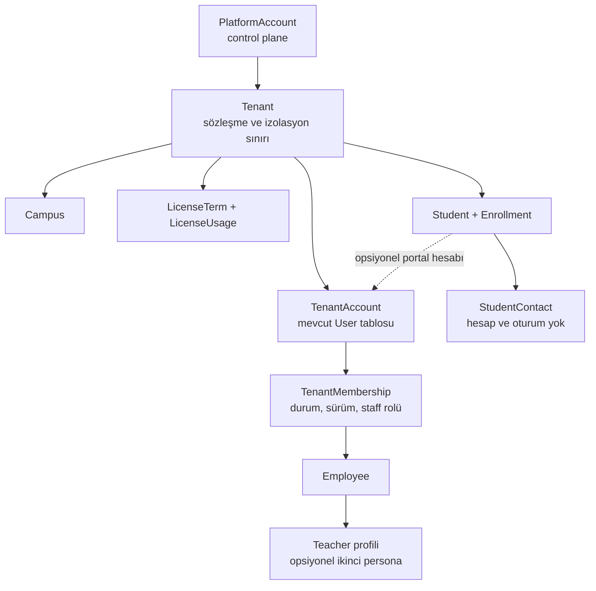

# O-Okul Kurum, Kullanıcı ve Hesap Yönetimi Mimarisi

**Durum:** Onaylı kararların kontrollü uygulama ve kapanış planı; P0/P1 açıkları devam ediyor
**Tarih:** 1 Ağustos 2026; son kontrol 5 Ağustos 2026
**Kapsam:** Özel okul ve özel öğretim kurslarına yıllık veya çok yıllık kiralanacak O-Okul için kurum, çalışan, öğretmen, öğrenci, hesap, lisans ve erişim yönetimi

## 1. Mimari karar özeti

O-Okul'un mevcut shared PostgreSQL + FORCE RLS çok kiracılı yapısı korunacaktır. Yeniden kurulması gereken bölüm; lisans, kullanıcı hesabı, çalışan profili, rol, oturum ve öğrenci kapasitesinin birbirinden ayrılmasıdır.

Kilitlenen ürün kararları:

- Bir sözleşmeli müşteri bir `Tenant` olacak; şubeler mevcut `Campus` yapısıyla tenant altında kalacak.
- Öğrenci profili zorunlu, öğrenci portal hesabı opsiyonel olacak.
- Veli rolü, hesabı, oturumu ve portalı kaldırılacak. Yeni yapıda yalnız hesapsız `StudentContact` bulunabilecek.
- Fiyatlama aktif öğrenci kotasına göre yapılacak; personel hesapları ücretli koltuk sayılmayacak.
- Hesaplar tenant-local olacak; aynı kişi farklı kurumlarda ayrı hesap kullanacak.
- Çalışan aynı zamanda öğretmense tek hesap kullanacak, fakat `STAFF` ve `TEACHER` personaları arasında geçiş yapacak.
- Altı sabit paket olacak: kurum sahibi, kurum yöneticisi, operasyon çalışanı, finans çalışanı, öğretmen ve öğrenci.
- Yetkiler özel rol oluşturucu yerine sabit paket + tenant/kampüs/atama kapsamı ile verilecek.
- Lisans bitiminde 14 gün salt-okunur, 15-90. günler arası dondurulmuş saklama, 91. günde kontrollü imha süreci uygulanacak.
- Kurum açılışı imzalı sözleşme sonrasında platform yöneticisi tarafından yapılacak; self-service satın alma kapsam dışı kalacak.
- Güncel kanonik giriş, `DEC-20260804-01` ve 5 Ağustos 2026 ürün sahibi teyidi uyarınca kurum subdomaini + tenant-local kullanıcı kimliğidir. Global kullanıcı adı kapsam dışıdır. T.C. kimlik numarası kullanıcı adı olmayacak.
- T.C. kimlik numarası yalnız belgelenmiş MEB/import ihtiyacında, opsiyonel ve korumalı tutulacak.
- İlk yük kabul hedefi tenant başına 10.000 öğrenci, 1.000 çalışan ve 20 kampüs olacak. Runtime güvenlik sınırı tenant başına 2.000 aktif çalışan hesabıdır. Bir subdomain bir tenant'a bağlandığı için bu sınırlar pratikte kurum subdomaini başına uygulanır; personel hesapları ücretli koltuk değildir.
- Guardian ürün kapsamından çıkarılacaktır. Mevcut guardian verisinin tamamının test verisi olduğu teyit edildi; yine de fiziksel silme öncesi otomatik envanter, yedek/restore makbuzu ve 14 günlük gözlem zorunlu olacak. Gerçek müşteri verisi görülürse işlem durur.

### Pazar ve mevzuat dayanağı

Türkiye'deki kurumsal ürünlerde yıllık sözleşme, role özel portal, toplu Excel/e-Okul aktarımı ve çok kampüslü yapı ortak örüntüdür. OkulumNET fiyatlamayı aktif öğrenci sayısına bağlayıp kullanıcı sayısını fiyat ölçüsü yapmıyor; K12NET kişi bazlı hesap ve rol portalları, K12Nova çok kampüslü kurumsal modeli öne çıkarıyor. Bunlar ürün beyanıdır; SLA, güvenlik sertifikası veya canlı entegrasyon kanıtı sayılmayacaktır. Kaynaklar: [OkulumNET fiyatları](https://okulumnet.com/fiyatlar), [K12NET ürün yapısı](https://k12net.com/okul-yonetim-yazilimi/), [K12Nova paketleri](https://k12nova.com/pricing).

O-Okul, MEB'in resmî kayıt sisteminin yerine geçtiğini iddia etmeyecek; e-Özel/e-Okul verileri içe aktarım ve uzlaştırma kaynağı olarak ele alınacaktır. Kaynak: [MEB e-Özel](https://ookgm.meb.gov.tr/e-ozel/index.php).

Varsayılan B2B hukuki modelde kurum veri sorumlusu, O-Okul talimatla çalışan veri işleyen olacaktır. T.C. kimlik numarası yerine daha az müdahaleci tanımlayıcılar kullanılacak; aydınlatma ile açık rıza ayrı ve sürümlü tutulacaktır. Bu maddeler uygulama gereksinimidir, hukuki görüş yerine geçmez. Kaynaklar: [KVKK veri sorumlusu/veri işleyen rehberi](https://www.kvkk.gov.tr/Icerik/4195/Veri-Sorumlusu-ve-Veri-Isleyen), [T.C. kimlik numarası rehberi](https://www.kvkk.gov.tr/Icerik/7798/Turkiye-Cumhuriyeti-Kimlik-Numaralarinin-Islenmesi-Hakkinda-Rehber), [2026/347 sayılı KVKK duyurusu](https://www.kvkk.gov.tr/Icerik/8710/veri-sorumlulari-tarafindan-acik-riza-ve-aydinlatma-metinlerinin-ayri-ayri-duzenlenmesi-gerektigi-hakkinda-kisisel-verileri-koruma-kurulunun-18-02-2026-tarihli-ve-2026-347-sayili-ilke-kararina-iliskin-kamuoyu-duyurusu).

### Mevcut repo değerlendirmesi

- **Korunacak:** Tenant/Campus yapısı, composite tenant FK'leri, FORCE RLS, tenant transaction context, HttpOnly refresh cookie, CSRF, refresh-family modeli ve TOTP temeli.
- **Kritik düzeltilecek:** Telefon numarası başlangıç ve reset parolası olarak kullanılıyor; normal API fiziksel tenant silip cascade veri kaybı oluşturabiliyor.
- **Eksik:** Çalışan/üyelik kapatma durumu, işe giriş-çıkış, kampüs kapsamı, atomik rol değişimi ve session revoke, lisans dönem geçmişi, sözleşme sonrası imha süreci.
- **Uyumsuz:** Per-tenant `User` modelinde e-posta global unique; mevcut rol-rank modeli yüksek rolü düşük rol endpoint'ine otomatik kabul ediyor.
- **Performans borcu:** Öğrenci/öğretmen listeleri sayfalamasız; bazı aramalar tenant listesini Node'a taşıyıp bellekte filtreliyor.
- **Ürün çatışması:** `GUARDIAN` hâlen canonical rol, veri modeli, portal ve UAT sözleşmesinin parçasıdır. Önce yeni DEC ile eski karar supersede edilecek; runtime ve evidence seti migration tamamlanmadan erkenden değiştirilmeyecektir.
- Bu analiz repo/statik test gerçeğidir; güncel staging veya production capability kanıtı değildir.

Başlıca repo kanıtları:

- `packages/db/prisma/schema.prisma`
- `packages/shared-types/src/role-capabilities.ts`
- `apps/api/src/user-management/user-management.service.ts`
- `apps/api/src/tenant/tenant-store.ts`
- `apps/api/src/auth/auth.service.ts`
- `apps/api/src/context/request-context.middleware.ts`
- `docs/DECISIONS.md`
- `docs/product-journeys-v1.md`

## 2. Hedef veri, lisans ve erişim modeli



### Kurum ve lisans

- `Tenant`, müşteri, veri izolasyonu ve operasyonel durum sınırı olarak kalacak.
- `Tenant.status`: `PROVISIONING | ACTIVE | SUSPENDED | OFFBOARDING | CLOSED`.
- Mevcut `Campus`, tenant altındaki şube olarak kullanılacak. Tenant için `PRIVATE_SCHOOL | PRIVATE_TEACHING_COURSE | MIXED`, kampüs için okul/kurs birim tipi eklenecek.
- Mutable `plan/licenseStartsAt/licenseEndsAt/seatLimit` alanlarının ticari otoritesi yeni `LicenseTerm` olacak:
  - `tenantId`, `planCode`, `startsAt`, `endsAt`, `activeStudentLimit`, `cancelledAt`, oluşturan platform hesabı ve audit referansı.
  - Aralık `[startsAt, endsAt)` olacak; başlangıç bitişten küçük olmalı ve iptal edilmemiş dönemler çakışmamalı.
  - Bir veya birkaç yıllık dönem desteklenir. Yenileme eski kaydı değiştirmez, yeni dönem ekler.
  - Plan/kota değişikliği mevcut kaydı geriye dönük düzenlemek yerine yeni efektif segment üretir.
- `LicenseState` zamandan türetilir: `SCHEDULED | ACTIVE | READ_ONLY | FROZEN | EXPIRED | CANCELLED`.
- Erişim:
  - Başlangıçtan önce tenant girişi kapalıdır.
  - Aktif dönemde normal erişim vardır.
  - Bitiş anından 14. gün sonuna kadar okuma ve dışa aktarma vardır; yazma yoktur.
  - 15-90. günlerde kullanıcı girişi kapanır; yalnız doğrulanmış kurum sahibi talebiyle kontrollü export yapılabilir.
  - 91. günde legal hold ve veri sınıfı saklama kuralları ayrılarak silme/anonimleştirme işi açılır; imha makbuzu tutulur.
- `LicenseUsage` aktif öğrenci sayısını transaction içinde günceller. Canonical tanım: silinmemiş, `Student.status=ACTIVE` ve bugün için tek açık `StudentEnrollment.status=ACTIVE`.
- Yeni aktivasyon kotayı aşarsa işlem atomik olarak `ACTIVE_STUDENT_LIMIT_REACHED` ile reddedilir. Ayrılan öğrenci kapasiteyi boşaltır; sözleşme dönemindeki tepe değer ve günlük snapshot yenileme/audit için saklanır.
- Uygulama ilerlemesi (2026-08-01): canonical aktif öğrenci sayımı, tek açık aktif enrollment kısıtı, transaction içi kota reddi ve günlük `LicenseUsage.current/peak` güncellemesi local/statik kontroller ile izole PostgreSQL 17 üzerinde doğrulandı. Tenant + kampüsler + ilk lisans dönemi + ilk `TENANT_OWNER` çalışanı ve aktivasyon teslimatı da platform-scope idempotency kaydıyla tek transaction'a alındı. Staging/canlı kanıt üretilmedi.
- Çalışan hesapları ücretli değildir. Kötüye kullanım ve operasyon güvenliği için tenant başına varsayılan 2.000 aktif çalışan hesabı teknik sınırı bulunur; platform tarafından gerekçeli ve auditli artırılabilir.
- Ödeme, fatura, tahsilat veya self-service abonelik bu mimarinin kapsamına girmeyecek.

### Hesap, üyelik ve kişi profilleri

- Mevcut DB tablosu ilk aşamada `User` olarak kalacak; public sözleşmede anlamı `TenantAccount` olacak. Riskli ve değersiz bir tablo adı migration'ı yapılmayacak.
- Tenant kullanıcılarında `tenantId` zorunlu olacak. Platform kullanıcıları ayrı `PlatformAccount` ve `PlatformSession` tablolarına taşınacak.
- `TenantAccount`:
  - `loginName`, `loginNameNormalized`, opsiyonel e-posta, parola hash sürümü ve `PENDING_ACTIVATION | ACTIVE | LOCKED | DISABLED` durumu.
  - `(tenantId, loginNameNormalized)` ve `(tenantId, lower(email))` tenant-scope unique.
  - Çalışan varsayılan giriş adı e-posta veya çalışan numarası; öğrenci varsayılanı öğrenci numarası/üretilmiş kullanıcı adıdır.
- T.C. kimlik numarası hesap açma veya login için zorunlu olmayacak. Gerekliyse envelope encryption ile şifreli değer ve anahtarlı tenant-scope HMAC/blind index saklanacak; API/UI varsayılan olarak yalnız maskeli gösterim verecek.
- `TenantMembership`, tenant başına hesap için tek satır olacak:
  - `status: ACTIVE | SUSPENDED | ENDED`
  - `version`, başlangıç/bitiş zamanı, kapatma nedeni ve actor/audit referansı.
  - Durum, rol veya scope değişikliği aynı transaction'da `version` artırıp bütün session'ları iptal edecek.
- `Employee`, idari çalışan kimliği olacak; hesap bağı opsiyonel tutulacak. İşe başlamadan profil hazırlanabilecek, daha sonra davet gönderilebilecek.
- `Teacher`, zorunlu olarak bir `Employee` uzmanlaşması olacak. Ders/sınıf/öğrenci erişimi `TeacherAssignment` üzerinden türetilecek.
- `Student` eğitim kaydı olarak kalacak; portal hesabı opsiyonel olacak. Profil silme/pasifleştirme portal erişimini ve session'ları aynı transaction'da kapatacak.
- `StudentContact`, ad/soyad, ilişki türü, gerekli telefon/e-posta ve iletişim izinlerini taşıyacak; hiçbir `User`, membership, invitation veya session oluşturmayacak.

### Roller, kapsam ve persona

Sabit role paketleri:

| Paket | Kapsam ve yetki |
|---|---|
| `TENANT_OWNER` | Tenant geneli; sahip/admin atama, güvenlik, audit ve veri export. Lisans koşullarını değiştiremez. Son aktif sahip kapatılamaz. |
| `TENANT_ADMIN` | Tenant geneli; çalışan, öğrenci, akademik yapı ve kurum ayarları. Sahip atayamaz, lisans/purge yapamaz. |
| `OPERATIONS_STAFF` | Tenant veya seçili kampüsler; kayıt, öğrenci, sınıf, sınav, devam, duyuru ve import. Finans, güvenlik ve geniş audit yetkisi yok. |
| `FINANCE_STAFF` | Tenant veya seçili kampüsler; ödeme planları ve finans işlemleri, yalnız gerekli öğrenci kimlik özeti. Akademik sonuçlara erişemez. |
| `TEACHER` | Yalnız aktif öğretmen atamalarındaki kampüs, sınıf, ders ve öğrenciler. |
| `STUDENT` | Yalnız kendi portal verisi. |

- Bir üyelikte en fazla bir staff paketi bulunacak; buna opsiyonel öğretmen personası eklenebilecek.
- Öğrenci personası çalışan personasıyla aynı hesapta birleştirilmeyecek.
- Kullanıcı her oturumda `STAFF`, `TEACHER` veya `STUDENT` personasından birini seçer. Token ve session `tenantId + membershipId + activePersona + membershipVersion + subjectId` bağlamına sahip olur.
- Farklı personaların capability'leri birleşmez.
- Rank tabanlı `hasRole >= requiredRole` kaldırılır. Endpoint'ler exact capability ve scope kontrolü kullanır.
- `SYSTEM_ADMIN` tenant rolü olmaktan çıkar; ayrı control plane hesabı olur. Tenant verisine varsayılan erişimi yoktur. Breakglass erişimi MFA, gerekçe, ticket, 30 dakikalık süre ve append-only audit gerektirir.

### Public API ve shared contract değişiklikleri

- `POST /tenants`, tenant + ilk `LicenseTerm` + kampüsler + ilk `TENANT_OWNER` çalışan profili ve davetini tek idempotent iş akışında oluşturacak; parola/telefon kabul etmeyecek.
- `POST /tenants/:id/license-terms` yenileme veya planlı dönem ekleyecek.
- `DELETE /tenants/:id` kaldırılacak ve geçiş sürümünde `410 TENANT_HARD_DELETE_RETIRED` döndürecek.
- Yerine `POST /tenants/:id/offboarding` durum geçişini başlatacak. Fiziksel purge yalnız ayrı privileged worker, çift platform onayı, retention bitişi ve yedek/export makbuzuyla çalışacak.
- `/tenant-users` eski sözleşmesi kullanımdan kaldırılacak:
  - `GET /tenant-memberships` cursor sayfalama, rol, durum, kampüs ve arama filtreleri;
  - `POST /employees`;
  - `POST /employees/:id/account-invitations`;
  - `PATCH /tenant-memberships/:id` için beklenen `version`, staff rolü, kampüs scope'ları ve lifecycle durumu.
- `POST /students/:id/portal-invitations` ve `PATCH /students/:id/portal-access` opsiyonel öğrenci hesabını yönetecek.
- `POST /auth/activate`, `POST /auth/password-reset/request`, `POST /auth/password-reset/confirm` tek kullanımlık token akışlarını taşıyacak.
- `POST /auth/persona/switch`, yeni persona bağlamında yeni access/session sürümü üretecek.
- `GET /me`, `membership`, `activePersona`, `availablePersonas`, exact capabilities, scopes ve account durumunu döndürecek.
- `StudentContact` işlemleri `/students/:studentId/contacts` altında olacak.
- Liste cevapları mevcut API envelope'u içinde `data.items` ve `meta.nextCursor`/`meta.previousCursor`
  biçiminde, varsayılan 50 ve azami 100 kayıt taşıyacak.
- Eski tenant lisans alanları bir geçiş süresince yeni modelden hesaplanan deprecated mirror olarak kalacak.
- Shared types, Zod doğrulamaları ve OpenAPI aynı PR'da güncellenecek.

## 3. Güvenlik, performans ve operasyon kuralları

### Kimlik ve oturum

- Telefon numarası hiçbir koşulda parola veya reset parolası olmayacak.
- Çalışan daveti: 256-bit tek kullanımlık token, 24 saat süre, invitation tablosunda yalnız hash.
- Öğrenci aktivasyonu: yetkili kurum çalışanına bir kez gösterilen QR/12 karakterlik yüksek entropili kod, 24 saat süre ve deneme limiti.
- Reset bağlantısı 30 dakika geçerli olacak; başarıda tüm session aileleri iptal edilecek.
- Transactional outbox secret payload'u envelope-encrypted olacak, log/audit'e girmeyecek ve teslim/expiry sonrasında silinecek.
- Parola:
  - MFA'sız hesaplarda en az 15 karakter, en az 128 karakter kabulü;
  - composition kuralı ve periyodik zorunlu değiştirme yok;
  - yaygın/ele geçirilmiş parola blocklist'i, paste ve password manager desteği;
  - async, sürümlü ve rastgele salt'lı `scrypt`; mevcut hashler başarılı login sırasında kademeli rehash edilir.
- Bu yaklaşım NIST'in güncel parola ilkeleriyle uyumlu kurulacak. Kaynak: [NIST SP 800-63B](https://pages.nist.gov/800-63-4/sp800-63b.html).
- MFA, `PlatformAccount`, `TENANT_OWNER`, `TENANT_ADMIN`, `OPERATIONS_STAFF` ve `FINANCE_STAFF` için aktivasyonun parçası olacak. Öğretmende önerilir, öğrencide zorunlu değildir.
- Sahip/admin değişimi, MFA reseti, geniş PII export ve purge onayında step-up MFA uygulanacak.
- Refresh rotation DB row lock/CAS ile yapılacak; aynı tokenla paralel N istekte tam bir başarı olmalı.
- Session doğrulaması canlı account/membership durumu ve membership version kontrolü yapacak. Yetkilendirme doğruluğu Redis cache'e bağlanmayacak.
- Proxy trust boundary sabitlenecek: Traefik gelen XFF'yi temizleyecek, API yalnız allowlist proxy'den gelen adresi kabul edecek. Login account+tenant ve güvenilir kaynak IP ile; MFA challenge ise challenge kimliğiyle ayrıca limitlenecek.
- Kullanıcı cihaz/session listesini görebilecek ve tek cihazı veya tüm cihazları iptal edebilecek.

### Veri ve tenant güvenliği

- Shared PostgreSQL korunacak. Bütün yeni tenant tabloları aynı migration'da composite tenant FK, `ENABLE/FORCE RLS`, `USING` ve `WITH CHECK` politikası alacak.
- Tenant uygulama DB rolü ile dar auth/control-plane rolü ayrılacak; `BYPASSRLS` ve tablo sahibi yetkileri normal API prosesine verilmeyecek. PostgreSQL'de owner ve `BYPASSRLS` rollerinin RLS'yi aşabildiği ayrıca test edilecek. Kaynak: [PostgreSQL RLS](https://www.postgresql.org/docs/17/ddl-rowsecurity.html).
- Audit kayıtları app rolü için append-only olacak; actor account/membership/persona, request correlation, sonuç ve hedef ID taşıyacak. E-posta, telefon, T.C., parola ve token metadata'ya yazılmayacak.
- StudentContact telefon/e-postası maskeli response, field encryption ve kontrollü exact-match indeksi kullanacak. Öğretmen varsayılan olarak iletişim verisini göremeyecek.
- Kurum kapatma: `OFFBOARDING -> export -> legal hold ayrımı -> freeze -> purge/anonimleştirme -> imha makbuzu`. İmha işlem kayıtları en az üç yıl korunacak. Kaynak: [KVKK İmha Yönetmeliği](https://www.kvkk.gov.tr/Icerik/5441/KISISEL-VERILERIN-SILINMESI-YOK-EDILMESI-VEYA-ANONIM-HALE-GETIRILMESI-HAKKINDA-YONETMELIK).
- E-posta, hata izleme, CDN, yedek ve destek sağlayıcıları alt işleyen envanterinde veri konumu ve yurt dışı aktarım mekanizmasıyla kaydedilecek.

### Performans

- Öğrenci, çalışan ve hesap listeleri cursor pagination kullanacak; tüm tenant listesini Node'a taşıyan arama kaldırılacak.
- Arama SQL'de normalize ad, öğrenci/çalışan no ve yetkili e-posta alanları üzerinden indeksli çalışacak; mevcut trigram indeksleri sorgu planında gerçekten kullanılacak.
- Toplu import:
  - 5 MB dosya sınırı, dry-run, satır doğrulama ve idempotency korunur.
  - Veriler staging tablosuna batch insert edilir; tenant içi eşleştirme toplu yapılır.
  - Canonical publish all-or-nothing transaction ile Student/Enrollment/Employee/Account ilişkilerini oluşturur.
  - 5.000 satırda N+1 sorgu ve kısmi aktivasyon olmayacak.
- `LicenseUsage` ve peak count transactionally güncellenecek; gece reconciliation işi canonical enrollment sayımıyla sapmayı ölçüp fail-closed alarm üretecek.
- Akademik invariant'lar DB'ye taşınacak:
  - tarih başlangıcı bitişten küçük;
  - tenant başına tek açık öğrenci enrollment;
  - tek aktif akademik yıl/dönem;
  - öğretmen atamalarında idempotent doğal anahtar.
- Performans hedefleri:
  - Login p95 <= 350 ms;
  - session/authorization DB kontrolü p95 <= 25 ms;
  - 50 kayıtlık liste ve indeksli arama p95 <= 200 ms;
  - 5.000 satır import <= 60 saniye ve sıfır kısmi canonical kayıt;
  - 200 RPS smoke'ta API p95 <= 500 ms, hata oranı <%1;
  - son öğrenci kotası için 20 paralel istekte yalnız biri başarılı.

## 4. Uygulama dilimleri ve migration

### PR-0 - Ürün kararı

- Yeni DEC; tenant/kampüs sınırı, altı rol, persona, aktif öğrenci fiyatlaması, lisans yaşam döngüsü ve veli hesabının kaldırılmasını kilitler.
- Mevcut guardian runtime/UAT henüz kaldırılmaz.
- En küçük güvenli ilk PR budur; schema veya runtime değişikliği içermez.

### PR-1 - Acil auth güvenliği

- Telefon-parolası ve telefonla reset kaldırılır.
- Aktivasyon/reset tokenları, password policy, async scrypt, session revoke ve gerçek e-posta outbox akışı eklenir.
- Güvenli e-posta sağlayıcısı canlı delivery smoke vermeden kullanıcı onboarding'i production-ready sayılmaz.

**Repo ilerleme notu (2 Ağustos 2026):** Reset isteği tenant-local `loginName` ile nötr yanıt
verir; telefon reset kimliği değildir. Davet, ilk sahip aktivasyonu ve reset tokenı URL fragment'inde
taşınır ve web sayfası URL'yi temizler. `production` ve `staging` MFA ile secret-delivery anahtarı
eksikse fail-closed olur. Reset yeniden üretimi/kullanımı kullanıcı başına tek bekleyen token kuralını
transaction içinde korur; MFA sayaçları yalnız ileri gider. Bunlar yerel test ve statik sözleşme
kanıtıdır; gerçek e-posta teslimatı, MFA enrollment/recovery ve PostgreSQL eşzamanlılık canary'si
staging kanıtı bekler.

### PR-2 - Acil lifecycle ve edge güvenliği

- Normal tenant hard-delete 410 olur.
- Profil pasifleştirme account/membership/session kapatmayla atomikleşir.
- `licenseStartsAt` uygulanır.
- Refresh CAS, trusted proxy/XFF ve MFA challenge limiter tamamlanır.

**Repo ilerleme notu (1 Ağustos 2026):** Aktif öğrenci `PASSIVE`, `GRADUATED` veya
`TRANSFERRED` durumuna alınırken Student ve açık enrollment güncellemesi; bekleyen öğrenci daveti/outbox
sırrı, canonical öğrenci membership'i, hesap, aktif session ve öğrenci cihaz tokenı kapanışıyla aynı
PostgreSQL transaction'ına bağlanmıştır. Üyelik ve hesap membership sürümü birlikte artırılır; yeniden
`ACTIVE` yapmak portal erişimini sessizce açmaz. 94 migration uygulanmış izole PostgreSQL 17'de uygulama
rolüyle durum/sürüm/session/davet/outbox/device sonucu ve cross-tenant negatif senaryo doğrulanmıştır.
Bu staging veya production aktivasyon kanıtı değildir.

### PR-3 - Additive veri modeli

- `PlatformAccount`, `LicenseTerm`, `LicenseUsage`, membership lifecycle/scope, `Employee` ve `StudentContact` eklenir.
- Preflight; tenant içi case-insensitive e-posta çakışması, birden çok açık enrollment, role kombinasyonları, orphan profile/account ve guardian fixture sayılarını raporlar.
- Eski ve yeni şema dual-write çalışır; RLS/composite FK aynı migration'da gelir.

### PR-4 - Backfill ve kimlik kesimi

- Mevcut `TENANT_ADMIN -> TENANT_ADMIN`, ilk doğrulanmış admin -> `TENANT_OWNER`, `ASSISTANT_ADMIN -> OPERATIONS_STAFF` olarak eşlenir.
- Öğretmenler için Employee, hesaplar için tek membership ve persona bağları oluşturulur.
- Global e-posta unique kısıtı tenant + lowercase unique'e dönüştürülür.
- Eski/yeni membership, login, rol ve session sonuçları parity checker ile karşılaştırılır.

**Repo ilerleme notu (1 Ağustos 2026):** Backfill/APPLY sözleşmesi, tenant-scope `loginName`
girişi ve canonical membership/persona runtime parity guard'ı uygulanmıştır. Geçişte session rol sonucu
legacy uyumluluğunu korur; canonical/legacy sapma, duplicate canonical satır veya membership version sapması
fail-closed olur. Access ve refresh canlı membership sürüm/rol kontrolü yapar. Bu not yerel/statik ve izole
PostgreSQL 17 kanıtıdır; exact-SHA staging aktivasyonu, 14 günlük gözlem ve rollback tatbikatı henüz kanıtlanmış
değildir.

### PR-5 - Lisans, kota ve kurum onboarding

- Mevcut tenant lisans snapshot'larından ilk LicenseTerm backfill edilir.
- Sözleşme sonrası tenant + kampüs + dönem + ilk sahip daveti atomik onboarding olur.
- Aktif öğrenci counter/peak, renewal, 14 günlük read-only ve 90 günlük kapanış akışları açılır.

**Repo ilerleme notu (1 Ağustos 2026):** Deterministik `LicenseState`, kanonik `LicenseTerm` runtime
okuması, legacy ayna parity guard'ı, login/refresh ve request erişim kesimi, eklemeli lisans dönemi endpoint'i,
DRY_RUN/APPLY backfill, aktif öğrenci transaction counter/peak ve canonical kurum onboarding uygulanmıştır.
Onboarding; tenant, kampüsler, ilk dönem, `TENANT_OWNER` Employee/membership, aktivasyon tokenı ve şifreli
teslimat outbox kaydını aynı transaction'da oluşturur. Platform-scope `Idempotency-Key` aynı gövdeyi replay
eder; farklı gövdeyi reddeder. Legacy tenant PATCH artık plan/tarih/kota kabul etmez. Sonuç yerel/statik ve
izole PostgreSQL 17 kanıtıdır; staging backfill/deploy kanıtı değildir.

### PR-6 - Yönetim UX ve performans

- "Kullanıcılar" yüzeyi "Çalışanlar ve Yetkiler", "Öğrenci Portal Erişimi" ve "Lisans Dönemleri" olarak ayrılır.
- Staff/teacher persona switch, lifecycle, kampüs scope ve session inventory ekranları eklenir.
- Cursor listeleri, DB arama ve staging tabanlı toplu import devreye alınır.

**Repo ilerleme notu (1 Ağustos 2026):** Tenant-scope salt-okunur lisans dönemi geçmişi,
canonical `LicenseState` gösterimi ve `/kurum/lisans-donemleri` yüzeyi uygulanmıştır. Ayrıca canonical
`Employee` ile hesap, staff rolü, öğretmen personası ve kampüs scope bağını birleştiren salt-okunur
`GET /api/v1/employees` projeksiyonu ile `/kurum/calisanlar` yüzeyi eklenmiştir. Endpoint'ler tenant
bağlamını ve ilgili capability'yi zorunlu tutar; Postgres okumaları explicit tenant RLS bağlamında
çalışır. OpenAPI, web rota envanteri ve dört zorunlu viewport smoke sözleşmesi güncellenmiştir. 93
migration uygulanmış izole PostgreSQL 17'de uygulama rolüyle iki tenantın çalışan sonuçları ayrışmıştır.
`/kurum/ogrenci-portal-erisimi` yüzeyi; Student, maskeli davet, tenant hesabı, canonical öğrenci üyeliği
ve aktif session sayısını `GET /api/v1/students/portal-access` cursor listesinde birleştirir. Ad/öğrenci
no/yetkili e-posta araması SQL'e taşınmış; cursor, hesap e-postası ve bekleyen davet e-postası indeksleri
eklenmiştir. 94 migration uygulanmış izole PostgreSQL 17'de ileri/geri cursor, cross-tenant negatif ve
gerçek query plan index kullanımı doğrulanmıştır. `PATCH /api/v1/students/:id/portal-access`, beklenen
membership sürümüyle erişimi açıp askıya alır; stale yazıyı reddeder, sürümü artırır ve aktif session'ları
aynı transaction'da iptal eder. `POST /api/v1/students/:id/portal-invitations`, yetkili kurum çalışanına
yalnız response'ta bir kez gösterilen, 24 saat geçerli, 12 karakter/60 bit öğrenci kodu üretir; veritabanı
yalnız hash ve deneme sayısını saklar. Aktivasyon bağlantısı kodu server/proxy erişim loglarına taşımayan URL
fragment'ı kullanır. `POST /api/v1/auth/activate`, tenant slug + öğrenci no + kodla hesabı,
canonical `STUDENT` membership'ini ve Student bağını tek transaction'da oluşturur; beş yanlış denemede kodu
kilitler ve replay'i reddeder. Davet/aktivasyon yazısı transaction anında yalnız aktif ve legacy mirror ile
eşleşen lisans döneminde çalışır. E-posta/T.C. gerekmez, staff koltuğu tüketilmez. Eski çalışan e-posta daveti aynı
aktivasyon sayfasında korunmuştur. 95 migration uygulanmış izole PostgreSQL 17'de uygulama rolüyle hash-only
saklama, deneme sayacı, atomik bağlar, replay ve cross-tenant negatif senaryo doğrulanmıştır; OpenAPI 223 path
üretmiştir. `PATCH /api/v1/tenant-memberships/:id`; beklenen sürümle tek staff rolü + opsiyonel öğretmen
personası, tenant/seçili kampüs kapsamı ve `ACTIVE | SUSPENDED | ENDED` erişim yaşam döngüsünü yönetir.
Canonical membership kimliği korunurken geçiş dönemi legacy rol satırları aynı transaction'da senkronlanır;
hesap membership sürümü artırılır ve aktif session'lar iptal edilir. Güvenlik nedeniyle `LOCKED` hesap rol/scope
değişiminde açılmaz, tenant admin sahip atayamaz ve son aktif sahip kapatılamaz. `/kurum/calisanlar` yüzeyi bu
yazıları sürümlü form üzerinden sunar. 95 migration uygulanmış ayrı bir PostgreSQL 17 container'ında uygulama
rolüyle iki session'ın atomik iptali, stale version, cross-tenant negatif, suspend/activate/end/replay, legacy
teacher parity ve son sahip koruması doğrulanmış; OpenAPI 224 path üretmiştir. Bu staging/canlı kanıtı değildir.
Yeni invariantları aşan eski `PATCH /tenant-users/:userId/roles` yazısı `410 TENANT_USER_ROLE_WRITE_RETIRED`
ile kapatılmış, `/kurum/kullanicilar` yalnız geçiş listesi olarak bırakılıp canonical çalışan yönetimine
yönlendirilmiştir.
Canonical session ve access token artık `membershipId + activePersona + membershipVersion` bağlamını taşır.
Staff + teacher hesap girişte yalnız `STAFF` capability kümesini alır; `POST /auth/persona/switch` eski session'ı
aynı store transaction'ında kapatıp yalnız hedef personanın rollerini ve subject bağını taşıyan yeni session
üretir. Web shell geçiş sonrası persona cache'ini temizler. `GET /me/profile` aktif/uygun personaları, exact
capability kümesini ve membership özetini döndürür. `GET /me/sessions`, tekil `DELETE /me/sessions/:id` ve
tümünü kapatan `DELETE /me/sessions` kullanıcı + tenant sahipliğiyle çalışır; refresh hash ve token family
dışarı verilmez. Oturumlar ham user-agent veya tam IP yerine normalize cihaz etiketi, yaklaşık ağ prefix'i ve
`lastSeenAt` taşır; refresh son etkinliği güncellerken cihaz kimliğini değiştirmez. `/hesap/oturumlar` ekranı
mevcut oturumu işaretler, tek cihazı veya bütün cihazları kapatır ve bütün persona/rol yüzeylerinden erişilebilir.
97 migration uygulanmış izole PostgreSQL 17'de uygulama rolüyle `STAFF -> TEACHER` atomik session değişimi,
cihaz metadata saklama/refresh güncellemesi, tenant RLS ayrışması, cross-tenant iptal reddi ve tümünü kapatma
doğrulanmış; OpenAPI 227 path, web rota envanteri 78 sayfa üretmiştir. Bu staging/canlı aktivasyon kanıtı değildir.
`POST /employees`, çalışan profilini hesap ve üyelik oluşturmadan `PLANNED | ACTIVE` durumda açar;
`POST /employees/:id/account-invitations` yalnız aktif ve hesapsız profile 24 saatlik e-posta daveti üretir.
Kabul akışı T.C. kimlik numarası istemeden tenant hesabını, canonical staff membership'ini ve Employee bağını
kurar. Token/hash response ve audit'e çıkmaz; teslimat şifreli outbox üzerinden ilerler. Bu aşamada owner/admin
başlangıç rolleri kabul zinciri tek transaction'a alınana kadar endpoint'te kapalı tutulmuş, yalnız
operasyon/finans rolleri açılmıştır. Çalışan yüzeyi profil oluşturma ve satır bazlı hesap davetini sunar. 97
migration uygulanmış izole PostgreSQL 17'de
hesapsız profil, T.C.'siz hesap, canonical membership projeksiyonu ve cross-tenant negatif doğrulanmış; OpenAPI
228 path üretmiştir. Bu staging/canlı teslimat kanıtı değildir.
`POST /auth/step-up`, TOTP veya tek kullanımlık recovery code doğrulamasından sonra beş dakika geçerli,
amaç-kullanıcı-session-membershipVersion bağlamlı imzalı kanıt üretir. `PATCH /tenant-memberships/:id`, mevcut
veya hedef staff rolü `TENANT_OWNER | TENANT_ADMIN` olduğunda bu kanıtı transaction içindeki kilitli canonical
üyelik satırına göre zorunlu tutar; terfi kadar rol düşürme, askıya alma ve kapsam değişimi de korunur. Kanıt
başka oturumda, başka üyelik sürümünde veya başka amaçla kullanılamaz; token ve MFA kodu audit'e yazılmaz.
`/kurum/calisanlar` hassas değişiklikte MFA/recovery kodunu ister, kısa ömürlü kanıtı yalnız takip eden üyelik
yazısının `X-Step-Up-Token` başlığında kullanır. API testleri 133 dosya/926 senaryo, ilgili web Playwright akışı
ve OpenAPI 229 path yerelde geçmiştir. Bu staging/canlı MFA kanıtı değildir.
Çalışan e-posta daveti kabulü daha sonra invitation kilidi, aktif lisans eşliği, Employee profili, tenant-local
User, canonical/legacy membership satırları, Employee bağı ve şifreli outbox temizliğini tek PostgreSQL
transaction'ında birleştirecek şekilde güçlendirilmiştir. Tenant satırı kullanıcı yazısından önce
`FOR NO KEY UPDATE` ile kilitlenir; aynı kilit sırası genel tenant kullanıcı oluşturma yolunda da korunur.
Çalışan hesabı sınırı öğrenci `seatLimit` kotasından ayrılmış, aktif ve hesaba bağlı Employee sayısı üzerinden
varsayılan 2.000 olarak uygulanmıştır; platform control-plane üzerinden auditli limit artırma yüzeyi henüz
uygulanmamıştır. Paralel son çalışan hesap hakkı yarışı, replay, son-adım rollback'i, öğrenci hesabıyla birleşme
reddi ve diğer tenantın değişmemesi 97 migration uygulanmış izole PostgreSQL 17'de uygulama rolüyle
doğrulanmıştır. Bu atomik kabul kanıtından sonra `TENANT_ADMIN` başlangıç daveti bağlı step-up kanıtıyla,
`TENANT_OWNER` başlangıç daveti ise ek olarak `owner:manage` capability'siyle açılmış; web formu MFA/recovery
kodundan aldığı kısa ömürlü kanıtı yalnız davet isteğinin `X-Step-Up-Token` başlığında gönderecek şekilde
güncellenmiştir. OpenAPI 229 path üretmiştir. Bu staging/canlı e-posta teslimatı veya MFA kanıtı değildir.
`GET /employees` 2 Ağustos'ta SQL aramalı, tenant/filtre/sıra bağlı opaque cursor ve ileri/geri meta
ile dönüştürüldü; eski `page` parametresi `422` döndürür ve `/kurum/calisanlar` yerel cursor denetimini
kullanır. Staging-tablosu tabanlı toplu import henüz tamamlanmamıştır; öğrenci, geçiş `tenant-users` ve
identity invitation gibi kalan legacy liste yüzeyleri de ayrı cursor/DB sorgu dilimlerine taşınmalıdır.

`SecretDeliveryOutbox` için ayrı worker DB sınırının additive hazırlığı 2 Ağustos'ta eklendi:
production worker artık `secret_delivery_worker` rolüne ait ayrı DSN olmadan açılmaz; idempotent rol bootstrap'ı
staging migration'ından önce çalışır ve rol yalnız outbox `SELECT/UPDATE` yetkisi alır. Mevcut `app` grant'leri
bu dilimde geri alınmadı. Revoke/cutover ancak ayrı credential ile staging teslimat, retry ve payload temizleme
kanıtı alındıktan sonra ayrı ve geri alınabilir bir değişiklik olarak yapılacaktır.

### PR-7 - Guardian emekliliği

- Preflight guardian kayıtlarının yalnız test/fixture olduğunu kanıtlar; veri sahibi onayı ve yedek makbuzu olmadan silme yapılmaz.
- Yeni guardian üretimi durdurulur; roller, invitation/session, portal rotaları, OpenAPI ve fixture'lar kaldırılır.
- Hedef `StudentContact` modeli temiz olarak başlatılır; eski guardian verisi dönüştürülmez.
- Preflight gerçek müşteri verisi bulursa bu PR hard-stop olur ve hiçbir guardian kaydı silinmez.
- Eski tablolar parity ve 14 günlük gözlem tamamlanmadan drop edilmez.

### PR-8 - Evidence, pilot ve kapanış

- Üç guardian UAT emekliye ayrılır; çalışan lifecycle/persona, kampüs negatif erişim, opsiyonel öğrenci aktivasyonu, lisans yenileme/kota ve offboarding senaryoları eklenir. Canonical sayı 21'den 23'e çıkar.
- Journey, UAT generator/checker, evidence templates, rollback ve production plan aynı değişiklik zincirinde güncellenir.
- Önce synthetic 10k öğrenci tenant yük testi, ardından en az 14 günlük kontrollü pilot yapılır.
- Local/CI PASS, staging exact-SHA aktivasyonu ve production/pilot kanıtı ayrı raporlanır.

Rollback, additive migration ve tenant bazlı cutover flag'i üzerinden yapılacak. Guardian fixture temizliği ve eski kolon/table drop işlemleri irreversible eşik kabul edilecek; bu eşikten önce doğrulanmış backup restore denemesi bulunacak.

## 5. Test ve kabul planı

### Zorunlu davranış testleri

- Aynı e-posta iki tenantta kullanılabilir; tenant kodu olmadan kurum hesabı aranmaz.
- Tenant veya campus ID istemci tarafından değiştirilse bile çapraz tenant/campus okuma-yazma sıfırdır.
- Staff personasındaki capability teacher personasına, teacher capability staff personasına sızmaz.
- Operasyon çalışanı finans verisine; finans çalışanı akademik sonuçlara erişemez.
- Öğretmen yalnız atanmış sınıf/öğrenci/dersi, öğrenci yalnız kendisini görür.
- Suspend/terminate/rol düşürme sonrasında eski access ve refresh aynı anda reddedilir; revoke failure-injection testi bunu bozamaz.
- Telefon yeni veya reset parola olarak kabul edilmez; activation expiry/replay ve raw-token leakage testleri geçer.
- Forged XFF rate-limit anahtarını değiştiremez; MFA challenge beş başarısız denemeden sonra tüketilir.
- Sahip/admin terfi ve rol düşürme işlemi step-up olmadan reddedilir; kanıt başka session veya membership sürümünde kullanılamaz.
- Paralel refresh yarışında tam bir başarı vardır.
- Lisans başlangıcından hemen önce erişim yok; başlangıç anında aktif; bitiş anında read-only; 15. günde frozen; 91. günde purge gate açılır.
- Son öğrenci kapasitesi için paralel aktivasyonlarda limit aşılmaz; peak count doğru kalır.
- Normal API tenant graph'ını fiziksel silemez.
- Aktif guardian rolü, invitation, session, portal veya OpenAPI yolu kalmaz; StudentContact login üretemez.
- Audit/evidence çıktısı ham ad, T.C., telefon, e-posta, parola veya token içermez.

### Repo doğrulamaları

```sh
pnpm product-journeys:check
pnpm --filter @o-okul/shared-types typecheck
pnpm --filter @o-okul/db test
pnpm db:rls:check
pnpm tenant-db:check
pnpm audit-log-partition:check
pnpm --filter @o-okul/api typecheck
pnpm --filter @o-okul/api test
pnpm openapi:generate
pnpm web:token-storage:check
pnpm admin-mfa:check
pnpm rate-limit:check
pnpm security:audit:check
pnpm identity-migration:check
pnpm --filter @o-okul/web typecheck
pnpm web:a11y:check
pnpm web:ux-baseline:check
pnpm privacy:inventory:check
pnpm prod:plan:check
pnpm prod:evidence:templates:check
pnpm uat:check
pnpm run ci
```

Staging kapanışı ayrıca canlı e-posta aktivasyon/reset teslimatı, gerçek Traefik üzerinden forged-XFF testi, cross-tenant negatif RLS, MFA enrollment/recovery, synthetic kapasite testi ve GitHub SHA -> deploy run -> çalışan image tag'leri -> canlı endpoint zincirini gerektirir.

### Kapsam dışı ve varsayımlar

- Veli hesabı/portal bildirimi, self-service ödeme, fatura, CRM, SAML/OIDC, SCIM ve özel rol tasarımcısı kapsam dışıdır.
- E-posta sağlayıcısı bu planda seçilmiyor; mevcut provider adapter'ı kullanılır, gerçek sağlayıcı ve teslimat kanıtı olmadan go-live bloklanır.
- Guardian verisinin test verisi olduğu teyidi migration öncesi teknik envanter ve yazılı veri sahibi onayıyla yeniden doğrulanır.
- 90 günlük ticari saklama varsayılandır; kanuni saklama ve legal hold veri sınıfı bazında kurum/veri sorumlusu ve hukuk danışmanı tarafından ayrıca onaylanır.
- Ponytail kullanılmayacaktır.

## 6. Güncel kalan iş ve kapanış planı

Bu bölüm 5 Ağustos 2026 repo incelemesinin son halidir. Önceki PR ilerleme notlarını silmez;
kalan işi karar, repo uygulaması ve gerçek ortam kanıtı olarak ayırır. Yerel veya template `PASS`,
exact-SHA staging, production, pilot ya da go-live kanıtı değildir.

### P0 - Yeni cutover öncesi

1. **Sınav evidence sözleşmesini tekleştir.** iSEM smoke üreticisi, ortak smoke checker,
   live-exam-cycle checker, template ve production plan aynı fixture sayımlarını istemelidir.
   Üreticinin yazdığı UI-worker credential dosyası `loginName`, `tenantSlug`, `generatedAt` ve portal
   login alanlarıyla preflight ve Playwright sözleşmesini doğrudan geçmelidir.
   - UAT: `UAT-KURUM-05`, `UAT-KURUM-06`
   - Sahip: `exam_reporting_engineer`; doğrulama: `qa_verification_engineer`
   - Kabul: Üreticinin yazdığı gerçek artifact ek dönüşüm olmadan bütün checker'ları geçer; fixture
     sayıları kod, template ve planda birebir aynıdır.
   - Doğrulama: `pnpm prod:evidence:templates:check`, `pnpm live:ui-worker:evidence-contract`,
     disposable Postgres/Redis/S3 üzerinde `pnpm isem-optical-pipeline:smoke`,
     `pnpm live:ui-worker:smoke`, `pnpm live:ui-worker:result-check`, `pnpm live:exam-cycle:check`.

2. **Rank tabanlı RBAC ve legacy system-admin erişimini kapat.** `roleRank`/geniş `@Roles`
   kullanımları route ailesi bazında exact capability + active persona + tenant/campus/assignment
   kapsamına taşınır. `SYSTEM_ADMIN` tenant rolünden ayrı PlatformAccount/PlatformSession ve süreli,
   MFA'lı, gerekçeli breakglass akışına kesilir.
   - UAT: `UAT-SYS-01`, `UAT-SYS-04`, `UAT-TEACHER-03`
   - Sahip: `backend_api_engineer` ve auth diliminde `auth_session_engineer`; güvenlik incelemesi:
     `tenant_security_reviewer`
   - Kabul: STAFF capability'si TEACHER personasına ve tersi yönde sızmaz; scope dışı erişim 403/404;
     normal system-admin oturumu tenant verisine doğrudan giremez.
   - Doğrulama: `pnpm --filter @o-okul/api exec vitest run src/rbac src/auth src/tenant`,
     `pnpm db:rls:check`, `pnpm web:token-storage:check`, `pnpm admin-mfa:check`.

### P1 - Ürün ve pilot kapanışı

3. **StudentContact ve guardian geçişi:** Guardian'ın ürün kapsamından çıkarılması ürün sahibi tarafından
   onaylandı. Önce hesapsız StudentContact API/UX/import ve izin modeli açılır. Guardian üretimi ancak
   fixture envanteri, doğrulanmış yedek/restore makbuzu ve 14 günlük gözlemden sonra durdurulur. Gerçek
   müşteri verisi görülürse işlem hard-stop olur.
4. **Kalan hesap operasyonları:** Control-plane runtime, offboarding/purge worker, öğrenci ve legacy
   kullanıcı listelerinde cursor/SQL arama, staging-table toplu import ve auditli çalışan-limit artırma
   ayrı geri alınabilir dilimlerdir.
5. **Outbox yetki kesimi:** Gerçek staging provider teslimi, retry, expiry ve payload temizleme kanıtından
   sonra `app` rolünün SecretDeliveryOutbox grant'leri ayrı migration ile geri alınır.
6. **UAT kanıtını güçlendir:** Her scenario exact source SHA, environment, run id, zaman aralığı ve
   artifact digest'ine bağlanır. UAT-KURUM-06 web/PDF/Excel içerik eşitliğini yalnız indirme boolean'ı
   ile değil aynı snapshot alanlarının karşılaştırmasıyla kanıtlar.
7. **Canlı kapanış:** Canlı image SHA `3e460783b35436dbd33dbc534ce57e2139d40f3f` ile production
   alan adı ve wildcard DNS/TLS 5 Ağustos 2026'da aktive edildi. Kalan zincir: aynı SHA için CI kanıtı ->
   uygulamanın ürettiği davet/reset e-postasının gerçek inbox teslimi + MFA -> rol bazlı UAT -> pull edilebilir
   image rollback + restore tatbikatı -> en az 14 günlük pilot -> go-live. Daha önce doğrulanan Workspace
   mailbox/alias teslimatı bu uygulama-provider kanıtından ayrıdır.

### Manuel işler ve onaylar

| ID | Manuel iş veya onay | Sahip | Blokladığı eşik |
|---|---|---|---|
| MAN-01 | **KAPALI:** Subdomain + tenant-local login seçildi; global kullanıcı adı kapsam dışı. | Ürün sahibi | — |
| MAN-02 | **ÜRÜN ONAYI KAPALI:** Guardian kaldırılacak. Fiziksel silme için fixture envanteri, doğrulanmış backup/restore makbuzu ve 14 günlük gözlem hâlâ zorunlu. | Ürün/veri sahibi + ops | Guardian fiziksel temizliği |
| MAN-03 | **BU FAZ İÇİN RİSK KABULÜ:** Hukuk/KVKK incelemesi repo uygulamasını ve pilot hazırlığını bloklamaz. Bu kayıt hukuk onayı sayılmaz; production purge/go-live öncesi yeniden ele alınır. | Ürün sahibi; sonra veri sorumlusu + hukuk | Production purge/go-live |
| MAN-04 | **KAPALI:** Tenant başına 2.000 aktif çalışan hesabı runtime üst sınırı; 1.000 çalışan yük kabul hedefidir. Personel hesabı ücretli koltuk değildir. | Ürün sahibi | — |
| MAN-05 | **DNS/TLS KAPALI:** `*.o-okul.com` Cloudflare'da `DNS only` olarak `212.108.107.190` adresine yönlendirildi; Traefik origin sertifikası `o-okul.com` + `*.o-okul.com` için üretildi ve dış HTTPS/health testi geçti. Otomatik yenilemeyi gerçek yenileme olayında gözleme ve legacy 30 günlük yönlendirme başlangıcı açık. | Ops/release sahibi | Sertifika yenileme ve legacy kapanışı |
| MAN-06A | **TARİHSEL OLARAK KAPALI:** Workspace mailbox/alias dış gönderim ve alım testi yapıldı; exact-SHA uygulama testi yerine geçmez. | Messaging + tenant sahibi | — |
| MAN-06B | Uygulamanın gerçek notification provider üzerinden ürettiği davet/reset e-postasının test inbox teslim makbuzu; admin MFA enrollment/recovery kabulü. | Messaging + tenant sahibi | Onboarding/go-live |
| MAN-07 | Canlı image SHA `3e460783b35436dbd33dbc534ce57e2139d40f3f`; domain-cutover rollback yedeği `/root/o-okul-cutover-backups/20260805T161400Z`. `.env.release` içindeki `6f9c9cb...` rollback image'ları sunucuda yok; pull edilebilir bilinen-iyi image hedefi, pilot kurum ve nihai go/no-go imzası açık. | Release captain + ürün sahibi | Production go-live |

### En küçük güvenli ilk PR

İlk PR yalnız P0 listesinin ilk evidence maddesini düzeltir: iSEM fixture sayımları ve UI-worker credential
şekli producer/checker/template/plan boyunca teklenir ve doğrudan entegrasyon testi eklenir. DB şeması,
guardian runtime'ı, RBAC veya provider mutation bu PR'a girmez. Mevcut kirli support/notification
değişiklikleri önce ayrı bir branch/PR üzerinde korunmadan bu dilime başlanmaz.
