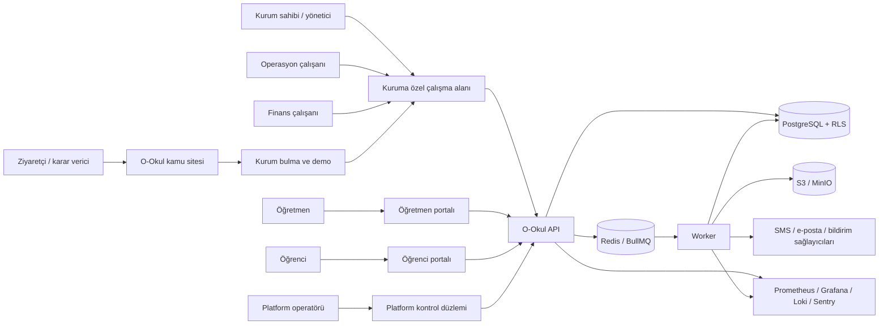
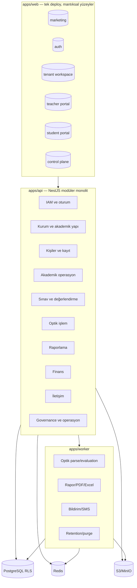
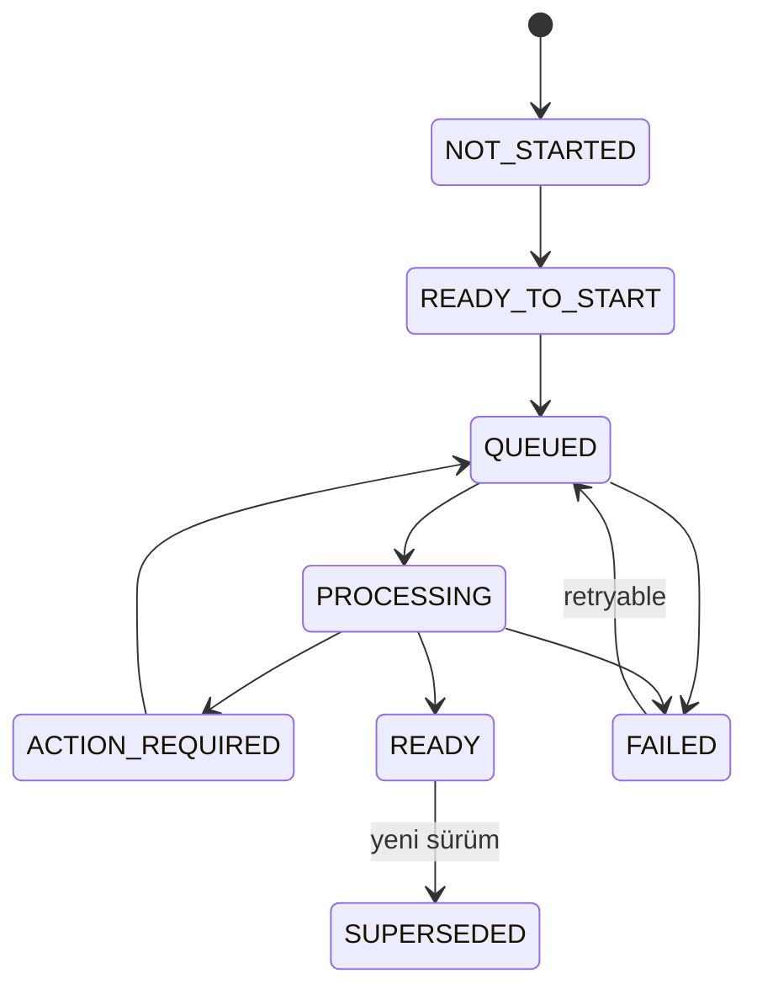
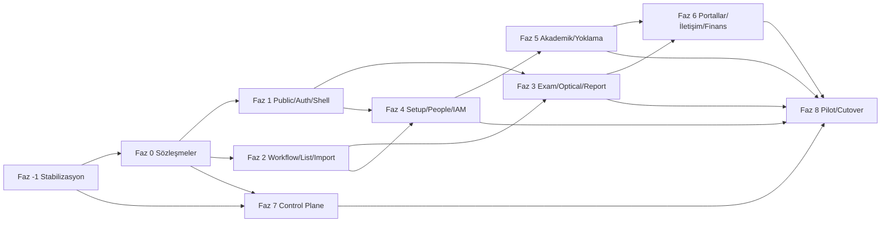
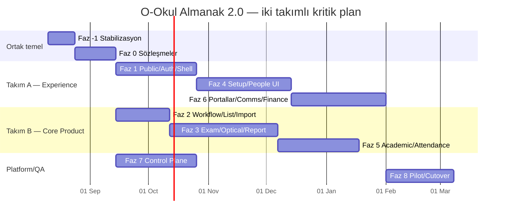

# O-Okul Almanak 2.0 — Kapsamlı Mimari Geliştirme ve Kademeli Dönüşüm Planı

**Tarih:** 9 Ağustos 2026\
**Kaynak rapor:** `o-okul.com Yeniden Tasarım ve Ürün Deneyimi Nihai Raporu`\
**Repo:** `4rmus/o-okul`\
**Plan baz alınan `main` snapshotı:** `af5dc5ad1572965709f0fc47f3bdf84a939e0626`\
**Güncel repo snapshotı:** `8a3ec5e640f4e29d66a6ad66d869d8159e1e021e`\
**Belge durumu:** Onaylı hedef mimari ve uygulama programı. Kanıt durumu aşağıdaki güncel ilerleme kaydından izlenir; bu belge tek başına canlı ortam kanıtı değildir.

---

## Güncel ilerleme ve ürün kararı — 23 Ağustos 2026

### Nerede kalındı?

- Gate A–C kapsamındaki güvenlik temeli, mimari sözleşmeler ve ilk yeni çalışma alanı repo/yerel düzeyde kuruldu.
- Gate D; sınav–optik–rapor, öğrenci, kurulum ve IAM için exact kaynak, CI ve staging kanıtlarıyla kapatıldı. Kanonik kayıt `docs/almanac-2-gate-d-evidence.md` dosyasıdır.
- Gate E hazırlığında provider, gözlemlenebilirlik, WAL/yedek ve canlı UAT kanıtlarının önemli bölümü üretildi. Son toplama çalışması eski sürüme dönüş kanıtını aradığı için tamamlanmadı; bu eksiklik aşağıdaki yeni ürün kararıyla pilot öncesi ayrı kapı olmaktan çıkarıldı.
- 23 Ağustos 2026 yerel uygulamasında Gate E otomasyonu schema v3 `forward-only-readiness` moduna uyarlandı. Exact-SHA cutover, dört servis ve restore kanıtı korunurken eski sürüme geçiş checkpoint'i kaldırıldı. Yerel sözleşme/template kontrolleri `PASS`; CI ve staging çalışması `EXTERNAL_NOT_RUN` durumundadır.
- İlk legacy UI diliminde `/kurum/uat-rollback` ekranı, navigasyon/manifest kaydı, özel testleri ve iki görsel snapshot'ı kaldırıldı. UAT matrisi ve checker/template kanıtı korundu; kalan 87 route ile operasyon/kanıt akışları 97 yerel tarayıcı testinde `PASS` oldu. CI ve dış ortam `EXTERNAL_NOT_RUN` durumundadır.
- İkinci legacy UI diliminde eski beş gruplu kurum navigasyonu kaldırıldı; yedi gruplu yeni navigasyon kanonik hale getirildi. Artık kullanılmayan `web.ia-v2` ve `web.shell-v2` rollout anahtarları shared/API/OpenAPI sözleşmesinden çıkarıldı; eski config anahtarları fail-closed reddedilir. API/shared/typecheck/OpenAPI/statik kontroller, 111 tarayıcı testi ve ana kurum yönetimi akışı yerelde `PASS`; CI ve dış ortam `EXTERNAL_NOT_RUN` durumundadır.
- Gate F pilot/go-live ve Gate G temizlik kapanışı henüz tamamlanmadı. Planın kalan büyük çalışma alanları Faz 5–8'dir; bazı alt dilimler uygulanmış olsa da her fazın güncel envanteri ayrı doğrulanacaktır.

### Onaylı yön değişikliği

1. Yeni ekranlar ve yeni veri modeli kanonik üründür; ürün eski ekranlara veya eski veri modeline geri döndürülmeyecektir.
2. Sorunlar yeni yapı üzerinde ileriye doğru düzeltilir. Eski sürüme dönüş provası Gate E veya pilot için ayrı bir kabul kapısı değildir.
3. Doğrulanmış yedek ve geri yükleme kabiliyeti veri kaybı/afet güvenliği için korunur. Bu, eski ürüne geri dönme mekanizması değildir.
4. Eski ekran, route, adapter, feature flag ve veri yapıları küçük ve bağımlılık sıralı dilimlerle kaldırılır. Gate G bu temizliğe başlama izni değil, temizliğin tamamlandığını doğrulayan kapanış kaydıdır.
5. Veri yapısının kaldırılması mevcut kayıtların silinmesi anlamına gelmez. Kayıtlar yeni yapıya taşınmadan, sayımlar eşleşmeden ve doğrulanmış yedek bulunmadan tablo/kolon fiziksel olarak kaldırılmaz.
6. Her temizlik diliminin kendi kapsamı, negatif tenant/yetki testleri, veri sayım kontrolü ve ileri-düzeltme planı olur. Bunlar yeni bir ürün gate'i değil, veri kaybını ve tenant sızıntısını önleyen dilim kabul kriterleridir.

Bu bölüm, belgenin eski ekrana dönüşü veya tarihsel fallback imajını zorunlu kılan önceki ifadelerine göre önceliklidir. Exact kaynak, CI, staging, provider, UAT, veri güvenliği ve pilot kanıtları zorunlu olmaya devam eder; yalnız eski ürün sürümüne dönüş koşulu kaldırılmıştır.

---

## Yönetici özeti

Bu plan, o-okul.com için hazırlanan tasarım ve ürün deneyimi raporunu; uygulanabilir mimari kararlar, bağımlılıklar, veri ve API sözleşmeleri, iş akışları, fazlar, PR dilimleri, kalite kapıları, rollout/rollback adımları ve modül sahiplikleri içeren bir geliştirme programına dönüştürür.

Temel mimari kararı şudur:

> **O-Okul mevcut modüler monolitini koruyacak; kamu sitesi, tenant çalışma alanı, öğretmen/öğrenci portalları ve sistem kontrol düzlemi aynı ürün ailesi içinde mantıksal olarak ayrılacak; kritik kullanıcı görevleri nested route, feature modülü ve açık workflow durum sözleşmeleriyle yeniden kurulacaktır.**

Bu dönüşümün ana hedefi yeni bir teknoloji yığını kurmak değildir. Asıl hedef:

- mevcut büyük istemci sayfalarını görev sınırlarına ayırmak,
- sınav → optik → değerlendirme → rapor zincirini tek çalışma alanı yapmak,
- tenant, persona, kampüs, dönem ve sınav bağlamını görünür ve doğrulanabilir hale getirmek,
- ürün modüllerini nesne listeleri yerine günlük kullanıcı işleri etrafında düzenlemek,
- UI, API, worker ve veri katmanı arasında ortak durum ve hata sözleşmeleri kurmak,
- mevcut RLS, capability, immutable snapshot, idempotency ve evidence yaklaşımını yeni deneyime taşımak,
- değişiklikleri tenant bazlı feature flag ve geri alınabilir migration dilimleriyle yayınlamaktır.

Planın kritik başlangıç koşulu, tasarım dönüşümünden önce repo içindeki iki mevcut P0 güvenlik/kanıt borcunun kapatılmasıdır:

1. iSEM/optik/rapor evidence producer–checker–template sözleşmesinin tekleştirilmesi.
2. Rank tabanlı RBAC ve tenant verisine doğrudan girebilen legacy `SYSTEM_ADMIN` modelinin exact capability + ayrı control-plane yaklaşımına kesilmesi.

Bu iki konu çözülmeden büyük UI cutover yapılması, yeni arayüzün eski güvenlik ve doğrulama belirsizliklerini yalnızca gizlemesine neden olur.

### Önerilen süre

| Ekip modeli | Kritik P0 ürün dönüşümü | Tam modüler dönüşüm ve pilot |
|---|---:|---:|
| Tek ürün takımı | 20–26 hafta | 36–44 hafta |
| İki paralel ürün takımı + ortak platform/QA | 12–16 hafta | 24–30 hafta |
| Üç paralel çalışma hattı | 10–14 hafta | 20–26 hafta |

Süreler gerçek kullanıcı testi, backend sözleşmesi değişiklikleri, guardian emekliliği, control-plane ayrımı ve staging/pilot kanıtlarına göre yeniden kalibre edilmelidir.

---

# 1. Planın amacı, kapsamı ve başarı tanımı

## 1.1. Amaç

Bu planın amacı, O-Okul’un:

- kamuya açık ürün anlatımını,
- kurum girişi ve kimlik deneyimini,
- kurum operasyon panelini,
- sınav/optik/rapor çekirdeğini,
- kişi ve akademik yapı modüllerini,
- öğretmen ve öğrenci portallarını,
- finans, iletişim ve destek yüzeylerini,
- platform operasyon ve evidence ekranlarını

tek bir tutarlı mimari program içinde dönüştürmektir.

## 1.2. Başarı tanımı

Dönüşüm aşağıdaki sonuçlar birlikte sağlandığında başarılı sayılır:

1. Bir kurum kullanıcısı ana görevini menü aramak yerine ilgili çalışma alanından tamamlayabilir.
2. Sınav bağlamı; cevap anahtarı, optik, karantina, değerlendirme ve rapor boyunca kaybolmaz.
3. UI hiçbir tenant, rol veya persona yetkisini kendi başına üretmez; API ve RLS otoritesi korunur.
4. Uzun süren işlemler aynı durum sözleşmesiyle görünür olur; kullanıcı kuyruk veya worker terimi görmek zorunda kalmaz.
5. Büyük listeler server-side arama/sıralama/sayfalama veya cursor sözleşmesiyle çalışır.
6. Öğrenci, çalışan ve sınav gibi yüksek yoğunluklu modüller liste, içe aktarma, detay ve workflow olarak ayrılır.
7. Kamuya açık site gerçek fakat sentetik/PII içermeyen ürün kanıtı gösterir.
8. Yeni yüzeylerin tamamı mobil, klavye, screen reader, görsel regresyon ve performans kapılarından geçer.
9. Her release exact source SHA, test çıktısı, migration durumu, rollout kapsamı, yedek/geri yükleme durumu ve ileri-düzeltme planıyla kanıtlanır.
10. Eski route ve sözleşmeler, yeni yüzey kanıtlanmadan kaldırılmaz.

## 1.3. Kapsam dışı

Bu plan aşağıdaki yatırımları önermez:

- mikroservis ayrıştırması,
- mikro-frontend,
- GraphQL katmanı,
- event sourcing,
- genel amaçlı BPM/workflow motoru,
- özel rol tasarımcısı,
- yeni bir admin template veya UI kitine toplu geçiş,
- self-service ödeme/abonelik,
- fatura veya makbuz üretimi,
- SAML/OIDC/SCIM,
- yeni veli hesabı veya yeni veli portalı,
- gerçek zamanlı WebSocket altyapısını varsayılan çözüm yapmak,
- ölçüm olmadan Redis cache, materialized view veya tablo sanallaştırma eklemek.

---

# 2. Mevcut mimari taban ve değişmezler

## 2.1. Korunacak ana yapı

O-Okul’un mevcut altyapısı yeniden yazılmayacaktır:

```text
o-okul/
├── apps/
│   ├── web/       # Next.js App Router
│   ├── api/       # NestJS modüler monolit
│   └── worker/    # BullMQ işlemcileri
├── packages/
│   ├── db/           # Prisma, migration, RLS
│   ├── shared-types/ # Zod/TypeScript sözleşmeleri
│   ├── ui/           # Ortak UI primitive ve bileşenleri
│   ├── config/
│   ├── sms-adapter/
│   └── notification-adapter/
├── infra/
├── docker/
├── scripts/
└── docs/
```

Korunacak teknoloji kararları:

- pnpm workspaces + Turborepo,
- Next.js 16 / React 19,
- NestJS 11,
- PostgreSQL + Prisma + FORCE RLS,
- Redis + BullMQ,
- S3/MinIO uyumlu obje depolama,
- Docker Compose + Traefik,
- Prometheus/Grafana/Loki/Sentry,
- OpenAPI ve Zod tabanlı sözleşmeler,
- Playwright, axe, Vitest ve repo evidence scriptleri.

## 2.2. Ürün ve güvenlik değişmezleri

Aşağıdaki kararlar yeni tasarım tarafından değiştirilemez:

- Bir müşteri bir `Tenant`, şubeler `Campus` olarak kalır.
- Tenant bağlamı `{tenantSlug}.o-okul.com` hostundan türetilir.
- Cookie tenant hostuna özel kalır.
- UI güvenlik sınırı değildir; API guard, exact capability, subject scope ve RLS kaynak olmaya devam eder.
- Çalışan ve öğretmen personaları capability birleşimiyle değil kontrollü persona geçişiyle ayrılır.
- `SYSTEM_ADMIN`, müşteri rolü değil ayrı platform operasyon hesabıdır.
- Öğrenci portal hesabı opsiyoneldir.
- Guardian hedef ürün personası değildir; hedef model `StudentContact`tır.
- Finans modülü ödeme planı, taksit ve tahsilat kaydıdır; online ödeme/fatura/makbuz değildir.
- Yeni LGS/YKS puanı resmî MEB/ÖSYM puanı olarak sunulamaz.
- Hazır raporlar immutable snapshot mantığını korur.
- Kanıt içermeyen “tam güvenli”, “hatasız”, “anlık”, “production-ready” ve benzeri iddialar kullanılmaz.

## 2.3. Mevcut açık P0 kapıları

Mimari programın **Faz -1** aşaması aşağıdaki mevcut açıkları kapatır:

- optik/rapor evidence producer ve checker sayım sözleşmesi,
- UI-worker credential artifact sözleşmesi,
- rank tabanlı RBAC kullanımları,
- legacy system-admin tenant erişimi,
- exact-SHA CI/deploy/rollback zincirinin korunması,
- mevcut support/notification çalışmalarının ayrı dalda güvenceye alınması.

Bu kapılar ürün dönüşümünün dışında değil, ön koşuludur.

---

# 3. Mimari ilkeler

## 3.1. Modüler monolit önce gelir

UI ve API modülleri domain sınırlarına ayrılır; fakat bağımsız deploy edilen servisler oluşturulmaz. Ayrı servis ancak aşağıdaki üç koşul birlikte oluşursa değerlendirilir:

1. bağımsız ölçek gereksinimi ölçülmüştür,
2. bağımsız release zorunluluğu vardır,
3. veri ve operasyon sınırı net biçimde ayrılabilmektedir.

Optik/report worker izolasyonu mevcut haliyle bu ihtiyacın büyük bölümünü karşılamaktadır.

## 3.2. Route bir kullanıcı görevini temsil eder

Route dosyası bir nesnenin tüm davranışlarını değil, tek bir kullanıcı işini orkestre eder. Örnek:

- “öğrenci listesi” ayrı,
- “öğrenci içe aktarma” ayrı,
- “öğrenci akademik detayı” ayrı,
- “öğrenci finans görünümü” ayrı route olur.

## 3.3. Workflow durumu birinci sınıf sözleşmedir

Kullanıcıya uzun işlem yapılan her yerde ortak durum modeli kullanılır. UI, BullMQ kuyruk adından veya geçici spinner’dan durum türetmez.

## 3.4. Domain otoritesi backend’dedir

Readiness, kapsam, yetki, sıralama, toplam sayılar ve kritik validasyonlar client tarafında hesaplanmaz. UI yalnız sunucunun verdiği doğrulanmış read model’i sunar.

## 3.5. Değişiklikler expand–migrate–contract sırasını izler

- Yeni alan/endpoint/route additive eklenir.
- Eski ve yeni yüzey kontrollü süre paralel çalışır.
- Veri ve UAT parity kanıtlanır.
- Trafik feature flag ile yeni yüzeye alınır.
- Eski yüzey gözlem süresi sonrası kaldırılır.

## 3.6. Ortak primitive, domain’e özel kompozisyon

`packages/ui` genel primitive ve erişilebilir bileşenleri taşır. Öğrenci, sınav, optik veya finans gibi domain bileşenleri `apps/web/features/*` içinde kalır. Böylece UI paketi iş kurallarıyla kirlenmez.

## 3.7. Ölçüm olmadan karmaşıklık eklenmez

Aşağıdakiler ancak ölçüm ve karar kaydıyla eklenebilir:

- WebSocket/SSE,
- materialized view,
- Redis query cache,
- sanallaştırılmış tablo,
- ayrı search servisi,
- ayrı control-plane deployment’ı,
- generic import veya workflow veritabanı.

## 3.8. Her değişiklik gözlemlenebilir ve geri alınabilir olmalıdır

Yeni route, API veya worker işi aşağıdakileri taşır:

- correlation/trace id,
- PII-safe audit olayı,
- başarı/hata metriği,
- feature flag durumu,
- eski yüzeye geri dönüş yöntemi,
- migration compatibility notu.

---

# 4. Hedef C4 mimarisi

## 4.1. Sistem bağlamı



## 4.2. Container hedefi



## 4.3. Fiziksel ayrım kararı

İlk hedefte kamu sitesi, tenant workspace, portallar ve control-plane aynı `apps/web` içinde kalır. Farklı host ve route group kullanılır:

| Host | Yüzey | Oturum alanı |
|---|---|---|
| `o-okul.com` | Kamu sitesi, demo, tenant locator | Oturumsuz |
| `{tenant}.o-okul.com` | Tenant auth, kurum, öğretmen ve öğrenci yüzeyleri | Tenant-local session |
| `sistem.o-okul.com` | Platform control-plane | PlatformAccount/PlatformSession |

Control-plane’in ayrı deploy edilmesi v1 dönüşümünün zorunlu parçası değildir. Önce auth, cookie, host ve data-access sınırı ayrılır; bağımsız deployment ancak release veya ölçek gereksinimi doğarsa yeni ADR ile değerlendirilir.

---

# 5. Hedef domain ve bounded-context haritası

## 5.1. Domain sahiplik tablosu

| Context | Sahip olduğu veriler | Ana kullanıcı işleri | Worker/harici yan etki | Bağımlılıklar |
|---|---|---|---|---|
| Platform Operations | PlatformAccount, PlatformSession, Tenant, LicenseTerm, rollout/evidence | kurum açma, lisans, askıya alma, breakglass | release/evidence | Governance, IAM |
| Tenant IAM | TenantAccount/User, TenantMembership, Employee erişimi, Session, MFA, Invitation | giriş, persona geçişi, davet, rol/kapsam, oturum | secret delivery | Tenant, People |
| Institution Setup | Campus, AcademicYear/Term, GradeLevel, Class, Course, Alan | kurulum, akademik yapı | import işleri | Tenant IAM |
| People & Enrollment | Student, StudentProfile, StudentContact, Enrollment, Teacher/Employee profili | kişi kaydı, içe aktarma, sınıf geçmişi, iletişim kişisi | import | Institution Setup, IAM |
| Academic Operations | ScheduleLesson, StudySession, Attendance, Homework, Material, TeacherNote | program, etüt, günlük yoklama, ödev ve not | bildirim gerekebilir | People, Institution |
| Assessment | Exam, Participant, AnswerKey, LearningOutcome, scoring profile | sınav hazırlama, katılımcı ve cevap anahtarı | evaluation tetikleme | People, Institution |
| Optical Processing | ParserConfig, OpticalTemplate, RawImport, Quarantine, evaluation linkage | format, yükleme, eşleşme, düzeltme | parse/evaluation | Assessment, People |
| Reporting | ReportSnapshot, student/class projections, PDF/Excel export | rapor üretme, karşılaştırma, karne, çıktı | report/export | Assessment, Optical |
| Communication | Announcement, MessageTemplate, SupportTicket, consent, delivery report | yayın, destek, SMS/WhatsApp | notification/SMS | People, IAM |
| Finance | PaymentPlan, Installment, PaymentTransaction | alacak, taksit, tahsilat kaydı | retention | People, Institution |
| Governance & Evidence | AuditLog, privacy inventory, health, backup/restore, UAT/release evidence | denetim, sistem sağlığı, rollback ve kanıt | backup/purge | tüm contextler |

## 5.2. Bağımlılık yönü

Bağımlılıkların genel yönü aşağıdaki gibi tutulur:

```text
Platform Operations
        │
        ▼
Tenant IAM ───────► Institution Setup
   │                     │
   └────────────► People & Enrollment
                         │
              ┌──────────┼──────────┐
              ▼          ▼          ▼
       Academic Ops   Assessment   Finance
                         │
                         ▼
                  Optical Processing
                         │
                         ▼
                     Reporting

Communication; IAM + People kapsamını okur.
Governance; tüm contextlerden PII-safe event ve evidence alır.
```

Kurallar:

- Reporting, Finance tablosuna doğrudan bağlanmaz.
- Communication, öğrenci/iletişim kişisi kapsamını People API/use-case üzerinden çözer.
- Optical, kullanıcı veya öğrenci kayıtlarını keyfi sorgulamaz; Assessment/People tarafından doğrulanmış referanslar kullanır.
- UI feature’ları başka feature’ın iç dosyalarını import etmez; yalnız public API/barrel kullanır.
- Domainler arası ortak tipler `packages/shared-types` altında açık sürümlü sözleşme olarak bulunur.


# 6. Çapraz mimari sözleşmeler

## 6.1. Route manifest sözleşmesi

Mevcut navigasyon, breadcrumb, komut paleti ve access kontrol tanımları birden fazla yerde tekrar edilmemelidir. Tek bir statik route manifest oluşturulmalıdır.

Önerilen tip:

```ts
interface RouteDefinition {
  id: string;
  path: string;
  family:
    | "MARKETING"
    | "AUTH"
    | "TENANT_DASHBOARD"
    | "REGISTRY"
    | "WORKFLOW"
    | "MASTER_DETAIL"
    | "PORTAL"
    | "CONTROL_PLANE";
  label: string;
  navigationGroup?: string;
  breadcrumbLabel: string;
  requiredCapabilities?: string[];
  allowedPersonas?: Array<"STAFF" | "TEACHER" | "STUDENT" | "PLATFORM">;
  context?: Array<"CAMPUS" | "TERM" | "EXAM" | "STUDENT">;
  searchable?: boolean;
  featureFlag?: string;
}
```

Bu manifest aşağıdakileri üretir:

- ana navigasyon,
- breadcrumb,
- komut paleti,
- route access ön kontrolü,
- route-family smoke envanteri,
- analytics route family etiketi,
- feature flag kontrolü.

Backend yetkisi yine API guard tarafından uygulanır. Manifest yalnız kullanıcı deneyimini ve tekrar eden frontend tanımlarını tekleştirir.

## 6.2. Çalışma bağlamı (`WorkContext`)

Her tenant yüzeyinde ortak bağlam aşağıdaki alanlardan oluşur:

```ts
interface WorkContext {
  tenantId: string;
  tenantSlug: string;
  tenantName: string;
  persona: "STAFF" | "TEACHER" | "STUDENT";
  capabilities: string[];
  campus?: { id: string; name: string };
  term?: { id: string; name: string };
  exam?: { id: string; title: string };
  timezone: "Europe/Istanbul";
}
```

Kurallar:

- Tenant hosttan, persona session’dan, capability sunucudan gelir.
- `examId` kritik sınav akışında query param değil path param olur.
- Kampüs/dönem seçimi URL state olarak taşınabilir ancak sunucu yeniden doğrular.
- `ContextBar`, ID yerine kullanıcı adlarını gösterir.
- Context değişimi cache invalidation sınırını belirler.
- Seçilmeyen bağlam “Tüm kampüsler” veya “Tüm dönemler” olarak açıkça görünür.

## 6.3. Ortak asenkron işlem sözleşmesi

UI, her modül için ayrı spinner ve farklı terim kullanmak yerine aşağıdaki ortak modeli tüketir:

```ts
type AsyncOperationState =
  | "NOT_STARTED"
  | "READY_TO_START"
  | "QUEUED"
  | "PROCESSING"
  | "ACTION_REQUIRED"
  | "READY"
  | "FAILED"
  | "SUPERSEDED";

interface AsyncOperationStatus {
  operationId: string;
  operationType: string;
  state: AsyncOperationState;
  progress?: { completed: number; total: number };
  retryable: boolean;
  errorCode?: string;
  userMessage?: string;
  startedAt?: string;
  updatedAt: string;
  completedAt?: string;
  supersededBy?: string;
  correlationId: string;
}
```

### Durum geçişleri



İnvariantlar:

- `FAILED` durumunda sabit `errorCode` bulunur.
- Güvenilir olmayan yüzde gösterilmez; belirsiz progress yerine “Hazırlanıyor” denir.
- BullMQ işi tamamlanmış olsa bile domain sonucu kaydedilmemişse UI `READY` göstermez.
- `READY` yalnız domain’in kalıcı sonucu doğrulandığında verilir.
- Tekrar üretim yeni operasyon ve gerekiyorsa yeni immutable snapshot oluşturur.
- Kullanıcıya queue, worker, job key veya raw exception gösterilmez.

## 6.4. Liste ve URL state sözleşmesi

Tüm registry ekranları tek bir liste sözleşmesi kullanır.

### Düşük/orta hacimli kaynak

```http
GET /api/v1/<resource>?page=1&limit=25&q=metin&sort=-createdAt&status=ACTIVE
```

### Yüksek hacimli veya değişken kaynak

```http
GET /api/v1/<resource>?limit=50&after=<opaqueCursor>&q=metin&sort=name
```

Ortak ilkeler:

- `q`, server-side arama yapar.
- Sıralama allowlist üzerinden doğrulanır.
- Filtreler açık isimlidir; JSON blob query kullanılmaz.
- Cursor tenant, filtre ve sıralamaya bağlı imzalı/opaque değerdir.
- Toplam sayı pahalıysa cursor response’unda zorunlu değildir.
- Arama, filtre, sıralama, yoğunluk ve görünür sütunlar URL’ye yazılır.
- UI sayfadaki satırlardan global metrik üretmez.
- Query key, tenant/persona/context/list state’in tamamını içerir.

Önerilen shared tipler:

```ts
type PageMeta = { page: number; limit: number; total: number; totalPages: number };
type CursorMeta = { limit: number; nextCursor?: string; previousCursor?: string; hasMore: boolean };
type ListResponse<T> = { data: T[]; meta: PageMeta | CursorMeta };
```

## 6.5. Hata sözleşmesi

API hata zarfı kullanıcı, form ve operasyon hatalarını ayırmalıdır:

```ts
interface ApiProblem {
  type: string;
  title: string;
  status: number;
  code: string;
  detail?: string;
  fieldErrors?: Record<string, string[]>;
  retryable?: boolean;
  traceId: string;
}
```

Kurallar:

- 4xx domain hataları sabit `code` taşır.
- 5xx kullanıcıya genel mesaj, operasyona trace id verir.
- Zod/form hataları `fieldErrors` ile alan seviyesine bağlanır.
- RLS/tenant kapsam ihlali ham veri veya kimlik sızdırmaz.
- Worker hata kodları UI sözlüğüne çevrilir.

## 6.6. Idempotency sözleşmesi

Aşağıdaki komutlar idempotency anahtarı taşır:

- sınav oluşturma/yayınlama,
- öğrenci/çalışan import commit,
- optik upload kaydı,
- karantina toplu çözümleme,
- değerlendirme başlatma,
- rapor üretme,
- duyuru yayınlama,
- SMS/WhatsApp gönderme,
- ödeme/tahsilat kaydı,
- davet ve kritik yetki değişikliği.

Anahtar tenant + actor + command + canonical payload ile ilişkilendirilir. Aynı anahtar farklı payload ile kullanılırsa conflict dönmelidir.

## 6.7. Dosya içe aktarma sözleşmesi

Ortak UI oluşturulur; fakat tüm domainleri zorla tek generic tabloya taşımak önerilmez.

```ts
interface ImportAdapter<TPreview, TResult> {
  validateFile(file: File): Promise<void>;
  preview(file: File, options: unknown): Promise<TPreview>;
  commit(previewToken: string, options: unknown): Promise<TResult>;
  status(operationId: string): Promise<AsyncOperationStatus>;
}
```

Ortak akış:

1. Dosya seçimi
2. Format ve boyut doğrulama
3. Dry-run / önizleme
4. Hata ve uyarı sınıflandırması
5. Kullanıcı onayı
6. Idempotent commit
7. Sonuç özeti
8. Hata dosyası/raporu

İlk aşamada mevcut 5 MB sınırı ve mevcut upload endpointleri korunabilir. Presigned S3 upload ancak gerçek dosya boyutu veya base64 maliyeti performans kapısını aştığında eklenir.

## 6.8. Feature rollout sözleşmesi

Kademeli dönüşüm için server-side çözülen feature flag gerekir.

Önerilen model:

```ts
interface FeatureRollout {
  featureKey: string;
  environment: "LOCAL" | "STAGING" | "PRODUCTION";
  defaultEnabled: boolean;
  tenantIds?: string[];
  enabledAt?: string;
  expiresAt?: string;
  owner: string;
  removalIssue: string;
}
```

Aktif flag seti (`web.ia-v2` ve `web.shell-v2` kanonik cutover sonrasında kaldırılmıştır):

- `web.exam-workspace-v2`
- `web.student-registry-v2`
- `web.setup-v2`
- `web.teacher-portal-v2`
- `web.student-portal-v2`
- `web.control-plane-v2`
- `product.guardian-read-only`

Kurallar:

- Flag client environment variable’dan tek başına okunmaz; sunucu çözümleyip kullanıcıya verir.
- Her flag’in sahibi ve kaldırma tarihi vardır.
- Flag sayısı kalıcı ürün konfigürasyonuna dönüşmez.
- Rollback ilk olarak flag ile yapılır; veri geri alma son çaredir.

## 6.9. Product analytics sözleşmesi

Event şeması PII içermez:

```ts
interface ProductEvent {
  name: string;
  schemaVersion: number;
  occurredAt: string;
  routeFamily: string;
  persona: string;
  tenantPseudonym?: string;
  featureFlags?: Record<string, boolean>;
  durationMs?: number;
  outcome?: "SUCCESS" | "FAILED" | "CANCELLED";
  errorCode?: string;
  correlationId?: string;
}
```

Yasak payload:

- ad/soyad,
- TCKN,
- telefon/e-posta,
- öğrenci numarası,
- dosya adı ve içeriği,
- cevap anahtarı,
- sınav sonucu veya net/puan,
- destek mesajı,
- ödeme tutarı/notu,
- raw URL query içinde kişisel değer.

---

# 7. Frontend hedef mimarisi

## 7.1. Önerilen fiziksel yapı

```text
apps/web/
├── app/
│   ├── (marketing)/
│   ├── (auth)/
│   ├── (tenant)/
│   ├── (teacher-portal)/
│   ├── (student-portal)/
│   └── (control-plane)/
├── features/
│   ├── shell/
│   ├── setup/
│   ├── students/
│   ├── employees/
│   ├── academic-structure/
│   ├── attendance/
│   ├── exams/
│   ├── optical/
│   ├── reports/
│   ├── communication/
│   ├── finance/
│   ├── teacher-portal/
│   ├── student-portal/
│   └── control-plane/
├── shared/
│   ├── api/
│   ├── auth/
│   ├── analytics/
│   ├── context/
│   ├── jobs/
│   ├── routing/
│   └── testing/
└── e2e-next/
```

Mevcut route’lar bir kerede taşınmaz. Bir modül dönüştürülürken ilgili feature klasörü oluşturulur; eski büyük component yeni feature orkestratörüne kademeli bölünür.

## 7.2. Katman sorumlulukları

### `app/`

- route parametrelerini okur,
- layout ve metadata üretir,
- server-side auth/context preflight yapar,
- ilgili feature page’i çağırır,
- domain iş kuralı içermez.

Hedef: route dosyaları çoğunlukla 50–150 satır arasında kalmalıdır.

### `features/`

- domain read model ve command adapter’ları,
- page/workbench kompozisyonları,
- domain form ve tablo bileşenleri,
- feature query key factory,
- domain’e özgü empty/error/loading durumları.

### `shared/`

- API client,
- session/context,
- route manifest,
- ortak job status,
- product analytics,
- PII-safe log yardımcıları.

### `packages/ui`

- Button, Field, Dialog, Panel, DataTable gibi primitive’ler,
- domain bağımsız layout primitive’leri,
- erişilebilirlik ve görsel state sözleşmeleri.

## 7.3. Import sınırları

```text
app → features → shared → packages/ui/shared-types
```

Kurallar:

- `packages/ui`, `apps/web/features` import edemez.
- Bir feature, başka feature’ın iç klasörüne import yapamaz.
- Feature’lar yalnız karşı tarafın `index.ts` public yüzeyini kullanır.
- `app` doğrudan `api-client` ile karmaşık veri toplamaz; feature query adapter kullanır.
- Client component, server-only secret veya auth cookie API’sini import edemez.

Bu kurallar için repo tarzına uygun bir custom checker önerilir:

```sh
pnpm web:architecture:check
```

## 7.4. Component ayrıştırma eşikleri

Bir page/component aşağıdaki durumlardan ikisini taşıyorsa ayrıştırma zorunludur:

- 500 satırı aşıyorsa,
- üçten fazla bağımsız async akış yönetiyorsa,
- liste + form + import + detay işlerini birlikte taşıyorsa,
- beşten fazla modal/dialog açıyorsa,
- iki farklı persona davranışını aynı render ağacında yönetiyorsa,
- çok sayıda `useState` ile bir workflow state machine taklit ediyorsa,
- aynı dosyada 25 KB’tan fazla domain UI bulunuyorsa.

Bu eşikler dogmatik lint sınırı değil, mimari review tetikleyicisidir.

## 7.5. Server Component ve client island yaklaşımı

- Marketing, layout, route metadata ve salt-okunur içerik Server Component olur.
- Registry listeleri initial query’yi server’da hydrate edebilir; etkileşimli filtre ve tablo client island olarak çalışır.
- Workbench ekranlarında shell ve statik context server; aktif form/table client olur.
- Tüm sayfayı `"use client"` yapmak yerine etkileşim sınırı daraltılır.
- Browser-only API gereken bileşenler açık biçimde izole edilir.

## 7.6. Query ve cache standardı

Her feature query key factory kullanır:

```ts
const studentKeys = {
  all: (tenantId: string) => ["students", tenantId] as const,
  list: (tenantId: string, query: StudentListQuery) => ["students", tenantId, "list", query] as const,
  detail: (tenantId: string, studentId: string) => ["students", tenantId, "detail", studentId] as const,
};
```

Kurallar:

- Tenant ve persona değişimi önceki cache’i temizler.
- Kampüs/dönem/sınav context query key’e girer.
- Mutation sonrası geniş `invalidate all` yerine hedefli invalidation yapılır.
- Stale veri gösteriliyorsa “son güncelleme” etiketi bulunur.
- Window focus refetch yalnız gerçekten gerekli read model’lerde açılır.

## 7.7. Yeni ortak ürün bileşenleri

`packages/ui` veya shared web katmanında şu bileşenler geliştirilir:

| Bileşen | Sorumluluk |
|---|---|
| `ContextBar` | kurum/kampüs/dönem/sınav/persona bağlamı |
| `WorkflowStepper` | aşama, blokaj, tamamlanma ve sonraki iş |
| `ReadinessChecklist` | server-computed hazırlık koşulları |
| `AsyncOperationBanner` | ortak uzun işlem durumu ve retry |
| `MasterDetailWorkspace` | liste + detay operasyon düzeni |
| `ImportWorkbench` | dosya, dry-run, hata, commit ve sonuç |
| `QuarantineReview` | eşleşmeyen kayıt çözümleme |
| `ProvenancePanel` | rapor sürümü, üretim zamanı ve güvenli kaynak bağlamı |
| `ActivityTimeline` | değişiklik ve işlem geçmişi |
| `PermissionImpactSummary` | yetki değişikliğinin etkisi |
| `SensitiveDataReveal` | maskeli PII ve auditli gösterim |
| `SelectionSummary` | toplu işlem kapsamı ve sonuç önizlemesi |
| `RouteStatePanel` | loading/empty/error/partial/stale durumları |

## 7.8. Tasarım sistemi kararı

- `design.md` ve `tokens.css` kanonik kalır.
- Source Serif 4 + IBM Plex Sans yönü korunur.
- Yeni UI kiti veya admin template eklenmez.
- Kartlar yalnız gerçek panel, öğe, modal veya araç yüzeyi olarak kullanılır.
- Genel reveal animasyonları eklenmez.
- Hareket yalnız transform/opacity; reduced-motion desteği zorunludur.
- PDF/karne geometrisi web redesign’dan ayrı regresyon sözleşmesi olarak kalır.

---

# 8. Backend ve API hedef mimarisi

## 8.1. İnce controller, açık use-case, kontrollü persistence

Kompleks contextlerde önerilen iç yapı:

```text
apps/api/src/exam/
├── exam.module.ts
├── api/
│   ├── exam.controller.ts
│   └── exam-workspace.controller.ts
├── application/
│   ├── create-exam.use-case.ts
│   ├── publish-exam.use-case.ts
│   └── get-exam-workspace.query.ts
├── domain/
│   ├── exam-readiness.ts
│   └── exam-errors.ts
└── persistence/
    ├── exam-store.ts
    └── exam-read-model-store.ts
```

Bu katmanlama her küçük CRUD modülüne zorla uygulanmaz. Sınav, optik, rapor, IAM ve import gibi çok akışlı alanlarda kullanılır.

## 8.2. Read model endpointleri

Yeni UI, çok sayıda küçük endpoint’i client’ta birleştirerek N+1 ve tutarsız state üretmemelidir. Görev odaklı read model endpointleri eklenir:

```http
GET /api/v1/institution-dashboard
GET /api/v1/exams/:examId/workspace
GET /api/v1/exams/:examId/readiness
GET /api/v1/students/:studentId/overview
GET /api/v1/students/:studentId/academic-summary
GET /api/v1/me/teacher/daily-brief
GET /api/v1/me/student/daily-brief
GET /api/v1/control-plane/tenants/:tenantId/overview
```

Bunlar ayrı BFF servisi değildir; ilgili Nest contextinin query/use-case katmanıdır.

### Örnek sınav çalışma alanı cevabı

```ts
interface ExamWorkspaceResponse {
  exam: ExamSummary;
  context: {
    campus?: NamedRef;
    gradeLevel?: NamedRef;
    alan?: NamedRef;
    startsAt?: string;
  };
  readiness: Array<{
    id: string;
    label: string;
    state: "BLOCKED" | "READY" | "IN_PROGRESS" | "ACTION_REQUIRED" | "COMPLETE" | "FAILED";
    reason?: string;
    href: string;
  }>;
  counts: {
    participants: number;
    attended: number;
    quarantined: number;
    evaluated: number;
    reports: number;
  };
  permissions: string[];
  latestOperation?: AsyncOperationStatus;
}
```

## 8.3. Command ve query ayrımı

Tam CQRS framework’ü eklenmez. Ancak mimari olarak:

- query endpointleri read model döndürür,
- command endpointleri domain değişikliği yapar,
- command response’u yeni aggregate version, operation id ve next state taşır,
- idempotency ve expectedVersion hassas komutlarda zorunludur.

## 8.4. API compatibility

- Mevcut `/api/v1` korunur.
- Additive alanlar aynı sürüme eklenebilir.
- Breaking field kaldırma yapılmaz; önce deprecated işaretlenir.
- Yeni UI eski API’yi adapter üzerinden kullanabilir.
- OpenAPI output contract ve shared-types aynı PR’da güncellenir.
- Route v2, API v2 anlamına gelmez.

## 8.5. Yetki uygulaması

Her endpoint için dört katman birlikte değerlendirilir:

1. host/session tenant eşleşmesi,
2. active persona,
3. exact capability,
4. resource scope: tenant, campus, class, teacher assignment veya self subject.

Rank tabanlı “yüksek rol her şeyi yapar” kontrolü kaldırılır. Navigation visibility aynı capability manifestinden türetilse de gerçek karar API guard/use-case katmanındadır.

## 8.6. Dashboard metrikleri

Kurum ve portal dashboard metrikleri client’ta listelenen satırlardan hesaplanmaz. Tek bir server-side aggregate query veya read model kullanılır. Her metrik:

- kapsamını,
- hesaplanma zamanını,
- veri eksikliği durumunu,
- kullanıcı aksiyon linkini

taşır.

## 8.7. Pagination ve arama migrationı

Öncelik sırası:

1. öğrenciler,
2. çalışanlar,
3. öğretmenler,
4. sınav katılımcıları,
5. finans taksitleri,
6. destek talepleri,
7. duyurular ve audit kayıtları.

Yüksek hacimli kaynaklar cursor’a; düşük hacimli yapı sözlükleri page veya tam listeye devam edebilir.

## 8.8. API performans ilkeleri

- `SELECT *` ve Node içinde tüm tenant listesini filtreleme yasaklanır.
- `tenantId + filter + sort` bileşik indeksleri query plan ile doğrulanır.
- Pahalı toplam sayılar ayrı veya opsiyonel yapılır.
- Öğrenci 360 gibi ekranlar materyal/ödev başına ayrı istek açmaz.
- Rapor snapshot listesi ve detay projection’ı ayrı optimize edilir.
- Cache yalnız DB optimizasyonundan sonra değerlendirilir.


# 9. Veri mimarisi ve migration planı

## 9.1. Genel migration stratejisi

Tüm veri değişiklikleri aşağıdaki sırayı izler:

1. **Expand:** yeni tablo/kolon/index nullable veya geriye uyumlu eklenir.
2. **Backfill:** tekrar çalıştırılabilir script ile veri doldurulur.
3. **Validate:** count, checksum, RLS, FK ve domain invariant kontrol edilir.
4. **Cutover:** tenant/feature flag ile yeni okuma-yazma yolu açılır.
5. **Observe:** minimum gözlem süresi uygulanır.
6. **Contract:** eski alan/route/table yalnız kanıt sonrası kaldırılır.

Migration PR’ı aşağıdakileri içerir:

- migration SQL,
- Prisma güncellemesi,
- backfill scripti,
- dry-run/check scripti,
- rollback veya forward-fix açıklaması,
- RLS policy testi,
- cross-tenant negatif test,
- production evidence template’i.

## 9.2. Büyük yeniden adlandırmalardan kaçınma

Mevcut `User` tablosunun anlamsal olarak `TenantAccount` olması gibi durumlarda, sırf isim düzeltmek için yüksek riskli fiziksel rename yapılmaz. Public contract ve kod içi alias önce düzeltilir; fiziksel rename yalnız gerçek bakım faydası riskten büyükse ayrı ADR ile değerlendirilir.

## 9.3. StudentContact ve guardian emekliliği

Bu migration ayrı bir programdır:

### Aşama A — Additive model

- `StudentContact` ve izin alanları açılır.
- Hesap, membership, session veya invitation üretmesi engellenir.
- Öğrenci formu “iletişim kişisi” diline geçirilir.
- Import şablonu yeni modeli destekler.
- Yeni duyuru/SMS/WhatsApp recipient çözümleme StudentContact üzerinden çalışabilir.

### Aşama B — Yeni guardian üretimini durdurma

- Yeni guardian create/invite UI feature flag ile kapatılır.
- API create endpointleri read-only/deprecated hale getirilir.
- Mevcut portal yalnız geçiş kullanıcıları için korunur.

### Aşama C — Envanter ve gözlem

- Fixture/test/gerçek veri ayrımı otomatik raporlanır.
- Backup + restore makbuzu alınır.
- Veri sahibi onayı kaydedilir.
- En az 14 gün yeni guardian üretimi ve kullanım sinyali gözlenir.
- Gerçek müşteri guardian verisi bulunursa fiziksel silme hard-stop olur.

### Aşama D — Runtime emekliliği

- rol, invitation, session, route, OpenAPI ve UAT sözleşmeleri kaldırılır,
- eski tablolar hemen drop edilmez,
- portal linkleri destek/migration sayfasına yönlenir.

### Aşama E — Fiziksel temizlik

- yalnız doğrulanmış backup/restore ve onay sonrası,
- irreversible migration ayrı release olarak,
- delete/purge makbuzu ve post-migration RLS kontrolüyle yapılır.

## 9.4. Control-plane veri ayrımı

Hedefte:

- `PlatformAccount` ve `PlatformSession` tenant hesaplarından ayrılır.
- Platform session tenant cookie’sini kullanmaz.
- Tenant verisine erişim normal session ile mümkün değildir.
- Breakglass kaydı; hedef tenant, gerekçe, süre, actor, MFA step-up, başlangıç/bitiş ve audit referansı taşır.
- Breakglass varsayılan olarak salt-okunur olmalı; yazma ayrıca explicit capability ve ikinci onay gerektirir.

## 9.5. Feature rollout verisi

İlk aşamada küçük ve auditli bir rollout tablosu yeterlidir. Genel ürün ayar sistemi kurulmaz. Her rollout kaydında:

- feature key,
- environment,
- tenant allowlist,
- owner,
- son kullanım tarihi,
- oluşturma/değiştirme audit referansı

bulunur.

## 9.6. Liste indeksleri

Her yüksek hacimli listede query plan kanıtı istenir. Örnek indeks ailesi:

```sql
CREATE INDEX ... ON "Student" ("tenantId", "status", "lastName", "firstName", "id");
CREATE INDEX ... ON "Enrollment" ("tenantId", "classId", "status", "startsAt", "id");
CREATE INDEX ... ON "ExamParticipant" ("tenantId", "examId", "status", "id");
CREATE INDEX ... ON "PaymentInstallment" ("tenantId", "dueDate", "status", "id");
```

Gerçek kolon ve indeksler `EXPLAIN (ANALYZE, BUFFERS)` ve pilot veri dağılımına göre seçilir; bu örnekler doğrudan migration değildir.

## 9.7. Rapor snapshot ve provenance

Immutable snapshot temel olarak korunur. Yeni UI için snapshot read model aşağıdaki güvenli alanları açıklar:

- snapshot id/sürüm,
- status,
- generatedAt,
- exam title/type/year,
- scoring profile id,
- `officialComparable:false`,
- soru sayısı ve başarı/net bağlamı,
- safe input version labels,
- supersededBy ilişkisi,
- export readiness.

Normal kullanıcıya SHA, storage key, queue name veya ham import referansı gösterilmez. Yetkili evidence ekranı güvenli teknik referansları ayrı sunabilir.

## 9.8. Audit ve PII

- Audit diff ham PII içermez.
- Reveal işlemi actor, subject, purpose ve timestamp ile auditlenir.
- Analytics ve evidence’de raw PII bulunmaz.
- Snapshot’ta yalnız onaylı minimal öğrenci kimliği tutulur.
- Silme/purge akışı snapshot içindeki dondurulmuş kimliği de kapsar.
- S3 storage key normal list endpointinden dönmez.

---

# 10. Worker, queue ve uzun işlem mimarisi

## 10.1. İş ailesi

| İş ailesi | Örnek işler | Domain sonucu |
|---|---|---|
| Optical | parse, normalize, match, quarantine resolve | RawImport/Quarantine/Evaluation |
| Reporting | snapshot generate, PDF, Excel, karne batch | ReportSnapshot/Export |
| Communication | notification, SMS, WhatsApp utility | DeliveryReport |
| Import | öğrenci/öğretmen/kazanım commit | ImportResult + domain kayıtları |
| Retention | upload cleanup, financial retention, guardian/purge | purge/evidence receipt |
| Operations | backup, restore evidence, release checks | evidence artifact |

## 10.2. Ortak job envelope

```ts
interface JobEnvelope<TPayload> {
  schemaVersion: number;
  jobId: string;
  jobType: string;
  tenantId?: string;
  actorId?: string;
  persona?: string;
  aggregate: { type: string; id: string };
  idempotencyKey: string;
  correlationId: string;
  createdAt: string;
  payload: TPayload;
}
```

Kurallar:

- Job payload minimal ve versioned olur.
- Ham PII mümkünse job payload’a yazılmaz; kalıcı kayıttan tenant scope ile okunur.
- Deterministik tekrar işlerinde job id canonical girdiden üretilir.
- Provider çağrıları için idempotency sağlayıcı yeteneği kadar garanti edilir; olmayan yerde “at-least-once” açıkça belirtilir.
- Job tamamlanması ile domain commit aynı şey değildir.
- Retry, idempotent veya explicit compensation davranışı olmayan işte otomatik açılmaz.

## 10.3. Kuyrukların system of record olmaması

BullMQ operasyonel yürütme katmanıdır. Kullanıcıya gösterilecek son durum kalıcı domain verisinden gelir:

- optik için RawImport/Quarantine/Evaluation kayıtları,
- rapor için ReportSnapshot/Export kayıtları,
- bildirim için DeliveryReport,
- import için ImportRun/sonuç kaydı,
- purge için evidence receipt.

Redis kaybı kullanıcı geçmişini yok etmemelidir.

## 10.4. Polling yaklaşımı

İlk hedef kontrollü polling’dir:

- ilk 10 saniye: 1–2 saniye,
- sonraki 50 saniye: 5 saniye,
- sonra: 10–15 saniye,
- sekme görünmezken yavaşlatma,
- terminal state’te durdurma,
- `Retry-After` veya server önerisi varsa kullanma.

SSE/WebSocket yalnız aşağıdaki eşiklerden biri ölçülürse değerlendirilir:

- polling API trafiğinin toplam read yükünde belirgin paya çıkması,
- kullanıcıların uzun işlem durumunu gecikmeli gördüğünün kanıtlanması,
- eşzamanlı operasyon sayısının pilot hedefi aşması.

## 10.5. Hata sınıfları

```text
VALIDATION        → kullanıcı girdisini düzeltir
ACTION_REQUIRED   → eşleşme/karantina çözülür
RETRYABLE_SYSTEM  → kullanıcı tekrar deneyebilir veya sistem otomatik retry yapar
NON_RETRYABLE     → konfigürasyon/versiyon değişikliği gerekir
PROVIDER          → sağlayıcı sonucu ve teslimat belirsizliği ayrı gösterilir
SECURITY          → işlem durur, audit ve alert oluşur
```

## 10.6. Correlation zinciri

Aynı `correlationId` şu zincirde korunur:

```text
Web action → API command → DB audit → BullMQ job → Worker log/metric → domain result → UI status
```

Sentry, Loki ve audit kayıtları bu ID ile ilişkilendirilebilir; ID tek başına PII taşımaz.

## 10.7. Queue operasyon ekranı

Normal kurum kullanıcısı queue-board görmez. Yetkili operasyon ekranı:

- iş türü,
- tenant,
- aggregate,
- state,
- yaş,
- retry count,
- son hata kodu,
- correlation id

gösterir; payload ve raw PII göstermez.

---

# 11. Güvenlik ve gizlilik mimarisi

## 11.1. Tenant izolasyonu

Yeni UI ve read model endpointleri aşağıdaki negatif testleri zorunlu taşır:

- başka tenant ID ile resource erişimi,
- başka tenant hostunda mevcut session kullanımı,
- campus ID manipülasyonu,
- exam/student ID enumeration,
- cursor replay’i başka tenant veya filtrede kullanma,
- role preview token’ı yazma işleminde kullanma.

Beklenen sonuç 403/404 ve sıfır veri sızıntısıdır.

## 11.2. Persona ve capability

- STAFF ve TEACHER cache/query alanları ayrılır.
- Persona switch eski session’ı kapatıp yeni session üretir.
- UI persona değişiminde tüm tenant query cache’ini temizler.
- `SYSTEM_ADMIN` tenant capability setine dahil edilmez.
- Navigation item görünürlüğü exact capability ile belirlenir.
- Hassas rol/kapsam değişikliği MFA step-up ister.

## 11.3. Kritik işlem UX’i

Aşağıdaki işlemlerde açık etki özeti ve yeniden doğrulama bulunur:

- owner/admin rol değişikliği,
- üyelik askıya alma/sonlandırma,
- tenant askıya alma/kapatma,
- toplu öğrenci sınıf taşıma,
- duyuru/SMS gönderme,
- rapor sürümü yeniden üretme,
- guardian/purge işlemi,
- backup restore,
- breakglass açma.

`PermissionImpactSummary` örneği:

```text
Bu değişiklikten sonra:
- Kullanıcı finans ekranlarını görebilecek.
- Akademik sonuçlara erişemeyecek.
- Mevcut 3 oturumu kapatılacak.
- Kampüs kapsamı A ve B ile sınırlı olacak.
```

## 11.4. Dosya güvenliği

- Dosya türü extension + MIME + içerik imzasıyla doğrulanır.
- Limitler domain bazında tanımlanır.
- S3 modunda storage key istemciye listede dönmez.
- Antivirüs taraması gereken türler fail-closed çalışır.
- Ham optik dosya ve support eki retention politikasına bağlanır.
- Marketing ekran görüntüleri production dosyalarından üretilmez.

## 11.5. Kamu sitesi ve demo gizliliği

- Demo ilk aşamada öğrenci verisi istemez.
- Ürün ekranları deterministic sentetik fixture’dan üretilir.
- Form analytics alan değerlerini kaydetmez.
- Form spam/rate-limit ve CSRF koruması taşır.
- KVKK başvuru kanalı demo lead verisinden ayrılır.

## 11.6. Threat modeling kapısı

Her büyük faz için en az aşağıdaki abuse case’ler gözden geçirilir:

- tenant context spoofing,
- IDOR,
- stale capability/session,
- bulk action scope widening,
- import formula/CSV injection,
- Excel export injection,
- stored XSS in announcement/support/note,
- malicious file upload,
- report snapshot tampering,
- provider replay/duplicate send,
- feature flag bypass,
- audit/evidence PII leakage.

---

# 12. Gözlemlenebilirlik, analytics ve SLO planı

## 12.1. Teknik telemetry

Tüm yüzeyler aşağıdaki ortak alanları üretir:

- `service`,
- `environment`,
- `sourceSha`,
- `routeFamily`,
- `operationType`,
- `tenantPseudonym` veya operational tenant id,
- `persona`,
- `correlationId`,
- `outcome`,
- `errorCode`,
- `durationMs`,
- `featureFlagState`.

Log ve product analytics ayrıdır. Operational log gerektiğinde tenant ID taşıyabilir; product analytics yalnız pseudonymous kimlik kullanır.

## 12.2. Önerilen metrikler

### Web

- route render süresi,
- hydration/client bundle,
- client exception,
- Core Web Vitals,
- form submit success/failure,
- navigation/command-palette başarı oranı.

### API

- endpoint p50/p95/p99,
- status/error code oranı,
- RLS/capability reject sayısı,
- query row count ve slow query,
- idempotency hit/conflict.

### Worker

- queue depth,
- waiting/active/failed,
- job age,
- retry count,
- domain commit gecikmesi,
- provider teslim sonucu.

### Ürün

- setup adım tamamlama,
- öğrenci import dry-run → commit,
- exam readiness tamamlama,
- optical upload → parse,
- quarantine çözüm süresi,
- report ready → görüntüleme/export,
- attendance tamamlama,
- announcement publish,
- payment transaction record.

## 12.3. İlk performans bütçeleri

Aşağıdaki değerler Faz 0’da mevcut baseline ile doğrulanıp kilitlenir:

| Alan | İlk hedef |
|---|---|
| Kamu sitesi LCP p75 | ≤ 2.5 sn |
| Kamu sitesi INP p75 | ≤ 200 ms |
| CLS p75 | ≤ 0.1 |
| Tenant shell sonraki route geçişi p75 | algılanan ≤ 1 sn |
| Kritik read model API p95 | ≤ 800 ms |
| Registry list API p95, 10k veri | ≤ 500 ms |
| Job status API p95 | ≤ 300 ms |
| Klavye ile kritik görev | mouse ile aynı işlevsel kapsam |
| Axe critical/serious | 0 |
| Cross-tenant negatif test | %100 reddedilme |

Optik 10k satır ve report 10k sonuç süreleri önce mevcut smoke ile ölçülür. İlk release kapısı, baseline’a göre %20’den fazla regresyon olmaması ve kullanıcıya görünür durumun iki saniye içinde başlamasıdır.

## 12.4. SLO olgunlaşma aşaması

Pilot öncesi:

- single-node yapıya uygun gerçekçi availability hedefi,
- backup/restore RTO/RPO,
- queue age alertleri,
- failed job oranı,
- provider delivery ve Sentry smoke

ayrı production readiness sözleşmesine bağlanır. Pazarlama metni bu iç SLO’ları doğrulanmış SLA olarak sunmaz.

---

# 13. CI/CD, evidence ve release mimarisi

## 13.1. PR kalite zinciri

Her PR kapsamına göre aşağıdaki zincirin ilgili bölümlerini geçer:

```sh
pnpm agents:check
pnpm product-journeys:check
pnpm --filter @o-okul/shared-types typecheck
pnpm --filter @o-okul/db test
pnpm db:rls:check
pnpm --filter @o-okul/api typecheck
pnpm --filter @o-okul/api test
pnpm openapi:generate
pnpm --filter @o-okul/worker test
pnpm --filter @o-okul/web typecheck
pnpm web:architecture:check
pnpm web:a11y:check
pnpm web:performance:check
pnpm web:ux-contract:check
pnpm ui-ux-redesign:visual-qa
pnpm prod:evidence:templates:check
pnpm run ci
```

`web:architecture:check` yeni bir custom gate olarak önerilir.

## 13.2. Evidence seviyesi

| Seviye | Anlamı |
|---|---|
| LOCAL_PASS | geliştirici ortamı |
| CI_PASS | exact SHA GitHub CI |
| STAGING_PASS | exact SHA staging deploy + gerçek servisler |
| PILOT_PASS | seçili tenant ve gerçek kullanıcı UAT |
| PRODUCTION_PASS | canlı endpoint/provider/monitoring/rollback kanıtı |
| GO_LIVE_APPROVED | teknik + ürün + operasyon imzası |

Bir alt seviye üst seviye yerine kullanılamaz.

## 13.3. Release artifact

Her release paketi:

- source SHA,
- image digest/tag,
- migration listesi,
- feature flag kapsamı,
- OpenAPI hash,
- UI visual artifact,
- a11y/performance sonucu,
- security negative test özeti,
- smoke/evidence dosyaları,
- rollback image ve komut,
- bilinen riskler,
- go/no-go kararı

taşır.

## 13.4. Rollback seviyeleri

1. **UI rollback:** feature flag eski route’a döner.
2. **API rollback:** additive endpoint kullanılmaz; eski endpoint açık kalır.
3. **Worker rollback:** schema-version uyumlu eski consumer image’ı çalıştırılır.
4. **DB forward-fix:** çoğu additive migration geri çevrilmez; hatalı cutover flag kapatılır.
5. **Data restore:** yalnız veri bozulması ve onaylı restore runbook ile.

## 13.5. Legacy route emekliliği

- Yeni route pilotta açılır.
- Eski route 308 veya uygulama içi yönlendirme ile korunur.
- 30 gün kullanım telemetry’si izlenir.
- Bookmark/deep-link uyumu doğrulanır.
- Route removal release note ve destek mesajıyla yapılır.


# 14. Modül dönüşüm matrisi

| Modül | Karar | Hedef sayfa ailesi | Başlıca mimari değişiklik | Faz |
|---|---|---|---|---:|
| Kamu ana sayfası | Refactor | Narrative Page | gerçek sentetik ürün kanıtı, statik/server-first yapı | 1 |
| Demo/iletişim | Refactor | Guided Form | PII’siz lead contract, spam/rate-limit, analytics | 1 |
| Tenant locator/login | Refactor | Auth Task | host context, canonical tenant login, MFA state ayrımı | 1 |
| App shell | Refactor | Workbench Shell | route manifest, ContextBar, görev tabanlı nav | 1 |
| Kurum dashboard | Refactor | Daily Brief | server aggregate, 3 öncelik, 4 metrik, son sınav | 1–2 |
| Kurulum | Replace UI / reuse API | Readiness Workflow | nested step routes, autosave, import workbench | 4 |
| Öğrenciler | Split | Registry + Detail | liste/import/360 ayrımı, cursor, read model | 4 |
| Çalışan/yetki | Refactor | Registry + Security Detail | capability impact, step-up, session revoke görünümü | 4 |
| Academic structure | Consolidate | Structure Hub | campus/level/class/course ilişki görünümü | 5 |
| Program/takvim/etüt | Refactor | Calendar/Workbench | ortak context, çakışma ve kapsam doğrulama | 5 |
| Devamsızlık | Refactor | Daily Task + History | “Bugünkü yoklama” ve “geçmiş/uyarı” ayrımı | 5 |
| Sınavlar | Replace UI / reuse domain | Workflow Workbench | `[examId]` context, readiness, nested routes | 3 |
| Optik | Split | Workflow Workbench | format/upload/quarantine/evaluation route’ları | 3 |
| Raporlar | Split | Analysis Workspace | overview/students/karne/exports, provenance | 3 |
| Finans | Refactor | Master–Detail | birincil tahsilat aksiyonu, zaman çizgisi | 6 |
| Duyuru/SMS | Refactor | Composer + Delivery | hedef doğrulama, preview, delivery report | 6 |
| Destek | Refactor | Master–Detail | liste/görüşme/meta panelleri | 6 |
| Öğretmen portalı | Split | Daily Brief Portal | bugün/ders/yoklama/öğrenci/rapor | 6 |
| Öğrenci portalı | Refactor | Daily Brief Portal | bugün/sınav/ödev/devamsızlık/destek | 6 |
| Veli portalı | Retire progressively | Transition Surface | read-only, migration, route removal | 4/8 |
| Sistem paneli | Separate logically | Control Plane | ayrı host/session, tenant overview, breakglass | 7 |
| Operasyon/evidence | Refactor | Evidence Index | seviye, kaynak SHA, ortam ve run kimliği | 7 |

---

# 15. Modül bazlı mimari geliştirme planları

## 15.1. Kamu sitesi, demo ve ürün kanıtı

### Hedef

Kamu sitesi, ürünün yalnız metin anlatımı değil, doğrulanabilir ve PII içermeyen gerçek çalışma akışını göstermelidir.

### Route yapısı

```text
/
/urun/optik-sinav
/urun/raporlama
/urun/kurum-operasyonu
/kimler-icin
/guvenlik
/demo
/giris
```

### Mimari değişiklikler

- Marketing route’ları Server Component ve statik metadata ağırlıklı olur.
- Ana sayfada client JS yalnız gerekli interaktif workflow ve demo formunda yüklenir.
- Ürün ekranları production tenant’tan çekilmez.
- Deterministic synthetic fixture ile ürün kanıtı üretilecek bir script eklenir:

```sh
pnpm marketing:evidence:generate
pnpm marketing:evidence:check
```

- Script; optik karantina, rapor karşılaştırması ve öğrenci gelişim ekranlarını sabit sentetik veriyle render eder.
- Asset metadata’sında source SHA, fixture version ve generatedAt bulunur.
- Sahte kullanıcı sayısı, kurum logosu veya müşteri yorumu eklenmez.

### Demo contract

İlk sürüm:

```ts
interface DemoRequest {
  name: string;
  workEmail: string;
  institutionName: string;
  institutionType: string;
  approximateStudentRange: string;
  opticalFormats: string[];
  note?: string;
  privacyNoticeVersion: string;
}
```

Yasak alanlar:

- öğrenci adı,
- TCKN,
- telefon listesi,
- optik dosya,
- cevap anahtarı,
- sınav sonucu.

Lead backend hazır değilse mailto fallback korunur; fakat UI aynı alanları kullanıcıya hazırlık özeti olarak sunar.

### Kabul kriterleri

- İlk viewport’ta değer önerisi + ürün kanıtı + demo CTA görünür.
- Beş adımlı akış yalnız bir kez anlatılır.
- Marketing route production API’sine veri sorgusu yapmaz.
- 320–1440 px’te taşma yoktur.
- LCP/INP/CLS bütçeleri geçer.
- Form alan değerleri analytics/log içine düşmez.

## 15.2. Tenant locator, login ve auth

### Hedef host davranışı

```text
o-okul.com/login                  → tenant locator
{tenant}.o-okul.com/giris         → tenant-local login
sistem.o-okul.com/giris           → PlatformAccount login
```

### Mimari değişiklikler

- Apex login tenant kodu ve parola birlikte sormaz; yalnız kurum adresini bulur.
- Tenant hostuna ulaşıldığında form `loginName + password` gösterir.
- Login state tek komponentte karmaşık koşullar yerine alt state bileşenlerine ayrılır:

```text
LoginCredentials
TenantSelection       # yalnız legacy/geçiş gerekiyorsa
MfaChallenge
MfaEnrollment
PasswordChangeRequired
AuthError
```

- MFA enrollment QR, recovery code ve confirmation ayrı state machine olarak test edilir.
- Tenant context logo/name güvenli URL ve tenant API cevabından gelir.
- Host/session mismatch fail-closed olur.
- Auth route’ları tenant shell bundle’ını yüklemez.

### Oturum mimarisi

- Login başarılı olduğunda active persona ve home route server contract’tan gelir.
- Staff/teacher persona switch tüm query cache’ini temizler.
- `/hesap/oturumlar` tüm personalarda erişilebilir kalır.
- Password reset ve activation linkleri tenant hostuna bağlıdır.

### Kabul kriterleri

- Apex formunda TCKN/telefon/kullanıcı parolası istenmez.
- Tenant hostunda kurum kodu alanı görünmez.
- Admin MFA enrollment ve recovery flows klavye ile tamamlanır.
- Cookie host-only kontrolü test edilir.
- Cross-host session 401/403 verir.

## 15.3. App shell, navigasyon ve ContextBar

### Hedef bilgi mimarisi

```text
Bugün
Kişiler
Akademik
Sınav
İletişim
Finans
Ayarlar
```

### Uygulama yaklaşımı

- `route-manifest.ts` nav, breadcrumb, command palette ve smoke inventory’nin kaynağı olur.
- Menü grupları capability’ye göre filtrelenir.
- Aynı anda yalnız aktif grup genişletilebilir; kullanıcı tercihi local storage’da saklanabilir.
- Mobile drawer focus trap, escape ve focus restore davranışı korunur.
- Global search gerçek entity search yetkisi olan rollerde gösterilir.
- ContextBar tenant, kampüs, dönem ve seçili sınavı gösterir.
- “Operasyon ve kanıt” günlük menüden ayrı uzman araç indeksi olarak kalır.

### Kurum dashboard read model’i

```http
GET /api/v1/institution-dashboard
```

Cevap:

- en fazla 3 attention item,
- en fazla 4 ana metrik,
- son sınav ve rapor durumu,
- son duyurular,
- setup readiness,
- generatedAt.

### Kabul kriterleri

- Bir route için nav, breadcrumb ve access label tekrarı bulunmaz.
- Context değişince cache doğru invalidation yapar.
- Menünün tab order’ı görsel sırayla aynıdır.
- 320/414 px drawer ve 1024/1440 rail görsel kapıları geçer.
- Kullanıcı günlük ana görevine en fazla iki navigasyon kararıyla ulaşır.

## 15.4. Sınav çalışma alanı

### Kanonik route yapısı

```text
/kurum/sinavlar
/kurum/sinavlar/yeni
/kurum/sinavlar/[examId]
/kurum/sinavlar/[examId]/katilimcilar
/kurum/sinavlar/[examId]/cevap-anahtari
/kurum/sinavlar/[examId]/optik/duzen
/kurum/sinavlar/[examId]/optik/yukleme
/kurum/sinavlar/[examId]/optik/eslesmeyenler
/kurum/sinavlar/[examId]/degerlendirme
/kurum/sinavlar/[examId]/rapor/genel
/kurum/sinavlar/[examId]/rapor/ogrenciler
/kurum/sinavlar/[examId]/rapor/karne
/kurum/sinavlar/[examId]/rapor/ciktilar
```

### Shared layout

Her alt route aynı layout’tan şunları alır:

- sınav adı ve tarihi,
- kurum/kampüs/seviye/alan bağlamı,
- readiness stepper,
- ilgili capability,
- son operasyon durumu,
- “sonraki önerilen iş”.

### Readiness model

| Adım | Complete koşulu | Blocker örneği |
|---|---|---|
| Sınav bilgisi | zorunlu metadata | sınav türü yok |
| Katılımcılar | en az bir doğrulanmış participant | sınıf/öğrenci kapsamı boş |
| Cevap anahtarı | aktif sürüm mevcut | soru sayısı uyumsuz |
| Optik düzen | onaylı parser config | format seçilmedi |
| Dosya yükleme | raw import kaydı | dosya yok/invalid |
| Eşleşme | unresolved quarantine = 0 veya kabul edilen politika | eşleşmeyen satır |
| Değerlendirme | tüm yetkili katılımcılar terminal state | pending/failed evaluation |
| Rapor | READY snapshot | değerlendirme eksik |

Readiness client’ta ayrı endpointlerden tahmin edilmez; server query üretir.

### Eski route uyumu

- `/kurum/optik?examId=...` yeni route’a yönlenir.
- `/kurum/raporlar?examId=...` yeni report route’una yönlenir.
- Eski URL en az 30 gün telemetry ile izlenir.

### Kabul kriterleri

- Kullanıcı sınav seçimini alt route’larda kaybetmez.
- Her adım blocker ve next action gösterir.
- Başka sınavdan stale query sonucu ekrana yazılamaz.
- Geri/ileri navigasyon form dışı state’i bozmadan çalışır.
- UAT-KURUM-05/06 yeni route zincirinde exact-SHA evidence üretir.

## 15.5. Optik düzen, yükleme ve karantina

### Feature yapısı

```text
features/optical/
├── format/
├── upload/
├── quarantine/
├── evaluation/
├── api/
├── model/
└── shared/
```

### Optik düzen

- Preset kartları teknik detay yerine ad, sınav türü, satır uzunluğu ve soru kapsamı gösterir.
- “Öneri üret” ve “onayla” farklı eylemdir.
- Preview tablosu sabit kolon aralıklarını erişilebilir biçimde sunar.
- Parser version ve template version provenance panelinde tutulur.

### Yükleme

- Dosya seçimi → client preflight → server preflight → upload → operation status.
- Aynı dosya SHA + exam + parser version tekrarında duplicate davranışı açık olmalıdır.
- Başarılı upload sonrası kullanıcı doğrudan eşleşme özetine gider.

### Karantina

Master-detail veya geniş masaüstü çalışma alanı:

```text
Sol: neden filtresi + kayıt listesi
Orta: ham satırın maskeli/güvenli özeti + eşleşme önerileri
Sağ: seçili öğrenci/cevap anahtarı/kitapçık bağlamı
```

Kurallar:

- Bulk resolve önce seçim özeti gösterir.
- TCKN/telefon varsayılan olarak açılmaz.
- Resolve işlemi expectedVersion/idempotency kullanır.
- Her kayıt için neden kodu, öneri ve çözüm geçmişi görünür.
- “Yoksay” varsa ayrı policy ve audit gerektirir.

### Evaluation

- Kullanıcı tüm katılımcıların ayrı job’larını izlemek zorunda kalmaz.
- Aggregate operation status; toplam, tamamlanan, pending, failed sayılarını verir.
- Failed participantlar ayrı filtrelenir ve retryability açıklanır.

### Kabul kriterleri

- 10k satırda UI donmaz; liste server-side veya kontrollü sayfalama kullanır.
- Quarantine resolve çapraz tenant/student referansını reddeder.
- Parse/evaluation aynı inputta deterministik sonuç üretir.
- UI-worker artifact yeni workflow route’larını test eder.

## 15.6. Raporlama, karne ve çıktı

### Alt çalışma alanları

1. Genel Bakış
2. Öğrenciler
3. Karne
4. Çıktılar

### Genel Bakış

- Başarı % ana metriktir.
- Net/Soru ikincil bağlamdır.
- Deneme puanı üçüncül ve resmî olmadığı uyarısıyla gösterilir.
- Sınıf/kampüs/alan karşılaştırmaları aynı snapshot’tan gelir.
- Stale/pending/failed snapshot açıkça ayrılır.

### Öğrenciler

- Server-side filtre/sıralama.
- İsim, öğrenci no, sınıf, başarı, net/soru, kurum/sınıf sırası.
- Bir öğrenci seçildiğinde detay query ayrı yüklenir.
- Başka sınav seçildiğinde eski request abort/generation guard ile iptal edilir.

### Karne

- Web karne toplu snapshot’ın projection’ıdır; yeniden hesaplama yapmaz.
- Snapshot içindeki frozen displayName/studentNo önceliklidir.
- 320–1440 viewport ve print/PDF ayrı visual contract taşır.

### Çıktılar

- Yalnız READY snapshot export edilir.
- PDF/Excel/web içerik parity checker aynı alanları karşılaştırır.
- Download boolean yeterli evidence sayılmaz.
- Export operation status ve generatedAt görünür.

### Provenance

Normal kullanıcı:

```text
Rapor sürümü 3
12 Ağustos 2026, 14:32 tarihinde hazırlandı
90 aktif soru · LGS 2026 deneme profili
Resmî MEB puanı değildir
```

Yetkili kanıt paneli ek sürüm/ref bilgisi gösterebilir.

### Kabul kriterleri

- Web/PDF/Excel aynı READY snapshot alanlarını okur.
- Export, stale/pending snapshot’ta devre dışıdır.
- Report listing p95 hedefini geçer.
- Score type değişimi sonuçları karıştırmaz.
- Eski immutable snapshot “Eski hesaplama” etiketiyle kalır.

## 15.7. Öğrenci registry, import ve 360

### Route yapısı

```text
/kurum/ogrenciler
/kurum/ogrenciler/import
/kurum/ogrenciler/[studentId]/genel
/kurum/ogrenciler/[studentId]/akademik
/kurum/ogrenciler/[studentId]/sinavlar
/kurum/ogrenciler/[studentId]/devamsizlik
/kurum/ogrenciler/[studentId]/odevler
/kurum/ogrenciler/[studentId]/iletisim
/kurum/ogrenciler/[studentId]/finans
/kurum/ogrenciler/[studentId]/gecmis
```

### Registry

- Server-side q/filter/sort/page veya cursor.
- Kolon görünürlüğü URL state’te.
- Sticky ad/soyad ve işlem kolonu.
- Satır ana aksiyonu öğrenci detayını açar.
- Create/edit form registry modalında kalabilir; kapsam büyürse ayrı route olur.
- Bulk class transfer seçim özeti ve validation taşır.

### Import

- CSV/XLSX dry-run ve commit ayrı aşama.
- Hata satırı, alan, kod ve öneri taşır.
- Preview token payload yerine server-side kısa ömürlü referans olabilir.
- Aynı import tekrarında idempotency uygulanır.
- Sonuçta oluşturulan/güncellenen/atlanılan/hatalı sayıları verilir.

### Öğrenci 360 read model

```http
GET /api/v1/students/:studentId/overview
```

Cevap özetleri:

- profil ve maskeli iletişim,
- aktif sınıf/enrollment,
- devamsızlık,
- son sınav ve gelişim,
- açık ödev/materyal,
- öğretmen notu sayısı,
- iletişim kişileri,
- finans özetine erişim capability’si,
- activity timeline.

Her sekme gerektiğinde ayrıntı endpointini ayrıca yükler; overview tüm ağır veriyi döndürmez.

### Kabul kriterleri

- Öğrenci listesi 10k hedef dataset’te server-side çalışır.
- Öğrenci detayında materyal başına N+1 istek yoktur.
- Finans erişimi olmayan rol finans sekmesini ve verisini alamaz.
- Maskeli PII reveal auditlenir.
- Import dry-run ile commit arasında schema/version kontrolü vardır.

## 15.8. Kurulum Merkezi

### Route yapısı

```text
/kurum/kurulum
/kurum/kurulum/genel
/kurum/kurulum/donem
/kurum/kurulum/siniflar
/kurum/kurulum/dersler
/kurum/kurulum/kisiler
/kurum/kurulum/hazirlik
```

### Readiness modeli

Her adım:

- state,
- zorunlu/opsiyonel,
- tamamlanan koşullar,
- eksik koşullar,
- son kaydetme,
- owner/actor

taşır.

Draft sessionStorage’a bağımlı kalmamalıdır. İlk sürümde:

- hassas olmayan geçici UI tercihleri local/session storage’da olabilir,
- kanonik onboarding progress server tarafında tutulur,
- kullanıcı başka cihazda devam edebilir.

### İçe aktarma

Öğrenci, öğretmen ve kazanım importları ortak `ImportWorkbench` kullanır ancak domain endpointleri ayrı kalır.

### Tamamlama

Kurulum “form gönderildi” ile değil, server readiness ile tamamlanır:

```text
Kurum bilgisi      Complete
Dönem              Complete
Sınıf yapısı       Complete
Dersler             Complete
Öğrenciler          Action required
Sınav hazırlığı     Blocked
```

### Kabul kriterleri

- Her adım deep-link ve geri/ileri navigasyon destekler.
- Refresh sonrası progress kaybolmaz.
- Eksik adım net blocker üretir.
- İlk öğrenci ve ilk sınava kadar süre ölçülür.
- UAT-KURUM-01 staging onboarding smoke ile kapanır.


## 15.9. Çalışan, öğretmen ve yetki yönetimi

### Hedef model

Çalışan profili, tenant hesabı, üyelik, staff rolü, öğretmen personası ve kampüs kapsamı birbirinden açık biçimde gösterilir.

### Route yapısı

```text
/kurum/calisanlar
/kurum/calisanlar/[employeeId]/profil
/kurum/calisanlar/[employeeId]/hesap
/kurum/calisanlar/[employeeId]/yetki
/kurum/calisanlar/[employeeId]/atamalar
/kurum/calisanlar/[employeeId]/oturumlar
/kurum/calisanlar/[employeeId]/gecmis
```

### Registry

- Cursor ve SQL arama mevcut çalışan modelinde standart olur.
- Çalışan profili ve hesap durumu ayrı kolon/etiket olarak görünür.
- “Hesap yok” durumu hata değil, desteklenen lifecycle state’tir.
- Davet aksiyonu satır ikonundan detay yüzeyine taşınabilir.

### Yetki düzenleme

- Sabit rol paketi + scope seçilir.
- Custom capability editörü yapılmaz.
- Etki özeti gösterilir.
- Owner/admin değişikliği step-up ister.
- `expectedVersion` ile optimistic concurrency uygulanır.
- Başarılı değişiklik tüm session’ları revoke eder.
- Kullanıcı başka personaya sahipse bu açıkça gösterilir.

### Öğretmen atamaları

- Öğretmen personası staff yetkisine otomatik birleşmez.
- Sınıf/ders/öğrenci scope atamalardan türetilir.
- Assignment yönetimi ayrı sekme ve API olur.
- Öğretmen portalı yalnız bu projection’ı kullanır.

### Kabul kriterleri

- Owner/admin değişikliği step-up olmadan reddedilir.
- Staff ve teacher persona capability sızıntısı yoktur.
- Kampüs kapsamı dışı liste ve yazma işlemi reddedilir.
- Üyelik değişikliği sonrası eski access/refresh token çalışmaz.
- Yetki UI’si kullanıcının ne göreceğini anlaşılır biçimde özetler.

## 15.10. StudentContact ve veli geçişi

### Yeni kullanıcı dili

- “Veli hesabı” yerine “Öğrenci iletişim kişisi”.
- İlişki türü kişi kaydının niteliğidir; login rolü değildir.
- İletişim izni kanal ve amaç bazında gösterilir.

### Hedef route

```text
/kurum/ogrenciler/[studentId]/iletisim
```

Ayrı `/kurum/veliler` registry’si yeni modelde ana navigasyondan kaldırılır. Geçiş süresinde legacy route:

- mevcut guardian kayıtlarını read-only veya migration odaklı gösterir,
- yeni kayıt üretmez,
- kullanıcıyı öğrenci detayındaki iletişim kişilerine yönlendirir.

### İzin modeli

Kanal ve amaç ayrımı:

```text
SMS      → announcement / operational
E-posta  → activation / operational
WhatsApp → explicit purpose + immutable consent event
```

İzin, portal hesabı veya finans görüntüleme yetkisi üretmez.

### Kabul kriterleri

- StudentContact login/session üretemez.
- İletişim recipient çözümleme yalnız aktif ve izinli kaydı kullanır.
- Consent lifecycle immutable event ile korunur.
- Gerçek guardian verisi görülürse purge otomatik durur.
- Yeni marketing/onboarding yüzeyinde guardian persona gösterilmez.

## 15.11. Akademik Yapı Merkezi

### Hedef

Kampüs, seviye, sınıf, ders ve alan ayrı CRUD sayfaları olmaya devam edebilir; ancak aralarındaki ilişkiyi gösteren bir hub eklenir.

```text
/kurum/akademik-yapi
/kurum/kampusler
/kurum/seviyeler
/kurum/siniflar
/kurum/dersler
/kurum/kazanimlar
```

### Hub read model

- kampüs sayısı,
- aktif dönem,
- seviye → sınıf ağacı,
- sınıf başına aktif öğrenci,
- ders ve alan ilişkisi,
- eksik yapı uyarıları,
- kuruluma dönüş linki.

### CRUD standardı

- ortak `RegistryPage`,
- server-side q/sort gerekiyorsa standart query,
- inline create yalnız küçük sözlüklerde,
- ilişkisel silme yerine dependency etkisi,
- destructive işlemde kullanım sayısı ve blocker.

### Kabul kriterleri

- Sınıf silme/kapama öncesi öğrenci/enrollment etkisi görünür.
- Kampüs kapsamı capability ile sınırlandırılır.
- Akademik yapı metrikleri paginated satırlardan hesaplanmaz.
- Kurulum ve günlük operasyon aynı canonical kayıtları kullanır.

## 15.12. Program, takvim ve etüt

### Hedef yüzey

```text
/kurum/planlama
/kurum/program
/kurum/akademik-takvim
/kurum/etutler
```

`/kurum/planlama` günlük veya haftalık ortak görünüm sunar; mevcut detay route’ları korunur.

### Mimari yaklaşım

- ContextBar kampüs/dönem bilgisini taşır.
- Program query tarih aralığı + kampüs + sınıf + öğretmen filtresiyle server-side çalışır.
- Etüt ve takvim aynı görsel takvimi kullanabilir fakat veri modeli birleşmez.
- Çakışma kontrolü API use-case’inde yapılır.
- Büyük takvim dataset’i tarih aralığıyla sınırlandırılır.

### Kabul kriterleri

- Aynı öğretmen/sınıf/oda çakışması tanımlı policy’ye göre reddedilir veya uyarılır.
- Mobilde günlük agenda, masaüstünde haftalık görünüm kullanılır.
- URL seçili tarih ve filtreyi korur.
- Öğretmen portalı yalnız assigned schedule projection’ını alır.

## 15.13. Devamsızlık

### Route yapısı

```text
/kurum/devamsizlik/bugun
/kurum/devamsizlik/gecmis
/kurum/devamsizlik/uyarilar
```

### Bugünkü yoklama

- Sınıf + tarih seçimi.
- Sunucu aktif enrollment’a göre roster üretir.
- “Tümünü var” yardımcı aksiyondur.
- Tek atomik upsert ile kaydedilir.
- Eksik durum bırakılırsa save kapalıdır.

### Geçmiş

- Server-side liste ve filtre.
- Öğrenci/sınıf/tarih/durum bağlamı.
- Ders bazlı legacy alan yalnız geriye uyumlu okunur.

### Uyarılar

- Günlük absence/late trendleri,
- sunucu aggregate,
- kullanıcıyı öğrenci 360 veya bugünkü yoklamaya götüren eylem.

### Kabul kriterleri

- Transfer edilen öğrencinin eski kaydı yeni sınıfa taşınmaz.
- Öğretmen yalnız atanmış sınıf için yoklama kaydeder.
- Duplicate öğrenci+tarih kaydı oluşmaz.
- Roster ve save aynı tarih/versiyon bağlamında doğrulanır.

## 15.14. Öğretmen portalı

### Hedef navigasyon

```text
Bugün
Ders Akışı
Yoklama
Öğrenci Takibi
Ödevler
Sınav Raporları
Duyurular
Destek
```

### Daily brief endpoint

```http
GET /api/v1/me/teacher/daily-brief?date=2026-08-09
```

Döndürür:

- bugünkü dersler,
- kaydedilmemiş yoklama,
- kontrol bekleyen ödev,
- açık destek,
- seçili/son rapor özeti,
- öncelikli 1–3 aksiyon.

### Feature ayrımı

```text
features/teacher-portal/
├── daily-brief/
├── schedule/
├── attendance/
├── student-tracking/
├── homework/
├── reports/
└── support/
```

Mevcut tek büyük portal componenti her view için yalnız gerekli query’yi yükleyen route feature’larına bölünür.

### Öğrenci takibi

- Öğretmen yalnız assigned öğrencileri arar.
- Seçili öğrenci summary read model alır.
- Not, materyal atama ve rapor okuma ayrı command/query sınırlarıdır.
- Bir view için gerekmeyen support, report veya homework query’si çalışmaz.

### Kabul kriterleri

- Portal overview en fazla üç ana aksiyon gösterir.
- View değişiminde gereksiz tüm portal verisi yeniden yüklenmez.
- Assignment dışı öğrenci 403/404 verir.
- 320/414 px’te yoklama ve günlük brief tamamlanabilir.
- UAT-TEACHER-01/02/03 korunur.

## 15.15. Öğrenci portalı

### Hedef navigasyon

```text
Bugün
Sınavlarım
Ödevlerim
Devamsızlığım
Duyurular
Profil
Destek
```

### Daily brief

- okunmamış duyuru,
- yaklaşan/aktif ödev,
- devamsızlık sinyali,
- son sınav başarı/net/soru bağlamı,
- açık destek talebi.

### Mimari yaklaşım

- Her route yalnız self-scope endpointlerini kullanır.
- `reportIndex` ve selected exam URL ile çalışır.
- Role preview read-only token yazma endpointlerine geçemez.
- PII ve profile detayları yalnız ilgili route’ta yüklenir.
- Mobil ilk ekran “bugün ne yapmalıyım?” sorusunu cevaplar.

### Kabul kriterleri

- Başka öğrenci id’si hiçbir self endpoint’te kabul edilmez.
- Portal overview gereksiz tüm detay dataset’ini indirmez.
- Son sınav yoksa doğru empty state gösterir; sıfır veri başarı gibi sunulmaz.
- UAT-STUDENT-01/02/03 korunur.

## 15.16. Duyurular, SMS ve WhatsApp

### Hedef ekran ailesi

```text
/kurum/iletisim/duyurular
/kurum/iletisim/duyurular/yeni
/kurum/iletisim/duyurular/[id]
/kurum/iletisim/sablonlar
/kurum/iletisim/teslimatlar
```

Eski route’lar redirect ile korunabilir.

### Composer

Adımlar:

1. İçerik
2. Hedef kapsam
3. Kanal
4. Alıcı önizlemesi
5. Son onay
6. Yayın/teslim sonucu

Duyuru yayınlamak ile SMS/WhatsApp göndermek ayrı komuttur. Uygulama içi duyuru provider teslimi değildir.

### Recipient resolution

- Sunucu tenant/campus/class/grade scope’u doğrular.
- İletişim kişisi aktif ve kanal/amaç izni olmalıdır.
- Preview token kısa ömürlü ve canonical filter’a bağlıdır.
- Send sırasında recipient listesi yeniden doğrulanır.
- Sıfır alıcı hard-block olur.

### Teslimat

- provider accepted, delivered, failed ve unknown ayrılır.
- Netgsm gibi upstream idempotency sunmayan yerde exactly-once iddiası yapılmaz.
- WhatsApp default-off feature olarak kalır.

### Kabul kriterleri

- Yayın öncesi kapsam ve kanal açık görünür.
- PII alıcı listesi normal kullanıcıya toplu açılmaz.
- Aynı idempotency key farklı payload ile conflict verir.
- Gerçek provider kanıtı olmayan kanal “kesin teslim” göstermez.

## 15.17. Destek

### Hedef masaüstü düzeni

```text
Sol panel   → filtrelenebilir talep listesi
Orta panel  → mesaj/yorum/ek zaman çizgisi
Sağ panel   → durum, öncelik, öğrenci ve akademik bağlam
```

Mobilde liste → detay route geçişi kullanılır.

### Route yapısı

```text
/kurum/destek
/kurum/destek/[ticketId]
```

### API/read model

Talep listesi ek ve yorum içeriklerini topluca yüklemez. Detay endpointi seçili ticket için:

- ticket,
- comments,
- attachment metadata,
- context names,
- allowed actions

döndürür.

### Dosya ekleri

- liste storage key/base64 döndürmez,
- download endpoint tenant/ticket/attachment eşleşmesini doğrular,
- S3 ve AV davranışı mevcut güvenlik sözleşmesini korur.

### Kabul kriterleri

- İlk liste sorgusu tüm comment/attachment içeriğini çekmez.
- Durum değişikliği optimistic concurrency kullanır.
- Portal kullanıcısı yalnız kendi/izinli taleplerini görür.
- Support ilk yanıt ve çözüm süresi ölçülür.

## 15.18. Finans

### Hedef route yapısı

```text
/kurum/finans
/kurum/finans/taksitler
/kurum/finans/ogrenciler/[studentId]
/kurum/finans/islemler
```

### Finans özeti

Server aggregate:

- bekleyen alacak,
- vadesi geçen,
- bugün/hafta tahsilat kaydı,
- plan sayısı,
- güncellenme zamanı.

### Taksit listesi

- öğrenci, plan, tutar, vade, durum,
- tek baskın aksiyon: “Tahsilat kaydet”,
- diğer durum değişiklikleri overflow menü,
- satır/detail drawer transaction timeline açar.

### Tahsilat

- online ödeme değil, kurum içi kayıt olduğu açıkça yazılır.
- idempotency ve expected state kullanılır.
- amount/date/method validation server’da tekrarlanır.
- değişiklik audit ve financial retention kapsamına girer.

### Erişim

- `FINANCE_STAFF` akademik rapor ve geniş kişi PII’si alamaz.
- Operasyon rolü finans endpointine erişemez.
- Öğrenci adı minimum gerekli projection olarak kullanılır.

### Kabul kriterleri

- Satırda altı eşdeğer ikon yerine tek primary action bulunur.
- Duplicate tahsilat retry’sı yeni kayıt üretmez.
- Finans toplamı yalnız açık sayfadaki satırlardan hesaplanmaz.
- Online ödeme/fatura/makbuz çağrışımı yoktur.

## 15.19. Control-plane ve sistem operasyonu

### Host ve auth

```text
sistem.o-okul.com
```

- PlatformAccount session.
- Tenant session kabul edilmez.
- Ayrı cookie adı ve auth audience.
- Normal platform oturumu tenant verisini okuyamaz.

### Route yapısı

```text
/
/kurumlar
/kurumlar/[tenantId]/genel
/kurumlar/[tenantId]/lisans
/kurumlar/[tenantId]/operasyon
/sistem-sagligi
/gozlemlenebilirlik
/denetim
/release-kaniti
/breakglass
```

### Tenant overview

- status ve license,
- aktif öğrenci/çalışan kullanımı,
- domain/TLS durumu,
- son deployment/evidence,
- health summary,
- açık riskler.

Tenant PII veya öğrenci listesi normal overview’da bulunmaz.

### Breakglass

Adımlar:

1. Tenant seç
2. Gerekçe yaz
3. Süre seç
4. MFA step-up
5. Salt-okunur/yazma kapsamını doğrula
6. Session başlat
7. Süre sonunda otomatik kapat
8. Audit/evidence üret

### Operasyon ve kanıt

Evidence ekranında her kayıt:

- environment,
- source SHA,
- image digest,
- run id,
- zaman aralığı,
- artifact digest,
- status,
- local/staging/production seviyesi

taşır.

### Kabul kriterleri

- Platform normal session tenant endpointini doğrudan çağıramaz.
- Breakglass süreli, gerekçeli, MFA’lı ve auditlidir.
- Tenant UI control-plane linklerini göstermez.
- UAT-SYS-01–04 seviye ve ortamı karıştırmadan evidence üretir.


# 16. Fazlandırılmış mimari uygulama programı

## Faz -1 — Repo stabilizasyonu ve güvenlik ön kapısı

**Süre:** 1–2 hafta\
**Amaç:** Yeni tasarım branch’leri başlamadan mevcut P0 kanıt ve yetki borcunu kapatmak.

### İş paketleri

1. iSEM producer/checker/template fixture sayılarını tekleştir.
2. UI-worker credential artifact alanlarını canonical hale getir.
3. Evidence integration testini disposable Postgres/Redis/S3 ile çalıştır.
4. `roleRank` ve geniş `@Roles` kullanımlarının envanterini çıkar.
5. İlk yüksek riskli route ailesini exact capability/persona/scope modeline geçir.
6. Legacy system-admin tenant access yolunu kapatacak control-plane guard temelini oluştur.
7. Kirli support/notification değişikliklerini ayrı branch/PR’da koru.
8. Plan snapshotı için exact SHA ve temiz baseline üret.

### Çıktılar

- `docs/almanac-2-architecture-plan.md` veya bu belgenin repo sürümü,
- evidence contract testi,
- RBAC migration envanteri,
- baseline CI artifact,
- rollout risk listesi.

### Kabul kapısı

```sh
pnpm prod:evidence:templates:check
pnpm live:ui-worker:evidence-contract
pnpm isem-optical-pipeline:smoke
pnpm live:ui-worker:smoke
pnpm live:ui-worker:result-check
pnpm live:exam-cycle:check
pnpm db:rls:check
pnpm admin-mfa:check
pnpm run ci
```

### Rollback

Bu faz davranış genişletmez. Evidence değişikliği eski template’i bozarsa producer/checker tek PR’da geri alınır. RBAC dilimi route bazlı uygulanır; geniş cutover yapılmaz.

### Faz çıkış kriteri

- Evidence artifact ek dönüştürme olmadan bütün checker’ları geçer.
- İlk exact capability route ailesi negative testlerle çalışır.
- Redesign branch’i temiz main snapshotından başlatılabilir.

---

## Faz 0 — Mimari sözleşmeler, ölçüm ve rollout temeli

**Süre:** 2–3 hafta\
**Bağımlılık:** Faz -1\
**Amaç:** Kod taşımadan önce hedef sınırları ve ölçüm tabanını kilitlemek.

### İş paketleri

- Route ve sayfa ailesi envanteri.
- API/query/job/migration envanteri.
- Büyük client component heatmap’i.
- Tasarım token ve UI primitive audit’i.
- Route manifest ADR’si.
- Frontend feature boundary ADR’si.
- Async operation state ADR’si.
- List/URL state ADR’si.
- Product analytics privacy ADR’si.
- Feature rollout mekanizması.
- `web:architecture:check` custom gate.
- Mevcut görev süreleri ve performans baseline’ı.
- 5–8 rol bazlı kullanıcı görüşmesi veya gözlem oturumu.

### Önerilen ADR’ler

Numaralar repodaki sonraki uygun ID’den verilmelidir:

1. Frontend feature/route sınırları
2. Ortak workflow ve async operation durumu
3. Route manifest ve navigation ownership
4. Liste, cursor ve URL state standardı
5. Read model endpointleri; ayrı BFF kurmama kararı
6. Feature rollout ve cutover
7. PII-safe product analytics
8. Control-plane logical separation

### Yeni repo kapıları

```sh
pnpm web:architecture:check
pnpm route-manifest:check
pnpm feature-rollout:check
pnpm product-analytics-schema:check
```

### Kabul kriterleri

- Her aktif route bir page family ve owner’a bağlıdır.
- Her büyük modül için “reuse/refactor/split/retire” kararı vardır.
- En az üç kritik görev için mevcut süre/hata baseline’ı kaydedilmiştir.
- Feature flag server-side tenant allowlist ile doğrulanmıştır.
- Yeni mimari sınırlar CI’da denetlenebilir hale gelmiştir.

### Rollback

Yeni mekanizmalar default-off olur; kullanıcı davranışı değişmez.

---

## Faz 1 — Kamu sitesi, auth ve uygulama kabuğu

**Süre:** 4–6 hafta\
**Bağımlılık:** Faz 0\
**Paralel çalışma:** Kamu sitesi/auth ile shell iki ayrı akışta ilerleyebilir.

### Akış A — Kamu sitesi

- Marketing route group.
- Yeni landing IA.
- Sentetik ürün kanıtı generator/checker.
- Ürün modül sayfaları.
- Demo form/fallback.
- Güvenlik ve kapsam sayfası.
- SEO/metadata/sitemap.

### Akış B — Auth

- Tenant locator sadeleştirme.
- Tenant login state bileşenlerine ayrıştırma.
- MFA challenge/enrollment UX.
- Platform login host ayrımı için hazırlık.

### Akış C — Shell

- Route manifest.
- Yedi ana navigasyon alanı.
- ContextBar.
- Mobile nav/focus.
- Kurum daily brief read model v1.
- Yeni shell ve bilgi mimarisi kanoniktir; feature flag kullanılmaz.

### Veri/API etkisi

- Demo lead endpointi opsiyonel.
- Institution dashboard aggregate endpointi.
- Route manifest için backend değişikliği gerekmez.
- Feature rollout tablosu/endpointi.

### Testler

- landing/auth a11y,
- login/MFA contract,
- host/session izolasyonu,
- shell command palette,
- mobile nav focus,
- route inventory,
- Web Vitals ve no-query marketing contract.

### Rollout

1. Local/CI
2. Staging tüm test kullanıcıları
3. Production marketing %100
4. Tenant shell yalnız internal/demo tenant
5. 1 pilot tenant
6. allowlist genişletme

### Rollback

- Marketing eski page componentine flag/route switch.
- Shell old/new layout server flag ile.
- Auth backend sözleşmesi değişmeden UI rollback.

### Faz çıkış kriteri

- Kamu sitesinde gerçek sentetik ürün kanıtı bulunur.
- Tenant locator ve tenant-local login ayrımı nettir.
- Yeni shell pilot tenantta kritik route’ları açar.
- Menünün eski route’ları kaybolmaz.
- 320/414/768/1024/1440 kapıları geçer.

---

## Faz 2 — Ortak workflow, liste ve import altyapısı

**Süre:** 3–4 hafta\
**Bağımlılık:** Faz 0; Faz 1 ile kısmen paralel\
**Amaç:** Sınav ve kişi modüllerinden önce tekrar kullanılacak davranış sözleşmelerini hazırlamak.

### İş paketleri

- `AsyncOperationStatus` shared type.
- Domain job status adapterları.
- `AsyncOperationBanner`.
- `WorkflowStepper` ve `ReadinessChecklist`.
- Error envelope ve UI mapping.
- Query key factory standardı.
- Page/Cursor response union.
- URL state utility v2.
- `ImportWorkbench` primitive’i.
- `MasterDetailWorkspace`.
- `PermissionImpactSummary`.
- Correlation id web → API → worker zinciri.

### API etkisi

- Ortak status shape; merkezi job tablosu zorunlu değil.
- Error response additive standardizasyonu.
- Readiness response type.
- Import preview/commit adapter sözleşmesi.

### Kabul kriterleri

- En az iki farklı domain aynı async status bileşenini kullanır.
- Bir page ve bir cursor liste ortak contract testini geçer.
- Error code UI sözlüğü raw exception göstermeden çalışır.
- ImportWorkbench sentetik adapter ile dry-run/commit akışını tamamlar.
- Correlation id worker sonucuna kadar izlenebilir.

### Rollback

Shared tipler additive; domain adapterları flag arkasındadır.

---

## Faz 3 — Çekirdek sınav, optik ve rapor dikey dilimi

**Süre:** 6–8 hafta\
**Bağımlılık:** Faz -1, Faz 1 shell, Faz 2 workflow contracts\
**Amaç:** Ürünün ana farklılaştırıcısını uçtan uca yeni mimaride çalıştırmak.

### Alt faz 3.1 — Exam workspace shell

- `[examId]` nested layout.
- Exam workspace read model.
- Readiness state.
- Katılımcı ve cevap anahtarı route’ları.
- Eski optik/rapor URL redirectleri.

### Alt faz 3.2 — Optical workbench

- Format/preset route’u.
- Upload/preflight.
- Parse aggregate status.
- Quarantine master-detail.
- Bulk resolve.
- Evaluation aggregate status.

### Alt faz 3.3 — Reporting workspace

- Genel bakış.
- Öğrenciler.
- Karne.
- Çıktılar.
- Provenance panel.
- Web/PDF/Excel parity evidence.

### API/worker etkisi

- `/exams/:id/workspace` ve readiness.
- Aggregate operation status.
- Quarantine cursor/filter endpoints.
- Report list/read model optimizasyonu.
- Export operation status.
- Job schema version/correlation id.

### Veri etkisi

- Yeni tablo gerekmiyorsa mevcut aggregate’lardan read model.
- Eksikse operation status için domain-level alanlar additive.
- İndeks ve query plan.
- Snapshot contract additive.

### UAT

- UAT-KURUM-05
- UAT-KURUM-06
- cross-tenant exam/student negative
- 10k satır optik smoke
- 10k report listing/perf
- karne visual contract
- live UI-worker evidence

### Rollout

- `web.exam-workspace-v2` internal tenant.
- Old/new parity run.
- Aynı sınav için iki UI’nın read-only karşılaştırması.
- Pilot tenantın yeni sınavları v2; mevcut sınavlar eski route’tan okunabilir.
- Yeni route default old redirect ile geri alınabilir.

### Faz çıkış kriteri

- İlk gerçek/sentetik staging sınavı yeni route’ta uçtan uca tamamlanır.
- Readiness blocker’ları doğru üretir.
- Quarantine çözümü, evaluation ve READY snapshot kanıtlanır.
- Web/PDF/Excel aynı snapshot alanlarını taşır.
- PII-safe evidence exact SHA ile üretilir.

---

## Faz 4 — Kurulum, öğrenci, çalışan ve StudentContact

**Süre:** 6–8 hafta\
**Bağımlılık:** Faz 1 shell, Faz 2 list/import; StudentContact için IAM P0\
**Amaç:** Kuruma ilk değer süresini ve yoğun kişi operasyonlarını yeniden kurmak.

### Alt faz 4.1 — Kurulum Merkezi

- Nested steps.
- Server readiness.
- Draft/progress persistence.
- Ortak import workbench.
- Onboarding smoke.

### Alt faz 4.2 — Öğrenci registry ve import

- Server-side list/cursor.
- Import dry-run/commit.
- Bulk enrollment transfer.
- Column/density URL state.

### Alt faz 4.3 — Öğrenci 360

- Overview read model.
- Sekmeli nested routes.
- PII reveal.
- Activity timeline.
- Finans capability boundary.

### Alt faz 4.4 — Çalışan ve yetki

- Cursor registry.
- Profile/account/access/assignment ayrımı.
- Permission impact.
- MFA step-up.
- Session revoke görünümü.

### Alt faz 4.5 — StudentContact

- Additive model/UI/import.
- Kanal/amaç izinleri.
- Yeni guardian üretimini default-off flag.
- Legacy guardian read-only transition.

### UAT

- UAT-KURUM-01/02/03
- employee access/persona tests
- student import smoke
- quota and concurrency
- PII inventory/redaction
- guardian preflight contract

### Rollout

- `web.student-registry-v2`, `web.setup-v2` tenant allowlist.
- StudentContact önce yeni demo/pilot tenantlarda.
- Legacy guardian data mutation kapatılmadan önce envanter.
- Existing tenant için old registry fallback.

### Faz çıkış kriteri

- Kurum ilk öğrenci ve ilk sınava yeni kurulumdan ulaşabilir.
- 10k öğrenci listesi ve import performansı geçer.
- Öğrenci 360 capability sınırını korur.
- Owner/admin yetki değişikliği step-up ile çalışır.
- StudentContact login/session üretmez.

---

## Faz 5 — Akademik yapı, planlama ve yoklama

**Süre:** 4–6 hafta\
**Bağımlılık:** Faz 1 shell, Faz 2 list, Faz 4 people/context\
**Amaç:** Günlük kurum operasyonunu görev odaklı hale getirmek.

### İş paketleri

- Akademik Yapı Merkezi.
- Kampüs/seviye/sınıf/ders registry standardizasyonu.
- Planlama hub.
- Program date-range query.
- Takvim/etüt görünümleri.
- Devamsızlık “Bugün / Geçmiş / Uyarılar”.
- Server aggregate ve conflict checks.

### API/veri etkisi

- Akademik structure summary read model.
- Planlama range endpointleri.
- Attendance daily roster/upsert korunur ve optimize edilir.
- Alert aggregate endpointi.
- Gerekli composite indexes.

### UAT

- UAT-KURUM-04
- teacher assigned attendance
- transfer-date behavior
- pagination/global aggregate correctness
- calendar mobile/keyboard

### Rollout ve rollback

Modül bazlı flag; old CRUD route’ları korunur. Hub yeni bir giriş yüzeyidir ve risk düşüktür. Attendance yeni subroute’ları eski `/kurum/devamsizlik` üzerinden yönlenebilir.

### Faz çıkış kriteri

- Bugünkü yoklama tek görev olarak tamamlanır.
- Planlama ve akademik yapı context kaybetmez.
- Global metrikler page rows’dan türetilmez.
- Assigned-scope negative testler geçer.

---

## Faz 6 — Portallar, iletişim, destek ve finans

**Süre:** 5–7 hafta\
**Bağımlılık:** Faz 1 shell, Faz 2 contracts, Faz 3 reports, Faz 4 people, Faz 5 attendance\
**Amaç:** Role özel günlük deneyimi ve ikincil operasyonları sadeleştirmek.

### Akış A — Öğretmen portalı

- Daily brief endpoint.
- View bazlı query ayrımı.
- Ders/yoklama/öğrenci/ödev/rapor route’ları.
- Assignment scope.

### Akış B — Öğrenci portalı

- Daily brief.
- Self-scope report/ödev/devamsızlık/destek.
- Mobile-first route’lar.

### Akış C — İletişim ve destek

- Duyuru composer.
- Recipient preview.
- Delivery report.
- Support master-detail.
- WhatsApp default-off lifecycle görünümü.

### Akış D — Finans

- Summary read model.
- Master-detail taksit/tahsilat.
- Idempotent transaction.
- Finance role isolation.

### UAT

- UAT-TEACHER-01/02/03
- UAT-STUDENT-01/02/03
- UAT-KURUM-07/08
- provider disabled-path
- announcement scope
- payment idempotency
- mobile portal visual/a11y

### Rollout

- Teacher/student portal v2 ayrı flag.
- Portal kullanıcılarına kontrollü tenant bazlı açılış.
- Communication provider mutation ilk etapta mevcut backend’i kullanır.
- Finance UI rollback eski route’a döner; kayıt modeli değişmez.

### Faz çıkış kriteri

- Öğretmen ve öğrenci günlük ana görevi ilk viewport’ta görür.
- Portal route’ları gereksiz tüm dataset’i yüklemez.
- Duyuru ile provider teslimi ayrı gösterilir.
- Finans ve akademik capability ayrımı negatif testle geçer.

---

## Faz 7 — Control-plane, governance ve ileri operasyon

**Süre:** 4–6 hafta\
**Bağımlılık:** Faz -1 RBAC/control-plane guard; Faz 0 ADR; account management plan\
**Amaç:** Platform operasyonunu tenant ürününden güvenli biçimde ayırmak.

### İş paketleri

- `sistem.o-okul.com` host routing.
- PlatformAccount/PlatformSession cutover.
- Ayrı cookie/audience.
- Tenant overview read model.
- License/usage yüzeyi.
- Breakglass.
- Health/observability/audit/evidence index.
- Backup/restore ve rollback UI.
- Critical operation approval/step-up.

### UAT/evidence

- UAT-SYS-01–04
- normal platform session tenant data reject
- breakglass expiry/reason/MFA/audit
- backup restore drill
- exact SHA deploy chain
- rollback image pull test

### Rollout

- Önce internal platform accounts.
- Legacy system routes read-only.
- Breakglass yazma default-off.
- Control-plane v2 staging exact-SHA.
- Normal tenant menusinden sistem linkleri kaldırılır.

### Faz çıkış kriteri

- `SYSTEM_ADMIN` tenant rolü olarak kullanılmaz.
- Platform session ve tenant session birbirine karışmaz.
- Breakglass süre sonunda otomatik kapanır.
- Release/evidence seviyesi açıkça etiketlenir.

---

## Faz 8 — Pilot, cutover, guardian kapanışı ve legacy temizliği

**Süre:** 3–5 hafta + minimum 14 günlük pilot\
**Bağımlılık:** Önceki fazların pilot kapsamı\
**Amaç:** Yeni mimariyi gerçek tenantlarda doğrulamak ve geri dönüşsüz temizliği kanıta bağlamak.

### Pilot kohortu

- 1 internal/demo tenant,
- 1 düşük riskli pilot kurum,
- mümkünse farklı optik format kullanan ikinci kurum,
- kurum sahibi/yönetici,
- öğretmen,
- öğrenci,
- finans/operasyon rolü.

### Pilot senaryoları

- tenant login/MFA,
- kurulum/import,
- öğrenci ve çalışan yönetimi,
- tam sınav döngüsü,
- rapor/PDF/Excel,
- yoklama,
- öğretmen/öğrenci portalı,
- duyuru/destek,
- finans kaydı,
- backup/restore,
- control-plane incident/breakglass.

### Cutover kapıları

1. Exact SHA CI pass
2. Staging exact SHA pass
3. Provider/inbox/MFA pass
4. Rol bazlı UAT pass
5. Performance/load pass
6. Backup/restore + pullable rollback image
7. 14 günlük pilot
8. Product/ops/security go-no-go

### Guardian kapanışı

- fixture envanteri,
- gerçek veri hard-stop,
- backup/restore makbuzu,
- veri sahibi onayı,
- 14 günlük gözlem,
- route/session/invitation removal,
- fiziksel drop ayrı irreversible release.

### Legacy cleanup

- feature flag kaldırma,
- eski route/component silme,
- deprecated API kaldırma,
- unused CSS ve query adapter cleanup,
- document/DEC/UAT update,
- architecture boundary checks sıkılaştırma.

### Faz çıkış kriteri

- Pilot closure report.
- Go-live evidence paketi.
- Rollback tatbikatı.
- Açık P0/P1 güvenlik bulgusu yok.
- Legacy temizliği yalnız kullanım sıfırlandıktan sonra.


# 17. Önerilen PR ve epic dilimleri

Her PR tek bir davranış ve kanıt zincirine odaklanmalıdır. Schema, geniş UI rewrite ve provider mutation aynı PR’a yığılmamalıdır.

| ID | PR/Epic | Ana çıktı | Bağımlılık | Ana kabul |
|---|---|---|---|---|
| S-01 | Evidence contract tekleştirme | iSEM/worker artifact parity | — | tüm checker aynı artifact’i geçer |
| S-02 | Exact capability ilk dilim | rank kullanımını azaltma | S-01 | scope/persona negative PASS |
| A-01 | Mimari ADR paketi | route/feature/workflow/list kararları | S-01 | onaylı ADR + route inventory |
| A-02 | Web boundary checker | import ve route sınırı CI gate | A-01 | forbidden import build’i kırar |
| A-03 | Feature rollout temel modeli | tenant allowlist + audit | A-01 | server-side flag ve expiry check |
| A-04 | Analytics privacy contract | event schema + forbidden payload gate | A-01 | PII fixture event’i reddedilir |
| UI-01 | Ortak workflow primitive’leri | ContextBar/Stepper/Status | A-01 | primitive contract/a11y PASS |
| UI-02 | Route manifest | nav/breadcrumb/command tek kaynak | A-02 | route inventory parity |
| UI-03 | Shell v2 | yeni IA + mobile nav | UI-01/02 | shell visual/a11y PASS |
| PUB-01 | Marketing evidence generator | sentetik ürün görselleri | A-04 | no-PII deterministic asset |
| PUB-02 | Landing ve ürün sayfaları | Narrative workflow | PUB-01 | CWV + content contract |
| AUTH-01 | Tenant locator | apex sade yönlendirme | UI-01 | canonical host redirect |
| AUTH-02 | Tenant login state split | login/MFA/enrollment | AUTH-01 | auth Playwright PASS |
| WF-01 | Async operation contract | shared type + UI adapter | UI-01 | iki domain adapterı PASS |
| WF-02 | List/URL state v2 | page/cursor union | A-01 | history/deep-link PASS |
| WF-03 | ImportWorkbench | dry-run/commit primitive | WF-01 | sentetik adapter PASS |
| EX-01 | Exam workspace read model | `/exams/:id/workspace` | WF-01 | readiness server test |
| EX-02 | Exam nested shell | context/readiness routes | EX-01/UI-03 | old/new route parity |
| OP-01 | Optical format/upload | format ve upload route’ları | EX-02/WF-03 | parse smoke PASS |
| OP-02 | Quarantine workbench | cursor/filter/resolve | OP-01 | bulk resolve negative PASS |
| OP-03 | Evaluation aggregate | common job status | OP-02/WF-01 | terminal state parity |
| RP-01 | Report overview read model | context/provenance | OP-03 | READY/stale/failed contract |
| RP-02 | Student analysis + karne | nested report routes | RP-01 | visual + scope PASS |
| RP-03 | PDF/Excel parity | export evidence | RP-02 | same snapshot fields |
| ST-01 | Student registry v2 | server list + URL state | WF-02/UI-03 | 10k list perf PASS |
| ST-02 | Student import | ImportWorkbench adapter | ST-01/WF-03 | dry-run/commit idempotency |
| ST-03 | Student 360 | overview + nested detail | ST-01 | no N+1 + capability PASS |
| SET-01 | Setup readiness API | server progress | WF-01 | readiness invariant tests |
| SET-02 | Setup nested routes | steps + persisted progress | SET-01/WF-03 | onboarding smoke PASS |
| IAM-01 | Employee registry/detail | profile/account/access split | S-02/WF-02 | cursor + step-up PASS |
| IAM-02 | Permission impact | scope/session impact UX | IAM-01/UI-01 | role downgrade/revoke PASS |
| IAM-03 | StudentContact additive | API/UI/import/consent | IAM-01/ST-03 | no login/session invariant |
| IAM-04 | Guardian create default-off | transition/read-only | IAM-03/A-03 | no new guardian production |
| AC-01 | Academic structure hub | structure read model | ST-01 | aggregate correctness |
| AC-02 | Planning hub | range query/calendar | AC-01 | conflict/scope PASS |
| ATT-01 | Attendance route split | bugün/geçmiş/uyarı | AC-02 | daily roster UAT PASS |
| TP-01 | Teacher daily brief | read model + overview | RP-01/ATT-01 | assigned scope PASS |
| TP-02 | Teacher feature routes | schedule/student/homework/report | TP-01 | view-specific query PASS |
| SP-01 | Student daily brief | self read model | RP-01/ATT-01 | self-scope PASS |
| SP-02 | Student portal routes | report/homework/attendance/support | SP-01 | 320/414 visual PASS |
| COM-01 | Announcement composer | target/channel/preview | IAM-03 | recipient revalidation PASS |
| COM-02 | Support master-detail | list/detail separation | WF-02 | no attachment N+1 |
| FIN-01 | Finance summary/read model | global metrics | WF-02 | role isolation PASS |
| FIN-02 | Finance master-detail | transaction timeline | FIN-01 | idempotency PASS |
| CP-01 | Platform auth realm | host/cookie/session ayrımı | S-02/A-01 | tenant session reject |
| CP-02 | Tenant control overview | license/health/evidence | CP-01 | no tenant PII default |
| CP-03 | Breakglass | süre/MFA/audit | CP-01/IAM-02 | expiry + negative PASS |
| CUT-01 | Pilot rollout | tenant cohort flags | tüm P0 | 14 günlük pilot PASS |
| CUT-02 | Legacy cleanup | route/flag/code removal | CUT-01 | usage zero + CI PASS |
| CUT-03 | Guardian physical cleanup | irreversible migration | IAM-04/CUT-01 | backup/onay/gözlem PASS |

## 17.1. PR boyutu ve review kuralları

- Hedef değişiklik: mümkünse 300–800 net satır; büyük generated fixture hariç.
- Tek PR’da bir ana migration veya bir ana UI workflow dilimi.
- Her migration PR’ı önce additive olmalıdır.
- Her UI PR’ında loading, empty, error, forbidden ve mobile state bulunmalıdır.
- Her domain PR’ında en az bir negatif access test bulunmalıdır.
- PR açıklaması: kapsam, non-goal, risk, test, rollout flag, rollback.
- Generated artifacts veya snapshot güncellemesi ayrı commit’te tutulmalıdır.

---

# 18. Bağımlılık ve kritik yol

## 18.1. Faz bağımlılık grafiği



## 18.2. Kritik yol

```text
Evidence + RBAC
→ Architecture contracts + feature rollout
→ Shell + workflow primitives
→ Exam/optical/report vertical slice
→ People/IAM/StudentContact
→ Portals and daily operations
→ Control-plane and release evidence
→ Pilot and cutover
```

## 18.3. Paralelleştirilebilecek işler

- Marketing site, shell ve async/list foundation.
- Student registry ve setup readiness API.
- Academic structure hub ve report visual work.
- Teacher portal ve finance UI; ortak API bağımlılıkları ayrıldıktan sonra.
- Control-plane UI ve tenant product modülleri; auth guard temeli ortak kapıdır.

## 18.4. Paralelleştirilmemesi gereken işler

- Guardian physical cleanup ile StudentContact additive geliştirme.
- Legacy system-admin kapatılmadan control-plane görsel cutover.
- Report UI ile snapshot contract belirsizliği.
- Optik quarantine UI ile resolve idempotency/tenant scope tamamlanmadan bulk action.
- Feature flag olmadan old/new shell eşzamanlı rollout.

---

# 19. Takım ve sahiplik modeli

## 19.1. Önerilen çalışma hatları

### Hat A — Experience ve frontend

- public site,
- auth,
- shell,
- design system,
- registry/workbench/portal UI,
- visual/a11y/performance.

### Hat B — Core product ve data

- sınav/optik/report,
- student/setup/academic,
- read models,
- list/query/index,
- worker ve snapshot.

### Hat C — Identity, platform ve release

- IAM/persona/capability,
- StudentContact/guardian,
- control-plane,
- observability/evidence,
- rollout/rollback/pilot.

## 19.2. Sorumluluk rolleri

Bu roller insan ekip üyesi veya repo içindeki agent profili tarafından karşılanabilir:

| Rol | Sorumluluk |
|---|---|
| Product/Architecture Lead | kapsam, ADR, bağımlılık, go/no-go |
| `frontend_ux_engineer` | web architecture, shell, routes, UI contracts |
| `backend_api_engineer` | Nest use-case/read model/API |
| `exam_reporting_engineer` | exam/optical/report vertical slice |
| `auth_session_engineer` | auth, persona, session, MFA, control-plane |
| `data_platform_engineer` | migration, RLS, query/index, backfill |
| `messaging_integrations_engineer` | notification/SMS/WhatsApp/provider |
| `observability_sre_engineer` | metrics/log/alerts/SLO |
| `ops_release_engineer` | Docker, deploy, evidence, rollback |
| `qa_verification_engineer` | contract, UAT, visual, performance |
| `tenant_security_reviewer` | tenant/capability/threat review |
| `privacy_governance_reviewer` | PII, consent, retention, evidence redaction |

## 19.3. RACI özeti

| Alan | A | R | C | I |
|---|---|---|---|---|
| Hedef mimari | Product/Architecture Lead | frontend + backend lead | security/data/QA | tüm ekip |
| Sınav dikey dilimi | Product Lead | exam_reporting | worker/data/frontend | ops/QA |
| IAM/control-plane | Architecture Lead | auth_session | security/data | product/ops |
| StudentContact | Product/Data owner | backend/data/frontend | privacy/messaging | QA/ops |
| UI system | Design/Product | frontend_ux | QA/a11y | tüm modül sahipleri |
| Release/pilot | Release captain | ops_release + QA | product/security | stakeholder |
| Go-live | Product owner | release captain | security/privacy/QA | tüm ekip |

## 19.4. Mimari review ritmi

- Haftalık 45 dakika architecture review.
- Her faz başında ADR/contract review.
- Her migration öncesi data/security review.
- Her pilot release öncesi evidence review.
- İki haftada bir UX görev testi.
- Aylık feature flag ve deprecated route temizliği.

---

# 20. Kalite ve test stratejisi

## 20.1. Test piramidi

| Katman | Test |
|---|---|
| Domain | pure function/unit, readiness, scoring, state transition |
| Persistence | Postgres integration, RLS, FK, concurrency, query plan |
| API | controller/use-case e2e, auth/capability, idempotency, OpenAPI |
| Worker | job composition, retry, domain commit, provider adapter |
| Web component | primitive/feature contract, form state, URL state |
| Browser | role journeys, mobile, keyboard, a11y, visual |
| Live smoke | Postgres/Redis/S3/provider/DNS/TLS |
| Pilot | gerçek rol bazlı UAT ve görev ölçümü |

## 20.2. Her modül için zorunlu durumlar

- loading,
- initial empty,
- filtered empty,
- partial/stale data,
- recoverable error,
- non-recoverable error,
- forbidden,
- read-only,
- feature disabled,
- long-running operation,
- mobile,
- keyboard/screen reader.

## 20.3. Güvenlik test matrisi

Her resource için mümkün olduğunda:

```text
same tenant + allowed capability       → success
same tenant + missing capability       → 403
same tenant + wrong persona            → 403
same tenant + out-of-campus scope       → 403/404
same tenant + out-of-assignment scope   → 403/404
other tenant + guessed ID               → 404/403, no leak
role preview + write                    → 403
expired session                         → 401
stale membership version                → 401/409
```

## 20.4. Görsel ve erişilebilirlik matrisi

Viewportlar:

- 320
- 375
- 414
- 768
- 1024
- 1280 × 800 landing fold
- 1440

Kritik ekranlar:

- landing,
- tenant locator/login/MFA,
- shell/menu/context,
- institution dashboard,
- exam readiness,
- optical quarantine,
- report/karne,
- student registry/360,
- daily attendance,
- teacher/student daily brief,
- finance/support master-detail,
- control-plane tenant overview.

## 20.5. Performans testleri

- Lighthouse/Web Vitals kamu sitesi.
- Playwright route transition ölçümü.
- k6 list/read model endpointleri.
- 10k student list/import.
- 10k optical/report smoke.
- queue backlog/retry simulation.
- dashboard aggregate query plan.
- S3 upload/download.

## 20.6. Migration testleri

- clean DB migration,
- production-like snapshot migration,
- backfill idempotency,
- partial failure/resume,
- RLS before/after,
- count/checksum,
- rollback flag,
- old app + new schema compatibility,
- new app + pre-cutover data compatibility.

---

# 21. Rollout, cutover ve rollback stratejisi

## 21.1. Cohort sırası

```text
Developer/local
→ CI fixture
→ Internal/demo tenant
→ Staging test tenant
→ Pilot tenant owner/admin
→ Pilot teacher/student
→ İkinci pilot tenant
→ Production allowlist
→ Default-on
→ Legacy cleanup
```

## 21.2. Shadow ve parity yaklaşımı

Riskli read model’lerde yeni query kullanıcıya gösterilmeden eski sonuçla karşılaştırılabilir:

- exam readiness count,
- report summary,
- student overview,
- finance aggregate,
- attendance aggregate.

Parity farkı PII-safe metric olarak raporlanır; raw satırlar loglanmaz.

## 21.3. Write cutover

Write işlemlerinde shadow dual-write varsayılan çözüm değildir. Tercih sırası:

1. Aynı canonical backend command’i eski ve yeni UI’nın kullanması.
2. Additive yeni endpoint’in aynı domain service’e bağlanması.
3. Veri modeli değişiyorsa tek transaction içinde kontrollü dual-write.
4. Dual-write yalnız kısa cutover süresi ve parity checker ile.

## 21.4. Kullanıcı iletişimi

- Menü/route değişikliği için in-app kısa duyuru.
- Bookmark redirectleri.
- Kritik görevlerde “yeni çalışma alanı” açıklaması.
- Guardian geçişinde yalnız mevcut kullanıcı ve kurum adminlerine hedefli iletişim.
- Pazarlama sitesinde henüz default-on olmayan özellik vaat edilmez.

## 21.5. Rollback karar ağacı

```text
UI hata / görev engeli
  → feature flag off
  → old route

API hata ama schema uyumlu
  → previous image
  → new endpoint unused

Worker hata
  → enqueue durdur
  → previous compatible worker
  → failed işleri kontrollü retry

Data invariant ihlali
  → writes freeze
  → evidence + scope belirleme
  → forward-fix veya restore runbook
```

---

# 22. Risk kaydı

| Risk | Olasılık | Etki | Erken sinyal | Önlem |
|---|---:|---:|---|---|
| UI rewrite kapsamının büyümesi | Yüksek | Yüksek | PR’lar 2k+ satır, faz taşması | vertical slice, flag, net non-goal |
| Büyük componentlerin sadece yer değiştirmesi | Yüksek | Orta | feature dosyaları yine 30–70 KB | component split trigger + boundary review |
| Yeni read model N+1 yaratması | Orta | Yüksek | API p95 artışı, query count | query budget, integration/perf test |
| Rank RBAC kalıntısı | Orta | Çok yüksek | beklenmeyen route erişimi | static inventory + negative tests |
| Control-plane görsel ayrılıp auth ayrılmaması | Orta | Çok yüksek | tenant cookie sistem hostunda kabul | ayrı audience/session/cookie gate |
| Guardian gerçek verisi | Düşük/Belirsiz | Çok yüksek | preflight fixture dışı kayıt | hard-stop, backup, owner approval |
| Feature flag borcu | Yüksek | Orta | 90+ gün açık flag | expiry owner + CI check |
| Async UI ile domain state drift | Orta | Yüksek | READY görünüp sonuç yok | queue değil domain source-of-truth |
| PII analytics/log sızıntısı | Orta | Çok yüksek | event payload review alarmı | schema allowlist, redaction gate |
| Mobile tablolar kullanılamaz | Orta | Yüksek | 320 px yatay taşma | priority/detail rows, visual gate |
| Optik/report performans regresyonu | Orta | Yüksek | job age, INP, API p95 | baseline, load smoke, bundle split |
| Provider duplicate/unknown delivery | Orta | Orta | delivery unknown, tekrar | at-least-once dili, idempotency report |
| Tasarım sistemi parçalanması | Orta | Orta | local renk/radius/spacing | token check + UI primitive review |
| Eski/new route state uyumsuzluğu | Orta | Orta | deep-link kırılması | redirects, URL contract tests |
| Çok erken mikroservis ayrımı | Düşük | Yüksek | yeni deploy/data sync yükü | modular monolith principle/ADR |
| Pilot kanıtı olmadan default-on | Orta | Çok yüksek | feature tüm tenantlarda açılır | release gate ve allowlist |

## 22.1. Risk kabul edilmemesi gereken konular

- cross-tenant veri sızıntısı,
- MFA/step-up atlama,
- guardian gerçek verisinin onaysız silinmesi,
- report snapshot doğruluğu/parity bozulması,
- backup olmadan irreversible migration,
- production provider/rollback kanıtı olmadan go-live,
- raw PII’nin log/evidence/analytics’e yazılması.

---

# 23. Ölçüm ve ürün başarı göstergeleri

## 23.1. North-star görev zinciri

```text
Kurum hazır
→ öğrenci hazır
→ sınav hazır
→ optik doğrulandı
→ rapor hazır
→ öğretmen/öğrenci aksiyon aldı
```

## 23.2. Faz metrikleri

### Kamu ve demo

- product evidence interaction rate,
- demo start/completion,
- tenant locator success,
- landing → login,
- CWV.

### Kurulum

- tenant creation → first student,
- first student → first exam,
- step completion/drop-off,
- import dry-run correction time.

### Sınav/optik/report

- exam readiness completion,
- upload → parse duration,
- quarantine rate,
- quarantine resolution duration,
- evaluation failure rate,
- report ready duration,
- report view/export,
- report → student/teacher follow-up.

### Operasyon

- attendance completion time,
- student lookup time,
- support first response,
- announcement scope correction,
- payment transaction error/duplicate,
- permission change rollback.

### Deneyim kalitesi

- task completion,
- error rate,
- keyboard completion,
- command palette success,
- mobile overflow,
- route transition,
- client exception,
- accessibility violations.

## 23.3. İlk hedefler

Faz 0 baseline sonrasında kilitlenmek üzere önerilen iyileşme hedefleri:

- Sınav → rapor görevindeki route/context kaybını en az %50 azaltma.
- Öğrenci bulma ve detaya erişim süresini en az %30 azaltma.
- Yoklama tamamlama süresini en az %25 azaltma.
- Demo talebi sürtünmesini en az %30 azaltma.
- Critical/serious axe ihlalini sıfırda tutma.
- Cross-tenant güvenlik testlerinde sıfır kaçak.
- Yeni listelerde client-side full tenant filtering kullanımını sıfıra indirme.

---

# 24. Definition of Done

Bir epic veya modül aşağıdaki maddelerin tamamı karşılandığında tamamlanır.

## 24.1. Ürün

- Kullanıcı görevi ve persona tanımlı.
- Kapsam dışı davranış yazılı.
- Terminoloji marketing/product contract ile uyumlu.
- Loading/empty/error/read-only durumları onaylı.

## 24.2. Mimari

- Route ve feature ownership açık.
- API/read model/command sınırı açık.
- Cross-domain dependency ihlali yok.
- Feature flag ve removal issue var.
- Legacy compatibility/redirect tanımlı.

## 24.3. Veri

- Migration additive veya onaylı irreversible gate’e bağlı.
- Backfill/check scripti var.
- RLS/FK/index doğrulandı.
- Retention/PII sınıfı tanımlı.

## 24.4. Güvenlik

- Exact capability/persona/scope uygulanıyor.
- Cross-tenant negatif test var.
- Hassas işlem step-up/confirm gereksinimi karşılanıyor.
- Log/evidence/analytics PII-safe.

## 24.5. Kalite

- Unit/integration/API/worker/browser testleri geçiyor.
- 320–1440 responsive kapıları geçiyor.
- Klavye ve screen reader kritik yol tamamlanıyor.
- Görsel ve performans bütçesi geçiyor.

## 24.6. Operasyon

- Metric/log/trace var.
- Source SHA ve artifact üretilebiliyor.
- Rollout ve rollback denenmiş.
- Runbook ve kullanıcı desteği güncel.
- Staging/pilot/production evidence seviyesi doğru etiketlenmiş.

---

# 25. İlk 30 günlük uygulama planı

## 1. Hafta — Stabilizasyon ve karar paketi

- S-01 evidence contract.
- Mevcut main exact SHA baseline.
- Büyük page/component envanteri.
- Route/domain sahiplik workshop’u.
- ADR taslakları.

**Çıktı:** temiz başlangıç, P0 evidence kapanışı, onaylanabilir mimari paket.

## 2. Hafta — Sınırlar ve rollout temeli

- A-01 ADR merge.
- A-02 architecture checker.
- A-03 feature rollout.
- Route manifest skeleton.
- Analytics privacy schema.

**Çıktı:** davranış değiştirmeyen fakat gelecekteki PR’ları koruyan temel.

## 3. Hafta — UI foundation ve shell prototipi

- ContextBar.
- WorkflowStepper/ReadinessChecklist.
- Route manifest nav/breadcrumb proof.
- Shell v2 responsive prototype.
- Exam workspace API contract draft.

**Çıktı:** kodlanmış shell foundation ve ilk gerçek vertical slice contract’ı.

## 4. Hafta — İlk dikey dilim

- Internal tenantta shell v2.
- `/exams/:id/workspace` read model ilk sürüm.
- `[examId]` layout + readiness read-only.
- Old route redirect proof.
- Browser/security/perf testleri.

**Çıktı:** DB mutation eklemeden, mevcut sınav verisini yeni mimari shell’de gösteren ilk uçtan uca dilim.

## İlk 30 gün sonunda karar kapısı

Aşağıdaki sorular cevaplanır:

- Yeni route/feature sınırı bakım maliyetini gerçekten düşürüyor mu?
- Shell v2 görev bulmayı iyileştiriyor mu?
- Exam readiness read model mevcut davranışla parity gösteriyor mu?
- Feature rollout/rollback güvenilir mi?
- İki takım paralel çalışabilecek kadar contract sınırı oluştu mu?

Olumsuz sonuçta geniş rollout durur; ADR ve slice küçültülür.


# 26. Takvim ve kapasite planı

## 26.1. İki takımlı önerilen takvim



Tarihler örnektir; gerçek başlangıç günü ve ekip kapasitesiyle yeniden planlanmalıdır.

## 26.2. Kapasite varsayımı

İki takımlı model:

- 2 frontend,
- 2 backend/data,
- 1 full-stack veya worker/report uzmanı,
- 1 product designer,
- 1 QA/automation,
- part-time security/privacy,
- part-time ops/release.

Bu kapasitenin altında kapsamı faz içinde küçültmek, paralel iş sayısını artırmaktan daha güvenlidir.

## 26.3. WIP sınırı

- Takım başına aynı anda en fazla 2 aktif epic.
- Aynı domain’de aynı anda en fazla 1 schema migration.
- Production rollout devam ederken aynı yüzeyde ikinci büyük refactor başlatılmaz.
- Bir feature flag pilot kapanmadan aynı route ailesine yeni flag eklenmez.

---

# 27. Mimari anti-pattern ve kaçınılacak çözümler

## 27.1. Mikroservis erken ayrımı

Sınav, optik ve raporu ayrı servis yapmak bugün için önerilmez. Shared tenant context, RLS, transactional state ve tek VPS dağıtımı düşünüldüğünde servis ayrımı:

- distributed transaction,
- yeni auth propagation,
- ayrı deploy/monitoring,
- veri senkronizasyonu,
- daha zor local development

getirir. Worker zaten CPU yoğun işleri izole etmektedir.

## 27.2. Mikro-frontend

Kurum, öğretmen ve öğrenci portallarını ayrı frontend repo veya runtime’a bölmek:

- tasarım sistemi drift’i,
- auth/session duplication,
- route/context tutarsızlığı,
- deploy koordinasyonu

oluşturur. App Router route group ve bundle split yeterlidir.

## 27.3. Generic workflow engine

Exam readiness ve setup readiness için ayrı bir BPM motoru kurulmaz. Her context kendi state/readiness fonksiyonunu tanımlar; UI ortak `WorkflowStepper` sözleşmesini kullanır.

## 27.4. Global client state store

TanStack Query + URL state + lokal form state mevcut ihtiyaç için yeterlidir. Redux/Zustand ancak cross-route client state’in server/URL ile çözülemediği ölçülürse değerlendirilir.

## 27.5. Her şeyi tek generic CRUD’ye sıkıştırma

`CrudPage` küçük registry’lerde korunabilir; fakat exam, optical, report, student 360, support ve finance gibi workflow/master-detail ekranları generic CRUD’ye zorlanmaz.

## 27.6. UI’dan global metrik hesaplama

Paginated satırlardan toplam, başarı, açık ticket veya finans metriği hesaplanmaz. Server aggregate kullanılır.

## 27.7. Queue state’i kullanıcı sonucu sayma

BullMQ `completed` olması domain sonucu `READY` anlamına gelmez. Domain persistence doğrulanmadan kullanıcıya hazır gösterilmez.

## 27.8. Feature flag’i kalıcı ürün ayarı yapmak

Her flag için expiry/removal issue zorunludur. Pilot sonrası default-on ve cleanup aynı roadmap’e girer.

---

# 28. Önerilen repo sözleşmeleri ve scriptler

## 28.1. Yeni script önerileri

```json
{
  "web:architecture:check": "node scripts/check-web-architecture-boundaries.mjs",
  "route-manifest:check": "node scripts/check-route-manifest.mjs",
  "feature-rollout:check": "node scripts/check-feature-rollout-contract.mjs",
  "product-analytics-schema:check": "node scripts/check-product-analytics-schema.mjs",
  "marketing:evidence:generate": "node scripts/generate-marketing-product-evidence.mjs",
  "marketing:evidence:check": "node scripts/check-marketing-product-evidence.mjs",
  "exam-workspace:contract": "node scripts/check-exam-workspace-contract.mjs",
  "report-export-parity:check": "node scripts/check-report-export-parity.mjs",
  "guardian-retirement:preflight": "node scripts/generate-guardian-retirement-preflight.mjs",
  "guardian-retirement:check": "node scripts/check-guardian-retirement-preflight.mjs"
}
```

İsimler mevcut repo script terminolojisine uyarlanabilir.

## 28.2. Architecture checker kuralları

- route dosyası feature internallerine doğrudan girmemeli,
- `packages/ui` domain import etmemeli,
- feature cross-import yalnız public barrel’dan,
- control-plane feature tenant session helper’ı import etmemeli,
- marketing production API client import etmemeli,
- portal feature admin command adapter import etmemeli,
- `SYSTEM_ADMIN` tenant route manifestinde görünmemeli,
- guardian yeni marketing/onboarding route’unda bulunmamalı.

## 28.3. Route manifest checker

- Her route unique ID.
- Breadcrumb label zorunlu.
- Protected route capability/persona tanımlı.
- Navigation item canonical route’a bağlı.
- Feature flag varsa owner/removal issue var.
- Dynamic parent breadcrumb kuralı var.
- Route-family smoke envanterinde temsilci bulunur.

## 28.4. Analytics schema checker

Forbidden key örnekleri:

```text
name
firstName
lastName
nationalId
tckn
phone
email
studentNo
fileName
rawRow
answerKey
score
net
amount
message
body
```

Domain eventlerinde gerekli teknik alanlar allowlist ile açık tanımlanır.

---

# 29. Önerilen endpoint kataloğu

Bu katalog kesin API tasarımı değil, hedef görev sınırlarını gösterir.

## 29.1. Institution ve setup

```http
GET  /api/v1/institution-dashboard
GET  /api/v1/setup/readiness
GET  /api/v1/setup/progress
PUT  /api/v1/setup/progress/:stepId
POST /api/v1/setup/complete
GET  /api/v1/academic-structure/summary
```

## 29.2. Students

```http
GET  /api/v1/students
POST /api/v1/students/imports/preview
POST /api/v1/students/imports/commit
GET  /api/v1/students/imports/:operationId
GET  /api/v1/students/:studentId/overview
GET  /api/v1/students/:studentId/academic-summary
GET  /api/v1/students/:studentId/activity
POST /api/v1/students/bulk-enrollment-transfer
```

## 29.3. Employees/IAM

```http
GET   /api/v1/employees
GET   /api/v1/employees/:employeeId
GET   /api/v1/employees/:employeeId/access
PATCH /api/v1/tenant-memberships/:membershipId
GET   /api/v1/employees/:employeeId/sessions
POST  /api/v1/employees/:employeeId/account-invitations
POST  /api/v1/auth/step-up
```

## 29.4. Exams/optical/report

```http
GET  /api/v1/exams/:examId/workspace
GET  /api/v1/exams/:examId/readiness
GET  /api/v1/exams/:examId/participants
POST /api/v1/exams/:examId/answer-key/import
GET  /api/v1/exams/:examId/optical/config
POST /api/v1/exams/:examId/optical/imports
GET  /api/v1/exams/:examId/optical/imports/:rawImportId/status
GET  /api/v1/exams/:examId/optical/quarantine
POST /api/v1/exams/:examId/optical/quarantine/resolve
POST /api/v1/exams/:examId/evaluations
GET  /api/v1/exams/:examId/evaluations/:operationId
POST /api/v1/exams/:examId/reports
GET  /api/v1/exams/:examId/reports
GET  /api/v1/report-snapshots/:snapshotId
POST /api/v1/report-snapshots/:snapshotId/exports
```

## 29.5. Portals

```http
GET /api/v1/me/teacher/daily-brief
GET /api/v1/me/teacher/schedule
GET /api/v1/me/teacher/students
GET /api/v1/me/teacher/reports
GET /api/v1/me/student/daily-brief
GET /api/v1/me/student/reports
GET /api/v1/me/student/homework
GET /api/v1/me/student/attendance
```

## 29.6. Communication/finance

```http
POST /api/v1/announcements/recipient-previews
POST /api/v1/announcements
POST /api/v1/announcements/:id/deliveries
GET  /api/v1/deliveries/:operationId
GET  /api/v1/support-tickets
GET  /api/v1/support-tickets/:ticketId
GET  /api/v1/finance/summary
GET  /api/v1/payment-installments
POST /api/v1/payment-transactions
```

## 29.7. Control-plane

```http
GET  /api/v1/control-plane/tenants
GET  /api/v1/control-plane/tenants/:tenantId/overview
GET  /api/v1/control-plane/tenants/:tenantId/license
POST /api/v1/control-plane/breakglass-sessions
DELETE /api/v1/control-plane/breakglass-sessions/:id
GET  /api/v1/control-plane/release-evidence
GET  /api/v1/control-plane/system-health
```

---

# 30. Product event kataloğu

| Event | Trigger | PII-safe alanlar |
|---|---|---|
| `marketing_product_evidence_viewed` | ürün kanıtı görünür | assetVersion, section |
| `marketing_demo_started` | demo form açıldı | sourceRoute |
| `marketing_demo_completed` | form/fallback tamamlandı | institutionType, sizeRange |
| `tenant_locator_submitted` | kurum adresi gönderildi | outcome, durationMs |
| `auth_login_completed` | login terminal | persona, outcome, errorCode |
| `setup_step_completed` | readiness complete | stepId, durationMs |
| `student_import_previewed` | dry-run | rowRange, issueCountBucket |
| `student_import_committed` | commit | createdBucket, updatedBucket, outcome |
| `exam_readiness_changed` | adım state değişti | stepId, from, to |
| `optical_upload_completed` | raw import kaydı | formatPreset, sizeBucket |
| `quarantine_resolution_completed` | resolve | countBucket, outcome |
| `evaluation_completed` | terminal | participantBucket, outcome |
| `report_ready` | READY snapshot | examType, durationMs |
| `report_exported` | PDF/Excel | exportType, outcome |
| `attendance_saved` | daily upsert | classSizeBucket, durationMs |
| `announcement_published` | app içi yayın | audienceType, outcome |
| `delivery_completed` | provider terminal | channel, status |
| `support_ticket_status_changed` | durum | from, to |
| `payment_transaction_recorded` | kayıt | method, outcome; amount yok |
| `permission_changed` | membership update | roleFrom, roleTo, scopeMode |
| `feature_rollout_exposed` | flag çözüldü | featureKey, enabled |

---

# 31. Mimari karar kapıları

## Gate A — Stabilizasyon

- Evidence sözleşmesi tek.
- İlk exact capability dilimi.
- CI baseline.

## Gate B — Foundation Ready

- ADR’ler onaylı.
- Architecture checker aktif.
- Feature rollout çalışıyor.
- Measurement baseline hazır.

## Gate C — First Vertical Slice

- Shell v2 internal tenant.
- Exam workspace read-only parity.
- Rollback flag test edilmiş.

## Gate D — Core Product Ready

- Exam/optical/report full staging pass.
- Student/setup/IAM pilot-ready.
- Cross-tenant/security pass.

## Gate E — Pilot Ready

- Portal/ops/control-plane staging pass.
- Provider, yedek/geri yükleme ve ileri-düzeltme hazırlığı.
- UAT senaryoları exact SHA’ya bağlı.

## Gate F — Go-Live

- 14 günlük pilot.
- Açık P0/P1 kritik risk yok.
- Product/ops/security/privacy imzası.

## Gate G — Legacy Removal

- Kullanım telemetry’si sıfır veya onaylı.
- Feature default-on stabil.
- Veri taşıma, doğrulanmış yedek ve support planı.
- Irreversible migration prerequisites.

---

# 32. Nihai mimari karar

O-Okul için doğru dönüşüm, yeni bir tema veya toplu frontend rewrite değildir. Doğru çözüm:

1. Mevcut modüler monoliti ve güvenlik temelini korumak.
2. Repo içindeki açık evidence ve RBAC P0’larını önce kapatmak.
3. Route manifest, ContextBar, workflow state, list/query ve feature rollout gibi ortak sözleşmeleri kurmak.
4. Sınav → optik → karantina → değerlendirme → rapor zincirini ilk tam dikey dilim olarak dönüştürmek.
5. Öğrenci, kurulum ve çalışan modüllerini registry/import/detail sınırlarına ayırmak.
6. Teacher/student portallarını günlük görev ve self/assignment scope etrafında yeniden kurmak.
7. Platform control-plane’i tenant ürününden auth, host, session ve data-access bakımından ayırmak.
8. Tüm cutover’ı tenant bazlı flag, exact-SHA evidence, pilot ve ileri-düzeltme yaklaşımıyla yapmak.
9. Guardian emekliliğini ayrı, geri dönüşsüz eşikleri olan bir veri programı olarak yürütmek.
10. Mikroservis, mikro-frontend veya generic workflow engine gibi erken karmaşıklıklardan kaçınmak.

İlk uygulanacak ürün dilimi, mevcut P0 stabilizasyonundan hemen sonra şu olmalıdır:

> **Yeni shell + server-computed sınav readiness + `[examId]` çalışma alanı; yalnız read-only parity ile başlayıp optik ve rapor komutlarını kademeli olarak içine almak.**

Bu dilim hem yeni bilgi mimarisini hem feature rollout/rollback modelini hem de ürünün ana değer zincirini en düşük geri dönüşsüz riskle doğrular.

---

# Ek A — Kaynak repo sözleşmeleri

Plan hazırlanırken özellikle aşağıdaki repo kaynakları esas alınmıştır:

- `README.md`
- `status.md`
- `design.md`
- `docs/DECISIONS.md`
- `docs/product-journeys-v1.md`
- `docs/ui-ux-professionalization-contract.md`
- `docs/marketing-claims.md`
- `docs/account-management-architecture-plan.md`
- `docs/phase-b-list-query-contract.md`
- `apps/web/app/page.tsx`
- `apps/web/app/(app)/app-shell.tsx`
- `apps/web/app/(app)/_shared/navigation.ts`
- `apps/web/app/(app)/kurum/sinavlar/exams-page.tsx`
- `apps/web/app/(app)/kurum/optik/parser-config-page.tsx`
- `apps/web/app/(app)/kurum/raporlar/reports-page.tsx`
- `apps/web/app/(app)/kurum/ogrenciler/students-page.tsx`
- `apps/web/app/(app)/kurum/kurulum/setup-wizard.tsx`
- `apps/web/app/(app)/kurum/calisanlar/employees-page.tsx`
- `apps/web/app/(app)/portals/*`
- `apps/api/src/app.module.ts`
- `apps/worker/src/*`
- `packages/ui/src/components/*`
- `package.json`

# Ek B — Belge kullanım notu

Bu plan bir “tek seferde uygulanacak backlog” değildir. Her fazın başında:

- repo snapshotı,
- aktif DEC/ADR’ler,
- production readiness durumu,
- kullanıcı görev baseline’ı,
- pilot kapsamı

yeniden doğrulanmalı; plan değişiklikleri yeni karar kaydıyla yapılmalıdır.
