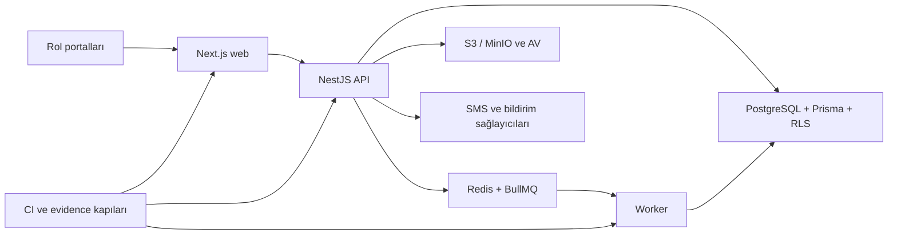

# O-Okul Genel Uygulama Analizi

Tarih: 2026-07-13
Başlangıç sürümü: `main` / `d8c197d6`
Kapsam: uygulama kodu, veri modeli, testler, aktif dokümanlar ve release sözleşmeleri
Canlı ortam: yeniden doğrulanmadı

## Yönetici Özeti

O-Okul; Next.js web, NestJS API, BullMQ worker ve PostgreSQL/Prisma/RLS tabanlı, çok kiracılı bir
eğitim yönetim uygulamasıdır. Tenant izolasyonu, rol bazlı erişim, sınav veri işleme, deterministik
rapor üretimi, portal yüzeyleri, finans ve iletişim takibi ile production evidence zinciri repo
içinde güçlü biçimde temsil edilmektedir.

Bu çalışmada ürün kapsamı sadeleştirildi, tarihsel plan yükü kaldırıldı ve kalan somut P1 kod
riskleri kapatıldı. Repo içi sonuç production onayı değildir: güncel CI, staging image, gerçek
provider, observability, rollback, pilot ve go-live kanıtları dış ortamda ayrıca üretilmelidir.

## Mimari Görünüm

| Alan | Konum | Değerlendirme |
|---|---|---|
| Web | `apps/web` | Rol bazlı App Router ekranları ve Playwright sözleşmeleri |
| API | `apps/api` | Auth/RBAC, tenant kapsamlı domain servisleri ve queue producer |
| Worker | `apps/worker` | Import, scoring, rapor, SMS ve operasyon işleri |
| Veri | `packages/db` | Prisma, migration, RLS, seed ve DB evidence kontrolleri |
| Sözleşme | `packages/shared-types` | Paylaşılan tipler, roller ve capability matrisi |
| Operasyon | `.github`, `scripts`, Docker dosyaları | CI, deploy ve fail-closed evidence zinciri |

## Güçlü Yönler

- Tenant ilişkili tablolar RLS ve composite tenant FK kontrolleriyle korunuyor.
- Access/refresh session, CSRF, rate limit, MFA ve subject-scope kontrolleri birlikte ele alınıyor.
- API sözleşmeleri shared type ve OpenAPI kontrolleriyle aynı değişiklikte tutuluyor.
- Raw import, parser/answer-key sürümleri, scoring ve rapor snapshot hattı ayrıştırılmış durumda.
- Mutasyonlar için idempotency envanteri ve tenant kapsamlı queue kimlikleri var.
- Repo/statik PASS ile staging/production kanıtı bilinçli biçimde ayrılıyor.

## Bu Çalışmada Kapatılan Riskler

1. Rapor anahtarı artık istemci kontrollü değil; API kapsamı ve worker'daki gerçek sonuç/sürüm
   referanslarından deterministik üretiliyor.
2. Zorunlu admin MFA ilk kayıt kilidi enrollment doğrulama akışıyla kapatıldı.
3. KVKK envanteri ham değer taşımadan TCKN, telefon, e-posta ve fotoğraf varlığını; audit zinciri
   ise gerçek purge yüzeyini izliyor.
4. RLS bypass çağrıları fonksiyon bazlı allowlist dışına çıkarsa statik kapı kırılıyor.
5. İptal edilen ürün yüzeyleri runtime, contract, evidence ve aktif belgelerden temizlendi.
6. Eski plan/faz arşivi yerine `status.md` ve LLM wiki tek güncel yön bulma merkezi oldu.

## Bilinen Sınırlar

- Netgsm sağlayıcısı upstream idempotency anahtarı sunmadığı için SMS teslimi `at-least-once`
  semantiğindedir. Delivery report ve deterministik job kimliği repo içi tekrarları sınırlar fakat
  provider başarısından hemen sonraki process çökmesini matematiksel olarak kapatmaz.
- Canlı release durumu bu belgeyle kanıtlanmaz. CI SHA, çalışan image etiketi, health/login,
  migration, provider smoke ve artifact referansları ayrı ayrı doğrulanmalıdır.
- Şablon evidence dosyaları gerçek evidence değildir.

## Güncel Kaynaklar

- Güncel durum: `status.md`
- Ajan/LLM rehberi: `docs/llm-wiki/README.md`
- Ürün kararları: `docs/DECISIONS.md`
- UAT ve kapsam: `docs/product-journeys-v1.md`
- Release sözleşmesi: `docs/phase-6-production-readiness.md`
- Operasyon runbook'u: `docs/phase-6-ops-runbook.md`

## Sonuç

Kod tabanı production odaklı iyi guardrail'lere sahiptir ve güncel ürün kapsamı önceki plan
yükünden arındırılmıştır. Repo içi kalite kapıları tamamlandıktan sonra kalan yol kod yazmak değil,
aynı SHA için staging ve production kanıt zincirini gerçek hedeflerde yürütmektir.
