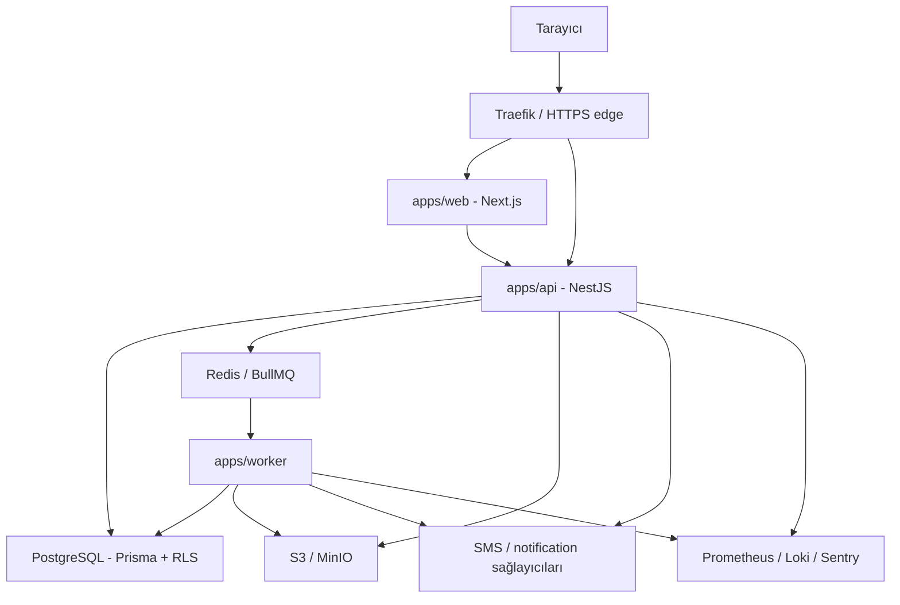
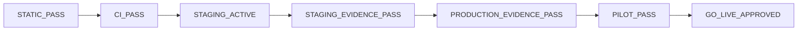

# O-Okul LLM Wiki

Bu dosya, O-Okul üzerinde çalışan insanlar ve kod ajanları için hızlı yön bulma merkezidir.
Ayrıntılı geçmişi tekrar etmez; doğru kaynak sırasını, mimari sınırları ve güvenli değişiklik
kurallarını gösterir.

Son güncelleme: 2026-07-13
Güncel durum: [`status.md`](../../status.md)
Son genel analiz: [`docs/application-analysis-2026-07-13.md`](../application-analysis-2026-07-13.md)

## 1. Doğruluk kaynağı sırası

Bir çelişki olduğunda şu sıra kullanılır:

1. Çalışan kod, güncel şema ve testler.
2. `AGENTS.md` — repo çalışma, güvenlik ve doğrulama kuralları.
3. `docs/DECISIONS.md` — onaylı ürün/mimari kararları.
4. `docs/product-journeys-v1.md` — v1 kapsamı, persona ve UAT durumu.
5. `status.md` — tarihli güncel repo/release özeti.
6. `docs/phase-6-production-readiness.md` — staging/prod kanıt sözleşmesi.
7. `docs/ui-ux-professionalization-contract.md` ve `docs/phase-b-list-query-contract.md` — aktif dar sözleşmeler.

`status.md` ve ilgili checker sonucu esas alınır.

## 2. Ürün özeti

O-Okul; dershane ve özel öğretim kurumları için çok kiracılı yönetim SaaS'idir. V1 omurgası:

`kurum kurulumu -> kişi ve akademik yapı -> TXT/DAT optik -> puanlama -> rapor/karne -> rol portalları -> finans ve iletişim`

V1 dışında ödeme sağlayıcı, fatura ve makbuz entegrasyonu bulunur.

Kapsam değişikliği önce yeni bir DEC kaydı gerektirir.

## 3. Sistem topolojisi

### Monorepo haritası

| Yol | Sorumluluk |
|---|---|
| `apps/web` | Next.js App Router, rol bazlı ekranlar, Playwright |
| `apps/api` | REST API, auth/RBAC, domain servisleri, queue producer |
| `apps/worker` | Optik, scoring, rapor, SMS ve backup işleyicileri |
| `apps/queue-board` | BullMQ görünürlüğü |
| `apps/hooks-worker` | Sınırlı hook/edge worker yüzeyi |
| `packages/db` | Prisma, migration, RLS, seed ve DB kontrolleri |
| `packages/shared-types` | Paylaşılan Zod/TS tipleri, roller ve capability'ler |
| `packages/ui` | Ortak UI ve karne/grafik bileşenleri |
| `packages/sms-adapter` | SMS sağlayıcı sınırı |
| `packages/notification-adapter` | E-posta/push notification sınırı |
| `scripts` | Smoke, evidence, sözleşme ve release kontrolleri |
| `docs/evidence-templates` | Şema ve negatif fixture'lar; gerçek canlı kanıt değildir |

## 4. Roller ve yetki modeli

Kanonik rol/capability kaynağı:
`packages/shared-types/src/role-capabilities.ts`.

- `SYSTEM_ADMIN`: platform ve tenant yönetimi.
- `TENANT_ADMIN`: kurumun tüm yönetim capability'leri.
- `ASSISTANT_ADMIN`: finans, güvenlik ve bazı yönetim yüzeyleri hariç operasyon.
- `TEACHER`: atanmış eğitim kapsamı.
- `STUDENT`: yalnız kendi subject verisi.
- `GUARDIAN`: yalnız bağlı öğrenci ve izinli veriler.

Web'de bir linki gizlemek yetkilendirme değildir. Yeni route veya işlem şu yüzeylerde birlikte
kontrol edilir:

1. Web navigation ve route guard.
2. Shared capability matrisi.
3. API decorator/guard.
4. Service içi subject/scope kontrolü.
5. Tenant DB/RLS sınırı.
6. Negatif 401/403 ve cross-tenant testleri.

## 5. Tenant ve PII değişmezleri

- Tenant tablosu tenant ilişkiliyse `tenantId` taşımalı ve RLS kapsamına girmeli.
- Tenantlar arası FK, mümkün olduğunda `(tenantId, id)` composite ilişki kullanmalı.
- Normal request akışı `withTenantQuery` veya eşdeğer tenant wrapper üzerinden gitmeli.
- `withBypassRlsQuery` yalnız auth/system/break-glass gerekçesiyle kullanılmalı; yeni kullanım
  güvenlik incelemesi gerektirir.
- TC düz metin saklanmaz; hash ve gerektiğinde şifreli değer kullanılır.
- Audit diff, log, metric label ve evidence dosyaları ham PII taşımamalı.
- Access token tarayıcı memory'sinde; refresh token HttpOnly cookie'de kalmalı.
- `localStorage` veya `sessionStorage` içine auth token yazılmamalı.
- Portal rolü subject bağı olmadan token veya geniş tenant erişimi almamalı.

## 6. Ana iş akışları

### Kimlik ve ilk giriş

1. Kurum/kişi oluşturulur veya import edilir.
2. Identity provisioning tenant kapsamlı `User`, membership ve subject bağını kurar.
3. Giriş kurum kodu + TC + parola ile yapılır.
4. İlk parola telefon tabanlı geçici parola olabilir; `mustChangePassword` zorunludur.
5. Admin MFA ayrıca TOTP/recovery code sözleşmesine bağlıdır.
6. Zorunlu modda TOTP'siz admin yalnız kısa ömürlü enrollment yanıtı alır; doğrulama tamamlanınca
   normal session üretilir.

### Optik ve rapor

1. Sınav ve cevap anahtarı hazırlanır.
2. TXT/DAT `RawImport` olarak arşivlenir.
3. Parser config ile satırlar ayrıştırılır; sorunlu satırlar karantinaya gider.
4. Worker deterministik scoring üretir.
5. Rapor job'ı `ReportSnapshot` ve PDF/Excel çıktıları üretir.
6. Kurum, öğrenci, öğretmen ve veli portalları yetki kapsamına göre okur.

Karşılaştırmalarda ana metrik `Başarı %`; `Net` ve `Soru` bağlamdır. Rapor queue anahtarı istemciden
alınmaz; API'de sınav/rapor/filtre kapsamı, worker snapshotında gerçek sonuç anahtarları ve
answer-key/parser/engine sürümleri deterministik kimliğe katılır.

### Release ve evidence

Bir önceki durum sonraki durumu otomatik vermez. Özellikle health `200`, image SHA parity ve
production evidence yerine geçmez.

## 7. Değişiklik reçeteleri

### API sözleşmesi

- DTO/Zod değişikliğini API ile aynı dilimde yap.
- `packages/shared-types` ve OpenAPI output contract'ını güncelle.
- Yetki ve tenant negatif testlerini ekle.
- En küçük doğrulama:
  `pnpm --filter @o-okul/api typecheck && pnpm --filter @o-okul/api test && pnpm openapi:generate`.

### DB veya tenant ilişkisi

- Prisma şeması, migration, RLS, seed etkisi ve DB evidence birlikte değişir.
- Tenant relation için composite FK veya açık/testli istisna gerekir.
- En küçük doğrulama:
  `pnpm --filter @o-okul/db test && pnpm db:rls:check && pnpm tenant-db:check`.

### Web/UI

- Mevcut App Router, shared UI ve role-aware shell desenlerini kullan.
- Token storage davranışını değiştirme.
- Form ve tabloları mobil/a11y sözleşmesiyle doğrula.
- En küçük doğrulama:
  `pnpm --filter @o-okul/web typecheck && pnpm web:a11y:check && pnpm web:ux-baseline:check`.

### Worker veya rapor

- Job payload tenant/user/entity/content kimliğini korumalı.
- Retry ve provider side effect'leri idempotent olmalı.
- Snapshot ve scoring tekrar üretilebilir olmalı.
- En küçük doğrulama:
  `pnpm --filter @o-okul/worker test && pnpm karne:visual-contract:check`.
- Canlı smoke ayrıca staging bağımlılığıdır; unit test yerine geçmez.

### Production evidence

- Checker, generator, örnek template, negatif fixture ve readiness dokümanı birlikte değişir.
- Örnek evidence sadece sözleşme doğrulamasıdır.
- Kalıcı artifact; environment, SHA/image, tarih, source ve PII-safe referans taşımalıdır.

## 8. Doğrulama matrisi

| Kapsam | Hızlı kapı |
|---|---|
| Agent sistemi | `pnpm agents:check` |
| Ürün kapsamı | `pnpm product-journeys:check` |
| API | `pnpm --filter @o-okul/api test` |
| Web | `pnpm --filter @o-okul/web typecheck` |
| Web UX/a11y | `pnpm web:a11y:check && pnpm web:ux-baseline:check` |
| Worker | `pnpm --filter @o-okul/worker test` |
| DB/RLS | `pnpm --filter @o-okul/db test && pnpm db:rls:check && pnpm tenant-db:check` |
| Auth | `pnpm web:token-storage:check && pnpm admin-mfa:check && pnpm rate-limit:check` |
| Rapor | `pnpm report-generation:smoke && pnpm karne:visual-contract:check` |
| Privacy/provider | `pnpm privacy:inventory:check && pnpm upload-av:check && pnpm notification:smoke` |
| Ops statik | `pnpm ops:check && pnpm prod:evidence:templates:check` |
| Tam aday | `pnpm run ci` + gerçek staging/prod evidence kapıları |

Environment/evidence target isteyen komutların targetsız kırılması beklenen fail-closed davranış
olabilir. Hata ile gerçek eksik kanıtı ayır.

## 9. Agent yönlendirme

- Plan/kapsam/UAT: `o-okul-planning` + `product_scope_planner`.
- Dar kod/test dilimi: `o-okul-implementation-slice` + tek write owner.
- RLS/RBAC/auth/PII: `tenant_security_reviewer`; gerekirse auth veya privacy owner.
- Optik/rapor: `exam_reporting_engineer`.
- DB/migration: `data_platform_engineer`.
- Staging/prod/evidence: `o-okul-release-evidence` + `ops_release_engineer`.
- Son diff incelemesi: `o-okul-pr-review` + `pr_gate_reviewer`.

Her delegasyonda amaç, sahip olunan yollar, yasak yollar, beklenen çıktı ve doğrulama komutları
açık yazılır. Ana agent entegrasyon ve nihai doğrulamadan sorumludur.

## 10. Sık yapılan hatalar

- Eski planı güncel status sanmak.
- Template PASS'i gerçek staging/prod kanıtı saymak.
- Health `200` ile çalışan image SHA'sını aynı kabul etmek.
- Web'de link gizlemeyi RBAC sanmak.
- API response değiştirip shared types/OpenAPI'yi unutmamak.
- Prisma değiştirip migration/RLS/seed/evidence zincirini eksik bırakmak.
- Worker retry varken provider side effect'ini exactly-once sanmak.
- Raporlarda farklı soru sayılarını ham net ile karşılaştırmak.
- Dirty worktree'de bütün ağacı stage etmek.

## 11. Başlangıç okuma listesi

1. [`AGENTS.md`](../../AGENTS.md)
2. [`status.md`](../../status.md)
3. [`docs/DECISIONS.md`](../DECISIONS.md)
4. [`docs/product-journeys-v1.md`](../product-journeys-v1.md)
5. [`docs/codex-agent-architecture.md`](../codex-agent-architecture.md)
6. [`docs/phase-6-production-readiness.md`](../phase-6-production-readiness.md)
7. Değişecek modülün kodu ve yakın testleri

Wiki güncellenirken geçmiş günlük buraya taşınmaz. Yeni kalıcı mimari kural eklenir; tarihli durum
ve ilerleme `status.md` içinde tutulur.
