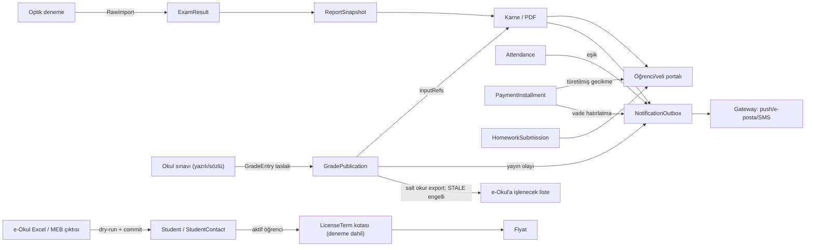
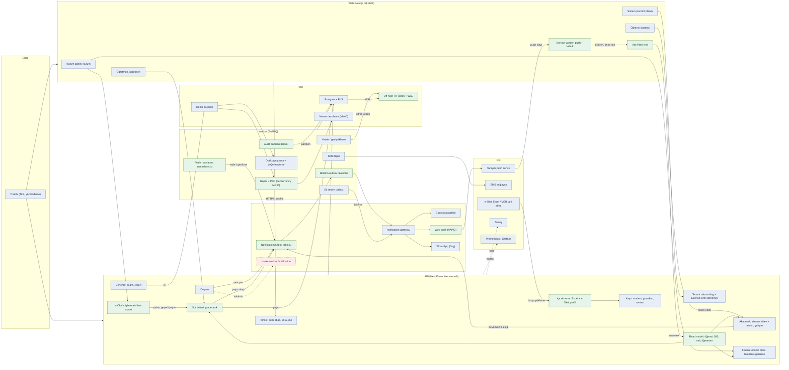

# O-Okul Özel K12 Strateji Çalışması — Ekler

**Tarih:** 2026-10-03
**Belge durumu:** Tarihli referans eki. Bu dosya plan değildir; kapsam yalnız `docs/DECISIONS.md` ile değişir. Ana plan: `docs/ozel-k12-strateji-ve-yol-haritasi-plan.md`.
**İçerik:** 2026-10-03 F0–F6 strateji çalışmasının ajan sentezleri: karar verici ve rakip analizi (web okuması, erişim tarihi 2026-10-03), modül × rol kod envanteri, farklılaşma tezleri ve çürütmeleri, hedef mimari ayrıntısı, yol haritası dilimlerinin tam tanımı, varsayım ve risk kaydı, DEC taslaklarının tam metni.
**Etiketler:** Pazar iddiaları KAYNAKLI (sayfa okundu) / DOGRULANMADI / VARSAYIM. Kod kanıtı repo-göreli dosya:satır, kanıt sınıfı LOCAL_STATIC (okuma; test koşturulmadı). Efor aralıkları UNPROVEN hız. Satır numaraları 2026-10-03 tarihli `fd01a5c63` okumasına aittir (bu commit `d9b42f81a`'nın atasıdır) ve kod değiştikçe kayar.
**Başlık kodları:** Ana plandaki "bkz. §F<n>.<m>" atıfları bu dosyadaki F-kodlu başlıklara gider.

---

## Ek 1. Karar verici, rakip profilleri ve masa bahsi analizi (F1.1–F1.3)

### F1.1 Kim karar verir, kim kullanır, kim öder (JTBD)

| Aktör | Karar | Kullanır | Öder | İş (JTBD) | Etiket ve dayanak |
|---|---|---|---|---|---|
| Kurucu / kurucu temsilcisi | Evet | Hayır | Evet | Kayıt döneminde veli güvenini ve tahsilatı korurken kampüs, ücret, borç ve doluluğu tek ekrandan görmek; zam ve yatırım kararını veriye dayandırmak | **VARSAYIM**. Dolaylı: Özel Öğretim Kurumları Yönetmeliği 2008 ilk metni md. 21 kurucu eğitim-öğretim yönetimine karışmaz (resmigazete.gov.tr/eskiler/2008/03/20080308-6.htm); 2011 tarihli makale kurucunun yıllık mali bütçeyi düzenlediğini aktarıyor (muhasebenet.net); K12NET kurucuları ayrı hedef kitle sayıp günlük "kurucu raporu" vaat ediyor (k12net.com/kurucularimiz-k12netle-huzur-bulsun/). Satın alma onayını kurucunun verdiğini açıkça söyleyen kaynak yok |
| Okul müdürü / genel müdür | Evet (kısa liste) | Evet | Hayır | Öğretmen-öğrenci-veli işlerini yürütürken e-Okul'a ikinci kez veri girmemek; veli şikâyetini hızlı kapatmak | **VARSAYIM**. Bilsa seçim rehberi e-Okul uyumunu ve benzer ölçekte referansı kritik kriter sayıyor (bilsa.com.tr/blog/okul-yonetim-sistemi-nedir/) |
| Müdür yardımcısı | Hayır | Evet | Hayır | Devamsızlık, ders programı, etüt ve sınav takvimini her gün güncelleyip veliye otomatik yansıtmak | **KAYNAKLI** kullanım (gelisim.k12.tr/TR/885/K12NET-ILETISIM-SISTEMI.htm) |
| Bilgi işlem sorumlusu | Hayır (teknik değerlendirme) | Evet | Hayır | Hesap yönetimi, e-Okul aktarımı ve KVKK yükünü düşük tutmak | **KAYNAKLI** kullanım; K12NET müşteri yorumlarının yazarları kampüs müdürü, öğrenci işleri, ölçme sorumlusu, rehberlik koordinatörü ve bilgi işlem (k12net.com/musteri-yorumlari/) |
| Muhasebe / finans | Hayır | Evet | Hayır | Taksit, gecikmiş borç ve hatırlatmayı otomatik yönetmek | **KAYNAKLI** (k12net.com/tr/, okulaile.com/ozel-okullar/) |
| Öğretmen | Hayır | Evet | Hayır | Ders arasında birkaç dokunuşla yoklama/not/ödev girmek; eksik kazanımı görüp etüde yönlendirmek | **KAYNAKLI** (erciyeskoleji.com rehberlik bülteni) |
| Rehber öğretmen | Hayır | Evet | Hayır | Ölçme sonuçları ve görüşme kayıtlarını tek öğrenci profilinde görüp riskli öğrenciye erken müdahale etmek | **KAYNAKLI** (tedkocaeli.k12.tr/k12-net-ted-ogrenci-bilgi-sistemi/) |
| Öğrenci | Hayır | Evet | Hayır | Deneme sonucunu ve konu eksiğini hemen görmek | **KAYNAKLI** (kurspro.net) |
| Veli | Hayır | Evet | Hayır (yazılımı değil, okulu öder) | Yüksek ücret ödediği okulda ödev, sınav, devamsızlık ve ödemeyi tek mobil uygulamada görmek | **KAYNAKLI** (gelisim.k12.tr; kurspro.net/mobil) |
| Zincir merkez ofisi | Evet | Evet | Evet | Tüm kampüslerde tek sistem ve aynı ölçütle karşılaştırma | **UNPROVEN**. Merkez ofisin seçtiğine dair kaynak yok; Okyanus Koleji merkezi BT birimi yalnız arama özetinde görüldü |
| Kurs/dershane sahibi (ikincil) | Evet | Evet | Evet | Denemeyi hızla okutup veliye rapor vermek; tahsilat ve SMS'i tek pakette tutmak | **VARSAYIM** tek karar verici; Kurspro sayfasında "sahip/kurucu" ifadesi geçmiyor |

Satın alma süreci:

| Bulgu | Etiket | Kaynak |
|---|---|---|
| Demo veya ücretsiz deneme standart: Kurspro 7 gün kartsız, KursMAX 15 gün kartsız, Delta 15 öğrenciye kadar ücretsiz, Bilsa "zorunlu deneme süresi" öneriyor | KAYNAKLI | kurspro.net/sik-sorulan-sorular; kursmax.com/kurs-yazilimi-fiyatlari/; onlinekurum.com/kurs-otomasyonu-ucret-hesaplama-sistemi; bilsa.com.tr/blog/okul-yonetim-sistemi-nedir/ |
| Benzer ölçekte referans ve e-Okul uyumu seçim kriteri; canlıya geçiş "birkaç hafta" | KAYNAKLI (satıcı beyanı) | bilsa.com.tr/blog/okul-yonetim-sistemi-nedir/ |
| Sözleşme: kursta yıllık abonelik; okulda öğrenci sayısı/şube/modüle göre kuruma özel teklif | KAYNAKLI | kurspro.net/ucretler; oktasis.com/paketler/ |
| Yaz geçiş penceresi | VARSAYIM; karşı kaynak var: Egitimdio dönem ortası geçişin mümkün olduğunu yazıyor (egitimdio.com/blog/okul-yonetim-sistemi-nasil-secilir) | — |
| Karar süresi (tek kampüs haftalar, zincir aylar) | VARSAYIM, kaynak yok | — |
| Mevcut sistemden geçişte "son anlaşmanın %50'si" fiyat teklifi kampanyası (e-sukul, 2021) | KAYNAKLI | e-sukul.com |

Pazar büyüklüğü (yalnız kaynakta geçen rakamlar):

| Rakam | Kaynak |
|---|---|
| 2024-25: 14.700 özel okul, 1.539.579 özel öğrenci, özel öğrenci oranı %9,1 (ortaöğretim %11,6) | meb.gov.tr/2024-2025-orgun-egitim-istatistikleri-aciklandi/haber/38473/tr |
| 2025-26 (haber): 15.094 özel okul, 1.485.021 özel öğrenci | haberturk.com/gundem/meb-2025-2026-orgun-egitim-istatistiklerini-acikladi-3916485 |
| 2026-27 özel okul tavan zam: ara sınıf %30,74, kademe başı %43,92 | hurriyet.com.tr/egitim/ozel-okullarda-tavan-zam-oranlari-belli-oldu-43077598 |
| Özel öğretim kursu sayısı | DOGRULANMADI (OOKGM sorgusu filtreye bağlı alt küme veriyor) |

---

### F1.2 Rakip profilleri

Birincil segment (özel K12) için dört doğrudan rakip: K12NET, Bilsa Okulsis, Eyotek, OkulAile. Edupratik yatay küçük oyuncu. Kurs/optik tarafı: Kurspro, Sanaliz, Delta, KursMAX. Vedubox LMS; çekirdek rakip değil.

#### Özel K12 odaklı rakipler

| | K12NET (Atlas Eğitim Yazılımı) | Bilsa Okulsis | Eyotek (Turtek) | OkulAile (SiberUzay) |
|---|---|---|---|---|
| **Segment** | Anaokulu–lise özel okul, uluslararası okul, YKS/LGS/KPSS/dil kursu. KAYNAKLI (k12net.com/tr/, /tanitim/) | Özel okul = Okulsis; kurs = Kurssis (36 modül); anaokulu ayrı; devlet okulu = Bilsa Windows. KAYNAKLI (bilsa.com.tr/urunlerimiz/okulsis/) | Kolej, kurs, anaokulu, dil kursu tek üründe; çok şube tek ekranda. KAYNAKLI (eyotek.com.tr/referanslar, ana sayfa) | Anaokulu–lise, kolej, kurs; ağırlık okul öncesi (29 referansın 11'i K12). KAYNAKLI (okulaile.com/referanslar) |
| **Fiyat modeli** | Yayınlanmıyor; teklif formu öğrenci sayısı ve il istiyor. KAYNAKLI (k12net.com/tanitim/). Model DOGRULANMADI | Yayınlanmıyor; push ücretsiz, SMS paket anlaşmasıyla. KAYNAKLI (…/okulsis/iletisim-bilgilendirme/) | Öğrenci sayısına göre yıllık hesaplayıcı, TL gösterilmiyor; optik form 1000'lik paket ve SMS ayrı kalem. KAYNAKLI (eyotek.com.tr/ucretler) | Yayınlanmıyor. DOGRULANMADI (okulaile.com/sikca-sorulan-sorular) |
| **Öne çıkan modüller** | 44 modül (tanıtımda 38); kayıt, günlük ve ders bazlı devamsızlık, not defteri, kazanım esaslı ölçme ve 28 rapor, eksik kazanıma otomatik etüt, ders dağıtım, 4 tür ödev, randevu, anket, rehberlik, yemekhane, kütüphane, ön muhasebe, servis. KAYNAKLI (k12net.com/okul-yonetim-yazilimi/k12net-moduller/) | 7 sistem 42 modül; aday kayıt akışı, MEB formatında karne, E-Yoklama ile veliye otomatik SMS, davranış takibi, muhasebe (hizmet türüne göre sözleşme, gecikmede SMS/e-posta, toplu fatura/makbuz/senet), haftalık ders dağıtım, kampüs (sağlık, yemekhane, kantin, ziyaretçi, servis yoklama, geçiş), yapay zekâ erken uyarı ve akıllı rapor ("%92 doğruluk" firma beyanı). KAYNAKLI | 40+ modül; ön kayıt CRM, ders ve nöbet programı, devamsızlık, ödev, etüt, kağıt+dijital optik sınav (konu/kazanım, il/ilçe/şube/sınıf), online sınav, bursluluk, rehberlik, İK, ön muhasebe (hizmet türüne göre taksit, gecikene SMS), kütüphane, revir, yemek, anket, soru havuzu. KAYNAKLI (eyotek.com.tr/moduller) | Test sınavı sonucu hesaplama, karne/gelişim raporu, ödev, devamsızlık, ders programı, gelir-gider (aidat, Excel, hatırlatma), CRM ve randevu, servis güzergahı, yemek, ilaç/ateş, rehberlik bülteni, çoklu şube; sınırsız foto/video (10 dk), okundu bilgili duyuru, birebir mesaj. KAYNAKLI (okulaile.com/ozellikler, /sikca-sorulan-sorular) |
| **Mobil / veli** | iOS 1,9/5 (780), uygulama öğretmen/personel odaklı; Android "K12NET Mobil" 2,7 (6,73 B yorum, 1 Mn+ indirme, 8 Eki 2025). Veli: portal üzerinden ödev, randevu, mesaj/duyuru/SMS, servis SMS'i. KAYNAKLI (apps.apple.com id1155767502; play…com.k12nt.k12netframe) | iOS 2,2/5 (52); Android 2,2 (140 yorum, 50 B+, 29 Eyl 2026). Veli: not, devamsızlık, ödev, sınav analizi, anket, mesaj, randevu; veli portalından kart ve havale ile online ödeme. KAYNAKLI (apps.apple.com id1584933332; play…com.bilsa.bilsa_demo; …/okulsis/muhasebe/) | iOS 4,7/5 (3,6 B); Android 4,7 (3,39 B yorum, 500 B+, 11 Eyl 2026). Veli: program, ödev raporları, etüt, sınav ve konu analizi, okul notları ve e-Okul notları, devamsızlık, mesaj, randevu, anket, yemek, belgeler, foto/video, servis bilgisi, kütüphane; kurum hangi sayfanın açık olacağını seçiyor; ödeme takibi (yapma değil). KAYNAKLI (apps.apple.com id1571118477; play…tr.com.turtek.eyotek; eyotek.com.tr/moduller/veli-ogrenci-bilgilendirme) | iOS 2,6/5 (146); Android 3,5 (390 yorum, 100 B+, 4 Haz 2026), son yorumlar olumlu. Kuruma özel markalı uygulamalar (Play geliştirici hesabında 18 uygulama). KAYNAKLI (apps.apple.com id1055315569; play…com.siberuzay.okulaile) |
| **Entegrasyonlar** | e-Okul: not ve devamsızlıkta çift yönlü (öğrenci kaydı için çift yön belirtilmiyor; teknik yöntem yok). Param sanal POS 23 banka/10 kart; 26 yayınevi ve optik okuma; muhasebe yazılımı web servisi; WhatsApp bildirim. KAYNAKLI (k12net.com/okul-yonetim-yazilimi/, /tanitim/). MEBBİS, e-fatura, SSO DOGRULANMADI | Notları e-Okul'a aktarım (yöntem belirsiz; blog yazısı veriyi "e-Okul'a işlenmek üzere hazır tutar" diyor); GİB e-fatura/e-arşiv; online ödeme (sağlayıcı adı yok); SMS/e-posta. KAYNAKLI (…/ogrenci-isleri-yonetimi/, /muhasebe/, bilsa.com.tr/blog/e-okul-okul-yonetim-yazilimi/) | e-Okul'dan "MEB veri alma programı" ile temel öğrenci bilgisi içe aktarım; geri yazım yok. iyzico; tek tuşla e-fatura; NetGSM çözüm ortağı. KAYNAKLI (eyotek.com.tr/moduller/ogrenci, /finansal-islemler-on-muhasebe) | Canlı ders: Zoom/Teams linki ekleme. KAYNAKLI. SMS, online ödeme, e-fatura, e-Okul DOGRULANMADI |
| **Zayıf yönler** | Mobil puanlar düşük; "web sayfası gibi çalışıyor" şikâyeti (sikayetvar.com/k12); Play yorumunda PDF sonuç şifreli açılmıyor (18 Eyl 2026); kurum sayısı sayfalara göre 4.426 / 4.358 / 4.328. KAYNAKLI | Mobil şikâyetler: giriş/şifre, güncelleme sonrası iPhone'da çalışmama, ödev ekranı; Play yorumları yavaşlık, mesaja yanıt yok, 2 MB ek sınırı. Kurum portalları ASP.NET WebForms Login.aspx (eski yığın VARSAYIM). Kurum sayısı 4000+/1500+/1000+/35.000+. Şikayetvar'da fatura şikâyeti. KAYNAKLI | App Store'da performans, giriş, bildirim şikâyetleri; Şikayetvar'da müfredat güncellemesi şikâyeti; e-Okul'a geri yazım yok (çift giriş VARSAYIM); canlı servis konumu yok. KAYNAKLI/VARSAYIM | iOS'ta beyaz ekran ve menü açılmama şikâyetleri; e-Okul ve optik/deneme analizi tanıtılmıyor; online tahsilat belgelenmemiş. KAYNAKLI/VARSAYIM |
| **Referanslar** | TED, Sınav Eğitim, Enka, BLIS, Fenerbahçe Okulları. KAYNAKLI (k12net.com/tr/) | Galatasaray Lisesi, Irmak, TAKEV vb. (bazıları devlet). KAYNAKLI (bilsa.com.tr/en/) | Ak İrfan Okulları, Özel Kadıköy Eğitmen Lisesi, Matematik Dünyası (kurs). KAYNAKLI (kurum sitelerinden) | Ege Bilim, Gökyüzü, İhlas, Bilge Okulları vb. KAYNAKLI (okulaile.com/referanslar) |

#### Yatay ve kurs/optik odaklı rakipler

| | Edupratik | Kurspro | Sanaliz | Delta Kurs Otomasyonu (OnlineKurum) | KursMAX | Vedubox |
|---|---|---|---|---|---|---|
| **Segment** | Her kurum tipi (özel/devlet okul, anaokulu, kurs, etüt, yurt, yayıncı); 526+ kurum beyanı; Play bilgileri e-sukul.com ile aynı geliştiriciyi gösteriyor. KAYNAKLI (edupratik.com; play…edupratikcom) | Özel öğretim kursu, dil, sanat; ana sayfada özel okul da hedef listesinde. KAYNAKLI (kurspro.net, /hakkimizda) | Okul, dershane, kurs, yayınevi; çok şubeli ortak sınav. KAYNAKLI (sanaliz.com.tr/hakkimizda/) | Kurs merkezleri ("600+ kurs merkezi", 2013'ten beri); referanslarda K12 yok, dil kursu ağırlıklı. KAYNAKLI (onlinekurum.com/referanslar) | Kurs, sınav hazırlık, dil, sanat; özel okul listede ama K12 süreci yok. KAYNAKLI (kursmax.com) | Kurumsal eğitim platformu; eğitim sektörlerden biri; K12 operasyonu yok. KAYNAKLI (vedubox.com) |
| **Fiyat modeli** | Yayınlanmıyor; e-sukul sezonluk lisans, veli online ödemesinden kuruma %0,5 ciro komisyonu vaadi. KAYNAKLI (e-sukul.com) | Yıllık 18.000–33.000 TL KDV dahil; 1–4 kullanıcı, 25–100 optik + aynı sayıda online sınav kotası; ek kullanıcı 7.200 TL; 7 gün kartsız deneme; kurulum/eğitim/destek dahil. KAYNAKLI (kurspro.net/ucretler, /sik-sorulan-sorular) | Öğrenci sayısına göre yıllık hesaplayıcı, TL yok. KAYNAKLI (sanaliz.com.tr) | Aktif öğrenci bazlı 12.475 ₺/yıl + KDV'den; sınırsız öğrenci 29.158 ₺/yıl + KDV'den; 15 öğrenciye kadar ücretsiz; sınırsız modül. KAYNAKLI (onlinekurum.com/kurs-otomasyonu-ucret-hesaplama-sistemi) | Yayınlanmıyor ("Fiyatlar yükleniyor…"); 15 gün kartsız deneme; yönlendirme başına %10 indirim. KAYNAKLI (kursmax.com/kurs-yazilimi-fiyatlari/) | USD, kullanıcı başı aylık: 50 kullanıcı $102,50 – 400 kullanıcı $545; yıllık %16 indirim; e-fatura/finans entegrasyonu $10/kullanıcı/ay ek hizmet. KAYNAKLI (vedubox.com/fiyatlar) |
| **Öne çıkan modüller** | 4 panel, akıllı tahta ile yoklama/ödev, muhasebe, mobil bildirim, şube yönetimi. KAYNAKLI. Kardeş e-sukul: taksit, online ödeme, e-fatura, optiksiz dijital sınav, satın alınabilir LGS/TYT/AYT denemeleri, kantin QR, 54 rehberlik testi (Edupratik markasında DOGRULANMADI) | Kayıt, ön kayıt, ders programı, yoklama, finans/muhasebe/cari, SMS, WhatsApp Business, ölçme (TYT/AYT/LGS; TXT/DAT yükleme; konu analizi; WhatsApp/PDF sonuç kartı), etüt, rehberlik, online sınav, uzaktan eğitim, PDKS. KAYNAKLI (kurspro.net/moduller, /olcme-degerlendirme) | Sınav okuma (optik şablon; karne, sonuç listesi, hata kitapçığı, konu analizi), yayınevi kazanım havuzu, öğrenci-veli portalı (dijital karne, video çözüm), SMS. Okul yönetimi modülü yok. KAYNAKLI (sanaliz.com.tr/sinav-okuma-sistemi/) | 40 modül: CRM, yoklama, ödev, otomatik ders programı, optik okuma/kazanım analizi, tahsilat/taksit, e-fatura, stok, İK hakediş, çok şube, API. Güncelleme günlüğü 06.12.2024'te duruyor. KAYNAKLI (onlinekurum.com/delta-kurs-otomasyonu) | Sezon/paket kayıt, yapay zekâ ders programı, yoklama → otomatik borçlandırma ve öğretmen hakedişi, ödev/etüt, sınav (optik toplu yükleme veya mobil tarama; anında karne), muhasebe, çoklu kurum. KAYNAKLI (kursmax.com alt sayfaları) | LMS, sanal sınıf, online sınav + gözetim, sertifika, görev/ödev, anket, duyuru, mesajlaşma, veli rolü. KAYNAKLI (vedubox.com/kurs-ve-okullar-icin-vedubox/) |
| **Mobil / veli** | Android 500+ indirme, puan yok; iOS 5,0 (1 değerlendirme); paket adı App Inventor (ince sarmalayıcı VARSAYIM). KAYNAKLI | Öğrenci/Öğretmen/Yönetici ayrı uygulamalar; Play 3,4; App Store Öğrenci 3,0 (7). Veli: program, ödev, deneme sonuçları, devamsızlık, ödemeler; iyzico/PayTR ile kartla ödeme; soru fotoğrafı gönderme. KAYNAKLI (kurspro.net/mobil) | iOS 4,2 (5), Mayıs 2025; Android 3,2 (30 yorum, 10 B+). Veli yorumları: belgeler görünmüyor, grafikler aynı, hata kitapçığı yok. KAYNAKLI (play…com.sanaliz) | Temmuz 2024'te eklendi; Android 100+ indirme (30.06.2024); iOS puan yok. KAYNAKLI | Store rozetleri var; Play'de "kursmax" araması uygulama döndürmedi. DOGRULANMADI | iOS 3,8 (5), sürüm notu "Webview eklendi"; ayrı veli uygulaması yok. KAYNAKLI/DOGRULANMADI |
| **Entegrasyonlar** | Edupratik'te DOGRULANMADI; e-sukul: SMS, online taksit, e-fatura. KAYNAKLI | iyzico, PayTR, Paraşüt e-fatura, WhatsApp Business, Google Takvim, SMS; veriler Türkiye'de, KVKK beyanı. KAYNAKLI (kurspro.net/ozellikler). e-Okul DOGRULANMADI | Yayınevleri, SMS. e-Okul/POS DOGRULANMADI | Toplu SMS/e-posta (iletim durumu takibi), e-fatura, API erişimi. KAYNAKLI. POS, e-Okul, WhatsApp DOGRULANMADI | WhatsApp + SMS bildirim; optik okuyucudan toplu yükleme. KAYNAKLI. POS, e-fatura, e-Okul DOGRULANMADI | Zoom, Teams, Webex, SCORM, API, SSO, LDAP; iyzico, PayPal. KAYNAKLI |
| **Zayıf yönler** | Mobil iz küçük (765 B+ veli beyanıyla tutarsız); kardeş e-sukul eys iOS 2,1 beyaz ekran; adres, fiyat ve referans listesi yok. KAYNAKLI | Orta mobil puanlar; sınav kotası sınırlı; kullanıcı sayısı düşük, ek kullanıcı pahalı (VARSAYIM maliyet); kurum sayısı "4.426+" K12NET ile birebir aynı (şüpheli); adlı referans yok. KAYNAKLI | Dar kapsam; küçük ve bölgesel görünüm; referans yok. VARSAYIM | Mobil tarafı zayıf; geliştirme temposu belirsiz; K12 modülleri yok. KAYNAKLI/VARSAYIM | Fiyat şeffaf değil; online ödeme görünmüyor; K12 modülleri yok. VARSAYIM | K12 operasyonu yok; USD kur riski. VARSAYIM |

---

### F1.3 Masa bahsi ve farklılaştırıcı ayrımı

Sayım yalnız KAYNAKLI iddialarla, 8 ana rakip üzerinden yapıldı. "K12 dörtlüsü" = K12NET, Bilsa, Eyotek, OkulAile.

**Masa bahsi (≥5/8 rakipte kaynaklı; olmazsa satılmaz):**

| Özellik | Rakip sayısı | Not |
|---|---|---|
| Veli erişimi (portal veya veli rollü uygulama) | 8/8 | Kapsam çok farklı; Eyotek ve Kurspro en geniş. K12NET'in iOS uygulaması personel odaklı |
| Duyuru, mesajlaşma, anlık bildirim | 7/8 | Okundu bilgisi yalnız Bilsa ve OkulAile'de |
| Ödev verme ve takibi | 7/8 | |
| Sınav / ölçme-değerlendirme | 7/8 | Konu veya kazanım analizi 5/8'de |
| Devamsızlık / yoklama | 6/8 | Devamsızlıkta veliye otomatik SMS yalnız Bilsa'da kaynaklı |
| Finans / ön muhasebe (sözleşme, taksit, tahsilat, hatırlatma) | 6/8 | Gecikme bildirimi 4 rakipte; hizmet türüne göre ayrı sözleşme Bilsa ve Eyotek'te |
| Çok şube / kampüs | 6/8 | |
| SMS gönderimi | 5/8 | Genelde ayrı ücretli kalem |
| Ön kayıt / aday öğrenci CRM | 5/8 | |
| Ders programı | 5/8 | |
| Rehberlik modülü | 5/8 | |

**Eşik altı ama K12 dörtlüsünde standart (VARSAYIM olarak masa bahsi sayılmalı):** online veli ödemesi (4/8; dörtlüde 3/4), optik okuma (4/8), e-fatura (4/8), online sınav (4/8), yemekhane/sağlık (4/8), **e-Okul aktarımı (3/8; dörtlüde 3/4)**.

**Farklılaştırıcılar (1–2 rakipte):**

| Özellik | Kimde | Neden değerli |
|---|---|---|
| Eksik kazanıma göre otomatik etüt ataması | K12NET | Ölçme sonucunu rapordan aksiyona çeviriyor |
| Yapay zekâ erken uyarı / risk | Bilsa ("%92" firma beyanı) | Rehber öğretmenin erken müdahale işi |
| e-Okul ile çift yönlü not ve devamsızlık | K12NET | Çift veri girişini bitiriyor; yöntem ve MEB yetkisi belgelenmemiş |
| WhatsApp ile bildirim / sonuç kartı | K12NET, Kurspro | Velinin zaten kullandığı kanal |
| Kuruma özel (beyaz etiket) uygulama | OkulAile | Yüksek ücret ödeyen veliye kurum markası |
| Veli panelinde sayfa bazlı açma/kapama | Eyotek | Kurum hangi veriyi ne zaman göstereceğini seçiyor; KVKK açısından değerli |
| Hata kitapçığı + soru başına video çözüm | Sanaliz, K12NET | Öğrencinin konu eksiğini görmesi |
| Türkiye'de barındırma ve KVKK beyanı | Kurspro | Bilgi işlemin risk işi |
| Muhasebe yazılımı web servisi + çok bankalı POS | K12NET | Muhasebenin nakit akışı işi |
| Şeffaf TL fiyat + kartsız deneme | Kurspro, Delta | Satın alma sürecini kısaltıyor; K12 dörtlüsünün hiçbiri fiyat yayınlamıyor |

**Boş alan (hiçbir rakipte kaynaklı değil):**

1. Velinin servisi canlı konumla izlemesi.
2. Farklı soru sayılı denemeleri Başarı % ile normalize edip kampüsler arası karşılaştıran konsolide rapor.
3. Kurucuya doluluk, ciro, borç ve kayıt yenileme hunisini birlikte gösteren karar paneli (OkulAile kısmen: ciro ve borç görünümü).
4. Rehberlik görüşmesi, ölçme, devamsızlık ve ödevi tek öğrenci profilinde birleştiren bütüncül takip (parçalar var, birleşik profil yok).
5. Velinin KVKK açık rıza ve tercih yönetimi (kanal, içerik, fotoğraf izni).
6. Yayınlanmış, sonradan değişmeyen, yeniden üretilebilir rapor/karne anlık kopyası.
7. Öğrenci kaydı dahil e-Okul senkronu ve geçiş aracı. **Uyarı:** MEB'in üçüncü taraflara resmî e-Okul web servisi sunduğuna dair kaynak bulunamadı (DOGRULANMADI); MEB Bilgi ve Sistem Güvenliği Yönergesi md. 6/2 ve 9/2-d kullanıcı hesabının başkası adına kullanımını ve admin şifresinin yükleniciyle paylaşımını yasaklıyor (memurlar.net/haber/761812). Okul şifresiyle tarayıcı otomasyonu uyum riski taşır. Güvenli yol: e-Okul'dan içe aktarma (Excel veya MEB veri alma çıktısı) ve e-Okul'a işlenecek veriyi hazır üretmek.
8. Kararlı, yerel veli uygulaması: K12 dörtlüsünün üçünde (K12NET 1,9/2,7; Bilsa 2,2/2,2; OkulAile 2,6/3,5) kalite boşluğu; Eyotek (4,7/4,7) istisna.

**Örüntüler:** Fiyat şeffaflığı düşük, baskın model öğrenci sayısına bağlı yıllık lisans, SMS ve optik form ayrı kalem. Veli erişimi evrensel ama uygulamaların çoğu düşük puanlı veya webview. e-Okul aktarımı K12 oyuncularında var, yönü ve yöntemi değişken, MEBBİS hiçbirinde yok. Kurum sayısı beyanları tutarsız; pazar payı çıkarımında kullanılmamalı.

**F1 boşlukları (tamlık turunda açık kalanlar):** ödeyen/karar veren ayrımı birincil kaynakla doğrulanamadı (5–10 kurucu/müdür görüşmesi gerekir); K12 dörtlüsünün fiyatları için EKAP, bayi ve forum kaynakları denenmedi; Play yorumlarında yorumcunun veli mi öğretmen mi olduğu ayrışmıyor.

---

---

## Ek 2. Mevcut durum özeti ve modül × rol kod envanteri (F2.0 ve F2 ayrıntı)

### F2.0 Özet: F1 masa bahsine karşı mevcut durum

| F1 masa bahsi / K12 standardı | O-Okul durumu | Kanıt (LOCAL_STATIC) |
|---|---|---|
| Veli erişimi (8/8 rakipte) | KISMI. GUARDIAN runtime çalışıyor ve testli, ama `product.guardian-read-only` flag'i yazma/davet yollarını kapatıyor; DEC-20260801-01 emekliye ayırıyor; hedef girişsiz StudentContact. Birebir mesajlaşma yok | `apps/api/src/guardian/guardian-write-policy.ts:12`, `status.md:169`, `packages/db/prisma/schema.prisma:1697` |
| Duyuru, mesaj, push (7/8) | Duyuru + okundu + alıcı raporu VAR (E2E). Push: cihaz kaydı var, gateway gönderimi uygulanmamış; e-posta/push teslimi BACKEND_ONLY, sağlayıcı noop | `infra/notification-gateway/src/index.mjs:51`, `packages/notification-adapter/src/index.ts:81`, `apps/hooks-worker/src/index.js:29` |
| Ödev verme ve takibi (7/8) | KISMI. Materyal havuzu ve bireysel atama VAR; sınıf ödevi API var UI yok; öğrenci başı teslim modeli yok (G1 doğrulandı) | `packages/db/prisma/schema.prisma:1241`, `apps/api/src/homework/homework.controller.ts:138` |
| Sınav / ölçme (7/8; kazanım analizi 5/8) | Optik deneme hattı VAR ve en güçlü alan (CI/STAGING kanıtlı): import, karantina, puanlama, kazanım, karne, Başarı %, hata kitapçığı, trend, STALE kilidi. **Yazılı/sözlü not girişi ve manuel sonuç yok (G5 doğrulandı)**; sonuç yalnız optik dosyadan | `apps/worker/src/jobs/postgres-exam-evaluation-adapter.ts:128` |
| Devamsızlık (6/8) | Günlük sınıf yoklaması VAR (E2E). Ders bazlı yoklama yok; eşik uyarısı BACKEND_ONLY; profilde grafik yok (G2 doğrulandı) | `apps/api/src/attendance/attendance-validation.ts:8`, `apps/api/src/attendance/attendance.service.ts:428` |
| Finans / ön muhasebe (6/8) | Liste, taksit, tahsilat, makbuz VAR (E2E). Ödeme planı oluşturma, iptal ve void yalnız API (G7 doğrulandı). Online ödeme ve e-fatura YOK (DEC-20260613-01 kapsam dışı) | `apps/api/src/payment/payment.controller.ts:83`; web'de `payment-plans` POST çağrısı yok |
| Çok şube / kampüs (6/8) | Campus modeli ve kampüs kapsamı VAR; kampüsler arası konsolide rapor yok | `apps/api/src/school/campuses.controller.ts:35` |
| SMS (5/8) | Toplu SMS ve şablon kodu var, `SMS_ENABLED` ile kapalı; sağlayıcı kanıtı EXTERNAL_NOT_RUN | `apps/api/src/config/env.ts:28` |
| Ön kayıt / CRM (5/8) | YOK | — |
| Ders programı (5/8) | Yönetim VAR; öğrenci ve veli görünümü YOK | `apps/api/src/program/schedule.controller.ts:34`; `role-capabilities.ts:70-71` |
| Rehberlik (5/8) | YOK. Gelişim değerlendirmesi API var, yazma ekranı yok (G8 doğrulandı); öğretmen notu var | `apps/api/src/development/development.controller.ts:41` |
| e-Okul aktarımı (K12 dörtlüsünde 3/4) | YOK (içe aktarma da yok). Öğrenci Excel içe aktarma VAR | `apps/api/src/student/student.controller.ts:246` |
| Online veli ödemesi, e-fatura (4/8) | YOK | `docs/product-journeys-v1.md:26` |
| Mobil uygulama | Responsive web + PWA manifest; service worker yalnız push; çevrimdışı önbellek yok; native kod yok | `apps/web/app/manifest.ts:10`, `apps/web/public/push-sw.js` |
| Açık API / webhook | YOK; OpenAPI UI yalnız prod dışı, API anahtarı yok | `apps/api/src/openapi.ts:40` |

O-Okul'un rakiplerde kaynaklı olarak **bulunmayan** ve kodda var olan yetenekleri: yeniden üretilebilir, STALE kilitli rapor snapshot'ı (`schema.prisma:1563`); farklı soru sayılı denemelerde Başarı % ana metriği (DEC-20260713-02, `report-generation-job.ts:400`); tenant RLS + capability tabanlı yetki + audit/KVKK PII temizleme (`privacy.controller.ts:24`, `student.controller.ts:302`); kurum tarafından talep edilen, makbuzlu temiz sıfırlama ve cihaz yedek/geri yükleme (CI/STAGING kanıtlı). Bunlar F3'te farklılaşma tezinin kod dayanağı adayıdır.

**Muhasebe (FINANCE_STAFF) rolünde P1 adayları (runtime'da doğrulanmadı):** `/me/password` 403 → zorunlu parola değişiminde kilitlenme riski; giriş sonrası `/kurum` panosu ve duyuru API'si 403; finans sayfasının `/courses`, `/grade-levels`, `/students`, `/academic-terms` çağrıları 403 ile kırılabilir. Kanıt: `apps/api/src/rbac/roles.ts:24`, `apps/web/app/(auth)/tenant-login-page.tsx:289`, `apps/web/app/(app)/kurum/finans/finance-page.tsx:713`.

**Ajanların çözmediği çelişkiler ve ana ajan kararı:**
- Rol tablosu satırları: doğru satırlar `role-capabilities.ts` OPERATIONS_STAFF 64–66, FINANCE_STAFF 68, TEACHER 69, STUDENT 70, GUARDIAN 71 (ana ajan okudu). Ödev envanterindeki `RC:71/72` atıfları birkaç satır kaymış; anlam değişmiyor.
- "Çalışan kaydı" ve "öğrenci portal erişimi" KISMI/VAR farkı: TENANT_OWNER/TENANT_ADMIN için VAR; OPERATIONS_STAFF'ta `user:*` yetkisi olmadığından hesap daveti KISMI. Matris Yönetici sütununda bu ayrım dipnot sayılmalı.
- Kurum yenileme talebi: 1.13'teki VAR / CI `RS:16` esas; 1.12'deki KISMI, OPERATIONS_STAFF'ın sayfayı görüp API'den 403 almasından kaynaklanıyor.
- Kanıt sınıfı: özellik matrisi envanter sınıfını (çoğu LOCAL_STATIC) esas alır; test haritasındaki CI etiketi suite düzeyindedir ve özelliğe özgü staging UAT değildir.

Aşağıdaki bölümler doğrulama ajanlarından geçmiş envanterin sentezidir.


**Tarih:** 2026-10-03 · **Dal:** `berrak/g10-karne` · **Kaynak:** doğrulama ajanlarından geçmiş 14 modül envanteri ve test haritası. Bu belge için yeni kod okuması yapılmadı.

**Kısaltmalar:** `A/` = `apps/api/src/` · `W/` = `apps/web/app/(app)/` · `WA/` = `apps/web/app/(auth)/` · `WS/` = `apps/web/src/` · `WK/` = `apps/worker/src/` · `E2E/` = `apps/web/e2e-next/` · `RC` = `packages/shared-types/src/role-capabilities.ts` · `RO` = `A/rbac/roles.ts` · `ME` = `A/me/me.controller.ts` · `SC` = `packages/db/prisma/schema.prisma` · `PJ` = `docs/product-journeys-v1.md` · `BP` = `docs/ui-ux-berrak-progress.md` · `GD` = `docs/almanac-2-gate-d-evidence.md` · `RS` = `docs/system-admin-tenant-reset-release-scope.md` · LS = LOCAL_STATIC

---

#### F2.1) Modül × Rol Matrisi

Hücre biçimi: durum ve en güçlü tek kanıt. Kanıtı olmayan NA hücreleri yalnız "NA" olarak yazıldı. Birden fazla modülde geçen özellikler, envanterdeki haliyle kendi modüllerinde bırakıldı. Modüller arası çelişkiler 6. bölümde.

**Veli sütunu dipnotu (¹):** Veli sütunu bugün çalışan GUARDIAN runtime'ını gösterir. Bu runtime DEC-20260801-01 ile emekliye ayrılıyor; hedef model girişsiz StudentContact. `product.guardian-read-only` rollout'u yeni yazma ve davet yollarını kapatır (status.md:169).

##### 1.1 Kimlik, hesap, kurum kurulumu, lisans, yetki

| Özellik | Yönetici | Öğretmen | Öğrenci | Veli¹ | Muhasebe | Akış | Kanıt sınıfı |
|---|---|---|---|---|---|---|---|
| Kurum kodu + kullanıcı adı ile giriş | VAR `A/auth/auth.controller.ts:125` | VAR `WA/tenant-login-page.tsx:66` | VAR `W/app-shell.tsx:517` | VAR `W/app-shell.tsx:518` | VAR `A/auth/auth.controller.ts:133` | E2E | STAGING `status.md:185` |
| MFA (TOTP) | YOK `A/auth/totp-mfa.ts:73` | YOK `A/auth/totp-mfa.ts:73` | YOK `A/auth/totp-mfa.ts:73` | YOK `A/auth/totp-mfa.ts:73` | YOK `A/auth/totp-mfa.ts:73` | E2E (yalnız SYSTEM_ADMIN) | LS |
| Çalışan daveti ve aktivasyon | KISMI `A/user-management/user-management.controller.ts:75` | KISMI `W/kurum/calisanlar/employees-page.tsx:343` | NA | NA | VAR `W/kurum/calisanlar/employees-page.tsx:347` | E2E | STAGING `status.md:185` |
| Portal kimlik daveti API'si | KISMI `A/identity-invitation/identity-invitation.controller.ts:35` | KISMI `A/identity-invitation/identity-invitation-validation.ts:16` | KISMI `A/identity-invitation/identity-invitation.e2e.test.ts:76` | KISMI `status.md:169` | NA | BACKEND_ONLY | LS |
| Öğrenci portal aktivasyon kodu | KISMI `A/student/student.controller.ts:275` | NA | VAR `A/identity-invitation/student-portal-activation.controller.ts:23` | NA | NA | E2E | LS |
| Parola sıfırlama (e-posta) | VAR `A/auth/auth.service.ts:647` | VAR `A/auth/auth.controller.ts:249` | KISMI `A/auth/auth.service.ts:652` | KISMI `A/auth/auth.service.ts:652` | VAR `A/auth/auth.controller.ts:262` | E2E | STAGING `status.md:185` |
| Kendi parolasını değiştirme / zorunlu değişim | VAR `ME:127` | VAR `ME:127` | VAR `ME:127` | VAR `ME:127` | KISMI `RO:24` | E2E | LS |
| Oturum yönetimi | VAR `ME:133` | VAR `W/app-shell.tsx:474` | VAR `ME:140` | VAR `ME:147` | VAR `ME:133` | E2E | LS |
| Persona geçişi (STAFF/TEACHER) | VAR `A/auth/auth.controller.ts:220` | VAR `A/auth/auth.controller.ts:220` | NA | NA | NA | E2E | LS |
| Çalışan kaydı, rol ve kampüs kapsamı | KISMI `RC:65` | NA | NA | NA | NA `RC:68` | E2E | LS |
| Kullanıcı hesapları listesi | KISMI `W/kurum/kullanicilar/users-page.tsx:161` | NA | NA | NA | NA | E2E | LS |
| Kampüs yönetimi | VAR `A/school/campuses.controller.ts:35` | NA `A/school/campuses.controller.ts:23` | NA | NA | NA | E2E | LS |
| Kurulum sihirbazı ve hazırlık | VAR `WS/route-manifest.js:178` | NA | NA | NA | NA | E2E | STAGING `status.md:185` |
| Lisans dönemi ve öğrenci kotası | KISMI `A/tenant/tenant.controller.ts:96` | NA | NA | NA | YOK `RC:68` | E2E | LS |
| Rol önizleme | KISMI `A/role-preview/role-preview.controller.ts:15` | NA | NA | NA | NA | E2E | LS |
| Güvenlik denetimi | KISMI `A/audit-log/audit-log.controller.ts:36` | NA | NA | NA | NA | E2E | LS |

##### 1.2 Kişiler: öğrenci, öğretmen, veli/iletişim kişisi, çalışan

| Özellik | Yönetici | Öğretmen | Öğrenci | Veli¹ | Muhasebe | Akış | Kanıt sınıfı |
|---|---|---|---|---|---|---|---|
| Öğrenci kaydı (CRUD) | VAR `A/student/student.controller.ts:222` | NA `RC:69` | NA `RC:70` | NA `RC:71` | NA `RC:68` | E2E | LS |
| Kayıt dönemi yenileme/transfer/toplu | VAR `A/student/student.controller.ts:292` | KISMI `ME:509` | KISMI `ME:218` | KISMI `ME:371` | NA `RC:68` | E2E | LS |
| Öğrenci CSV/XLSX içe aktarma | VAR `A/student/student.controller.ts:246` | NA `RC:69` | NA `RC:70` | NA `RC:71` | NA `RC:68` | E2E | LS |
| Öğrenci 360 / overview | KISMI `W/kurum/ogrenciler/student-detail-page.tsx:1298` | VAR `ME:501` | VAR `ME:199` | VAR `ME:363` | YOK `RC:68` | E2E | LS |
| Veli kaydı ve öğrenci bağlama | KISMI `A/guardian/guardian-write-policy.ts:12` | KISMI `A/guardian/guardians.controller.ts:33` | KISMI `ME:205` | NA `PJ:90` | NA `RC:68` | E2E | LS |
| İletişim kişisi (StudentContact) ve izin kanıtı | KISMI `A/student/student-contact.service.ts:39` | YOK `A/student/student-contact.service.ts:78` | KISMI `A/student/student-contact.service.ts:77` | NA `status.md:166` | NA `RC:68` | E2E (flag kapalı) | LS |
| Öğretmen kaydı ve ataması | VAR `A/teacher/teachers.controller.ts:60` | KISMI `A/teacher/teachers.controller.ts:40` | NA `RC:70` | NA `RC:71` | NA `RC:68` | E2E | LS |
| Öğretmen toplu içe aktarma | KISMI `W/kurum/kurulum/setup-wizard.tsx:1917` | NA `RC:69` | NA `RC:70` | NA `RC:71` | NA `RC:68` | E2E | LS |
| Öğrenci portal erişimi aç/askıya al/davet | VAR `A/student/student.controller.ts:267` | NA `RC:69` | NA `RC:70` | NA `RC:71` | NA `RC:68` | E2E | LS |
| Çalışan kaydı, daveti, rol/kampüs | VAR `A/user-management/user-management.controller.ts:69` | NA `RC:69` | NA `RC:70` | NA `RC:71` | NA `RC:68` | E2E | LS |
| KVKK PII temizleme | VAR `A/student/student.controller.ts:302` | NA `RC:69` | NA `RC:70` | NA `RC:71` | NA `RC:68` | E2E | LS |
| WhatsApp KVKK rızası | KISMI `A/whatsapp-consent/whatsapp-consent-store.ts:8` | NA `RC:69` | NA `RC:70` | YOK `A/whatsapp-consent/whatsapp-consent-store.ts:8` | NA `RC:68` | NONE | LS |
| Öğrenci dışa aktarma | KISMI `A/student/student.controller.ts:168` | KISMI `A/student/student.controller.ts:168` | NA `RC:70` | NA `RC:71` | NA `RC:68` | BACKEND_ONLY | LS |

##### 1.3 Akademik yapı ve program

| Özellik | Yönetici | Öğretmen | Öğrenci | Veli¹ | Muhasebe | Akış | Kanıt sınıfı |
|---|---|---|---|---|---|---|---|
| Sınıf (şube) yönetimi | VAR `A/school/classes.controller.ts:35` | KISMI `A/school/classes.controller.ts:23` | YOK `RO:15` | YOK `RO:16` | NA `RC:68` | E2E | LS |
| Seviye yönetimi | VAR `A/school/grade-levels.controller.ts:48` | KISMI `A/school/grade-levels.controller.ts:23` | YOK `A/school/grade-levels.controller.ts:23` | YOK `A/school/grade-levels.controller.ts:23` | NA `RC:68` | E2E | LS |
| Alan (dal) yönetimi | KISMI `A/school/alanlar.controller.ts:30` | KISMI `A/school/alanlar.controller.ts:18` | YOK `A/school/alanlar.controller.ts:18` | YOK `A/school/alanlar.controller.ts:18` | NA `RC:68` | BACKEND_ONLY | LS |
| Ders kataloğu | VAR `A/school/courses.controller.ts:35` | KISMI `A/school/courses.controller.ts:23` | KISMI `W/portals/student-portal-page.tsx:376` | KISMI `W/portals/guardian-portal-page.tsx:550` | NA `RO:24` | E2E | LS |
| Seviye-ders eşlemesi | KISMI `A/school/grade-levels.controller.ts:40` | KISMI `A/school/grade-levels.controller.ts:35` | KISMI `A/school/grade-levels.controller.ts:35` | KISMI `A/school/grade-levels.controller.ts:35` | NA `RC:68` | E2E | STAGING `status.md:274` |
| Akademik yıl ve dönem | VAR `A/school/academic-calendar.controller.ts:39` | KISMI `A/school/academic-calendar.controller.ts:27` | KISMI `A/school/academic-calendar.controller.ts:61` | KISMI `W/portals/guardian-portal-page.tsx:551` | YOK `RO:24` | E2E | LS |
| Öğretmen-sınıf-ders-dönem ataması | VAR `A/teacher/teachers.controller.ts:89` | KISMI `A/teacher/teachers.controller.ts:54` | NA `A/teacher/teachers.controller.ts:54` | NA `A/teacher/teachers.controller.ts:54` | NA `RC:68` | E2E | LS |
| Ders programı yönetimi | VAR `A/program/schedule.controller.ts:34` | KISMI `A/program/schedule.controller.ts:22` | YOK `RC:70` | YOK `RC:71` | NA `RC:68` | E2E | LS |
| Öğretmen ders akışı | NA `A/app.e2e.test.ts:432` | VAR `ME:769` | YOK `A/app.e2e.test.ts:437` | YOK `W/portals/guardian-portal-page.tsx:550` | NA `RC:68` | E2E | LS |
| Öğrenci/veli ders programı görünümü | NA `A/program/schedule.controller.ts:22` | NA `ME:768` | YOK `RC:70` | YOK `RC:71` | NA `RC:68` | NONE | LS |
| Etüt planlama | VAR `A/program/study-session.controller.ts:35` | KISMI `A/program/study-session.controller.ts:23` | YOK `A/program/study-session.controller.ts:23` | YOK `A/program/study-session.controller.ts:23` | NA `RC:68` | E2E | LS |

##### 1.4 Devamsızlık, öğretmen notu, gelişim, öğrenci takibi

| Özellik | Yönetici | Öğretmen | Öğrenci | Veli¹ | Muhasebe | Akış | Kanıt sınıfı |
|---|---|---|---|---|---|---|---|
| Günlük sınıf yoklaması girişi | VAR `W/kurum/devamsizlik/attendance-page.tsx:336` | VAR `A/attendance/attendance.controller.ts:75` | NA `A/attendance/attendance.e2e.test.ts:283` | NA `A/attendance/attendance.e2e.test.ts:283` | NA `RO:24` | E2E | LS |
| Ders bazlı yoklama | YOK `SC:995` | YOK `A/attendance/attendance-validation.ts:8` | NA | NA | NA | NONE | LS |
| Devamsızlık geçmişi ve özet | VAR `A/attendance/attendance.controller.ts:34` | VAR `ME:517` | VAR `ME:232` | VAR `ME:394` | NA `RO:24` | E2E | LS |
| Devamsızlık eşik uyarısı | KISMI `A/attendance/attendance.service.ts:428` | NA `A/attendance/attendance.service.ts:265` | YOK `A/attendance/attendance.service.ts:420` | KISMI `A/attendance/attendance.service.ts:418` | NA | BACKEND_ONLY | LS |
| Profilde devamsızlık grafiği (G2) | KISMI `W/kurum/ogrenciler/student-detail-page.tsx:1264` | KISMI `W/portals/teacher-portal-page.tsx:869` | KISMI `W/portals/student-portal-page.tsx:142` | KISMI `W/portals/guardian-portal-page.tsx:449` | NA | E2E (yalnız veri) | LS |
| Öğretmen notu yazma/düzenleme/silme | VAR `W/kurum/notlar/teacher-notes-page.tsx:446` | VAR `A/teacher-note/teacher-note.controller.ts:35` | NA `A/teacher-note/teacher-note.e2e.test.ts:249` | NA `A/teacher-note/teacher-note.e2e.test.ts:249` | NA | E2E | LS |
| Öğretmen notu okuma | VAR `A/student-overview/student-overview.service.ts:69` | VAR `ME:557` | VAR `A/teacher-note/teacher-note.service.ts:173` | VAR `ME:406` | NA | E2E | LS |
| Gelişim değerlendirmesi yazma (G8) | KISMI `A/development/development.controller.ts:41` | KISMI `A/development/development.controller.ts:42` | NA | NA | NA | BACKEND_ONLY | LS |
| Gelişim kriteri tanımlama | KISMI `A/development/development.controller.ts:28` | NA `RC:69` | NA | NA | NA | BACKEND_ONLY | LS |
| Gelişim değerlendirmesi okuma | YOK `W/kurum/ogrenciler/student-detail-page.tsx:775` | YOK `A/development/development.controller.ts:35` | VAR `ME:250` | VAR `ME:412` | NA | E2E | LS |
| Öğretmen öğrenci takibi çalışma alanı | NA | VAR `W/portals/teacher-portal-page.tsx:568` | NA | NA | NA | E2E | LS |
| Kurum öğrenci profili takip özeti | VAR `A/student-overview/student-overview.controller.ts:14` | NA `WS/route-manifest.js:165` | NA | NA | NA `RC:68` | E2E | LS |

##### 1.5 Ödev ve materyal

| Özellik | Yönetici | Öğretmen | Öğrenci | Veli¹ | Muhasebe | Akış | Kanıt sınıfı |
|---|---|---|---|---|---|---|---|
| Materyal havuzu CRUD | VAR `A/homework/homework.controller.ts:108` | KISMI `ME:533` | NA | NA | YOK `RC:71` | E2E | LS |
| Materyal dosya yükleme ve AV | KISMI `A/upload/upload-av-scanner.ts:58` | YOK `RC:72` | YOK | NA | NA | E2E | LS |
| Materyal dosyası indirme | VAR `A/homework/homework.controller.ts:73` | KISMI `W/portals/_shared/homework-panels.tsx:11` | YOK `RO:15` | YOK `RO:16` | NA | E2E | LS |
| Öğrenciye bireysel materyal ataması | VAR `A/homework/homework.controller.ts:98` | VAR `A/homework/homework.service.ts:378` | NA | NA | YOK `RO:24` | E2E | LS |
| Sınıf ödevi oluşturma (toplu) | KISMI `A/homework/homework.controller.ts:138` | YOK `A/homework/homework.e2e.test.ts:1014` | NA | NA | NA | BACKEND_ONLY | LS |
| Ödev kontrol durumu (checkedAt) | VAR `A/homework/homework.controller.ts:161` | VAR `W/portals/teacher-portal-page.tsx:985` | NA | NA | NA | E2E | LS |
| Öğrenci bazlı teslim takibi (G1) | YOK `SC:1241` | YOK `SC:1250` | YOK | YOK | NA | NONE | LS |
| Öğrenci ödev teslimi | NA | YOK | YOK `ME:226` | NA | NA | NONE | LS |
| Öğrenci ödev görünümü | NA | NA | KISMI `ME:227` | NA | NA | E2E | LS |
| Veli ödev görünümü | NA | NA | NA | KISMI `ME:386` | NA | E2E | LS |
| Öğretmen ödev listesi / bekleyen özet | NA | VAR `A/me/me-teacher-today.service.ts:46` | NA | NA | NA | E2E | LS |
| Kurum öğrenci detayında materyal atamaları | VAR `W/kurum/ogrenciler/student-detail-page.tsx:1390` | VAR `W/portals/teacher-portal-page.tsx:926` | NA | NA | YOK `RO:24` | E2E | LS |

##### 1.6 Sınav: deneme, optik, parser, cevap anahtarı, karantina, puanlama, kazanım

| Özellik | Yönetici | Öğretmen | Öğrenci | Veli¹ | Muhasebe | Akış | Kanıt sınıfı |
|---|---|---|---|---|---|---|---|
| Deneme/sınav tanımı | VAR `A/exam/exam.controller.ts:45` | KISMI `A/exam/exam.service.ts:226` | NA `RC:70` | NA `RC:71` | NA `RC:68` | E2E | CI `BP:650` |
| Cevap anahtarı Excel (sınav oluştururken, B kitapçık, kazanım) | VAR `A/exam/postgres-answer-key-repository.ts:175` | KISMI `A/exam/answer-key.controller.ts:91` | NA `RC:70` | NA `RC:71` | NA `RC:68` | E2E | STAGING `GD:87` (eski SHA) |
| Cevap anahtarı sürüm / iptal soru / yayın | KISMI `A/exam/answer-key.controller.ts:128` | YOK `A/exam/answer-key.controller.e2e.test.ts:189` | NA `RC:70` | NA `RC:71` | NA `RC:68` | BACKEND_ONLY | CI `BP:650` |
| Optik düzen / parser / form şablonu | VAR `A/exam/parser-config.controller.ts:30` | YOK `A/exam/parser-config.controller.e2e.test.ts:177` | NA `RC:70` | NA `RC:71` | NA `RC:68` | E2E | CI `BP:650` |
| TXT/DAT optik ham import | VAR `A/exam/raw-import.controller.ts:53` | YOK `A/exam/raw-import.controller.ts:53` | NA `RC:70` | NA `RC:71` | NA `RC:68` | E2E | STAGING `GD:87` (eski SHA) |
| Karantina çözümü tekli/toplu | VAR `A/exam/raw-import.controller.ts:117` | YOK `A/exam/raw-import.controller.ts:117` | NA `RC:70` | NA `RC:71` | NA `RC:68` | E2E | STAGING `GD:87` (eski SHA) |
| Değerlendirme/puanlama (NOSD, kitapçık, kazanım) | VAR `WK/jobs/postgres-exam-evaluation-adapter.ts:73` | NA `A/exam/raw-import.controller.ts:88` | NA `RC:70` | NA `RC:71` | NA `RC:68` | E2E | STAGING `GD:87` (eski SHA) |
| Sınav çalışma alanı stepper (8 adım) | VAR `A/exam/exam.controller.ts:78` | YOK `A/exam/exam.controller.e2e.test.ts:533` | NA `A/exam/exam.controller.e2e.test.ts:533` | NA `RC:71` | NA `RC:68` | E2E | CI `BP:650` |
| Kazanım kataloğu | VAR `A/school/learning-outcomes.controller.ts:45` | KISMI `A/school/learning-outcomes.controller.ts:33` | NA `A/school/learning-outcomes.controller.ts:33` | NA `A/school/learning-outcomes.controller.ts:33` | NA `RO:24` | E2E | CI `BP:650` |
| Sınav katılımcıları ve kitapçık | KISMI `A/exam/exam.controller.ts:126` | KISMI `A/exam/exam.controller.ts:120` | NA `RC:70` | NA `RC:71` | NA `RC:68` | E2E | CI `BP:650` |
| Manuel sınav sonucu girişi | YOK `WK/jobs/postgres-exam-evaluation-adapter.ts:128` | YOK `RC:69` | NA `RC:70` | NA `RC:71` | NA `RC:68` | NONE | LS |

##### 1.7 Rapor ve karne

| Özellik | Yönetici | Öğretmen | Öğrenci | Veli¹ | Muhasebe | Akış | Kanıt sınıfı |
|---|---|---|---|---|---|---|---|
| Rapor snapshot üretimi | VAR `A/report/report-generation.controller.ts:121` | YOK `A/report/report-generation.controller.e2e.test.ts:607` | NA | NA | NA `RC:68` | E2E | LS |
| Genel bakış ve sınıf karşılaştırması | VAR `W/kurum/raporlar/reports-page.tsx:1238` | KISMI `W/portals/_shared/teacher-panels.tsx:159` | NA | NA | NA `RC:68` | E2E | LS |
| Seviye bazlı katılımcı/ortalama/trend (G3) | KISMI `WK/jobs/report-generation-job.ts:266` | YOK `W/portals/_shared/teacher-panels.tsx:159` | NA | NA | NA | E2E | LS |
| Web karne (KarneSheet) | VAR `A/report/report-generation.controller.ts:89` | VAR `ME:642` | VAR `ME:320` | VAR `ME:702` | NA | E2E | CI `BP:650` |
| PDF dışa aktarma | VAR `A/report/report-generation.service.ts:1487` | KISMI `A/report/report-generation.controller.e2e.test.ts:331` | YOK `A/report/report-generation.controller.e2e.test.ts:237` | YOK `ME:680` | NA | E2E | CI `BP:650` |
| Excel dışa aktarma | VAR `A/report/report-generation.controller.ts:51` | KISMI `A/report/report-generation.controller.e2e.test.ts:303` | NA | NA | NA | E2E | LS |
| Portal rapor indeksi | KISMI `A/me/me-report-index.service.ts:80` | VAR `ME:634` | VAR `ME:301` | VAR `ME:680` | NA | E2E | LS |
| Hata kitapçığı | VAR `A/report/report-generation.controller.ts:98` | VAR `ME:654` | VAR `ME:339` | VAR `ME:727` | NA | E2E | LS |
| Öğrenci gelişim trendi | VAR `A/report/report-generation.controller.ts:108` | VAR `ME:666` | VAR `ME:347` | VAR `W/portals/guardian-portal-page.tsx:506` | NA | E2E | LS |
| Başarı % ana metriği | VAR `WK/jobs/report-generation-job.ts:400` | VAR `W/portals/_shared/teacher-panels.tsx:191` | VAR `W/portals/_shared/report-panel.tsx:114` | VAR `W/portals/_shared/report-panel.tsx:128` | NA | E2E | CI `BP:650` |
| Yeniden üretilebilirlik / STALE | VAR `SC:1563` | NA | NA | NA | NA | E2E | LS |

##### 1.8 İletişim

| Özellik | Yönetici | Öğretmen | Öğrenci | Veli¹ | Muhasebe | Akış | Kanıt sınıfı |
|---|---|---|---|---|---|---|---|
| Duyuru oluşturma ve hedefleme | VAR `A/announcement/announcement.controller.ts:76` | YOK `A/announcement/announcement.e2e.test.ts:627` | NA | NA | YOK `RC:68` | E2E | LS |
| Portal duyuru okuma / okundu | NA `A/announcement/announcement.controller.ts:32` | VAR `ME:780` | VAR `ME:262` | VAR `ME:423` | YOK `RO:24` | E2E | LS |
| Alıcı ve okunma raporu | VAR `A/announcement/announcement.controller.ts:44` | YOK `RC:69` | NA | NA | YOK `RC:68` | E2E | LS |
| Duyuru dış kanal teslimi (e-posta/push) | KISMI `packages/notification-adapter/src/index.ts:81` | YOK | NA | NA | YOK | BACKEND_ONLY | LS |
| Web push cihaz kaydı | KISMI `W/_shell/push-devices.tsx:130` | KISMI `W/app-shell.tsx:72` | KISMI `W/app-shell.tsx:72` | KISMI `W/app-shell.tsx:72` | YOK `RO:24` | E2E (env kapısı) | LS |
| Toplu SMS | KISMI `A/config/env.ts:28` | YOK `A/sms-batch/sms-batch.e2e.test.ts:314` | NA | KISMI `A/sms-batch/sms-batch.e2e.test.ts:222` | YOK | E2E (env kapalı) | LS |
| Mesaj şablonları | KISMI `W/kurum/sablonlar/page.tsx:6` | KISMI `A/message-template/message-template.controller.ts:22` | NA | NA | YOK | E2E (SMS kapısı) | LS |
| WhatsApp bildirimleri | KISMI `W/kurum/duyurular/announcements-page.tsx:394` | YOK | YOK | YOK | YOK | SCREEN_ONLY | LS |
| Kurum içi destek talebi yönetimi | VAR `A/support-ticket/support-ticket.controller.ts:57` | NA | NA | NA | YOK `RC:68` | E2E | LS |
| Portal destek talebi | NA | VAR `ME:474` | VAR `ME:289` | KISMI `ME:459` | YOK | E2E | LS |
| Veli bildirim tercihleri | NA | NA | NA | VAR `ME:438` | NA | E2E | LS |
| Birebir öğretmen-veli mesajlaşması | YOK | YOK `SC:1697` | YOK | YOK `ME:459` | YOK | NONE | LS |
| Canlı yayın (Yayın hazırlığı) sayfası | KISMI `W/kurum/canli-yayin/live-release-page.tsx:8` | NA | NA | NA | NA | SCREEN_ONLY | LS |
| Herkese açık iletişim/demo sayfası | NA | NA | NA | NA | NA | SCREEN_ONLY | LS |

##### 1.9 Finans

| Özellik | Yönetici | Öğretmen | Öğrenci | Veli¹ | Muhasebe | Akış | Kanıt sınıfı |
|---|---|---|---|---|---|---|---|
| Ödeme planı oluşturma (G7) | KISMI `A/payment/payment.controller.ts:83` | NA `A/payment/payment.e2e.test.ts:254` | NA `A/payment/payment.e2e.test.ts:254` | NA `ME:447` | KISMI `RC:68` | BACKEND_ONLY | LS |
| Plan ve taksit listesi, filtre | VAR `WS/route-manifest.js:177` | NA `A/payment/payment.e2e.test.ts:254` | NA `A/payment/payment.e2e.test.ts:254` | NA `ME:447` | VAR `A/rbac/capability-access.e2e.test.ts:231` | E2E | LS |
| Taksit düzenleme ve durum | VAR `A/payment/payment.controller.ts:128` | NA `A/payment/payment.e2e.test.ts:578` | NA `A/payment/payment.e2e.test.ts:578` | NA `ME:447` | VAR `RC:68` | E2E | LS |
| Tahsilat kaydı | VAR `W/kurum/finans/finance-page.tsx:749` | NA `A/payment/payment.e2e.test.ts:578` | NA `A/payment/payment.e2e.test.ts:578` | NA `ME:447` | VAR `A/rbac/capability-access.e2e.test.ts:231` | E2E | LS |
| Tahsilat iptali (void) | KISMI `A/payment/payment.controller.ts:117` | NA `A/payment/payment.e2e.test.ts:578` | NA `A/payment/payment.e2e.test.ts:578` | NA `ME:447` | KISMI `RC:68` | BACKEND_ONLY | LS |
| Ödeme planı iptali | KISMI `A/payment/payment.controller.ts:92` | NA `A/payment/payment.e2e.test.ts:254` | NA `A/payment/payment.e2e.test.ts:254` | NA `ME:447` | KISMI `RC:68` | BACKEND_ONLY | LS |
| Tahsilat kayıtları ve makbuz görünümü | VAR `W/kurum/finans/finance-page.tsx:644` | NA `A/payment/payment.e2e.test.ts:254` | NA `A/payment/payment.e2e.test.ts:254` | KISMI `W/portals/_shared/guardian-panels.tsx:132` | VAR `A/payment/payment.service.ts:205` | E2E | LS |
| Alacak ve gecikme özeti | KISMI `W/kurum/finans/finance-page.tsx:782` | NA `A/payment/payment.e2e.test.ts:254` | NA `A/payment/payment.e2e.test.ts:254` | KISMI `W/portals/guardian-portal-page.tsx:338` | KISMI `W/kurum/finans/finance-page.tsx:778` | E2E | LS |
| Veli ödeme planı görünümü | NA `ME:448` | NA `A/payment/payment.e2e.test.ts:619` | YOK `A/payment/payment.e2e.test.ts:619` | VAR `A/payment/payment.service.ts:80` | NA `ME:448` | E2E | LS |
| Öğrenci detayında finans özeti | VAR `W/kurum/ogrenciler/student-detail-page.tsx:1260` | NA `A/payment/payment.e2e.test.ts:254` | NA `A/payment/payment.e2e.test.ts:254` | NA `ME:447` | KISMI `A/rbac/capability-access.e2e.test.ts:180` | E2E | LS |
| Çevrimiçi ödeme / fatura | YOK `PJ:26` | NA `PJ:26` | NA `PJ:26` | YOK `PJ:26` | YOK `PJ:26` | NONE | LS |

##### 1.10 Portallar ve rol bazlı navigasyon

| Özellik | Yönetici | Öğretmen | Öğrenci | Veli¹ | Muhasebe | Akış | Kanıt sınıfı |
|---|---|---|---|---|---|---|---|
| Rol bazlı navigasyon ve portal menüsü | VAR `W/_shared/access.ts:20` | VAR `WS/route-manifest.js:205` | VAR `WS/route-manifest.js:219` | KISMI `WS/route-manifest.js:43` | KISMI `W/_shared/access.ts:21` | SCREEN_ONLY | LS |
| Öğretmen günlük özet | KISMI `W/portals/teacher-today-page.tsx:30` | VAR `ME:760` | NA | NA | NA | E2E | LS |
| Öğretmen ders akışı ve yoklama | KISMI `W/portals/teacher-portal-page.tsx:207` | VAR `A/attendance/attendance.controller.ts:74` | NA | NA | NA | E2E | LS |
| Öğretmen öğrenci takibi ve not | KISMI `W/portals/teacher-portal-page.tsx:140` | VAR `A/teacher-note/teacher-note.controller.ts:35` | NA | NA | NA | E2E | LS |
| Öğretmen ödev kontrolü ve materyal atama | KISMI `W/portals/teacher-portal-page.tsx:140` | KISMI `SC:1220` | NA | NA | NA | E2E | LS |
| Portal sınav raporu | KISMI `W/portals/student-portal-page.tsx:57` | VAR `ME:634` | VAR `ME:301` | VAR `ME:680` | NA `PJ:66` | E2E | LS |
| Öğrenci portalı | KISMI `W/portals/student-portal-page.tsx:57` | NA | VAR `ME:232` | NA | NA | E2E | LS |
| Veli portalı (geçiş) ve emeklilik kapıları | KISMI `A/guardian/guardian-write-policy.ts:11` | KISMI `A/guardian/guardians.controller.ts:33` | KISMI `W/portals/student-portal-page.tsx:359` | KISMI `ME:357` | NA | E2E | LS |
| Veli ödeme ve bildirim tercihi | KISMI `W/portals/guardian-portal-page.tsx:540` | NA | NA | KISMI `ME:447` | NA `RC:68` | E2E | LS |
| Portal duyuru ve destek | KISMI `W/portals/guardian-portal-page.tsx:397` | VAR `ME:474` | VAR `ME:274` | VAR `ME:459` | NA | E2E | LS |
| Öğrenci portal erişimi yönetimi | VAR `A/student/student.controller.ts:266` | NA | NA | NA | NA | E2E | LS |
| Rol önizleme | KISMI `A/role-preview/role-preview.controller.ts:15` | NA | NA | NA | YOK `RC:68` | E2E | LS |
| Persona geçişi | VAR `W/app-shell.tsx:455` | VAR `W/app-shell.tsx:464` | NA | NA | KISMI `W/app-shell.tsx:456` | E2E | LS |
| Responsive / mobil kabuk | VAR `W/app-shell.tsx:328` | VAR `W/app-shell.tsx:106` | VAR `W/app-shell.tsx:107` | KISMI `W/app-shell.tsx:108` | VAR `W/app-shell.tsx:328` | NONE | CI `BP:650` |
| Web push cihaz kaydı | KISMI `W/_shell/push-devices.tsx:130` | KISMI `W/app-shell.tsx:73` | KISMI `W/_shell/push-devices.tsx:14` | KISMI `ME:180` | KISMI `RO:24` | E2E | LS |

##### 1.11 Platform yetenekleri

| Özellik | Yönetici | Öğretmen | Öğrenci | Veli¹ | Muhasebe | Akış | Kanıt sınıfı |
|---|---|---|---|---|---|---|---|
| Excel içe aktarma (öğrenci/öğretmen/kazanım) | VAR `A/student/student.controller.ts:239` | NA `RC:69` | NA `RC:70` | NA `RC:71` | YOK `RC:68` | E2E | LS |
| Cevap anahtarı Excel içe aktarma (ayrı `imports` ucu) | KISMI `A/exam/answer-key.controller.ts:112` | NA `RC:69` | NA `RC:70` | NA `RC:71` | NA `RC:68` | BACKEND_ONLY | LS |
| Rapor dışa aktarma (XLSX/PDF/karne) | VAR `A/report/report-generation.controller.ts:51` | KISMI `A/report/report-generation.controller.ts:52` | YOK `RC:70` | YOK `RC:71` | NA `RC:68` | E2E | LS |
| Öğrenci listesi XLSX dışa aktarma | KISMI `A/student/student.controller.ts:167` | KISMI `A/student/student.service.ts:160` | YOK `A/rbac/capability-access.e2e.test.ts:203` | YOK `A/rbac/capability-access.e2e.test.ts:203` | YOK `RC:68` | BACKEND_ONLY | LS |
| Yedekleme ve geri yükleme | KISMI `A/operations/device-restore.service.ts:27` | NA `WS/route-manifest.js:182` | NA `WS/route-manifest.js:182` | NA `WS/route-manifest.js:182` | NA `RC:68` | E2E | STAGING `docs/tenant-device-restore-release.md:14` |
| Duyuru bildirim teslimatı | KISMI `infra/notification-gateway/src/index.mjs:51` | KISMI `A/announcement/announcement.service.ts:427` | KISMI `A/announcement/announcement.service.ts:493` | KISMI `A/announcement/announcement.service.ts:422` | NA `RC:68` | E2E | LS |
| Web push cihaz kaydı | KISMI `W/_shell/push-devices.tsx:130` | KISMI `ME:174` | KISMI `ME:174` | KISMI `ME:174` | YOK `RO:24` | E2E | LS |
| KVKK envanteri ve PII temizleme | KISMI `A/privacy/privacy.controller.ts:24` | KISMI `A/privacy/privacy.controller.ts:46` | KISMI `RO:24` | KISMI `A/privacy/privacy.controller.ts:47` | YOK `RO:24` | E2E | LS |
| Denetim kayıtları (audit) | VAR `A/audit-log/audit-log.controller.ts:20` | NA `RC:69` | NA `RC:70` | NA `RC:71` | YOK `RC:68` | E2E | LS |
| Global arama | VAR `A/search/search.controller.ts:25` | VAR `A/search/search.e2e.test.ts:124` | YOK `A/search/search.e2e.test.ts:183` | YOK `A/search/search.e2e.test.ts:183` | YOK `RC:68` | E2E | LS |
| Feature rollout | KISMI `A/feature-rollout/feature-rollout.service.ts:34` | YOK `packages/shared-types/src/feature-rollout.ts:3` | YOK `packages/shared-types/src/feature-rollout.ts:4` | YOK `W/kurum/ogrenciler/students-page.tsx:169` | NA `RC:68` | E2E | LS |
| PWA / mobil / çevrimdışı | KISMI `apps/web/app/manifest.ts:10` | KISMI `apps/web/app/manifest.ts:10` | KISMI `apps/web/app/manifest.ts:10` | KISMI `apps/web/app/manifest.ts:10` | KISMI `apps/web/app/manifest.ts:10` | SCREEN_ONLY | LS |
| Açık API / API anahtarı / webhook | YOK `A/openapi.ts:40` | NA `A/openapi.ts:40` | NA `A/openapi.ts:40` | NA `A/openapi.ts:40` | YOK `A/openapi.ts:16` | NONE | LS |
| Çok dil desteği | YOK `apps/web/app/layout.tsx:30` | YOK `apps/web/app/layout.tsx:30` | YOK `apps/web/app/layout.tsx:30` | YOK `apps/web/app/layout.tsx:30` | YOK `apps/web/app/layout.tsx:30` | NONE | LS |
| Gözlemlenebilirlik (Sentry/metrics) | NA `WS/route-manifest.js:193` | NA `WS/route-manifest.js:193` | NA `WS/route-manifest.js:193` | NA `WS/route-manifest.js:193` | NA `WS/route-manifest.js:193` | BACKEND_ONLY | LS |

##### 1.12 Ek: Platform kurum yönetimi (/sistem/kurumlar, aktör SYSTEM_ADMIN)

| Özellik | Yönetici | Öğretmen | Öğrenci | Veli¹ | Muhasebe | Akış | Kanıt sınıfı |
|---|---|---|---|---|---|---|---|
| Kurum listesi | NA `A/tenant/tenant.controller.e2e.test.ts:342` | NA | NA | NA | NA | E2E | LS |
| Kurum oluşturma (onboarding) | NA `A/tenant/tenant.controller.ts:102` | NA | NA | NA | NA | E2E | LS |
| Kurum profili düzenleme | NA `A/tenant/tenant.controller.ts:111` | NA | NA | NA | NA | E2E | LS |
| Erişim durumu (askıya alma / açma) | NA `RC:23` | NA | NA | NA | NA | E2E | LS |
| Ek lisans dönemi atama | NA `A/tenant/tenant.controller.ts:131` | NA | NA | NA | NA | BACKEND_ONLY | LS |
| Kurum silme (410) | NA `A/tenant/tenant.controller.ts:140` | NA | NA | NA | NA | NONE | LS |
| Temiz kurulum sıfırlaması | NA `RC:23` | NA | NA | NA | NA | E2E | LS |
| Kurum içi lisans dönemleri görünümü | KISMI `A/tenant/tenant.controller.ts:97` | NA | NA | NA | YOK `RC:68` | E2E | LS |
| Kurumun temiz kurulum talebi | KISMI `A/tenant/tenant-fresh-reset.service.ts:179` | NA | NA | NA | NA | E2E | LS |

##### 1.13 Ek: Kurum verisini temiz sıfırlama

| Özellik | Yönetici | Öğretmen | Öğrenci | Veli¹ | Muhasebe | Akış | Kanıt sınıfı |
|---|---|---|---|---|---|---|---|
| Yenileme talebi gönderme / durum | VAR `A/tenant/tenant-fresh-reset.service.ts:178` | NA `RC:69` | NA `RC:70` | NA `RC:71` | NA `RC:68` | E2E | CI `RS:16` |
| Yenileme talebini geri çekme | VAR `A/tenant/tenant.controller.ts:43` | NA `RC:69` | NA `RC:70` | NA `RC:71` | NA `RC:68` | E2E | CI `RS:16` |
| Clean-reset önizlemesi (SYSTEM_ADMIN) | NA `RC:23` | NA `RC:69` | NA `RC:70` | NA `RC:71` | NA `RC:68` | E2E | CI `RS:16` |
| Clean-reset işini başlatma | NA `A/tenant/tenant-fresh-reset.service.ts:149` | NA `RC:69` | NA `RC:70` | NA `RC:71` | NA `RC:68` | SCREEN_ONLY | CI `RS:16` |
| İş durumu izleme / uzlaştırma | NA `A/tenant/tenant.controller.ts:76` | NA `RC:69` | NA `RC:70` | NA `RC:71` | NA `RC:68` | E2E | CI `RS:16` |
| Temizleme yürütmesi ve sonuç özeti | NA `W/sistem/kurumlar/[tenantId]/tenant-reset-panel.tsx:116` | NA `RC:69` | NA `RC:70` | NA `RC:71` | NA `RC:68` | BACKEND_ONLY | UNPROVEN `RS:27` |
| Reset tanılama | NA `A/tenant/tenant.controller.ts:50` | NA `RC:69` | NA `RC:70` | NA `RC:71` | NA `RC:68` | BACKEND_ONLY | CI `RS:16` |
| Teslim makbuzu doğrulama | NA `A/tenant/tenant.controller.ts:56` | NA `RC:69` | NA `RC:70` | NA `RC:71` | NA `RC:68` | BACKEND_ONLY | CI `RS:16` |

##### 1.14 Ek: Kurum ana panosu (/kurum)

| Özellik | Yönetici | Öğretmen | Öğrenci | Veli¹ | Muhasebe | Akış | Kanıt sınıfı |
|---|---|---|---|---|---|---|---|
| /kurum yönlendirmesi ve özet çerçeve | VAR `ME:159` | NA `A/rbac/capability-access.e2e.test.ts:350` | NA `WA/tenant-login-page.tsx:291` | NA `RO:16` | KISMI `RO:24` | E2E | LS |
| Dikkat listesi | VAR `W/kurum/kurum-dashboard.tsx:43` | NA `A/rbac/capability-access.e2e.test.ts:350` | NA `RC:70` | NA `RC:71` | YOK `RO:24` | E2E | LS |
| Metrik özet şeridi | VAR `W/kurum/kurum-dashboard.tsx:255` | NA `A/rbac/capability-access.e2e.test.ts:350` | NA `WA/tenant-login-page.tsx:291` | NA `RO:16` | YOK `RO:24` | E2E | LS |
| Son sınav ve rapor durumu | VAR `A/me/me-institution-dashboard.store.ts:57` | NA `A/rbac/capability-access.e2e.test.ts:350` | NA `WA/tenant-login-page.tsx:291` | NA `RO:16` | YOK `RO:24` | E2E | LS |
| Sınıf karşılaştırması grafiği | VAR `W/kurum/kurum-dashboard.tsx:202` | NA `A/rbac/capability-access.e2e.test.ts:350` | NA `WA/tenant-login-page.tsx:291` | NA `RO:16` | YOK `RO:24` | E2E | LS |
| Kurum duyuruları (son 3) | VAR `A/announcement/announcement.controller.ts:32` | NA `A/announcement/announcement.controller.ts:32` | NA `WA/tenant-login-page.tsx:291` | NA `RO:16` | YOK `RO:24` | E2E | LS |
| Kurulum başlangıç kartı | VAR `W/kurum/kurum-dashboard.tsx:135` | NA `RC:69` | NA `RC:70` | NA `RC:71` | YOK `RC:68` | E2E | LS |
| Yükleme / hata / yeniden dene | VAR `W/kurum/kurum-dashboard.tsx:78` | NA `WA/tenant-login-page.tsx:290` | NA `WA/tenant-login-page.tsx:291` | NA `RO:16` | KISMI `W/kurum/kurum-dashboard.tsx:84` | SCREEN_ONLY | LS |

---

#### F2.2) Uçtan Uca Çalışan Akışlar

Bu tabloda akış türü E2E olan ve en az bir test ya da UAT kanıtı bulunan özellikler var. Her satırda tek temsilci test verildi. Birden fazla modülde geçen özellik bir kez yazıldı.

| Akış | Rol(ler) | Kanıt sınıfı | Test dosyası |
|---|---|---|---|
| Kurum kodu ile giriş | tümü | STAGING `status.md:185` | `E2E/login-selection-next.spec.ts` |
| Çalışan daveti ve aktivasyon | yönetici (OWNER/ADMIN), muhasebe (davetli) | STAGING `status.md:185` | `E2E/activation-next.spec.ts` |
| Parola sıfırlama | yönetici, öğretmen, muhasebe; öğrenci ve veli e-postaya bağlı | STAGING `status.md:185` | `E2E/password-reset-next.spec.ts` |
| Kurulum sihirbazı | yönetici | STAGING `status.md:185` | `E2E/setup-wizard-contract-next.spec.ts` |
| Seviye-ders eşlemesi | yönetici | STAGING `status.md:274` | `A/school/school.e2e.test.ts` |
| Öğrenci portal aktivasyon kodu | öğrenci | LS | `E2E/activation-next.spec.ts` |
| Kendi parola değişimi | yönetici, öğretmen, öğrenci, veli | LS | `E2E/login-next.spec.ts` (5127) |
| Oturum yönetimi | tümü | LS | `E2E/sessions-next.spec.ts` |
| Persona geçişi | yönetici, öğretmen | LS | `E2E/persona-switch-next.spec.ts` |
| Çalışan kaydı, rol, kampüs | yönetici (OWNER/ADMIN) | LS | `E2E/employee-access-next.spec.ts` |
| Kullanıcı listesi (salt okunur) | yönetici | LS | `A/user-management/user-management.e2e.test.ts` |
| Kampüs yönetimi | yönetici | LS | `A/school/school.e2e.test.ts` |
| Lisans dönemi ve kota | yönetici (salt okunur) | LS | `A/tenant/tenant.controller.e2e.test.ts` |
| Rol önizleme | yönetici (OWNER/ADMIN) | LS | `E2E/role-preview-contract-next.spec.ts` |
| Güvenlik denetimi / audit listesi | yönetici (OWNER/ADMIN) | LS | `E2E/governance-evidence-contract-next.spec.ts` |
| Öğrenci CRUD | yönetici | LS | `A/app.e2e.test.ts` |
| Kayıt dönemi yenileme/transfer | yönetici; öğretmen, öğrenci, veli salt okur | LS | `A/student/student-profile.e2e.test.ts` |
| Öğrenci/öğretmen/kazanım Excel içe aktarma | yönetici | LS | `A/app.e2e.test.ts` (854) |
| Öğrenci 360 / overview | yönetici, öğretmen, öğrenci, veli | LS | `E2E/student-relationship-flow-next.spec.ts` |
| Veli kaydı ve bağlama | yönetici | LS | `E2E/guardian-privacy-next.spec.ts` |
| StudentContact (flag kapalı) | yönetici | LS | `A/student/student-contact.e2e.test.ts` |
| Öğretmen kaydı, ataması, toplu import | yönetici | LS | `A/school/school.e2e.test.ts` |
| Öğrenci portal erişimi yönetimi | yönetici (OWNER/ADMIN) | LS | `A/student/student-portal-access.e2e.test.ts` |
| KVKK PII temizleme | yönetici (OWNER/ADMIN) | LS | `E2E/kvkk-privacy-next.spec.ts` |
| Sınıf, seviye, ders, akademik yıl/dönem | yönetici | LS | `E2E/list-url-state-next.spec.ts` |
| Ders programı ve etüt | yönetici; öğretmen salt okur | LS | `A/program/schedule.e2e.test.ts` |
| Öğretmen ders akışı | öğretmen | LS | `E2E/teacher-portal-contract-next.spec.ts` |
| Günlük yoklama | yönetici, öğretmen | LS | `A/attendance/attendance.e2e.test.ts` |
| Devamsızlık geçmişi | yönetici, öğretmen, öğrenci, veli | LS | `E2E/student-guardian-portal-contract-next.spec.ts` |
| Öğretmen notu yazma/okuma | yönetici, öğretmen; öğrenci ve veli okur | LS | `A/teacher-note/teacher-note.e2e.test.ts` |
| Gelişim değerlendirmesi okuma | öğrenci, veli | LS | `A/development/development.service.test.ts` |
| Öğretmen öğrenci takibi / günlük özet | öğretmen | LS | `E2E/teacher-portal-contract-next.spec.ts` |
| Materyal havuzu, dosya, indirme | yönetici | LS | `A/homework/homework.e2e.test.ts` |
| Bireysel materyal ataması | yönetici, öğretmen | LS | `E2E/teacher-portal-contract-next.spec.ts` |
| Ödev kontrol durumu / öğretmen ödev listesi | yönetici, öğretmen | LS | `A/homework/homework.e2e.test.ts` |
| Öğrenci/veli ödev görünümü | öğrenci, veli | LS | `A/me/me-access-matrix.e2e.test.ts` |
| Sınav tanımı, stepper, kazanım, katılımcı, parser | yönetici | CI `BP:650` | `A/exam/exam.controller.e2e.test.ts` |
| Cevap anahtarı, optik import, karantina, puanlama | yönetici | STAGING `GD:87` (eski SHA) | `A/exam/raw-import.controller.e2e.test.ts` |
| Rapor snapshot ve sınıf karşılaştırması | yönetici | LS | `A/report/report-generation.controller.e2e.test.ts` |
| Web karne, PDF, Başarı % | yönetici, öğretmen, öğrenci, veli | CI `BP:650` | `E2E/portal-report-panel-next.spec.ts` |
| Excel rapor, hata kitapçığı, trend, portal indeksi | yönetici, öğretmen, öğrenci, veli | LS | `A/me/me-report-index.e2e.test.ts` |
| Yeniden üretilebilirlik / STALE kilidi | yönetici | LS | `E2E/report-workspace-contract-next.spec.ts` |
| Duyuru oluşturma, okundu, alıcı raporu | yönetici; portallar okur | LS | `A/announcement/announcement.e2e.test.ts` |
| Destek talebi (kurum ve portallar) | yönetici, öğretmen, öğrenci, veli | LS | `A/support-ticket/support-ticket.e2e.test.ts` |
| Veli bildirim tercihleri | veli | LS | `E2E/student-guardian-portal-contract-next.spec.ts` |
| Finans: liste, taksit, tahsilat, makbuz | yönetici (OWNER/ADMIN), muhasebe | LS | `A/payment/payment.e2e.test.ts` |
| Veli ödeme planı görünümü | veli | LS | `E2E/guardian-privacy-next.spec.ts` |
| Yedek / cihaz geri yükleme | yönetici (OWNER/ADMIN) | STAGING `docs/tenant-device-restore-release.md:14` | `E2E/backup-restore-next.spec.ts` |
| Global arama | yönetici, öğretmen | LS | `A/search/search.e2e.test.ts` |
| Feature rollout okuma | yönetici | LS | `A/feature-rollout/feature-rollout.e2e.test.ts` |
| Sistem: kurum listesi, oluşturma, profil, durum | SYSTEM_ADMIN | LS | `E2E/system-tenant-contract-next.spec.ts` |
| Sistem: temiz kurulum önizleme ve iş izleme | SYSTEM_ADMIN | CI `RS:16` | `E2E/system-tenant-contract-next.spec.ts` |
| Kurum yenileme talebi gönder/geri çek | yönetici (OWNER/ADMIN) | CI `RS:16` | `E2E/tenant-reset-request-next.spec.ts` |
| Kurum ana panosu | yönetici | LS | `E2E/login-next.spec.ts` (3908-3932) |

Bu akışların staging rol UAT'ı güncel SHA `fd01a5c63` için UNPROVEN (`BP:652`). STAGING etiketli akışlar tarihsel Gate D SHA'larına dayanıyor (`status.md:185`, `GD:79-87`).

---

#### F2.3) Yalnız Ekranı Olan veya Yarım Akışlar

##### BACKEND_ONLY (API var, ekran yok)

| Özellik | Eksik katman |
|---|---|
| Portal kimlik daveti oluşturma/listeleme/yeniden gönderme | Web arayüzü; web yalnız `/accept` çağırıyor (`WS/api-client.ts:177`) |
| Öğrenci listesi dışa aktarma | Web butonu ve pozitif içerik testi |
| Alan (dal) oluşturma/düzenleme/silme | Yazma ekranı (`W/kurum/siniflar/classes-page.tsx:411` yalnız GET) |
| Devamsızlık eşik uyarısı | Eşik yönetimi ve uyarı listesi ekranı; kişiye özel bildirim |
| Gelişim değerlendirmesi yazma (G8) | Yazma ekranı, tüm rollerde |
| Gelişim kriteri tanımlama | Kurum ekranı |
| Sınıf ödevi oluşturma / from-material | UI; öğretmenin `homework:write-assigned` yetkisi hiçbir controller'da kullanılmıyor (`RC:72`) |
| Cevap anahtarı sürüm, iptal soru, yayın; ayrı `imports` ucu | UI (web'de `answer-keys` çağrısı yok) |
| Duyuru dış kanal teslimi (EMAIL/PUSH) | Gönder düğmesi ve teslim raporu ekranı; sağlayıcı varsayılan noop |
| Ödeme planı oluşturma (G7), tahsilat void, plan iptali | Finans ekranında form ve buton |
| Gözlemlenebilirlik | Sistem ekranı statik; canlı veri yok |
| Ek lisans dönemi atama (SYSTEM_ADMIN) | `system-api.ts` fonksiyonu ve form |
| Reset yürütmesi, tanılama, teslim makbuzu | Ekran; yürütme ayrıca env ve kod guard'ı ile kapalı |
| Kurum içi tekil sınav katılımcısı / kitapçık düzeltme | UI (`A/exam/exam.controller.ts:126` çağrılmıyor) |
| Öğretmen için rapor Excel/PDF indirme | Portal butonu (API izin veriyor) |

##### SCREEN_ONLY (ekran var, API yok, stub ya da kapalı)

| Özellik | Eksik katman |
|---|---|
| Rol bazlı navigasyon | API halkası yok; istemci tarafı süzgeç |
| WhatsApp bildirimleri | Statik "kapalı" paneli; izin, gönderim ve sağlayıcı yok |
| Canlı yayın sayfası | Sabit dizi; canlı ders yeteneği değil |
| /iletisim demo talebi | Yalnız mailto; form backend'i yok |
| PWA | Çevrimdışı önbellek ve SW cache yok; SW yalnız push için |
| Clean-reset işini başlatma | `requireResetWriteQuiescence` her zaman hata atıyor (`packages/db/src/tenant-fresh-reset.ts:26`); başlatma butonu hiç görünmüyor |
| Pano hata paneli | 403 ile geçici hata ayrımı yok |

##### Flag veya env ile kapalı (KISMI)

| Özellik | Kapı |
|---|---|
| Öğrenci overview read model, StudentContact | `web.student-registry-v2`, varsayılan kapalı (`A/feature-rollout/feature-rollout.service.ts:13`) |
| Veli yazma ve davet yolları | `product.guardian-read-only` (`A/guardian/guardian-write-policy.ts:12`) |
| MFA | `ADMIN_MFA_MODE`, prod dışında off (`A/auth/totp-mfa.ts:66`); yalnız SYSTEM_ADMIN |
| SMS ve şablonlar | `SMS_ENABLED` (`A/config/env.ts:28`), `NEXT_PUBLIC_SMS_ENABLED` (`WS/sms-feature.ts:1`) |
| WhatsApp | `WHATSAPP_ENABLED=false` (`scripts/check-prod-readiness.mjs:556`) |
| Web push | `NEXT_PUBLIC_WEB_PUSH_ENABLED` (`W/_shell/push-devices.tsx:130`); gateway push uygulanmamış (`infra/notification-gateway/src/index.mjs:51`) |
| Materyal AV taraması | Prod dışında Noop (`A/upload/upload-av-scanner.ts:58`) |
| Cihaz geri yükleme | `TENANT_DEVICE_RESTORE_ENABLED`, tek kurum (`A/operations/device-restore.service.ts:27`) |
| Reset worker | `TENANT_RESET_DATABASE_URL` yoksa kurulmuyor (`WK/jobs/tenant-fresh-reset-worker.ts:7`) |
| Feature rollout'un tamamı | Tüm flag'ler 2026-11-07'de sona eriyor (`A/feature-rollout/feature-rollout.service.ts:15`); 3 flag hiçbir yerde okunmuyor |

---

#### F2.4) Doğrulanan ve Çürütülen Boşluklar

| Kod | Sonuç | Kanıt |
|---|---|---|
| G1 ödev teslim takibi ve toplu atama | **Teslim takibi doğrulandı. Toplu atama kısmen çürütüldü.** Teslim modeli ve öğrenci başı durum yok; tek kayıt ödev düzeyindeki `checkedAt`. Sınıf düzeyi `Homework.classId` backend'de var ama arayüz yok. Öğretmen ataması tek `studentId` alıyor. | `SC:1241`, `SC:1250`, `SC:1216`; `SC:1244`, `A/homework/homework.controller.ts:138`; `W/portals/teacher-portal-page.tsx:998` |
| G2 profilde devamsızlık | **Kurum profilinde doğrulandı.** `attendanceSummary` yükleniyor ama çizilmiyor; liste çekmecesinde yalnız toplam sayı var. **Portal tarafında çürütüldü:** `/ogrenci/devamsizlik` tablo çiziyor. Hiçbir rolde grafik yok. | `W/kurum/ogrenciler/student-detail-page.tsx:1298`; `W/kurum/ogrenciler/students-page.tsx:1223`; `W/portals/student-portal-page.tsx:311` |
| G3 seviye bazında katılımcı/ortalama/trend | **Doğrulandı.** Snapshot'ta yalnız sınıf kırılımı var. Seviye filtresi tek bir snapshot üretiyor. Seviye trendi yok, panoda da yok. | `WK/jobs/report-generation-job.ts:266`; `W/kurum/raporlar/reports-page.tsx:524` |
| G4 | Tanımsız; envanterde karşılığı yok. | — |
| G5 sonuç yalnız optik | **Doğrulandı.** `ExamResult` yalnız worker'da `ParsedAnswer`'dan yazılıyor. Manuel sonuç ucu yok. `excel-import` kuyruğu da optik ayrıştırıcıyı çalıştırıyor. | `WK/jobs/postgres-exam-evaluation-adapter.ts:128`; `A/exam/raw-import.controller.ts:43`; `WK/queue/bullmq-worker.ts:197` |
| G6 | Tanımsız; envanterde karşılığı yok. | — |
| G7 ödeme planı arayüzden açılamıyor | **Doğrulandı.** API var. Web yalnız GET, taksit PATCH ve tahsilat çağırıyor. | `A/payment/payment.controller.ts:83`; `W/kurum/finans/finance-page.tsx:702`; `W/kurum/ogrenciler/student-detail-page.tsx:1261` |
| G8 gelişim yazma ekranı yok | **Doğrulandı.** API var, web'de çağrı yok. Portaldaki "Gelişim durumu" yalnız TeacherNote alanı. | `A/development/development.controller.ts:41`; `W/portals/teacher-portal-page.tsx:710` |

##### Envanterde çıkan ek boşluklar (P1 adayları testle doğrulanmadı)

- **Muhasebe zorunlu parola değişimi:** `/me/password` FINANCE_STAFF'a 403 veriyor. Zorunlu parola değişiminde döngüye girme riski var (`ME:127`, `RO:24`, `W/app-shell.tsx:117`). P1 adayı.
- **Muhasebe ana panosu:** FINANCE_STAFF girişte `/kurum`'a yönleniyor, pano ve duyuru API'si 403 dönüyor (`WA/tenant-login-page.tsx:289`, `RO:24`). P1 adayı.
- **Finans referans yüklemesi:** Finans sayfası `/courses`, `/grade-levels`, `/students` ve `/academic-terms` çağırıyor. Saf FINANCE_STAFF'ta bu çağrılar 403 ile kırılabilir (`W/kurum/finans/finance-page.tsx:713`). Runtime'da doğrulanmadı.
- **Push paneli:** FINANCE_STAFF, ASSISTANT_ADMIN ve OPERATIONS_STAFF paneli görüyor, API 403 veriyor (`W/app-shell.tsx:73`, `ME:180`).
- **Bildirim teslimi:** `apps/hooks-worker` `/notification` hiçbir şey göndermeden "sent" dönüyor (`apps/hooks-worker/src/index.js:29`).
- **Kendi verisini silme:** `/privacy/me/purge-pii` rütbe kalıtımıyla öğretmen, öğrenci ve yöneticiye de açık (`A/privacy/privacy.controller.ts:46`, `RO:24`).
- **Etüt kampüs kapsamı:** Etüt listesinde OPERATIONS_STAFF için kampüs filtresi yok (`A/program/study-session.service.ts:265`). Ders programında bu filtre var (`A/program/schedule.service.ts:30`).
- **Reset talebi:** OPERATIONS_STAFF sayfayı görüyor, API `INSTITUTION_ADMIN_REQUIRED` ile reddediyor (`A/tenant/tenant-fresh-reset.service.ts:179`).
- **Veli destek talebi:** Read-only rollout veli destek talebi POST'unu kapatmıyor (`ME:459`).
- **Öğrenci ders programı:** Öğrenci ve veli için ders programı görünümü yok. G listesinde kodu olmayan yeni bir boşluk.

---

#### F2.5) Test ve Kanıt Altyapısı

**Test haritası:** 28 akış eşlendi. Akış sınıfları 20 CI, 7 STAGING, 1 LOCAL_STATIC (gelişim değerlendirmesi). CI sınıfı suite düzeyinde verilmiş; özelliğe özgü staging UAT değil.

**Playwright'ın gerçek durumu:**
- Sürüm `@playwright/test ^1.60` (`apps/web/package.json:26`); spec'ler `apps/web/e2e-next` altında.
- Sözleşme spec'lerinin çoğu `page.route` mock'u kullanıyor; gerçek API'ye gitmiyor.
- Canlı spec'ler env olmadan skip ediliyor: `E2E/live-onboarding-next.spec.ts:35` ve `E2E/live-ui-worker-report-next.spec.ts:29`.
- CI alt kümeleri: `auth-contract` bir `--grep` alt kümesi (`apps/web/package.json:9`). `ux-contract` (`apps/web/package.json:21`) list-url-state, data-table-mobile-contract, role-preview vb. içeriyor.
- CI listesinde olmayan spec'ler: `employee-access`, `guardian-privacy`, `kvkk-privacy` ve `login-next.spec.ts:5248` (sıfır veri kurulum testi).
- Dolu finans tablosu ve tahsilat akışı Playwright ile sınanmıyor. Denetim sayfası ve öğrenci portal erişimi sayfası için Playwright testi yok.

**CI ve staging referansları:**

| Referans | Kapsam | Kaynak |
|---|---|---|
| `fd01a5c63` CI 36843682705 | Tam `pnpm run ci` PASS | `BP:650` |
| Staging deploy 36845578115 | Rapora özgü değil | `BP:651` |
| Staging rol UAT | UNPROVEN | `BP:652` |
| `raw-import:smoke` | EXTERNAL_NOT_RUN | `BP:653` |
| `main 937b32c` CI 33509083048 | — | `status.md:5-6` |
| Gate D CI 31542604334 / deploy 31543523234 | — | `status.md:185`, `status.md:272` |
| Reset yayını `362a2d5` run 34161751919 | — | `RS:16` |
| Cihaz geri yükleme CI 34356557283 | STAGING `2a16e43f` | `docs/tenant-device-restore-release.md:13-14` |

CI giriş noktası: `.github/workflows/ci.yml:44` → `package.json:26`.

**Envanterde kanıt sınıfı dağılımı (166 özellik):**

| Sınıf | Adet |
|---|---|
| LOCAL_STATIC | 138 |
| CI | 17 |
| STAGING | 10 |
| UNPROVEN | 1 |
| LOCAL_TEST | 0 |
| PRODUCTION | 0 |
| EXTERNAL_NOT_RUN | 0 |

EXTERNAL_NOT_RUN özellik sınıfı olarak kullanılmadı; notlarda geçiyor (WhatsApp, SMS sağlayıcı, raw-import smoke, UAT-KURUM-05/06).

**Akış türü dağılımı:** E2E 127 · BACKEND_ONLY 19 · SCREEN_ONLY 7 · NONE 13.

**Prod açıkları:** Notification provider smoke, Sentry/alerting ve off-host/WAL yedek FAIL ya da eksik (`status.md:224-226`).

---

#### F2.6) Düzeltme Günlüğü

Sayılar ajan corrections listelerinden elle sayıldı; yaklaşık değerlerdir.

| Envanter | Satır düzeltmesi | Diğer |
|---|---|---|
| Kimlik | 5 | api-client yardımcı halkaları ve 2 sayfa halkası eklendi; audit akışı `safe-list` olarak düzeltildi |
| Kişiler | 3 | 1 yol normalizasyonu; öğrenci export için "test yok" iddiası çürütüldü, 2 test eklendi |
| Akademik | 6 | 3 UAT not satırı düzeltildi |
| Devamsızlık/not/gelişim | 10 | E2E zincir halkaları eklendi |
| Ödev | 3 | Hepsi RC satırları |
| Sınav | 4 | 1 kanıt değiştirildi (`RC:68` → `RO:24`); 2 ci_doc eklendi; RLS "doğrulanmadı" iddiası düzeltildi |
| Rapor | 2 | 1 yol; 7 halka eklemesi |
| İletişim | 0 | 1 not düzeltmesi |
| Finans | 4 | Halka eklemeleri |
| Portallar | 10 | 1 not; **navigasyon akışı E2E → SCREEN_ONLY** (tek akış düşürmesi) |
| Platform | 1 | 2 yol (`worker/index.ts` → `main.ts`); 1 kanıt eklendi; test notları düzeltildi |
| Kurum yönetimi | 7 | 2 not; 2 test eklendi |
| Reset | 9 | — |
| Ana pano | 0 | 1 UAT not; 3 halka eklemesi |
| Test haritası | ~6 | G2 notu kısmen çürütüldü; G7 notu düzeltildi |

**Toplam:** yaklaşık 64 envanter satırı ve 6 test haritası satırı düzeltildi, 4 dosya yolu düzeltildi. Silinen kanıt yok, düşürülen rol durumu yok. Tek akış düşürmesi navigasyonda.

**Ajanların çözmediği çelişkiler:**
- **RC satır numaraları:** Ödev envanteri OPERATIONS_STAFF/FINANCE_STAFF/TEACHER için `RC:68/71/72` kullanıyor. Diğer envanterler `RC:64-65/68/69` kullanıyor. Biri yanlış ve tekrar okunmalı.
- **Çalışan kaydı:** Kimlik envanteri KISMI, kişiler envanteri VAR diyor. Fark OPERATIONS_STAFF'ın sayılıp sayılmaması.
- **Öğrenci portal erişimi:** Kimlik envanteri KISMI, kişiler ve portallar envanteri VAR diyor. Aynı neden.
- **Kurum yenileme talebi:** 1.12'de KISMI / LS, 1.13'te VAR / CI `RS:16`.
- **Kanıt sınıfı düzeyi:** Test haritası suite düzeyinde CI veriyor; özellik matrisi envanter sınıfını (çoğunlukla LS) esas aldı.
---

---

## Ek 3. Farklılaşma tezleri, yargı ve çürütmeler (F3 ayrıntı)

> Kapsam: Bu bölüm F1/F2 verisini, 11 tezi, 3 yargıcın puanlarını ve 9 çürütmeyi bir araya getirir. Yeni pazar araştırması yapılmadı. Kod satırları 2026-10-03 tarihinde `berrak/g10-karne` dalında `sed -n` ile okundu. Bütün kod kanıtları LOCAL_STATIC sınıfındadır. Pazar iddiaları KAYNAKLI, DOGRULANMADI ya da VARSAYIM olarak etiketlidir.

#### F3.1 Parite matrisi

##### Parite boşluğu

| Özellik | Rakiplerde | O-Okul | Öncelik | Kanıt |
|---|---|---|---|---|
| Okul sınavı ve not defteri (yazılı/sözlü, manuel giriş, dönem notu) | K12NET'te not defteri var, KAYNAKLI ([k12net modüller](https://www.k12net.com/okul-yonetim-yazilimi/k12net-moduller/)). Eyotek'te okul notu ve e-Okul notu var, KAYNAKLI ([eyotek veli](https://www.eyotek.com.tr/moduller/veli-ogrenci-bilgilendirme)). Bilsa'da MEB formatında karne var, KAYNAKLI ([bilsa](https://www.bilsa.com.tr/urunlerimiz/okulsis/)). | YOK | P0 | `packages/db/prisma/schema.prisma:1488` (`rawImportId` zorunlu); `apps/worker/src/jobs/postgres-exam-evaluation-adapter.ts:128` (yalnız `ParsedAnswer` okunuyor) |
| e-Okul içe aktarma ve e-Okul'a işlenecek listenin hazır üretilmesi | K12 dörtlüsünün 3'ünde var. Eyotek MEB veri alma, KAYNAKLI ([eyotek öğrenci](https://www.eyotek.com.tr/moduller/ogrenci)). Bilsa "hazır tutma", KAYNAKLI ([bilsa blog](https://www.bilsa.com.tr/blog/e-okul-okul-yonetim-yazilimi/)). K12NET çift yön beyan ediyor; yöntemi DOGRULANMADI ([k12net](https://www.k12net.com/okul-yonetim-yazilimi/)). | YOK. Yalnız genel öğrenci içe aktarma var. | P0 | `apps/api/src/student/student.controller.ts:245` |
| Veli deneyimi (GUARDIAN yazma, davet) | 8/8 rakipte var, KAYNAKLI | KISMI. Okuma çalışıyor; yazma ve davet 410 ile kapalı. | P0 | `apps/api/src/guardian/guardian-write-policy.ts:11-12`; `apps/api/src/identity-invitation/identity-invitation.service.ts:319` |
| Veliye anlık bildirim (push/e-posta) | 7/8 rakipte var, KAYNAKLI. Bilsa push, KAYNAKLI ([bilsa iletişim](https://www.bilsa.com.tr/urunlerimiz/okulsis/iletisim-bilgilendirme/)). | KISMI. Uygulama içi duyuru var; sağlayıcı `noop`, push yapılandırılmamış. | P0 | `packages/notification-adapter/src/index.ts:81`; `infra/notification-gateway/src/index.mjs:51` |
| Ödev arayüzü ve öğrenci başına teslim | 7/8 rakipte var, KAYNAKLI ([k12net modüller](https://www.k12net.com/okul-yonetim-yazilimi/k12net-moduller/)) | KISMI. API var, arayüz yok; teslim modeli yok. | P0 | `apps/api/src/homework/homework.controller.ts:137-138`; `packages/db/prisma/schema.prisma:1216` |
| Finans: ödeme planı oluşturma ve gecikme | 6/8 rakipte var, KAYNAKLI ([bilsa muhasebe](https://www.bilsa.com.tr/urunlerimiz/okulsis/muhasebe/)) | KISMI. Plan yalnız API'den açılıyor; gecikme job'u yok. | P0 | `apps/api/src/payment/payment.controller.ts:83`; `apps/web/app/(app)/kurum/finans/finance-page.tsx:702` |
| Devamsızlıkta öğrenciye özel veli bildirimi | Bilsa E-Yoklama SMS, KAYNAKLI ([bilsa](https://www.bilsa.com.tr/urunlerimiz/okulsis/)) | KISMI. Uyarı sınıfın tüm velilerine aynı genel metinle gidiyor; eşik bir env sabiti. | P1 (KVKK hijyeni) | `apps/api/src/attendance/attendance.service.ts:418-424`, `:49` |
| Birebir öğretmen–veli mesajı | Bilsa, Eyotek ve OkulAile'de var, KAYNAKLI ([okulaile](https://www.okulaile.com/ozellikler)) | YOK. Yalnız destek talebi var. | P1 | `apps/api/src/me/me.controller.ts:459` |
| Öğrenci/veli ders programı | 5/8 rakipte var, KAYNAKLI | KISMI. Yalnız öğretmen programı var. | P1 | `apps/api/src/me/me.controller.ts:768`; `packages/shared-types/src/role-capabilities.ts:70-71` |
| Rehberlik (görüşme, gelişim yazma) | 5/8 rakipte var, KAYNAKLI | YOK/KISMI. API var, ekran yok. | P1 | `apps/api/src/development/development.controller.ts:41` |
| SMS'in canlı sağlayıcıyla açılması | 5/8 rakipte var, KAYNAKLI ([eyotek finans](https://www.eyotek.com.tr/moduller/finansal-islemler-on-muhasebe)) | KISMI. Kapıyla kapalı; smoke testi EXTERNAL_NOT_RUN. | P1 | `apps/api/src/config/env.ts:28` |
| Ön kayıt / aday CRM | 5/8 rakipte var, KAYNAKLI ([eyotek modüller](https://www.eyotek.com.tr/moduller)) | YOK (grep sonucu boş) | P1 | Yokluğun dosya:satır kanıtı olamaz. |
| Veli–öğretmen randevusu | K12 dörtlüsünün 4'ünde var, KAYNAKLI | YOK (grep sonucu boş) | P1 | — |
| Kurulabilir PWA (ikon, çevrimdışı kabuk) | 8/8 rakipte mağaza uygulaması var. Eyotek 4,7, KAYNAKLI ([app store](https://apps.apple.com/tr/app/id1571118477)). | KISMI. Manifest standalone; service worker yalnız push için. | P1 | `apps/web/app/manifest.ts:10` |
| Anket | 3 rakipte var, KAYNAKLI | YOK | P2 | — |
| Online sınav | 4/8 rakipte var, KAYNAKLI | YOK | P2 | `packages/db/prisma/schema.prisma:1488` |
| Ders bazlı yoklama | K12NET'te var, KAYNAKLI | Bilinçli olarak yok (DEC-20260713-01) | P2 | `apps/api/src/attendance/attendance-validation.ts:11` |
| WhatsApp bildirimi | K12NET ve Kurspro'da var, KAYNAKLI ([k12net tanıtım](https://www.k12net.com/tanitim/)) | KISMI. Yalnız rıza modeli var. | P2 | `packages/db/prisma/schema.prisma:864` |

##### Farklılaştırıcı fırsat

| Özellik | Rakip durumu | Kod dayanağı | Not |
|---|---|---|---|
| Yeniden üretilebilir, STALE kilitli rapor/karne snapshot'ı | Hiçbir rakip tanıtmıyor (F1.3 boş alan 6). DOGRULANMADI: yokluk kanıtlanmadı. | `packages/db/prisma/schema.prisma:1563`; `apps/worker/src/jobs/postgres-report-generation-adapter.ts:306` | `examId` zorunlu (`schema.prisma:1537`). Not defteri bu modele doğrudan oturmaz. |
| Farklı soru sayılı sınavlarda Başarı % ve trend | Rakiplerde kaynaklı değil (F1.3 boş alan 2). VARSAYIM. | `apps/worker/src/jobs/report-generation-job.ts:610-616`; `apps/api/src/report/report-generation.service.ts:683` | Formül basit (net / soru). Algoritmik savunması yok. |
| İletişim kişisi bazında rıza, kanal izni ve PII temizleme | Rakiplerde kaynaklı değil (F1.3 boş alan 5) | `packages/db/prisma/schema.prisma:849`; `apps/api/src/student/student.controller.ts:302` | Okuma `web.student-registry-v2` bayrağına bağlı (`apps/api/src/student/student-contact.service.ts:39`). |
| RLS, capability, rol önizleme, audit | Rakipler tanıtmıyor. DOGRULANMADI. | `apps/api/src/role-preview/role-preview.controller.ts:14` | Demoda "velinin ne gördüğünü" göstermek için kullanılabilir. |
| Duyuru alıcı ve okunma raporu | Okundu bilgisi yalnız Bilsa ve OkulAile'de var, KAYNAKLI | `apps/api/src/announcement/announcement.controller.ts:43` | Push olmadan değeri sınırlı. |
| Bütüncül öğrenci profili | Birleşik profil kaynaklı değil (F1.3 boş alan 4) | `apps/api/src/student-overview/student-overview.service.ts:65-80` | Kampüs kapsamlı personel için not ve sınav verisi boş geliyor (`:48-49`). |
| Kurumun yönettiği yedek ve temiz sıfırlama | Rakipler tanıtmıyor. DOGRULANMADI. | `apps/api/src/operations/backup-restore.controller.ts:39` | Sıfırlama yürütmesi kapalı (`packages/db/src/tenant-fresh-reset.ts:26`). Satış vaadi yapılmamalı. |

##### Bilinçli olarak yapılmayacak

| Özellik | Neden | Yeniden değerlendirme tetikleyicisi |
|---|---|---|
| e-Okul'a yazma / tarayıcı otomasyonu | Onaylı karar. MEB yönergesi hesap paylaşımını yasaklıyor, KAYNAKLI ([memurlar.net](https://www.memurlar.net/haber/761812)). | MEB'in yazılı bir üçüncü taraf API'si veya yetkilendirme protokolü yayımlaması |
| Online veli ödemesi / sanal POS | V1_OUT (DEC-20260613-01). PCI ve iade operasyonu 1 geliştiricinin taşıyabileceğinden fazla. | İlk 3 ödeyen okulun 2'sinin şart koşması ya da barındırılan ödeme sayfasının PCI kapsamı dışında kaldığının doğrulanması |
| e-fatura / e-arşiv | Fatura işini mali müşavir yürütüyor (VARSAYIM). Entegratör dış bağımlılık. | Pilotta çift giriş şikâyeti. Önce Excel dışa aktarım denenir. |
| Yemekhane, kantin, revir, kütüphane, stok | Masa bahsi eşiğinin altında (4/8). Kapsamı dağıtır. | En az 2 kayıp satışta gerekçe olarak gösterilmesi |
| Servis ve canlı GPS | Donanım gerektirir ve konum verisi KVKK riski taşır | Servis firmasının API sunduğu bir pilot (yalnız salt okunur) |
| Canlı ders / LMS / SCORM | K12 yüz yüze eğitimde çekirdek iş değil | MEB uzaktan eğitim kararı ya da 3+ müşterinin talebi |
| Kurs/dershane özel modülleri | Onaylı karar: ikincil segment | Satılabilir sürüm sonrasında kurs satışlarının payının anlamlı hale gelmesi |
| Native / beyaz etiket mağaza uygulaması | İki mağazanın bakım yükü. Rakip puanları kalitenin daha belirleyici olduğunu gösteriyor, KAYNAKLI (F1.2). | iOS web push teslim oranının yetersiz ölçülmesi ya da "mağazada yok" gerekçesiyle satış kaybı. Önce TWA/Capacitor denenir. |
| Açık API ve webhook | Ödeyen 0, talep yok | Somut bir entegrasyon ihtiyacıyla sözleşme imzalanması |
| Yapay zekâ erken uyarı / otomatik ders programı | Model kuracak veri yok. Bilsa'nın %92 beyanı firma iddiası. | Bir tam öğretim yılı gerçek veri birikmesi ve rehberlik modülünün kullanımda olması |

#### F3.2 Farklılaşma tezleri

Yargıç toplamları (6 kriter × 3 yargıç, en fazla 90): **T9 = 67**, **T4 = 64**, **T7 = 62**. Kazanan tercihleri: iki yargıç T4'ü, bir yargıç T9'u seçti. Üç tez de çürütmede "refuted, medium" sonucunu aldı.

##### T9 — Kendi sınav dosyanla karne: deneme ve okul yazılısı Başarı % ekseninde

- **Müşteri işi:** Özel K12 müdürü ve ölçme sorumlusu, ortaokul ve lisede her deneme ve yazılıdan sonra veliye ve kurucuya "öğrenci ilerliyor mu" sorusunu somut olarak yanıtlamak istiyor. Bugün verinin dağınık olduğu VARSAYIM.
- **Ne inşa edilir:** Demo, müdürün kendi TXT/DAT dosyası ve cevap anahtarıyla başlar. Sırasıyla parser önerisi, karantina, puanlama, karne ve hata kitapçığı gösterilir. G5 not defteri aynı sonuç hattına kaynak türüyle yazılır ve veli aynı karneyi görür.
- **Kopyalanması neden zor (etiketli):**
  - Rakiplerin satış anlatısı modül listesine dayanıyor: K12NET 44, Eyotek 40+, Bilsa 42 modül. KAYNAKLI ([k12net](https://www.k12net.com/okul-yonetim-yazilimi/k12net-moduller/), [eyotek](https://www.eyotek.com.tr/moduller), [bilsa](https://www.bilsa.com.tr/urunlerimiz/okulsis/)).
  - Karne ve hata kitapçığı rakipte de var (Sanaliz). KAYNAKLI ([sanaliz](https://www.sanaliz.com.tr/sinav-okuma-sistemi/)).
  - Başarı % ile normalize eden bir rakip bulunamadı. Bu bir yokluk iddiası: VARSAYIM.
  - "Altyapıyı yeniden kurmak aylar alır": VARSAYIM.
- **Koddaki dayanak:**
  - `apps/api/src/exam/raw-import.controller.ts:52-58`: yükleme, `academic:manage` ve idempotency-key.
  - `apps/api/src/exam/parser-config-suggestion.service.ts:48`: yalnız OPTIK_129 ve YANIT ön ayarları var.
  - `apps/worker/src/jobs/report-generation-job.ts:610-616`: Başarı % = net / (D+Y+B).
  - `apps/web/app/(app)/portals/_shared/report-panel.tsx:114`: Başarı % birincil kart.
  - `apps/api/src/report/report-generation.controller.ts:98`: hata kitapçığı ucu.
  - Eksik olan: `apps/worker/src/jobs/postgres-exam-evaluation-adapter.ts:128` yalnız `ParsedAnswer` okuyor; `packages/db/src/tenant-fresh-reset.ts:26` her zaman hata atıyor.
- **Nasıl doğrulanır:**
  - 5–8 müdür veya ölçme sorumlusuna "dosyanızı getirin" teklifi. Metrik: dosyayı getirme oranı ve ilk itiraz türü. Maliyet: 1–2 hafta, 0 TL.
  - Getirilen dosyalarla masa başı test. Metrik: karneye ulaşma süresi ve elle müdahale sayısı. Maliyet: dosya başına birkaç saat.
  - 2 öğretmenle manuel yazılı girişi prototipi. Maliyet: 1 hafta.
- **Yargıç toplamı:** 67 (23 / 23 / 21).
- **Çürütme sonucu:**
  - Ayakta kalan: dosyadan karneye uzanan hat gerçek ve ucuz bir **demo ve onboarding kaldıracı**. Yalnız deneme için Başarı % trendi zaten büyük ölçüde var (`apps/web/app/(app)/kurum/ogrenciler/student-detail-page.tsx:362`).
  - Çöken:
    - Deneme ve yazılıyı tek çizgide birleştirmek ölçek karışımı yaratır. Net ceza içerir; yazılı 0–100 puandır.
    - K12NET ve Eyotek iki veri kaynağını da tutuyor, yani birleşik trend onlar için yalnız bir rapor işi. KAYNAKLI.
    - G5 parite işi; bu teze özgü sayılamaz.
  - required_fix:
    1. Kopyalanamazlık iddiası "ilk karneye ulaşma süresi" olarak yeniden yazılmalı.
    2. Yazılı, ayrı seri olarak gösterilmeli ya da yeni bir DEC ile metrik tanımlanmalı.
    3. G5 bu tezin bağımlılığı olmaktan çıkarılıp parite dilimine alınmalı.
    4. Demo anonim veya sentetik kopyayla ya da kalıcı olmayan bir kuru çalıştırmayla yapılmalı.
    5. Ödeme isteği metriği eklenmeli.
    6. Efor yalnız teze özgü işe göre yeniden tahmin edilmeli: 0,5–1 ay.

##### T4 — Sürümlü not ve karne yayını, e-Okul'a hazır not listesi

- **Müşteri işi:** Müdür yardımcısı veya ölçme sorumlusu, veli "not değişti" dediğinde yayın sürümünü kanıtlamak ve e-Okul'a işlenen notun okulda yayınlananla aynı olduğunu göstermek istiyor. İtirazın tahsilata etkisi VARSAYIM.
- **Ne inşa edilir:** Not defteri, yayın anında hash'li ve değişmez bir kopya üretir. Düzeltme yapıldığında eski kopya STALE olur ve yeni sürüm yayınlanır. Yayınlanmış snapshot'tan e-Okul sırasına uygun Excel/PDF üretilir. Okulun e-Okul çıktısı geri yüklenince fark raporu çıkar. e-Okul'a yazma yoktur.
- **Kopyalanması neden zor (etiketli):**
  - Rakipler çift yönlü senkron vaat ediyor. KAYNAKLI ([k12net](https://k12net.com/okul-yonetim-yazilimi/)).
  - Rakip not tablolarının sürümsüz olduğu: VARSAYIM.
  - Bilsa portalları WebForms üzerinde. Yığın gözlemi KAYNAKLI, "yeniden yazım gerekir" çıkarımı VARSAYIM.
  - MEB yönergesi hesap paylaşımını yasaklıyor. KAYNAKLI ([memurlar.net](https://www.memurlar.net/haber/761812/milli-egitim-bakanligi-bilgi-ve-sistem-guvenligi-yonergesi.html)).
  - Değişmez karne kopyası hiçbir rakipte kaynaklı değil (F1.3 boş alan 6).
- **Koddaki dayanak:**
  - `packages/db/prisma/schema.prisma:1535-1563`: `examId` zorunlu (`:1537`), `@@unique([tenantId, contentHash])`.
  - `apps/worker/src/jobs/postgres-exam-evaluation-adapter.ts:321-330`: STALE, `UPDATE` ile yapılıyor; `staleReason` = `exam_result_changed`.
  - `apps/api/src/student/student.controller.ts:245-249`: idempotent içe aktarma.
  - `apps/api/src/me/me.controller.ts:702`: veli yalnız `latest` raporu görüyor.
- **Nasıl doğrulanır:**
  - 8–10 müdür yardımcısı görüşmesi. Metrikler: itiraz sayısı, e-Okul'a not işleme kişi-saati, "sistem değiştirir misiniz" oranı. Eşik görüşmeden önce yazılır.
  - 1 okulda bir dönemlik pilot. Metrikler: fark satırı sayısı ve kanıt üretme süresi.
- **Yargıç toplamı:** 64 (22 / 20 / 22).
- **Çürütme sonucu:**
  - Ayakta kalan: deneme tarafında sürümlü karne zaten var ve satışta kanıt maddesi olarak kullanılabilir. G5 yazılırken yayınlanan notu snapshot olarak saklamak düşük ek maliyetli bir tasarım tercihi. Yayınlanmış snapshot'tan e-Okul'a hazır Excel, parite kapsamında makul.
  - Çöken:
    - Ödeme gerekçesi yok.
    - Resmî itiraz akışı e-Okul ve müdürlük üzerinden yürüyor (5 iş günü, komisyon). KAYNAKLI ([kazimceylan.av.tr](https://www.kazimceylan.av.tr/lise-not-itiraz-dilekcesi)); yönetmelik birincil kaynaktan okunmadı, DOGRULANMADI.
    - Eyotek'te not defteri ve yayın kontrolü zaten var. KAYNAKLI ([eyotek ders notları](https://www.eyotek.com.tr/moduller/ders-notlari)).
    - "Hazır liste", K12NET'in otomatik aktarımının gerisinde okunur.
    - STALE sınav düzeyinde çalışıyor ve satırı güncelliyor; veliye görünen bir sürüm izi yok.
    - Bilsa ölçeği güncel değil: 35.000+ beyan ediyor. KAYNAKLI ([bilsa](https://www.bilsa.com.tr/)).
  - required_fix:
    1. G5'in içine katlanmalı; ayrı dilim açılmamalı.
    2. Not için veri modeli kararı (sentetik Exam mı, GradeSnapshot mı) önce yazılmalı.
    3. "İtiraz edilemez" ifadesi kaldırılmalı.
    4. Fark raporu ve sürüm izi ekranları, gerçek bir e-Okul Excel örneği gelene ve itiraz sıklığı eşiği geçilene kadar ertelenmeli.
    5. Efor, parite takvimiyle birlikte yeniden hesaplanmalı.

##### T7 — Kural tabanlı haftalık dikkat listesi

- **Müşteri işi:** Rehber öğretmen veya müdür yardımcısı, her hafta kime bakacağını profil profil gezmeden görmek istiyor. Bu iş KAYNAKLI ([tedkocaeli](https://tedkocaeli.k12.tr/k12-net-ted-ogrenci-bilgi-sistemi/)).
- **Ne inşa edilir:** Yeni tablo açmadan 4 kural: devamsızlık eşiğine yakınlık, Başarı % düşüşü, kazanımda sınıf ortalamasının altında kalma, son 30 günde öğretmen notu. Her satırda kural adı görünür; eşikler kurum ayarıdır.
- **Kopyalanması neden zor (etiketli):**
  - Bilsa "yapay zekâ erken uyarı" sunuyor (%92 firma beyanı). KAYNAKLI ([bilsa](https://www.bilsa.com.tr/urunlerimiz/okulsis/)).
  - K12NET otomatik etüt atıyor. KAYNAKLI ([k12net](https://www.k12net.com/okul-yonetim-yazilimi/k12net-moduller/)).
  - Birleşik profil rakiplerde yok: DOGRULANMADI.
  - Başarı % ile yanlış alarmın azalacağı: VARSAYIM.
- **Koddaki dayanak:**
  - `apps/api/src/student-overview/student-overview.service.ts:65-80`: tek öğrenci, 14 paralel sorgu.
  - `apps/worker/src/jobs/report-generation-job.ts:428`: kazanım ortalamaları.
  - `apps/api/src/attendance/attendance.service.ts:412`: eşik karşılaştırması.
  - Engeller:
    - `attendance.service.ts:49`: eşik kurum ayarı değil, global env değişkeni.
    - `student-overview.service.ts:48-49`: kampüs kapsamlı kullanıcıda not ve sınav verisi boş geliyor.
    - `packages/shared-types/src/role-capabilities.ts:69`: rehber capability'si yok.
- **Nasıl doğrulanır:**
  - 3–5 rehber öğretmeniyle görüşme. Metrik: kabul edilen kural sayısı; en az 2.
  - Kâğıt üstünde liste. Metrik: "gözümden kaçmış" satır oranı.
  - Pilot telemetrisi. Maliyet toplamda yaklaşık 6 saat ile 2 gün arası, 0 TL.
- **Yargıç toplamı:** 62 (21 / 22 / 19).
- **Çürütme sonucu:**
  - Ayakta kalan: personele özel, gerekçesini gösteren bir hijyen ve parite özelliği.
  - Çöken:
    - Bilsa birleşik risk listesini zaten satıyor. KAYNAKLI.
    - MEB, rehberlik servisine anomali bildiren bir sistem duyurdu. KAYNAKLI ([turkgun](https://www.turkgun.com/egitim/mebden-yapay-zeka-hamlesi-ogrenci-takibine-yeni-sistem/377755)); özel okulu kapsayıp kapsamadığı belirsiz.
    - "Yeni tablo yok" iddiası yanlış: eşik ayarı ve toplu sorgu gerekiyor.
    - Ödeme yapan kişinin işine dokunmuyor.
  - required_fix:
    1. Tez parite/hijyen olarak yeniden konumlanmalı.
    2. G5'e bağlanıp parite diliminden sonraya alınmalı.
    3. Birinci aşama mevcut veriyle 3 kural ve tek toplu sorgu olmalı, 2–3 hafta sınırıyla.
    4. Kampüs kapsamı açığı düzeltilmeli.
    5. Doğrulamaya ödeme isteği sorusu eklenmeli.

#### F3.3 Seçim

**Seçilen: T9, daraltılmış hali.** Önerilen ad: "Kendi deneme dosyanla ilk görüşmede karne; okul notu aynı öğrenci ekranında."

**Gerekçe:**
- Yargıç toplamında birinci (67, T4'ten 3 puan önde).
- Üç tez de çürütüldü. Çürütmeden sonra en somut ve ucuz parça T9'da kaldı: kodda CI/STAGING kanıtlı hattı satış hareketine çeviren demo kaldıracı.
- T4'ün çekirdeği G5 içine katlandı; T7'ninki hijyene indi.
- Çürütme sonrası kalan teze özgü iş 0,5–1 ay ve parite takvimini en az zorlayan seçenek.
- T9'un bir sınırı açıkça yazılmalı: bu ürün hendeği değil, **GTM ve uygulama hızı bahsi**. Rakipler aynı trendi 6 ay içinde ekleyebilir (VARSAYIM).

**Çürütme düzeltmeleriyle kapsam:**
1. Deneme ve yazılı tek çizgide birleştirilmez. Aynı zaman ekseninde iki ayrı seri olur ve ölçek etiketlenir. Yazılı için Başarı % tanımı gerekirse yeni bir DEC açılır.
2. G5 not defteri parite diliminde yapılır; T9'un efor tahminine sayılmaz.
3. Demo anonimleştirilmiş/sentetik kopyayla ya da kalıcı olmayan kuru çalıştırmayla yapılır. Bu yolla `packages/db/src/tenant-fresh-reset.ts:26` Mayıs 2027'ye kadar açılmak zorunda kalmaz. Gerçek veriyle demo, KVKK veri işleme sözleşmesi hazır olunca yapılır.
4. Parser ön ayarı genişletilmeden önce gerçek okul dosyalarıyla masa başı test yapılır (`parser-config-suggestion.service.ts:48` yalnız 2 ön ayar destekliyor).

**Diğer ikisi neden elendi:**
- **T4:** İki yargıcın birincisiydi. Ancak çürütmede ödeme gerekçesi olarak ayakta kalan bir şey çıkmadı. Resmî kayıt e-Okul, Eyotek'te not yayın kontrolü var, K12NET otomatik aktarım vaat ediyor. Değerli parçaları G5'in tasarım tercihi olarak T9'a aşılanıyor.
- **T7:** Bilsa ve MEB aynı işi kapsıyor, kopyalanması en kolay tez (bir yargıç savunulabilirliğe 1 verdi). Not defteri olmadan ilkokulda liste boş çıkıyor. Parite sonrasında katman olarak eklenir.

**Kazanana aşılanacak parçalar (graft):**

| Kaynak | Parça | Ne zaman | Kod dayanağı |
|---|---|---|---|
| T4 | G5'te yayınlanan not değişmez snapshot olarak saklanır; düzeltmede eski kopya silinmez, STALE olur. Veri modeli kararı (sentetik Exam mı, GradeSnapshot mı) G5 başlamadan yazılır. | Parite dilimi | `packages/db/prisma/schema.prisma:1537`, `:1563`; `apps/worker/src/jobs/postgres-exam-evaluation-adapter.ts:321` |
| T4 | e-Okul'a işlenecek not listesi yalnız yayınlanmış snapshot'tan Excel olarak üretilir. Fark raporu, gerçek okul örneği gelene kadar ertelenir. | Parite dilimi | `apps/api/src/student/student.controller.ts:245` (içe aktarma deseni) |
| T6 | Veli karneyi açtığında snapshot kimliğiyle okuma kaydı tutulur. STALE olunca portalda "düzeltildi" bandı gösterilir; dış kanal yok. | Veli yeniden açılışı | `packages/db/prisma/schema.prisma:1602`; `apps/api/src/me/me.controller.ts:702` |
| T8 | Sınıf geneli eşik duyurusu, öğrenciye özel veli bildirimine çevrilir (KVKK hijyeni). | Hemen, veli DEC'i ile | `apps/api/src/attendance/attendance.service.ts:418-424` |
| T10 | StudentContact/GUARDIAN kimlik kararı, bayrak bitişinden önce DEC'e yazılır. | 2026-11-07'den önce | `apps/api/src/feature-rollout/feature-rollout.service.ts:15`; `apps/api/src/student/student-contact.service.ts:39` |
| T7 | Mevcut veriyle 3 kurallı dikkat listesi; rehber kapsamı için `GUIDANCE_COUNSELOR` ataması kullanılır. | Parite sonrası, Mayıs 2027 kritik yolunda değil | `packages/shared-types/src/domain.ts:757`; `apps/api/src/student-overview/student-overview.service.ts:48-49` |
| T3 | Etüt kaydına snapshot ve kazanım referansı eklenir; demoda "zayıf kazanım → etüt önerisi" tek adım olarak gösterilir. | Mayıs 2027 sonrası | `apps/api/src/program/study-session.controller.ts:34` |

#### F3.4 Elenen diğer tezler

| Tez | Toplam | Eleme nedeni |
|---|---|---|
| T3: Kazanımdan etüde kapalı döngü | 60 | K12NET otomatik etüdü zaten yapıyor (KAYNAKLI). Değer LGS/YKS kademesiyle sınırlı. T3 grafti olarak saklandı. |
| T6: Değişmeyen veli karnesi ve okuma kaydı | 60 | Tek başına satılmaz, "gizli kalite" kalma riski var. T4/T6 grafti olarak alındı. |
| T1: Rehber izleme listesi ve görüşme kaydı | 58 | Yeni hassas veri modeli ve KVKK yükü getiriyor, kolay kopyalanıyor. Yalın hali T7 grafti. |
| T8: Öğrenciye özel devamsızlık bildirimi | 58 | Farklılaştırıcı değil (savunulabilirlik 1). KVKK hijyeni olarak graft edildi. |
| T10: Veli itirazına tek ekran kanıt | 58 | Demoda soyut kalıyor; push yok. Yalnız kimlik kararı aciliyeti graft edildi. |
| T2: Haftalık dondurulmuş veli kartı | 55 | Push uygulanmamış. Eyotek 4,7 puanla güçlü (KAYNAKLI). PWA'nın yeterliliği DOGRULANMADI. |
| T5: KVKK kanıtlı veli kanalı | 50 | Kurucunun bunu satın alma nedeni saydığına dair kanıt yok. İki kimlik modeli ve sağlayıcı kanıtı 1 geliştirici için ağır. |
| T11: Kurucunun yenileme dönemi listesi | 42 | Finans verisi güvenilir değil (G7). Kod dayanağı hatalı: overview sınav verisi içeriyor (`student-overview.service.ts:79`). Profilleme riski taşıyor. |

#### F3.5 Doğrulama planı (T9, daraltılmış)

Başlangıç 2026-10-03. Dış bütçe yok. Eşikler, ölçüm başlamadan bu belgeye yazılmış karar kurallarıdır; pazar verisi değildir. Bütün sonuçlar ölçülene kadar UNPROVEN sayılır.

| Gün | Adım | Maliyet | Başarı eşiği | Başarısızlık eşiği ve tepki |
|---|---|---|---|---|
| 0–30 | **Masa başı dosya testi.** Kişisel ağdan 3–5 okulun gerçek (anonimleştirilmiş) optik dosyası ve cevap anahtarı iç provada karneye kadar götürülür. Süre ve elle müdahale sayısı kaydedilir. | 1–2 hafta geliştirici zamanı | Dosyaların en az %60'ı mevcut iki ön ayar ve karantina akışıyla 30 dk içinde karneye ulaşır. | Dosyaların yarısından fazlası ön ayara uymuyorsa önce parser kapsamı karara bağlanır (DEC-20260613-01 açık sorusu); demo vaadi askıya alınır. |
| 0–30 | **Kimlik kararı.** StudentContact/GUARDIAN DEC'i ve DEC-20260801-01'in kısmi geri alınması yazılır. | 1–2 gün | DEC 2026-11-07'den önce kabul edilir. | Gecikirse bayrak bitişi rollout'u bozar; T6/T8 graftları da bekler. |
| 0–30 | **KVKK demo yolu.** Anonimleştirme betiği ve veri işleme sözleşmesi şablonu hazırlanır. Gerçek veri tenant'a yüklenmez. | 3–5 gün | Demo, kalıcı veri bırakmadan çalışır. | Anonimleştirme mümkün olmazsa demo sentetik dosyayla yapılır ve "kendi dosyan" vaadi kaldırılır. |
| 31–60 | **Müdür ve ölçme sorumlusu görüşmeleri (5–8 kişi).** "Son denemenizin dosyasını getirin" teklifi yapılır. Getirme oranı, ilk itiraz türü (KVKK mı, ilgisizlik mi) ve mevcut sistem (K12NET/Eyotek) kaydedilir. Ayrıca K12NET/Eyotek'in deneme ile yazılıyı birlikte gösterip göstermediği ekranda görülür. | 2–3 hafta, 0 TL | En az %40'ı dosya getirir ya da getirme sözü verir. Çoğunluk deneme ile yazılıyı bugün birleşik görmediğini söyler. | Getirme oranı %20'nin altındaysa demo kancası çalışmıyor demektir; tez T4/G5 parite anlatısına geri çekilir. Rakip birleşik trendi zaten gösteriyorsa yeniden konumlanır. |
| 31–60 | **Ödeme isteği sorusu (en az 3 kurucu veya temsilcisi).** "Bu akış için mevcut sistemi bırakır mısınız / ek modül olarak öder misiniz" sorusu ve fiyat aralığı kaydedilir. | Görüşmelere dahil | En az 1 kurucu ücretsiz pilot ve dönem sonu ücret teklifini kabul eder. | Hiçbiri kabul etmezse T9 satış argümanı olmaktan çıkar, yalnız onboarding aracı kalır. Öncelik e-Okul ve veli paritesine kayar. |
| 61–90 | **G5 prototipi ve ayrı seri gösterimi.** 2 öğretmen tek şubede yazılı sonucu girer. Deneme Başarı % ve yazılı puanı aynı eksende ayrı seri olarak gösterilir. | 1–2 hafta geliştirme ve 2 oturum | Bir sınıfın girişi 15 dk'nın altında kalır ve düzeltme sayısı 2'yi geçmez. Ölçme sorumlusu iki seriyi yanlış okumaz. | Ölçek karışıklığı ya da itiraz çıkarsa yazılı Başarı % tanımı için DEC açılır; birleşik gösterim ertelenir. |
| 61–90 | **İlk pilot taahhüdü.** 60. gün eşiğini geçen okulla 2027 bahar dönemi pilotu için yazılı niyet alınır. | 0 TL | 1 pilot okul niyeti alınır. | Pilot yoksa Mayıs 2027 satılabilir sürüm planı referanssız kalır. Parite önceliği korunur, T9 demo cilası durdurulur. |

**Açık riskler:**
- Efor tahminleri ölçülmüş hıza dayanmıyor (UNPROVEN).
- `raw-import:smoke` EXTERNAL_NOT_RUN.
- Kurucunun ödeme yapan kişi olduğu hâlâ VARSAYIM.
---

---

## Ek 4. Hedef mimari ayrıntısı (F4 ayrıntı)

Kanıt sınıfı: Bu bölümdeki kod kanıtlarının hepsi LOCAL_STATIC sınıfındadır. Kanıtlar kod okunarak (`sed -n`, `grep -rn`) toplandı, test koşturulmadı. CI, STAGING ve PRODUCTION kanıtı yoktur (UNPROVEN). Efor aralıklarının hepsi 1 geliştirici ve yapay zekâ ajanlarıyla çalışma varsayımına dayanır, yani **UNPROVEN hız**. Pazar iddiaları F1, F2 ve F3 raporundan alınmıştır ve KAYNAKLI, DOGRULANMADI ya da VARSAYIM olarak etiketlenmiştir.

---

#### F4.0 Tezin mimariye karşılığı

Seçilen tez: "İlk görüşmede kendi verinle sonuç; yayınlanan hiçbir sayı sessizce değişmez." GTM: yayınlanmış TL fiyat ve kartsız deneme. Fiyat modeli aktif öğrenci kotasıdır (DEC-20260801-01).

| Tez / GTM parçası | Mevcut dayanak (kanıt) | Hedef bileşen | Karar | Efor (UNPROVEN hız) |
|---|---|---|---|---|
| Kendi verisini ilk görüşmede yükleme | Öğrenci import'unda dry-run var: `apps/api/src/student/student-import.service.ts:49`. Kota önizleme: `:138` | e-Okul / MEB çıktısı için kolon eşleme profili, dry-run raporu ve idempotent commit (ADR-0015) | ŞİMDİ, gerçek örnek dosya geldikten sonra | 1-3 hafta (ADR-0015 içinde) |
| Deneme tenant'ı (kartsız) | Tenant onboarding idempotent çalışıyor ve platform operatörünce açılıyor: `apps/api/src/tenant/tenant.service.ts:95-96`. Onboarding `firstOwner`, `campuses` ve `licenseTerm` istiyor: `:335`. `LicenseTerm` modelinde `planCode`, `startsAt`, `endsAt`, `activeStudentLimit` alanları var: `packages/db/prisma/schema.prisma:330-349` | Yeni model yok. Deneme, kısa `endsAt` değerli ve düşük `activeStudentLimit`'li bir `LicenseTerm`'dür (deneme `planCode`'u). Deneme süresi bitince aynı tenant yeni bir `LicenseTerm` ile gerçek müşteriye döner, veri taşınmaz. Kart bilgisi istenmez, çünkü sanal POS HİÇ. Self-serve kayıt SONRA; denemeyi platform operatörü açar. | ŞİMDİ | 2-5 gün (planCode kümesi ve süre dolumu davranışı okunmadı, bkz. F4.4 #22) |
| Demo veriden gerçek veriye geçiş | Tüm tenantlar demo (F0) | Demo tenant'lar ayrı kalır, deneme tenant'ı boş açılır ve müşterinin verisini alır. Demo'dan gerçek tenant'a kopyalama yapılmaz. | ŞİMDİ (karar, kod yok) | 0 |
| İlk karne akışı | Optik → ReportSnapshot → karne hattı çalışıyor (F4.1(c)) | Kontrol listesi: (1) öğrenci import, (2) optik import ya da not girişi, (3) yayın, (4) karne PDF. Onboarding sonrasında kurum panelinde adım listesi olarak gösterilir; yeni API gerekmez. | ŞİMDİ | 2-4 gün |
| Yayınlanan sayı sessizce değişmez | ReportSnapshot contentHash unique: `schema.prisma:1563`; `ON CONFLICT DO NOTHING`: `apps/worker/src/jobs/postgres-report-generation-adapter.ts:306` | GradePublication sürümlü yayın (ADR-0012). e-Okul listesi yalnız yayından üretilir (ADR-0015). | ŞİMDİ | ADR-0012 içinde |

---

#### F4.1 Ürün mimarisi

##### (a) Rol × modül haritası

Hücre değerleri `tam`, `okuma`, `yok` ve `kapsamlı` (yalnız atanmış ya da bağlı öğrenci) şeklindedir. `A → B` mevcut durumdan hedefe değişimi gösterir. `(V)` işaretli hücreler denetimde doğrudan okunmadı, rol kapsamından çıkarıldı (VARSAYIM).

| Modül | Yönetici (OWNER/ADMIN/ASSISTANT) | Operasyon | Muhasebe | Öğretmen | Rehber | Öğrenci | Veli | Platform operatörü |
|---|---|---|---|---|---|---|---|---|
| Öğrenci kaydı / registry | tam | okuma (V) | yok → okuma (liste) | okuma, kapsamlı | okuma, kapsamlı | yok | yok | yok |
| İletişim ve rıza (StudentContact) | tam (registry-v2 flag'ine bağlı → koşulsuz) | yok (V) | yok | yok | yok | yok | yok | yok |
| Veli hesabı ve bağlantısı | tam (yazma 410 → tam) | yok (V) | yok | okuma (`GET /guardians`, kapsam doğrulanmadı) | okuma (aynı) | yok | kendi bildirim tercihi | yok |
| e-Okul içe aktarma | genel Excel import → e-Okul profili | yok (V) | yok | yok | yok | yok | yok | yok |
| e-Okul'a işlenecek liste | **yok → tam** (yayından export) | yok | yok | **yok → kendi şubesi, kapsamlı** | yok | yok | yok | yok |
| Akademik yapı (ders, şube, dönem) | tam | okuma (V) | **403** → okuma | okuma | okuma | okuma (V) | okuma | yok |
| Devam | tam | yok (V) | yok | tam, kapsamlı (günlük PUT) | aynı | okuma | okuma | yok |
| Ödev | tam (V) | yok | yok | tam, kapsamlı; teslim durumu yok → öğrenci başı | aynı | okuma; **teslim yok → "teslim ettim" işareti (ek dosya yok)** | okuma | yok |
| Deneme / optik / karne | tam (`academic:manage`) | yok (V) | yok | okuma (rapor index) | okuma | okuma | okuma | yok |
| Not defteri (yazılı/sözlü) | **yok → tam** (tanım, yayın) | yok | yok | **yok → giriş, kapsamlı** | yok → kapsamlı (atama rolüyle) | **yok → okuma** (ayrı seri) | **yok → okuma** (ayrı seri) | yok |
| Gelişim / rehberlik | tam (V) | yok | yok | yazma (`@Roles("TEACHER")`) | aynı → yalnız GUIDANCE_COUNSELOR / CLASS_TEACHER ataması | okuma (V) | okuma | yok |
| Duyuru / bildirim | tam | yok (V) | yok | yok (V) | yok (V) | okuma | okuma; push kırık → çalışır | yok |
| Finans: ödeme planı ve taksit | tam (V) | yok | tam (`finance:*`); **gecikme elle → türetilmiş** | yok | yok | yok | okuma (`canViewFinance` ile); **gecikme görünümü + vade hatırlatması** | yok |
| Destek talebi | tam (V) | okuma (V) | yok | yok | yok | yok (V) | açma (`canOpenSupportTickets` ile) | yok |
| Self-service (parola, profil) | tam | tam (V) | **403 → tam** | tam | tam | tam | tam | tam |
| Kurum ayarları / lisans | tam (`/me/tenant`) | yok | yok | yok | yok | yok | yok | tam (control plane; deneme `LicenseTerm`'ü) |
| MFA | yok → TOTP | yok | yok | yok (SONRA) | yok (SONRA) | yok | yok (SONRA) | TOTP var |

Kanıtlar:
- Muhasebe:
  - `apps/api/src/me/me.controller.ts:127` (`/me/password`, FINANCE_STAFF yok).
  - `apps/api/src/school/courses.controller.ts:23` (referans okuma).
  - `apps/api/src/rbac/roles.ts:24` (rank istisnası).
  - `packages/shared-types/src/role-capabilities.ts:68` (`FINANCE_STAFF: ["feature-rollout:read", "finance:*"]`).
- Öğretmen yazma kapsamı: `apps/api/src/school/assert-teacher-assigned.ts:59`.
- Gelişim: `apps/api/src/development/development.controller.ts:41`.
- Veli:
  - Read-only kapısı: `apps/api/src/guardian/guardian-write-policy.ts:12`.
  - Bağlantı bayrakları: `packages/db/prisma/schema.prisma:965`.
  - Destek talebi bayrağı: `apps/api/src/support-ticket/support-ticket.service.ts:566`.
  - Finans bayrağı: `apps/api/src/payment/payment.service.ts:80` (`FORBIDDEN_FINANCE_PERMISSION`); veli ucu `apps/api/src/me/me.controller.ts:447` (`guardian/students/:studentId/payment-plans`).
- Platform MFA: `apps/api/src/auth/totp-mfa.ts:74`.
- Operasyon: `hasTenantManagementRole` OPERATIONS_STAFF'ı içermiyor (`apps/api/src/tenant/tenant-access.ts:158`).

Rol modeline etkisi:
- Yeni tenant rolü eklenmez.
- Rehber ayrı bir rol değildir. `TeacherAssignment.role=GUIDANCE_COUNSELOR` kullanılır (`apps/api/src/school/school-validation.ts:46`).
- Yeni uçlarda `@Roles` değil `@RequireCapability` kullanılır.
- `apps/api/src` içinde tanımı dışında tüketilmeyen capability'ler (grep, LOCAL_STATIC):
  - `note:write-assigned`, `homework:write-assigned` (TEACHER, `role-capabilities.ts:69`).
  - `self:read` (STUDENT, `:70`).
  - `ward:read` (GUARDIAN, `:71`).
- TEACHER ve STUDENT için ölü olan üç capability silinir. `homework:write-assigned` ADR-0013'te teslim uçlarına bağlanırsa kalır.
- GUARDIAN seti bu silmenin **dışındadır**. F4.3 DEC'i GUARDIAN setini değiştirmez; `ward:read`'in kaderi DEC'in Açık soru alanında (soru 7) karara bağlanır.

##### (b) Çekirdek alan modeli: öğrenci 360

| Alt alan | Mevcut Prisma modelleri | Eklenecek / değişecek | Uygunluk |
|---|---|---|---|
| Kimlik ve hesap | `Student` (`schema.prisma:721-769`), `Guardian` (`:946`, `userId`), `GuardianStudent` (`:960-976`), `StudentContact` (`:835-862`) | `StudentContact.guardianId String?` (bileşik FK, nullable, ayrı dilim). İletişim ve rıza için tek kaynak StudentContact olur. | KISMEN |
| Kayıt ve lisans | `Student.studentNo` (unique değil, `:769`), `nationalIdHash` (tenant içinde unique, `:732`), `LicenseTerm` (`:330-349`: `planCode`, `startsAt`, `endsAt`, `activeStudentLimit`) | Model değişmez. e-Okul eşleme profili gelir. Deneme bir `LicenseTerm` satırıdır (F4.0). Ön kayıt (`StudentApplication`) SONRA. | KISMEN |
| Akademik yapı | `Class` (`campusId?`, `:530`), `TeacherAssignment` (GUIDANCE_COUNSELOR) | Model değişmez. Kampüs yeni modellerde sınıf üzerinden türetilir. | KISMEN |
| Devam | `Attendance` (unique tenantId+studentId+date, `:995`) | Model değişmez. Ders bazlı devam gerekirse SONRA, ayrı `LessonAttendance` tablosuyla. | KISMEN |
| Ödev | `Homework` (`classId` zorunlu, tek `checkedAt`, `:1244`, `:1250`), `HomeworkMaterialAssignment` (`:1220`) | **`HomeworkSubmission`** (öğrenci başı durum satırı, ek dosya yok; öğrenci "teslim ettim" yazabilir) | KISMEN |
| Sınav ve not | `Exam`, `RawImport` (`:1378`), `ExamResult` (`rawImportId`/`answerKeyId` zorunlu, `:1488-1489`), `ReportSnapshot` (`examId` zorunlu, `:1538`; contentHash unique, `:1563`), `DevelopmentAssessment` (1-5 ölçek, `:169`) | **`GradeAssessment`, `GradeEntry`, `GradePublication`**. Optik hatta dokunulmaz. | UYGUN_DEGIL → yeni bağlam |
| İletişim ve rıza | `StudentContact`, `GuardianStudent.canReceive*`, `SecretDeliveryOutbox` (`:500-502`), `NotificationDeviceToken` (`:267`), `AnnouncementDeliveryReport` | **`NotificationOutbox`**. `GuardianStudent.canReceiveSms` yeni kodda okunmaz. | KISMEN |
| Finans | `PaymentPlan` (`:1027-1059`, `studentId` zorunlu, `totalAmount Int`, `currency` varsayılanı TRY), `PaymentInstallment` (`:1061-1080`, `dueDate @db.Date` `:1067`, `status String @default("PENDING")`, `(tenantId, planId, dueDate, deletedAt)` index'i `:1079`), `PaymentTransaction` (`:1082`) | Model değişmez. Gecikme **okuma anında türetilir**: `status = PENDING` ve `dueDate < bugün (Europe/Istanbul)` ise gecikmiş sayılır. Saklanan `OVERDUE` geriye uyum için kabul edilir, yeni kod onu yazmaz. Sanal POS ve e-fatura HİÇ. | KISMEN |

Finans ve gecikme bulguları (LOCAL_STATIC):
- `OVERDUE` yalnız elle atanabiliyor: `apps/api/src/payment/payment.controller.ts:19` (status enum), `:128` (`PATCH :planId/installments/:installmentId`); `apps/api/src/payment/payment.service.ts:35`.
- Ödeme kaydında durum yeniden hesaplanıyor ve yalnız `PAID` ya da `PENDING` üretiliyor: `payment.service.ts:356`. Elle `OVERDUE` yapılan bir taksit kısmi ödeme sonrası `PENDING`'e döner.
- Bu yüzden gecikme saklanan bir durum değil, türetilmiş bir değer olmalıdır. Cron ile durum yazan bir iş eklenmez.
- Kurum ekranı `apps/web/app/(app)/kurum/finans/finance-page.tsx` ve veli portalı `guardian-portal-page.tsx` `payment-plans` uçlarını kullanıyor (grep). Gecikme hesabı bu ekranlarda okunmadı.
- Uç listesi: `apps/api/src/payment/payment.controller.ts:68` (`@Controller("payment-plans")`), `:73`, `:83`, `:92`, `:101`, `:107`, `:117`, `:128`.

Özet ER (`NEW_` önekli olanlar eklenecek):

```mermaid
erDiagram
  TENANT ||--o{ CLASS : "sahip"
  TENANT ||--o{ STUDENT : "sahip"
  TENANT ||--o{ LICENSE_TERM : "lisans ve deneme"
  CLASS |o--o{ STUDENT : "sinif"
  CLASS ||--o{ TEACHER_ASSIGNMENT : "atama"
  STUDENT ||--o{ GUARDIAN_STUDENT : "bag"
  GUARDIAN ||--o{ GUARDIAN_STUDENT : "bag"
  STUDENT ||--o{ STUDENT_CONTACT : "iletisim"
  GUARDIAN |o--o{ STUDENT_CONTACT : "NEW guardianId"
  STUDENT ||--o{ ATTENDANCE : "gunluk"
  CLASS ||--o{ HOMEWORK : "odev"
  HOMEWORK ||--o{ NEW_HOMEWORK_SUBMISSION : "teslim"
  STUDENT ||--o{ NEW_HOMEWORK_SUBMISSION : "teslim"
  EXAM ||--o{ RAW_IMPORT : "optik"
  RAW_IMPORT ||--o{ EXAM_RESULT : "sonuc"
  EXAM ||--o{ REPORT_SNAPSHOT : "karne"
  CLASS ||--o{ NEW_GRADE_ASSESSMENT : "yazili-sozlu"
  NEW_GRADE_ASSESSMENT ||--o{ NEW_GRADE_ENTRY : "not"
  NEW_GRADE_ASSESSMENT ||--o{ NEW_GRADE_PUBLICATION : "surumlu yayin"
  STUDENT ||--o{ NEW_GRADE_ENTRY : "not"
  STUDENT ||--o{ PAYMENT_PLAN : "odeme plani"
  PAYMENT_PLAN ||--o{ PAYMENT_INSTALLMENT : "taksit"
  PAYMENT_INSTALLMENT ||--o{ PAYMENT_TRANSACTION : "tahsilat"
  TENANT ||--o{ NEW_NOTIFICATION_OUTBOX : "teslim"
  TENANT ||--o{ AUDIT_LOG : "iz"
```

Not: `PAYMENT_TRANSACTION` hem plana hem taksite bağlıdır (`schema.prisma:1058`, `:1074`). Diyagramda yalnız taksit bağı gösterildi.

Değişmez kurallar:
- `GradePublication` satırı hiç güncellenmez. Düzeltme yeni bir `version` olarak yazılır; önceki satıra `supersededAt` konur. Desen, `ReportSnapshot` contentHash ile `ON CONFLICT DO NOTHING` kalıbının kopyasıdır (`apps/worker/src/jobs/postgres-report-generation-adapter.ts:306`).
- Karne snapshot'ı `inputRefs` alanında gradePublication id ve version taşır.
- Deneme Başarı % ve okul notu ayrı seri olarak tutulur.
- e-Okul'a işlenecek liste yalnız geçerli (supersede edilmemiş) bir `GradePublication`'dan üretilir.
- Her yeni tablo şunlara uyar:
  - `tenantId` alanı ve bileşik `(tenantId, id)` FK.
  - RLS: ENABLE ve FORCE, policy, app grant (`packages/db/scripts/check-rls.mjs:45`).
  - Reset kataloğu (`packages/db/src/tenant-reset-catalog.ts:3`).
  - Cihaz yedek politikası (`apps/api/src/operations/device-backup-impact.ts:31`).
  - KVKK export (`apps/api/src/operations/tenant-data-export-store.ts:42`).

##### (c) Modüller arası veri akışı



| Akış | Mevcut | Hedef | Kanıt |
|---|---|---|---|
| Optik → snapshot → karne | Çalışıyor. STALE yalnız `exam_result_changed` nedeniyle işaretleniyor. PDF senkron üretiliyor; job.data snapshot'ın tamamını taşıyor. | Optik hat değişmez. PDF hattına concurrency ayarı, snapshotId ve MinIO eklenir. | `apps/worker/src/jobs/postgres-exam-evaluation-adapter.ts:321`; `apps/api/src/report/report-generation.service.ts:1514`, `:1520` |
| Okul sınavı → yayın → karne | Yok | Taslak, ardından idempotent yayın, ardından sürümlü snapshot ve audit kaydı. Karne yayına inputRefs ile bağlanır. | `schema.prisma:1488`, `:1538`; `apps/api/src/audit-log/audit-log.service.ts:42` |
| Yayın → e-Okul'a işlenecek liste | Yok | Şube ve ders bazında, yalnız geçerli `GradePublication`'dan üretilen salt okur workbook. Yayın supersede edilmişse ya da karne snapshot'ı STALE ise export reddedilir. Dosya sha256 değeri AuditLog'a yazılır. e-Okul'a yazma yok. | Snapshot'tan workbook deseni: `report-generation.service.ts:1213`; `audit-log.service.ts:42` |
| Karne / not / finans → portal | Veli istemcisi yaklaşık 18 istek atıyor, 4 seri tur | `GET /me/guardian/students/:id/overview` tek read model. Finans özeti (`canViewFinance` ise) ve gecikmiş taksit sayısı bu read model'e eklenir. | `apps/web/app/(app)/portals/guardian-portal-page.tsx:471`, `:479`, `:510`; `me.controller.ts:447`; `payment.service.ts:80` |
| Taksit → gecikme → bildirim | Gecikme yalnız elle `OVERDUE` ile işaretleniyor; ödeme kaydı bu değeri `PENDING`'e çeviriyor. Otomatik hatırlatma yok. | Gecikme okuma anında türetilir. Vade hatırlatması (vade günü ve gecikmenin 1. günü gibi sabit kurallar) outbox'a satır olarak yazılır; alıcı `canViewFinance` ve rıza bayrağı olan velidir. | `payment.controller.ts:19`, `:128`; `payment.service.ts:356` |
| → bildirim | Senkron `sendBatch`. 25'ten fazla alıcıda tümü düşüyor. PUSH hiç çalışmıyor. | Outbox ve worker; gateway'de push. Yeni otomatik tetikleyiciler (not yayını, devamsızlık, vade) outbox'tan sonra gelir. | `apps/api/src/announcement/announcement.service.ts:198-199`; `infra/notification-gateway/src/index.mjs:3`, `:38`, `:50` |
| Devamsızlık → eşik → bildirim | Otomatik tetikleyici yok. Yazma işlemi tenant'ın bütün yoklama tablosunu okuyor. | Önce sınıf+tarih kapsamlı sorgu ve 409 çakışma (ayrı DEC). Eşik bildirimi outbox'tan sonra. | `apps/api/src/attendance/attendance.service.ts:175` |
| e-Okul import → kayıt | Genel Excel import (dry-run ve idempotent commit, kota önizleme, TC maskeleme) | e-Okul kolon eşleme profili. Birincil anahtar `nationalIdHash`. Dosya sha256 değeri ve satır sayısı AuditLog'a yazılır. Format DOGRULANMADI. | `apps/api/src/student/student-import.service.ts:49`, `:80`, `:138`, `:583`; `schema.prisma:769` |
| Kayıt → lisans kotası → fiyat | Kota önizleme import sırasında var. Fiyat aktif öğrenci kotasıyla belirleniyor (DEC-20260801-01). `LicenseTerm.activeStudentLimit`. | Değişmez. Deneme `LicenseTerm`'ü aynı kota yolunu kullanır. Ön kayıt kotaya girmemeli, bu yüzden ayrı tablo olacak (SONRA). | `student-import.service.ts:138`; `schema.prisma:336` |

##### (d) Platform yetenekleri

| Yetenek | Mevcut | Hedef | Kanıt |
|---|---|---|---|
| Bildirim | Duyuru senkron gönderiliyor. Outbox yalnız sır teslimi için var. Gateway e-postayı işliyor; WhatsApp flag arkasında; PUSH koşulsuz başarısız. hooks-worker gönderim yapmadan "sent" dönüyor. | Önce: 25'lik parçalama ve hooks-worker'ın kaldırılması. Sonra: `NotificationOutbox` (SecretDeliveryOutbox claim deseni) ve VAPID web push. SMS ve WhatsApp SONRA. | `packages/notification-adapter/src/index.ts:165`; `apps/hooks-worker/src/index.js:36`; `apps/worker/src/jobs/secret-delivery-outbox.ts:40` |
| İş akışı / kuyruk | 8 BullMQ tüketicisi var; attempts 5, exponential backoff. ADR-0004 durum tipi uygulanmamış. `excel-import` kuyruğu aslında optik ayrıştırıcı. `QueueName` tipi eksik. | ADR-0004 durum tipi shared-types'a taşınır ve yalnız yeni hatlarda kullanılır. Kuyruk adları hizalanır. Roster import için ayrı kuyruk, yalnız dosya boyutu gerektirirse. | `apps/worker/src/main.ts:26`; `apps/api/src/queue/job-producer.ts:118`; `apps/worker/src/queue/bullmq-worker.ts:197`; `apps/worker/src/queue/queues.ts:1` |
| Raporlama ve snapshot | contentHash ile değişmezlik sağlanıyor. Snapshot tek Json kolonunda. PDF senkron, iş başına bir puppeteer süreci. | Not yayını için GradePublication. PDF hattında concurrency, tarayıcının yeniden kullanımı, MinIO ve toplu asenkron iş. | `schema.prisma:1548`, `:1563`; `apps/worker/src/jobs/report-pdf-render-job.ts:53`, `:67`; `docker-compose.yml:334` |
| İçe / dışa aktarma | Öğrenci/öğretmen import'u (dry-run ve commit). Snapshot'tan workbook üretimi. KVKK tenant export'u. | e-Okul import profili. e-Okul'a işlenecek liste yalnız geçerli yayından üretilir; STALE ya da supersede edilmiş kaynakta export engellenir (ADR-0015). | `apps/api/src/student/student.controller.ts:239-251`; `apps/api/src/report/report-generation.service.ts:1213` |
| API / entegrasyon | Dışarıya açık API ve webhook yok. Tek gelen webhook WhatsApp durum webhook'u. OpenAPI sözleşme haritası elle tutuluyor; eşleşmeyen giriş sessizce atlanıyor. Idempotency anahtarı opsiyonel. | Açık API HİÇ (talep gelene kadar). Eşleşmeyen OpenAPI girişi hata verir. Yayın, export ve import uçlarında idempotency zorunlu. | `infra/notification-gateway/src/index.mjs:15`; `apps/api/src/openapi-contracts.ts:4560`; `apps/api/src/http/idempotency.ts:47`; `scripts/check-idempotency-inventory.mjs:64` |

---

#### F4.2 Teknik mimari

##### (a) Mevcut mimarinin hedefe uygunluğu

| Alan | Konu | Uygunluk | Kanıt |
|---|---|---|---|
| Veri | Tenant RLS otomasyonu, bileşik FK | UYGUN | `packages/db/src/tenant-models.ts:16`; `packages/db/scripts/check-tenant-relation-fks.mjs:12` |
| Veri | Okul notu sonuç modeli | UYGUN_DEGIL | `schema.prisma:1488`, `:1538` |
| Veri | Ödev teslim modeli | KISMEN | `schema.prisma:1244`, `:1250` |
| Veri | Ödeme planı ve taksit modeli (gecikme saklanan durum olarak tutarsız) | KISMEN | `schema.prisma:1027`, `:1061`, `:1067`; `payment.service.ts:356` |
| Veri | Deneme lisansı için LicenseTerm | KISMEN (planCode kümesi ve süre dolumu okunmadı) | `schema.prisma:330-349`; `tenant.service.ts:335` |
| Veri | Veli kimliği: iki paralel model | KISMEN | `schema.prisma:846`, `:966`; `docs/DECISIONS.md:399` |
| Veri | e-Okul eşleme alanları | KISMEN | `schema.prisma:732`, `:769` |
| Veri | Kampüs kapsamının uygulama katmanında olması | KISMEN | `apps/api/src/tenant/tenant-access.ts:92` |
| Veri | Yeni tablo için gereken kayıtlar (reset denetimi iki sabit migration dosyasını okuyor) | KISMEN | `packages/db/scripts/check-tenant-reset-catalog.ts:14` |
| Veri | Devam modeli (günlük) | KISMEN | `schema.prisma:995` |
| Veri | Flag bitiş tarihi 2026-11-07 | KISMEN | `apps/api/src/feature-rollout/feature-rollout.service.ts:15` |
| API | Modül haritası; `me` fiilen gömülü BFF (849 satır) | KISMEN | `apps/api/src/me/me.controller.ts:99` |
| API | `@Roles` rank modeli ile capability karışık | KISMEN | `apps/api/src/rbac/roles.ts:7`, `:24`; `apps/api/src/http/http-infrastructure.module.ts:26` |
| API | Muhasebe 403 | UYGUN_DEGIL | `me.controller.ts:127`, `:153` |
| API | Ölü capability'ler | KISMEN | `role-capabilities.ts:69`, `:70`, `:71` |
| API | Öğretmen kapsam yardımcısında fail-open dal ve atama rolünün yok sayılması | KISMEN | `tenant-access.ts:133`; `assert-teacher-assigned.ts:59` |
| API | Idempotency, OpenAPI kapısı | KISMEN | `idempotency.ts:47`; `openapi-contracts.ts:4560` |
| API | Not defteri API'si | UYGUN_DEGIL | `apps/api/src/exam/exam.controller.ts:44` |
| API | Ödeme planı uçları ve veli finans kapısı | UYGUN | `payment.controller.ts:68`; `payment.service.ts:80`; `me.controller.ts:447` |
| Web | Tek shell ve route manifest | UYGUN | `apps/web/app/(app)/layout.tsx:7`; `apps/web/src/route-manifest.js:130` |
| Web | PWA manifest | KISMEN | `apps/web/app/manifest.ts:9`, `:13` |
| Web | Web push (istemci hazır, teslimat yok) | UYGUN_DEGIL | `apps/web/public/push-sw.js:14`; `infra/notification-gateway/src/index.mjs:50` |
| Web | Çevrimdışı kabuk | UYGUN_DEGIL | `push-sw.js:1` |
| Web | Yoklama yazma semantiği | KISMEN | `apps/api/src/attendance/attendance.controller.ts:74`; `attendance.service.ts:175` |
| Web | Veli portalında istemci orkestrasyonu | UYGUN_DEGIL | `guardian-portal-page.tsx:510`; `docs/ADR-0007-read-models-no-separate-bff.md:25` |
| Web | Öğretmen portalı | KISMEN | `apps/web/app/(app)/portals/teacher-portal-page.tsx:918` |
| Web | Velinin alt sekmesi | KISMEN | `apps/web/app/(app)/_shell/portal-bottom-nav.tsx:7` |
| Web | Next 16 / React 19 yapısı | KISMEN (bileşen boyutu) | `apps/web/package.json:38`; `docs/ADR-0003-frontend-route-feature-boundaries.md:30` |
| Worker | Duyuru teslimi senkron | KISMEN | `announcement.service.ts:179-199`; `apps/worker/src/jobs/announcement-delivery-job.ts:28` |
| Worker | SecretDeliveryOutbox deseni | UYGUN | `secret-delivery-outbox.ts:8`, `:29`, `:40` |
| Worker | Gateway ve adaptörler | UYGUN_DEGIL | `infra/notification-gateway/src/index.mjs:50`, `:54`; `apps/hooks-worker/src/index.js:29` |
| Worker | 25'lik batch uyuşmazlığı | UYGUN_DEGIL | `notification-adapter/src/index.ts:165`, `:176`; `notification-gateway/src/index.mjs:38` |
| Worker | BullMQ retry ve idempotency | KISMEN | `job-producer.ts:118`; `bullmq-worker.ts:451` |
| Worker | ADR-0004 uygulaması | KISMEN | `docs/ADR-0004-async-operation-state.md:26`; `apps/worker/src/jobs/excel-import-job.ts:18` |
| Worker | RawImport ve karantinanın e-Okul için kullanılabilirliği | KISMEN | `schema.prisma:1378`, `:1515` |
| Worker | Açık API / webhook duruşu | UYGUN | `infra/notification-gateway/src/index.mjs:15` |
| Ops | Tek Postgres ve RLS ile ölçek | KISMEN | `docs/ADR-0001-multi-tenancy.md:9`; `docker-compose.yml:279`, `:295` |
| Ops | PDF / karne hattının ölçeklenmesi | UYGUN_DEGIL | `report-generation.service.ts:1514`, `:1520`; `report-pdf-render-job.ts:67` |
| Ops | Snapshot boyutu | KISMEN | `schema.prisma:1548` |
| Ops | Audit partition'ları (son partition 2026_12) | KISMEN | `packages/db/prisma/migrations/20260530143000_partition_audit_log_by_created_at/migration.sql:44` |
| Ops | Veri yerleşimi beyanı | KISMEN | `scripts/check-deployment-region-evidence.mjs:165`; `infra/notification-gateway/wrangler.jsonc:7` |
| Ops | Yedek, WAL, felaket kurtarma | UYGUN_DEGIL | `docker-compose.yml:301`, `:315`; `status.md:223` |
| Ops | MFA kapsamı | KISMEN | `apps/api/src/auth/totp-mfa.ts:16`, `:74` |
| Ops | Kanıt zincirinin yeni modüllere genişlemesi | KISMEN | `packages/db/scripts/tenant-models.mjs:15`; `scripts/check-security-audit-evidence.mjs:31` |
| Ops | Control plane ayrımı | KISMEN | `docs/ADR-0010-control-plane-logical-separation.md:14` |
| Ops | Gözlemlenebilirlik | KISMEN | `docker-compose.yml:31`; `status.md:224` |

Özet: Hiçbir alan yığın değişimi gerektirmiyor. UYGUN_DEGIL olan bulgular iki türe ayrılıyor:
- Eksik bileşenler: not defteri, push gönderici, off-host yedek, service worker.
- Dar hatalar: 25'lik batch, sahte "sent" yanıtı, muhasebe 403'ü.

Finans gecikmesi ve deneme lisansı yeni model gerektirmez. Bunlar mevcut modeller üzerinde okuma tarafında yapılacak işlerdir.

##### (b) Evrim mi, yeniden yazım mı?

Yargıcın karar matrisi (1-5; yüksek puan iyi):

| Seçenek | Maliyet | Risk | Süre | Müşteri etkisi | Kanıt yükü | Toplam |
|---|---|---|---|---|---|---|
| EVRİM | 5 | 4 | 4 | 5 | 4 | **22** |
| HİBRİT | 4 | 4 | 4 | 5 | 3 | 20 |
| YENİDEN_YAZIM | 1 | 1 | 1 | 3 | 1 | 7 |

**Karar:** EVRİM, ancak dar kapsamlı kısmi yeniden yazımlara izin verilerek. Pratikte bu, HİBRİT'in en dar biçimidir. Çekirdek platform korunur. Üç yüzey eskisinin yanına yeni sınırlı bileşen olarak kurulur, sonra eskisi kaldırılır.

Tam yeniden yazım reddedildi. Gerekçeler:
- 1459 izlenen dosya ve 118 migration var.
- Kanıt betikleri yaklaşık 1 MB; `scripts/check-prod-evidence-templates.mjs` tek başına 9248 satır.
- 2026-11-07 tarihine ve Mayıs 2027 hedefine tam yeniden yazımla yetişilemez.

Toplam süre aralığı 5-7 aydır (UNPROVEN hız). Bu düzeltmede P0 kapsamına eklenen kalemler (gecikme görünümü ve vade hatırlatması, e-Okul'a işlenecek liste, öğrenci teslim işareti, deneme lisansı ve ilk karne akışı) toplamda yaklaşık 3-6 hafta ekler (UNPROVEN hız). Bu ek, aralığın üst ucuna iter. Takvim baskısı oluşursa koşul 8 uygulanır.

**Koşullar:**
1. 2026-11-07'den önce DEC (F4.3) uygulanır. İki flag kodla ve aynı PR'da kaldırılır. Bu yapılmazsa seçim geçersizdir.
2. Yeni tablo ekleyen ilk dilimden önce `check-tenant-reset-catalog.ts` bütün migration'ları tarayacak şekilde değiştirilir. Yöntem `check-rls.mjs:8` ile aynıdır.
3. Optik hatta dokunulmaz:
   - ExamResult, ReportSnapshot (examId zorunlu kalır), RawImport ve karne contract değişmez.
   - Sentetik Exam kaydı üretilmez, examId nullable yapılmaz.
   - Yayınlanmış satır güncellenmez; düzeltme yeni sürüm olarak yazılır.
4. Her yeni tablo aynı dilimde şu kayıtlara girer: tenantId ve bileşik FK, `db:rls:check`, reset kataloğu, cihaz yedek politikası, KVKK export.
5. Kısmi yeniden yazımlar strangler yöntemiyle yapılır. Eski yüzey, yenisi aynı kanıt sınıfında (LOCAL_TEST ve CI; staging varsa STAGING) yeşil olmadan kaldırılmaz. Route ve OpenAPI geriye uyumlu kalır.
6. Kanıt betikleri bütünüyle yeniden yazılmaz. Yalnız yeni modüller manifest'ten okunur. `prod:evidence:templates:check` ve `ops:check` her adımda yeşil kalır.
7. Mayıs 2027 öncesinde şunlar tamamlanır: 25'lik parçalama, hooks-worker'daki "sent" yanıtının kaldırılması, muhasebe 403 düzeltmesi, audit partition zamanlaması (2026-12 öncesi), off-host TR yedeği ve restore tatbikatı.
8. Bir L işi planlanan aralığı 4 haftadan fazla aşarsa kapsam daraltılır. Yeniden yazım kapsamı genişletilmez.

**İzin verilen kısmi yeniden yazımlar:**

| Bileşen | Neden | Yeniden kullanılan |
|---|---|---|
| Not defteri sonuç hattı (`apps/api/src/gradebook` ve üç tablo) | Optik modele kilitli: `schema.prisma:1488-1489`, `:1538`. Uyarlamak ya sahte kayıt ya da gevşetilmiş FK gerektirir. | `assert-teacher-assigned.ts:15`, `report-generation.service.ts:1213`, idempotency, `audit-log.service.ts:42` |
| Duyuru dış kanal teslimi (`NotificationOutbox`, worker, gateway web push) | 25'ten fazla alıcıda tüm gönderim başarısız oluyor, PUSH koşulsuz düşüyor, alıcı başına retry yok: `notification-gateway/src/index.mjs:3`, `:51`; `hooks-worker/src/index.js:36`. Geçiş sırasında adaptörde 25'lik parçalama yapılır. | `secret-delivery-outbox.ts:40` |
| Veli portalının veri katmanı (overview read model, yeni kabuk, alt sekme, PWA manifest) | İstemcide yaklaşık 18 istek atılıyor; bu ADR-0007 ile çelişiyor (`guardian-portal-page.tsx` 715 satır). Öğretmen ve öğrenci portalları yeniden yazılmaz, yalnız ADR-0003 dilim kuralıyla bölünür. `me.controller` aynı modül içinde dosyalara bölünür. | `student-overview.service.ts:65` deseni |

Finans modülü bu listede değildir. Gecikme ve veli finans görünümü mevcut `payment` modülü ve read model üzerinde evrimle yapılır.

##### (c) Hedef bileşen diyagramı



Diyagram notları:
- `web_veli`, `api_import`, `api_readmodel` ve `w_rapor` mevcut bileşenlerin genişletilmiş hâlidir. Yeni kısımları baskın olduğu için "yeni" sınıfıyla boyandılar.
- `api_finans` ve `api_tenant` mevcut olarak boyandı. Gecikme türetme ve deneme lisansı bu modüllerin içinde, yeni modül açmadan yapılır.
- `w_vade` ayrı bir kuyruk değildir. Mevcut worker'da günlük çalışan bir zamanlanmış iştir. Durum yazmaz, yalnız outbox'a satır ekler. Tekrar gönderimi önlemek için idempotency anahtarı `(installmentId, kural, tarih)` olur.
- Push yolu: `a_push` önce tarayıcı push servisine gider, oradan `web_sw`'ye ulaşır.
- `hooks-worker /notification` kaldırılacak. Mevcut hâli gönderim yapmadan "sent" dönüyor (`apps/hooks-worker/src/index.js:36`).
- PDF üretiminin API içinde senkron beklenmesi (`report-generation.service.ts:1520`) hedefte asenkron işe dönüşür.

##### (d) ADR başlıkları

Denetimler birden fazla öneriye ADR-0011 ya da ADR-0012 numarasını vermişti. Aşağıda numaralar tek sıraya göre yeniden dağıtıldı. Repoda ADR-0001..0010 var; ADR-0011..0019 boştur.

**Mevcut ADR'lerde değişenler**

| ADR | Değişiklik | Kaynak bulgu |
|---|---|---|
| ADR-0001 Multi-tenancy (ek) | Kampüs kapsamı uygulama katmanında kalır ve sınıf üzerinden türetilir. Yeni modellerde `classId` zorunludur. Student'a `campusId` eklenmez (`schema.prisma:721-769`'da yok). RLS'e kampüs politikası eklenmez. Guardian ile StudentContact arasındaki bağ bileşik FK ve RLS ile kurulur. Audit partition bakımı zamanlanmış bir işe bağlanır. | `tenant-access.ts:92`, `schema.prisma:530`, partition migration `:44` |
| ADR-0002 Deployment (revizyon; F4.3 DEC'inin kapsamı dışında) | Veri yerleşimi beyanının kapsamı alt işleyenleri de içerir: Cloudflare DNS ve e-posta Worker, Sentry, SMS sağlayıcı, Let's Encrypt. Her biri için "yurt dışı aktarım: evet/hayır + mekanizma" alanı tutulur. Production'da sağlayıcı ve ülke kanıtı istenir. | `check-deployment-region-evidence.mjs:165`, `wrangler.jsonc:7`, `status.md:212-217` |
| ADR-0004 Async operation state (güncelleme) | WF-01 kapsamı genişler: bildirim outbox'ı, roster import, toplu rapor işleri. Ortak durum tipi shared-types'a taşınır ve yalnız yeni hatlarda kullanılır. Durumu UNCERTAIN olan teslim otomatik olarak yeniden denenmez. (Yoklama optimistic concurrency kararı bu ADR'den çıkarıldı; aşağıda ayrı DEC olarak listelenir.) | `ADR-0004:26`, `excel-import-job.ts:18` |
| ADR-0007 Read models (ek) | Portal read model kapsamı tanımlanır: veli overview (not, devam, ödev teslimi, `canViewFinance` varsa finans özeti ve gecikmiş taksit sayısı) ve `/me/teacher/today`. Kaldırılacak istemci orkestrasyonu listelenir. `me.controller` route'ları değiştirilmeden persona dosyalarına bölünür. | `ADR-0007:25` (istemci orkestrasyonu yerine tek read model), `guardian-portal-page.tsx:510`, `teacher-portal-page.tsx:918`, `me.controller.ts:99`, `:447` |
| ADR-0008 Feature rollout (ek) | İki anahtar katalogdan çıkar ve kaldırma kaydı eklenir. Readiness kontrolü, bitişine 30 günden az kalan flag için uyarı verir. Süre dolumunda flag'in davranış değiştirmesine yalnız kodla izin verilir. | `feature-rollout.service.ts:15`, `:42` |

**Yeni ADR'ler**

| No | Başlık | Bağlam / karar / sonuç | Kaynak bulgu |
|---|---|---|---|
| ADR-0011 | Yeni tenant tablosu kontrol listesi | Bağlam: Her yeni model RLS dışında üç ayrı kayda girmek zorunda. Reset denetimi yalnız iki sabit migration dosyasını okuyor. Karar: Reset denetimi bütün migration'ları tarar. Yeni tablo şunları tek dilimde alır: RLS, bileşik FK, reset kataloğu, cihaz geri yükleme politikası, KVKK export, shared-types ve OpenAPI. Sonuç: Additive migration ilkesi ile CI çelişmez. Efor S. | `check-tenant-reset-catalog.ts:14`, `device-backup-impact.ts:31`, `tenant-data-export-store.ts:42` |
| ADR-0012 | Okul notu: ayrı bağlam ve sürümlü değişmez yayın | Bağlam: Sonuç modeli optik hatta bağlı. Karar: GradeAssessment, GradeEntry ve GradePublication tabloları ile `gradebook` modülü kurulur. Yayın idempotent ve audit kayıtlıdır. Düzeltme yeni version ve `supersededAt` ile yapılır. Deneme serisinden ayrı tutulur. Not girişi `assertTeacherAssigned` ile korunur; rehberlik için atama rolü parametresi eklenir. Sonuç: "Yayınlanan sayı sessizce değişmez" tezinin kod karşılığı olur. Efor L, 2-6 hafta (UNPROVEN hız). | `schema.prisma:1488`, `:1538`, `:1563` |
| ADR-0013 | Ödev teslimi öğrenci başı durum satırı | Bağlam: Ödev sınıf düzeyinde, tek bir `checkedAt` alanıyla tutuluyor. Karar: `HomeworkSubmission` tablosu (ASSIGNED / SUBMITTED / CHECKED / MISSING) eklenir. Öğretmen her durumu yazabilir. Öğrenci yalnız kendi satırını `ASSIGNED → SUBMITTED` yapabilir ("teslim ettim"), ek dosya olmadan. `CHECKED` sonrası öğrenci yazamaz. `Homework.checkedAt` geriye uyum için kalır. Dosya eki ayrı bir karar konusudur (SONRA). Sonuç: Parite listesindeki "ödev teslim" kalemi karşılanır ve öğrenci 360'ta ödev görünür. Efor M: öğretmen tarafı 1-2 hafta, öğrenci işareti için ek 2-4 gün. | `schema.prisma:1244`, `:1250`; `role-capabilities.ts:69` |
| ADR-0014 | Veli: Guardian giriş kimliği, StudentContact iletişim ve rıza kaynağı | Bağlam: İzinler iki ayrı modelde tutuluyor ve aralarında FK yok. Karar: F4.3'teki DEC ile birlikte `StudentContact.guardianId` nullable alanı eklenir. SMS ve duyuru rızası StudentContact'ta, portal görünürlüğü (finans, destek talebi) GuardianStudent'ta tutulur. Hash ile otomatik eşleme yapılmaz. Sonuç: İzin çelişkisi kapanır. Efor M, 3-6 gün. | `schema.prisma:846`, `:966` |
| ADR-0015 | Tenant import hattı, e-Okul sınırı ve e-Okul'a işlenecek liste | Bağlam: RawImport ve karantina modelleri examId'ye bağlı. `excel-import` kuyruğu optik ayrıştırıcıyı çalıştırıyor. e-Okul'a yazma onaylı kararla yasak. Karar (içe aktarma): student-import deseni temel alınır ve e-Okul eşleme profili eklenir. Dosya sha256 değeri ve satır sayısı AuditLog'a yazılır. Birincil eşleme anahtarı `nationalIdHash`'tir. İçe aktarma tek bir idempotent commit olarak çalışır. Karar (liste export'u): Şube ve ders bazında salt okur bir workbook üretilir. Kaynak yalnız geçerli `GradePublication` sürümüdür. Taslak not, supersede edilmiş yayın ya da STALE karne snapshot'ı kaynak olamaz; bu durumlarda export hata döner. Dosyada yayın id'si ve version'ı bulunur. Üretim AuditLog'a yazılır, uç idempotent çalışır. e-Okul'a yazma, kimlik saklama ve tarayıcı otomasyonu yoktur. Sonuç: Gerçek örnek dosya alınmadan kod yazılmaz. Efor M: import 1-3 hafta, liste export'u 3-7 gün (gradebook'tan sonra). | `student-import.service.ts:49`, `bullmq-worker.ts:197`, `schema.prisma:1515`, `report-generation.service.ts:1213` |
| ADR-0016 | Bildirim teslim outbox'ı ve web push | Bağlam: Gönderim senkron yapılıyor, 25 mesaj sınırı var, PUSH kırık, hooks-worker sahte teslim dönüyor. Karar: Kanaldan bağımsız `NotificationOutbox` kurulur; SecretDeliveryOutbox claim deseni kullanılır. Gateway'de VAPID web push uygulanır, FCM ya da APNs aracı kullanılmaz. Push payload'ı PII içermez, yalnız başlık ve deep link taşır. 404 ve 410 dönen cihaz pasifleştirilir. Otomatik tetikleyiciler (not yayını, devamsızlık eşiği, vade hatırlatması) yalnız outbox'a satır yazar. Sonuç: Veli anlık bildirim kanalına kavuşur. Secret ve provider değişikliği kullanıcı onayı ister. Efor M, outbox ve push için ayrı ayrı 1-2 hafta. | `announcement.service.ts:198`, `notification-gateway/src/index.mjs:3`, `:50`; `secret-delivery-outbox.ts:40` |
| ADR-0017 | PWA-önce mobil ve kimlikli cache politikası | Bağlam: Manifest minimal, service worker yalnız push için kayıtlı, çevrimdışı çalışma yok. Karar: start_url ve id değerleri persona köküne ayarlanır; PNG, maskable ve apple-touch ikonları eklenir. Tek service worker oturum açılışında kaydolur. Allowlist ile yalnız veli overview stale-while-revalidate yöntemiyle cache'lenir; anahtar tenant ve kullanıcıdır, logout sırasında silinir. Serwist ya da Workbox kullanılmaz. TWA ve Capacitor SONRA'ya bırakılır, native HİÇ. Sonuç: Paylaşılan cihazda PII riski tasarımla sınırlanır. | `manifest.ts:9`, `:13`; `push-sw.js:1`; `push-devices.tsx:113` |
| ADR-0018 | Yedekleme ve DR hedefi | Bağlam: WAL aynı host'ta tutuluyor; `prod:env:check` FAIL. Karar: TR içinde S3 uyumlu off-host şifreli yedek ve WAL gönderimi kurulur (pgBackRest, wal-g ya da genişletilmiş archive_command). RPO ve RTO yazılır; restore tatbikatı yapılır. Sonuç: İlk pilot sözleşmesinden önce zorunludur. Efor M. | `docker-compose.yml:301`, `:315`; `status.md:223` |
| ADR-0019 | Modül kanıt manifest'i | Bağlam: Modüle özel string sözleşmeleri 9248 ve 4694 satırlık betiklerde elle tutuluyor. Karar: Her modül için tek bir kayıt tutulur (owned tables, smoke, evidence key). Önce yalnız not defteri bu kayda bağlanır; eski girişler kademeli olarak taşınır. Sonuç: İkinci bir kanıt sistemi kurulmaz. Efor L. | `tenant-models.mjs:15`, `check-security-audit-evidence.mjs:31-37` |

ADR gerektirmeyip DEC ile karara bağlanacaklar:
- Kurum yöneticisi MFA politikası (`totp-mfa.ts:74`).
- Muhasebe 403 düzeltmesi.
- e-Okul format sözleşmesinin kaydı (import ve liste kolonları).
- Yoklama yazımına optimistic concurrency (`baseUpdatedAt`, 409) ve sınıf+tarih kapsamlı sorgu (`attendance.controller.ts:74`, `attendance.service.ts:175`).
- Taksit gecikmesinin türetilmiş değer olması, saklanan `OVERDUE`'nun kaderi ve vade hatırlatma kuralları (`payment.service.ts:356`).
- Deneme `LicenseTerm` planCode'u, süresi ve süre dolumu davranışı.
- Rehberlik görüşme notu açılırsa ayrı bir privacy DEC'i.

##### (e) ŞİMDİ / SONRA / HİÇ

| Yetenek | Karar | Gerekçe | Tetikleyici |
|---|---|---|---|
| Okul sınavı / not defteri ve sürümlü yayın | ŞİMDİ | P0 parite dilimi ve tezin ikinci yarısı. Efor 2-6 hafta. | Hemen, ADR-0011 kontrol listesinden sonra |
| e-Okul import profili | ŞİMDİ | P0. Tezin ilk yarısı (kendi veriyle sonuç). | Anonimleştirilmiş gerçek örnek dosya |
| e-Okul'a işlenecek liste (yalnız yayından, STALE engelli) | ŞİMDİ | P0. Okulun e-Okul'a elle işleyeceği veriyi hazır verir. e-Okul'a yazmadan aynı ihtiyacı karşılar. Efor 3-7 gün. | Gradebook yayını canlıda ve örnek liste formatı alındığında |
| Ödev teslimi: öğretmen durum satırı ve öğrencinin "teslim ettim" işareti (ek yok) | ŞİMDİ | P0 "ödev arayüzü ve teslim". Efor 1-2 hafta + 2-4 gün. | Hemen |
| Ödev dosya eki | SONRA | Depolama, AV taraması ve KVKK yükü getirir. | Pilot okul talebi |
| Ödeme planı: türetilmiş gecikme (kurum ve veli ekranı) | ŞİMDİ | P0 "ödeme planı UI ve gecikme". Gecikme şu an elle işaretleniyor ve ödeme kaydında geri alınıyor (`payment.service.ts:356`). Model değişmez. Efor 3-8 gün. | Hemen |
| Veli finans görünümü (`canViewFinance`) read model'de | ŞİMDİ | Uç ve izin var (`me.controller.ts:447`, `payment.service.ts:80`); overview'a bağlanır. | Veli overview read model ile aynı dilimde |
| Vade / gecikme hatırlatma bildirimi | ŞİMDİ | P0 gecikme kalemi. Efor 2-4 gün. | Outbox ve push canlıya çıktıktan sonra |
| Sanal POS / online ödeme | HİÇ | Onaylı karar. | Strateji değişikliği DEC'i |
| e-fatura | HİÇ | Onaylı karar. | Strateji değişikliği DEC'i |
| Kartsız deneme tenant'ı (operatör açar, deneme `LicenseTerm`'ü) | ŞİMDİ | GTM. Yeni model gerekmez (`schema.prisma:330`; `tenant.service.ts:95`). Efor 2-5 gün. | Yayınlanmış fiyat sayfasıyla aynı dönemde |
| İlk karne adım listesi (import → sınav ya da not → yayın → karne) | ŞİMDİ | Tezin ilk yarısı. Efor 2-4 gün. | e-Okul import profilinden sonra |
| Self-serve kayıt (operatörsüz deneme açma) | SONRA | Kötüye kullanım, KVKK ve doğrulama yükü getirir; ödeyen müşteri 0. | Haftada birden fazla deneme talebinin operatör darboğazı oluşturması |
| PWA kurulabilirliği (manifest, ikonlar, start_url, velinin alt sekmesi) | ŞİMDİ | Küçük efor (1-3 gün), native yerine seçilen yol. | Hemen |
| Web push uçtan uca | ŞİMDİ | İstemci hazır, gateway düşürüyor. Anlık bildirim 7/8 rakipte var (KAYNAKLI, F1). | VAPID secret için kullanıcı onayı; outbox'tan sonra |
| TWA (Play Store) | SONRA | PWA bittikten sonra düşük efor. | En az 2 satış görüşmesinde engel olarak kayda geçmesi ya da ilk ödeyen okulun talebi |
| Capacitor / iOS App Store | SONRA | Apple incelemesi ve ikinci dağıtım hattı yüksek sabit maliyet getirir. | iOS PWA push'unun pilotta ölçülerek yetersiz bulunması ve ödeyen müşteri talebi |
| Native uygulama (RN/Swift/Kotlin) | HİÇ | Onaylı kararla yapılmayacak; ikinci kod tabanı gerektirir. | Strateji değişikliği DEC'i |
| Çevrimdışı veli okuma (son görülen veri) | SONRA | Read model olmadan 15 URL'yi cache'lemek kırılgan; PII tasarımı gerekiyor. | Veli overview read model ve PWA kurulumu canlıda |
| Çevrimdışı öğretmen yoklaması (IndexedDB kuyruğu, 409 farkı) | SONRA | Önce kapsam düzeltmesi ve 409 gerekiyor. Okul içi bağlantı sorunu VARSAYIM. | Pilotta bağlantı kaybı raporu ya da satışta zorunlu şart olarak çıkması |
| Çevrimdışı not girişi | HİÇ | Snapshot bütünlüğünü ve tezi riske atar. | Birden fazla ödeyen müşteri talebinde yeniden değerlendirme |
| Ölçek: portal read model | ŞİMDİ | Velide 4 seri tur ve yaklaşık 18 istek var; ADR-0007 bunu zaten karara bağlamış. | Veli DEC'i kabul edildiğinde |
| Ölçek: PDF hattı (concurrency, MinIO, asenkron toplu iş) | ŞİMDİ | Dönem sonunda ilk kırılma noktası (UNPROVEN). | Not defteri yayınından ya da ilk dönem sonu karnesinden önce |
| Ölçek: snapshot boyutu ve arşiv | SONRA | 50 okul ölçeğinde sorun değil (VARSAYIM); TOAST ve yedek süresi ölçülmedi. | Yük testi ya da yedek süresi ölçümünün sınırı aştığını göstermesi |
| Ölçek: audit partition (2027) ve zamanlanmış bakım | ŞİMDİ | Son partition 2026_12; sonrasında düzeltmek pahalı. | 2026-12-01'den önce |
| Ölçek: yük testi (50 okul sentetik) | ŞİMDİ | Mevcut tek senaryo rapor listeleme (`check-k6-report-listing.mjs:4`). | PDF hattı değişikliğiyle aynı dilimde |
| Ölçek: read replica, ayrı DB host'u, PgBouncer | SONRA | 75k öğrenci tek Postgres için küçük (VARSAYIM). | p95 hedefinin aşılması, bağlantıların %70'i geçmesi ya da 20'den fazla aktif okul |
| Ölçek: çoklu DB (DB-per-tenant / schema-per-tenant) | HİÇ | ADR-0001 RLS yeterli; operasyon maliyeti orantısız. | Sözleşmeyle fiziksel ayrım isteyen müşteri; ayrı deployment olarak değerlendirilir |
| Çoklu bölge / Kubernetes | HİÇ | Tek VPS ve off-host yedek yeterli. | Dikey ölçeğin yetmemesi; önce ayrı DB host'u |
| Kurum OWNER/ADMIN MFA | ŞİMDİ | Altyapı var, yalnız kapsam genişletilecek. PII ve silme yetkisini korur. | İlk pilot öncesi, en geç Mayıs 2027 |
| Öğretmen / veli MFA | SONRA | Kullanıcı sürtünmesi yüksek, erişim kapsamı dar. | Müşteri ya da KVKK denetimi talebi, ya da hesap ele geçirme olayı |
| Açık API / giden webhook | HİÇ | Onaylı karar; ödeyen müşteri 0. | Yazılı entegrasyon talebi ile yeni DEC |
| Gelen sağlayıcı webhook'ları (bounce, push 410) | SONRA | Teslim raporunu doğrulamak için gerekli. | Outbox ve push canlıya çıktığında |
| LMS / canlı ders | HİÇ | Onaylı karar. | Strateji değişikliği DEC'i |
| Kurs/dershane'ye özel modül | HİÇ | Onaylı karar: dershane ikincil segment. | Strateji değişikliği DEC'i |
| Kantin / servis GPS | HİÇ | Onaylı karar. | Strateji değişikliği DEC'i |
| AI erken uyarı | HİÇ (bu faz) | Gerçek veri birikimi yok. Reşit olmayan öğrencinin verisinin yurt dışına aktarımı KVKK yükü getirir. Kural tabanlı eşik yeterli. | 2 dönem gerçek veri, hukuk onaylı aktarım ya da TR içinde model barındırma, ve ödeyen müşteri talebi |
| AI ders programı oluşturma | HİÇ (bu faz) | Denetimde ayrıca incelenmedi; AI altyapısı satırından türetildi. Parite dilimlerinin dışında. | AI erken uyarı ile aynı |
| AI soru çözümü (öğrenciye yönelik) | HİÇ (bu faz) | Denetimde ayrıca incelenmedi. Öğrenci girdisi LLM sağlayıcısına gider (KVKK). LMS dışı kapsam. | AI erken uyarı ile aynı |
| PII içermeyen AI yardımcıları (destek dokümanı arama, parser-config önerisi) | SONRA | KVKK riski düşük, teze katkısı ikincil. | Mayıs 2027 sonrası, destek yükü ölçüldüğünde |
| e-Okul'a yazma (tarayıcı otomasyonu, kimlik saklama) | HİÇ | Onaylı karar. MEB yönergesi hesap paylaşımını yasaklıyor (KAYNAKLI, F1, memurlar.net atfı). | MEB'in yazılı üçüncü taraf API'si yayımlaması |

Denetimler arasındaki zamanlama farkları şöyle uzlaştırıldı:
- **e-Okul import:** DB denetimi SONRA, API ve worker denetimi ŞİMDİ diyordu. Kodlama ŞİMDİ'dir, ancak anonimleştirilmiş gerçek örnek dosya alındıktan sonra başlar.
- **e-Okul'a işlenecek liste:** Önceki taslak SONRA diyordu. P0 olduğu için ŞİMDİ'ye alındı. Sıralama: gradebook yayınından sonra.
- **Ödev teslimi:** Öğretmen tarafındaki durum satırı ve öğrencinin ek dosyasız "teslim ettim" işareti ŞİMDİ. Dosya eki SONRA.
- **Finans:** Önceki taslak finansı denetim dışında bırakmıştı. Gecikme görünümü ve vade hatırlatması ŞİMDİ. POS ve e-fatura HİÇ.
- **me.controller bölmesi:** Bir denetim SONRA diyordu. Bölme, gradebook okuma uçlarını ekleyen ilk PR'da yapılır.

---

#### F4.3 Kimlik DEC taslağı

Aşağıdaki kayıt `docs/DECISIONS.md:8-11` formatına uyar. ID ve tarih onay günü verilir. Uygulama eforu ve etkilenen dosya listesi DEC'in dışında, F4.3 sonundaki "Uygulama planı notu" bölümünde yer alır.

##### DEC-YYYYMMDD-NN — Veli hesabı korunur; StudentContact iletişim kaydı olarak kalır

Durum: Taslak (ürün sahibi onayı bekliyor; ID onay günü verilir)

Karar:
1. **GUARDIAN korunur.** `GUARDIAN` rolü, hesabı, session'ı ve veli portalı emekliye ayrılmaz; geliştirilir. Altı çalışan/öğrenci yetki paketinin dışında, portal öznesi olarak kalır (`portalSubjectRoles`). Capability seti bu DEC ile değişmez: `feature-rollout:read`, `student:read`, `ward:read`. `ward:read` şu an `apps/api/src` içinde tüketilmiyor; ne olacağı Açık soru 7'de karara bağlanır.
   - Giriş kuralı DEC-20260801-01'deki gibidir: kurum kodu ve kurum içi kullanıcı kimliğiyle girilir.
   - T.C. kimlik numarası ve telefon kullanıcı adı, ilk parola veya reset parolası olamaz.
   - Veli hesabı tenant'a bağlıdır; farklı tenantlarda ayrı hesap kullanılır.
2. **StudentContact girişsiz kayıt olarak kalır.** `StudentContact` öğrencinin iletişim ve rıza kaydıdır. Şifreli telefon/e-posta, varsayılanı kapalı izinler, `consentSource` ve `consentRecordedAt` taşır. Hesap, session veya davet üretmez.
   - Bir kayıt isteğe bağlı olarak aynı tenant'taki tek bir `Guardian` hesabına bağlanabilir.
   - Bağlantıyı yalnız kurum yöneticisi açıkça kurar.
   - Telefon veya e-posta hash'iyle otomatik eşleştirme yapılmaz. Hash en fazla öneri listesi üretebilir. Veli kendi kendine eşleştirme yapamaz.
   - Bağlantı ayrı ve sonraki bir dilimde gelir: additive, nullable alan; tenant bileşik FK'si; RLS kontrolü.
   - Bağlantı yoksa iki kayıt birbirinden bağımsız çalışır.
3. **`product.guardian-read-only` 2026-11-07'den önce koddan kaldırılır ve yazma yolları açılır.** Kaldırılacaklar: `featureRolloutKeys` girdisi, `GuardianWritePolicy` ve davet servisindeki ayrı kontrol. Açılan yollar ve kapsam:
   - Kurum yöneticisinin yetkisindeki yollar (`guardian` capability'leri değişmez): `createGuardian`, `updateGuardian`, `deleteGuardian`, `linkGuardianStudent`, `updateGuardianStudent`, `unlinkGuardianStudent`.
   - Öğrenci oluşturma, toplu oluşturma ve import akışında veli otomatik provizyonu (`assertGuardianProvisioningAllowed`).
   - GUARDIAN öznesi için davet `create`, `resend` ve `accept`.
   - Velinin kendisi için tek yazma yolu `updateCurrentGuardianNotificationPreferences`'tır.
   - Öğretmen bağlantıları okur, yazamaz.
   - Telefon doğrulama ve veli self-service eşleştirme kapsam dışındadır.
   - DEC-20260531-01'in bu içeriği geri gelir.
   - Silme mevcut davranışla sınırlıdır. Fiziksel silme ve KVKK purge davranışı bu DEC ile değişmez.
4. **`web.student-registry-v2` varsayılan davranış olur.** Flag 2026-11-07'den önce kaldırılır. v2 yolu koşulsuz çalışır: server-side registry query, StudentContact CRUD, overview read model, import'ta StudentContact. Legacy liste dalı ve web'deki koşullu dallar silinir.
   - Gerekçe: Katalogdaki tüm kayıtlar `expiresAt: 2026-11-07` ile fail-closed çalışır.
   - Flag kalırsa StudentContact list/create/update/delete ve öğrenci overview `FEATURE_ROLLOUT_DISABLED` (403) döner, liste legacy'ye düşer. Bu durum kendi kendine bir geri dönüş olur.
5. **İki flag aynı PR'da kaldırılır.** Sadece süre dolmasına bırakılırsa `guardian-read-only` sessizce kapanır ve yazma yolları plansız, kanıtsız açılır. Kaldırma kodla yapılır ve testle kanıtlanır.
6. **DEC-20260801-01 ile ilişki.**
   - Geçersiz olan cümleler:
     - "`GUARDIAN` rolü, hesabı, session'ı ve portalı emekliye ayrılacaktır; yeni hedef yalnız login yetkisi olmayan `StudentContact` kaydıdır."
     - "Mevcut guardian runtime, fixture ve UAT sözleşmeleri ... gözlem süresi tamamlanmadan kaldırılmaz." Emeklilik olmadığı için bu kapı konusuz kalır; fixture ve UAT'ler kalıcı sözleşme olur.
     - "Bu karar DEC-20260531-01'in tamamının ... yerine geçer" ifadesindeki DEC-20260531-01 kısmı. DEC-20260531-01 yeniden yürürlüğe girer.
   - Geçerli kalanlar: Tenant/Campus modeli; aktif öğrenci kotası fiyatlaması; LicenseTerm ve yaşam döngüsü; `Tenant.status`; onboarding; hesap/profil/üyelik/session ayrımı; kurum kodu ile giriş; TC/telefon girişi yasağı; altı yetki paketi; `SYSTEM_ADMIN` control plane ayrımı; "Öğrenci profili zorunlu, portal hesabı opsiyoneldir"; DEC-20260627-01'in TC/telefon girişi bölümünün yerine geçme ile akademik taksonomi/SMS varsayımlarının korunması.
   - Onayla birlikte DEC-20260801-01 `Durum` satırına "DEC-YYYYMMDD-NN ile guardian kısmı güncellendi" yazılır. DEC-20260531-01 `Durum` satırına "DEC-YYYYMMDD-NN ile yeniden yürürlükte" yazılır.
7. **Pazarlama ve ürün dili sınırı.** `docs/marketing-claims.md` güncellenir:
   - Satır 18-21: hedef personalara "veli" eklenir. "`GUARDIAN` geçiş desteklidir" cümlesi kaldırılır.
   - Satır 50, veli satırı. Kanıt: bu DEC, UAT-GUARDIAN-01/02/03 ve ilgili akışın staging kanıtı.
     - İzinli cümle: "Veli, kurumun açtığı hesapla yalnız bağlı öğrencisinin kurumun yetkilendirdiği verilerini görür."
     - Yasak cümleler: "veli uygulaması" (native yok; PWA kanıtı gelene kadar), "veliyle mesajlaşma" (birebir mesaj yok), "online ödeme", "anlık bildirim", "otomatik e-Okul notu", "KVKK uyumlu".
   - Satır 64: "Guardian yalnız ... emeklilik iletişiminde anılır" kuralı kaldırılır.
   - `docs/product-journeys-v1.md` 53-75'teki persona tablosuna `GUARDIAN | Veli | Yalnız bağlı öğrenci kapsamı; yazma yalnız kendi bildirim tercihi` satırı eklenir. Geçiş paragrafı bu DEC'e göre yeniden yazılır.

Kaynak: Ürün sahibinin F0 çerçevesi ("veli deneyimi yeniden açılıyor") ve 2026-10-03 yönlendirmesi ("1 A, 2 A, 3 A"). Pazar gerekçesi: veli erişimi incelenen 8 rakibin 8'inde var (F1+F2 raporu, KAYNAKLI; rakip sayfaları ve mağaza listelemelerine dayanır). Velinin ödeme kararındaki ağırlığı VARSAYIM.

Kanıt (LOCAL_STATIC, okunarak doğrulandı):
- Flag süresi ve fail-closed davranış:
  - `apps/api/src/feature-rollout/feature-rollout.service.ts:15`: tüm katalog `expiresAt: "2026-11-07T00:00:00.000Z"`.
  - `:42`: süresi dolan katalog kaydını enabled listesinden düşürür.
  - `:64-68`: `assertEnabled` 403 `FEATURE_ROLLOUT_DISABLED` atar.
  - Sahip ve kaldırma issue'ları: `:164-179` (`product-iam`/IAM-04, `frontend-experience`/ST-01).
  - Fail-closed ilkesi: `docs/ADR-0008-feature-rollout-cutover.md:7-12`.
- Flag kataloğu: `packages/shared-types/src/feature-rollout.ts:1-7`.
- Read-only kapısı: `apps/api/src/guardian/guardian-write-policy.ts:9-13` (410 `GUARDIAN_WRITE_READ_ONLY`).
- Çağrı yerleri:
  - `apps/api/src/guardian/guardian.service.ts:107` (createGuardian), `:156` (updateGuardian), `:182` (deleteGuardian), `:317` (linkGuardianStudent), `:366` (updateGuardianStudent), `:400` (updateCurrentGuardianNotificationPreferences), `:424` (unlinkGuardianStudent).
  - `apps/api/src/student/student.service.ts:447` (create), `:540` (createMany), `:663-665`.
  - `apps/api/src/student/student-import.service.ts:134`.
  - `apps/api/src/identity-invitation/identity-invitation.service.ts:78` (create), `:184` (resend), `:221` (accept), `:316-322`.
- Web dalları: `apps/web/app/(app)/kurum/ogrenciler/students-page.tsx:168-171`, `:462`, `:907`, `:1065`; `apps/web/app/(app)/kurum/ogrenciler/student-detail-page.tsx:150`.
- registry-v2 bağımlılıkları: `apps/api/src/student/student-contact.service.ts:39`, `:68`, `:87`, `:99`; `apps/api/src/student-overview/student-overview.service.ts:43`; `apps/api/src/student/student.controller.ts:149`; `apps/api/src/student/student-import.service.ts:452`; `apps/api/src/openapi-contracts.ts:3700`.
- StudentContact'ta hesap bağı yok ve izinler varsayılanda kapalı: `packages/db/prisma/schema.prisma:835-862`. GuardianStudent izinleri: `packages/db/prisma/schema.prisma:960-976`.
- GUARDIAN capability'leri: `packages/shared-types/src/role-capabilities.ts:71`. `ward:read` için `apps/api/src` içinde tüketici bulunmadı (grep).
- Mevcut durum özeti: `status.md:166-170`.
- Persona ayrımı: `docs/product-journeys-v1.md:53-75`.
- Pazarlama sınırı: `docs/marketing-claims.md:18-21`, `:35`, `:50`, `:64`.
- Geri getirilen karar: `docs/DECISIONS.md:130-139`. Değişen karar: `docs/DECISIONS.md:364-415`.

Etkilenen ADR:
- ADR-0001: Guardian ve StudentContact bağı tenant bileşik FK ve RLS ile kurulur.
- ADR-0008: Flag kataloğundan iki anahtar çıkar ve kaldırma kaydı eklenir.
- ADR-0014 (yeni): Bu DEC'i izler. Rıza StudentContact'ta, portal görünürlüğü GuardianStudent'ta tutulur; hash ile otomatik eşleme yapılmaz.
- ADR-0002 bu DEC ile değişmez. F4.2(d)'deki ADR-0002 revizyonu veri yerleşimi konusudur ve bu DEC'in kapsamı dışındadır.

Açık soru:
1. İletişim izinlerinin doğruluk kaynağı ne olsun? `StudentContact` (canReceiveSms/Announcements/Finance + consent) ile `GuardianStudent` (canReceiveSms/Announcements/canViewFinance/canOpenSupportTickets) aynı izinleri iki yerde tutuyor. Öneri: SMS ve duyuru rızası StudentContact'ta, portal görünürlüğü (finans, destek talebi) GuardianStudent'ta kalsın. Onaylıyor musunuz?
2. StudentContact ile Guardian bağlantısı flag kaldırma PR'ıyla mı gelsin, yoksa ayrı ve sonraki bir dilimde mi? Öneri: ayrı dilim.
3. Öğrenci oluşturma ve import sırasında veli hesabı otomatik açılsın mı (`provisionAccounts` varsayılanı true), yoksa yalnız StudentContact yazılıp hesap kurum yöneticisi tetikleyince mi açılsın?
4. DEC-20260627-01'in guardian kapsamı (DEC-20260801-01'in yerine geçtiği kısım) bu DEC ile mi geri gelsin, yoksa yalnız DEC-20260531-01 mi geri gelsin? Bu taslakta DEC-20260627-01 metni okunmadı.
5. Veli için UAT-GUARDIAN kanıtına ek olarak staging smoke'u zorunlu tutulsun mu? Pazarlama satırındaki izinli cümle yalnız staging kanıtından sonra mı kullanılabilsin?
6. Kaldırma issue'ları IAM-04 ve ST-01 bu DEC'le kapanıyor mu, yoksa yeni issue numarası mı açılmalı?
7. `ward:read` tüketilmiyor. Veli kapsamı için kullanılmak üzere bağlansın mı, yoksa ayrı bir değişiklikle silinsin mi? Bu DEC seti değiştirmez.
8. Mevcut veriyi bağlama (backfill): Veri modeli denetimi "phoneHash üzerinden kurum onaylı backfill" öneriyordu. Bu DEC hash ile otomatik eşleştirmeyi yasaklıyor. "Hash yalnız öneri listesi üretir, bağlantıyı kurum yöneticisi tek tek kurar" yorumu onaylanıyor mu?

Son kontrol: 2026-10-03 (taslak repo okuması; kanıt sınıfı LOCAL_STATIC; CI, STAGING ve PRODUCTION UNPROVEN)

##### Uygulama planı notu (DEC'in parçası değil; plan veya PR açıklamasına taşınır)

Efor (UNPROVEN hız; 1 geliştirici ve ajanlar):
- İki flag'in kaldırılması, testleri, web dalları ve doküman güncellemesi: 2-4 gün.
- StudentContact ile Guardian bağlantısı (şema, migration, RLS, shared-types, API, UI): 3-6 gün.

Etkilenen dosyalar:
- `docs/DECISIONS.md`, `docs/marketing-claims.md`, `docs/product-journeys-v1.md`, `status.md`, `docs/ADR-0008-feature-rollout-cutover.md`, `docs/account-management-architecture-plan.md`
- `packages/shared-types/src/feature-rollout.ts`
- `apps/api/src/feature-rollout/feature-rollout.service.ts`
- `apps/api/src/guardian/guardian-write-policy.ts`, `guardian.module.ts`, `guardian.service.ts`
- `apps/api/src/student/student.service.ts`, `student-import.service.ts`, `student-contact.service.ts`, `student.controller.ts`
- `apps/api/src/student-overview/student-overview.service.ts`
- `apps/api/src/identity-invitation/identity-invitation.service.ts`
- `apps/api/src/openapi-contracts.ts`
- `apps/web/app/(app)/kurum/ogrenciler/students-page.tsx`, `student-detail-page.tsx`
- `scripts/check-product-analytics-schema.mjs`
- Bağlantı dilimi: `packages/db/prisma/schema.prisma` (StudentContact.guardianId nullable + bileşik FK), yeni additive migration, `packages/shared-types/src` (StudentContact tiplerine guardianId).

Süre dolumu bulgusu: API denetimi, flag süresi dolunca ne olacağını okumamıştı. `feature-rollout.service.ts:42` süresi dolan kaydı listeden düşürüyor. Bu durumda yazma yolları kendiliğinden açılır, StudentContact uçları da 403'e düşer. Bu bulgu flag'lerin kodla kaldırılmasını zorunlu kılıyor (Karar 5).

---

#### F4.4 Riskli varsayımlar

| # | Varsayım | Dayanan karar | Etiket | Doğrulama yolu |
|---|---|---|---|---|
| 1 | e-Okul ve MEB veri alma çıktısının kolon formatı mevcut import alanlarına eşlenebilir | ADR-0015, e-Okul import ŞİMDİ | DOGRULANMADI | Pilot okuldan anonimleştirilmiş gerçek dosya almak. Dosya gelmeden kod yazılmaz. |
| 2 | e-Okul'a elle işlenecek not listesinin sütun sırası ve biçimi bilinebilir | e-Okul'a işlenecek liste (ŞİMDİ, ADR-0015) | VARSAYIM | Aynı örnek dosya ve bir öğretmenle yapılacak deneme. Format gelmeden export kodlanmaz. |
| 3 | 1 geliştirici ve ajanlarla 5-7 ayda Mayıs 2027'ye yetişilir; gradebook 2-6 hafta sürer; eklenen P0 kalemleri 3-6 hafta ekler | Yargıcın EVRİM kararı, sıralama | UNPROVEN hız | İlk L dilimi bitince gerçek süreyle karşılaştırma; sapma 4 haftayı geçerse kapsam daraltılır (koşul 8). |
| 4 | 75k öğrenci tek Postgres ve tek VPS için küçük bir yüktür | Çoklu DB HİÇ, read replica SONRA | VARSAYIM | 50 okul sentetik k6 testi, p95 ve kaynak tavanının ölçülmesi. |
| 5 | Dönem sonundaki ilk kırılma noktası PDF/karne hattıdır (Redis OOM, timeout) | PDF hattı ŞİMDİ | UNPROVEN | Yük testinde toplu karne senaryosu. |
| 6 | 25'ten fazla alıcıda duyurunun tamamı başarısız oluyor | 25'lik parçalama ŞİMDİ | LOCAL_STATIC çıkarım | 26 alıcılı entegrasyon testi. |
| 7 | Cloudflare Worker'da Web Push şifrelemesi WebCrypto ile uygulanabilir (npm paketi çalışmayabilir) | ADR-0016 push'un gateway'de olması | DOGRULANMADI | Wrangler'da küçük bir prototip; olmazsa gönderici worker'a taşınır. |
| 8 | iOS'ta web push yalnız ana ekrana eklenmiş PWA'da çalışır ve bu yeterlidir; Safari Background Sync'i desteklemez; SVG ikonla Chrome kurulum istemi çıkmaz | ADR-0017, Capacitor SONRA, çevrimdışı kuyrukta Background Sync kullanılmaması | DOGRULANMADI | Gerçek cihazlarla test; pilotta abonelik ve teslim oranının ölçülmesi. |
| 9 | Velinin birincil cihazı telefondur | Veli alt sekmesi, PWA önceliği | VARSAYIM | Pilotta cihaz dağılımı (analitik). |
| 10 | Okul içi bağlantı sorunu henüz bir engel değildir | Çevrimdışı yoklama SONRA | VARSAYIM | Pilot öğretmen geri bildirimi. |
| 11 | e-Okul'un devam modeli günlüktür; ders bazlı devam gerekmez | Attendance değişmez | VARSAYIM | Pilot okul görüşmesi. |
| 12 | Production sunucusu Türkiye'dedir; uygulama dışı akışlar (Cloudflare, Sentry) beyanı bozmaz | "Türkiye'de barındırma" beyanı, ADR-0002 revizyonu | DOGRULANMADI; hukuk onayı UNPROVEN | Production'da `deployment:region:check` PASS, alt işleyen envanteri, hukuk görüşü. |
| 13 | Öğretmen `GET /guardians` uç noktasında yalnız atanmış öğrencilerin velilerini görür | Rol × modül tablosundaki öğretmen okuma hücresi | DOGRULANMADI | Servis okuması ve kapsam testi. |
| 14 | `AuditLogService.record` domain yazımıyla aynı transaction içinde çalışır | Gradebook yayınında ve liste export'unda audit garantisi | DOGRULANMADI | `audit-log.service.ts` okunmalı; değilse yayın transaction'ına alınır. |
| 15 | Muhasebe rolü giriş sonrası kırılıyor (403) | Muhasebe 403 düzeltmesi ŞİMDİ | LOCAL_STATIC, runtime doğrulaması yok | me-access-matrix e2e testine muhasebe satırı eklenir. |
| 16 | GUARDIAN persona eşlemesi `ActivePersona` dışında bir mekanizmayla çalışıyor | Veli portalının korunması, read model | DOGRULANMADI (mekanizma okunmadı; `packages/shared-types/src/domain.ts:9`) | Persona ve subjectType çözümünün okunması. |
| 17 | Kampüs kapsamının uygulama katmanında kalması yeterli ve testli | ADR-0001 eki, kampüs RLS HİÇ | VARSAYIM (yeni modeller için test yok) | Yeni modellerde kampüs kısıtı testi. |
| 18 | Snapshot boyutu 50 okul ölçeğinde yedek süresini etkilemez | Snapshot arşivi SONRA | VARSAYIM | Yedek ve restore tatbikatında sürenin ölçülmesi. |
| 19 | Rakip sayımları doğru: veli erişimi 8/8, ödev 7/8, anlık bildirim 7/8, ön kayıt 5/8 | Parite önceliği, push ŞİMDİ | KAYNAKLI (F1/F2; rakip sayfaları ve mağaza listelemeleri, ürün denenmedi) | Satış görüşmelerinde teyit. |
| 20 | Velinin ödeme kararında ağırlığı vardır | GUARDIAN'ın korunması, veli yatırımı | VARSAYIM | Pilot ve satış görüşmesi notları. |
| 21 | Ön kayıdın Student status'ü ile tutulması kotayı bozar, ayrı tablo gerekir | Ön kayıt SONRA | LOCAL_STATIC çıkarım | Kota hesabının okunması (dilim açıldığında). |
| 22 | Deneme, mevcut `LicenseTerm` ile yeni model olmadan ifade edilebilir; süre dolumunda tenant davranışı (salt okuma, kilit) tanımlıdır | Kartsız deneme ŞİMDİ (F4.0) | DOGRULANMADI (`planCode` değer kümesi ve `endsAt` sonrası davranış okunmadı; `schema.prisma:330-349`, `tenant.service.ts:200-206`) | LicenseTerm ve `Tenant.status` kullanımının okunması; deneme planCode'u için DEC. |
| 23 | Okullar taksit gecikmesini "vade geçti ve ödenmedi" olarak tanımlar; tolerans günü ya da kısmi ödeme kuralı gerekmez | Türetilmiş gecikme ŞİMDİ | VARSAYIM | Pilot okul muhasebe görüşmesi; kural DEC'e yazılır. |
| 24 | Velilere vade hatırlatması göndermek, mevcut rıza bayrakları (`canViewFinance`, StudentContact `canReceiveFinance`) ile KVKK açısından yeterli dayanağa sahiptir | Vade hatırlatma bildirimi ŞİMDİ | DOGRULANMADI; hukuk onayı UNPROVEN | Privacy envanteri ve hukuk görüşü. |
| 25 | Kurum ve veli finans ekranları (`finance-page.tsx`, `guardian-portal-page.tsx`) taksit durumunu sunucudan geldiği gibi gösteriyor; türetilmiş gecikme yalnız API değişikliğiyle görünür olur | Gecikme görünümü efor aralığı (3-8 gün) | DOGRULANMADI (yalnız `payment-plans` kullanımı grep ile görüldü) | Bu iki bileşenin okunması. |

Takvime bağlı sabit riskler (varsayım değil, tarih):
- Flag bitişi: 2026-11-07 (`feature-rollout.service.ts:15`).
- AuditLog'un son partition'ı: 2026_12. Bakım betiği 2026-12-01'den önce çalışmalı.
---

---

## Ek 5. Yol haritası dilimlerinin tam tanımı (F5 ayrıntı)

Bu bölüm F4 denetimlerinden, yargıç sıralamasından ve doğrulayıcı bulgularından derlendi. Yeni araştırma yapılmadı. Bütün efor değerleri **UNPROVEN**: geliştirme hızı ölçülmedi, tek geliştirici ve yapay zekâ ajanlarıyla çalışılıyor, her PR'ı geliştirici gözden geçiriyor. Kanıt sınıfları ayrı yazıldı: LOCAL_STATIC, LOCAL_TEST, CI, STAGING, PRODUCTION, EXTERNAL_NOT_RUN ve UNPROVEN.

Doğrulayıcı düzeltmeleri şöyle uygulandı:
- KF-8'in yolu `kurum/not-defteri/` oldu.
- KF-7'nin komutu `pii:contact-policy:check` oldu.
- KV-6'nın test yolu hooks-worker `smoke` adımına bağlandı.
- KF-10'dan `agents:check` çıkarıldı.
- KF-1'e `web:ux-baseline:check` eklendi.
- Koşul 4 için tablo açan dilimlere cihaz yedeği ve KVKK export dosyaları eklendi.
- H2'de KF-1 ve PO-2 başa alındı.
- PO-9 yalnız KV-1 rolleriyle sınırlandı. Staging onarımı bu dilimin ilk adımı oldu.
- KV-9'a ayrı bir kanıt yolu tanımlandı.
- PO-3'e optik kuyruk kabul kriteri eklendi.
- Birleştirilen dilimlerin kapsamı açıkça yazıldı.

#### F5.0 Sıralama ilkesi ve ufuk özeti

| Ufuk | Satılabilir çıktı | Dilim | Hafta min–max (UNPROVEN) | Kapasite |
|---|---|---|---|---|
| H1 0–3 ay (2026-10-03 → 2027-01-03, 12 hf) | Operatör kartsız deneme tenant'ı açar. Okul kendi e-Okul listesini yükler (örnek dosya gelirse). Öğretmen not girer, yönetici yayınlar, düzeltme yeni sürüm olarak çıkar. Optik karne ve 25'ten fazla alıcıya giden duyuru düşmez. Kanıt LOCAL_TEST/STAGING. | 11 | 10,8–23 | Yalnız min senaryoda sığar (10,8/12). Max 23/12. |
| H2 3–6 ay (2027-01-03 → 2027-04-03, 13 hf) | e-Okul'a işlenecek liste, toplu veli daveti, kurulabilir veli PWA'sı ve tek ekran özet, ekrandan ödeme planı ve gecikme, muhasebe 403'süz, TR off-host yedek ve restore tatbikatı (STAGING). | 8 | 13–24 | Min 13/13, tampon 0. Max 24/13. |
| H3 6–12 ay (2027-04-03 → 2027-10-03, 26 hf; Mayıs 2027 = 4. hafta) | Mayıs: yayınlanmış TL fiyat, kartsız deneme, OWNER/ADMIN MFA. Eylül 2027: PRODUCTION'da push, otomatik bildirimler, ödev teslimi, ölçülmüş PDF hattı ve 50 okul kapasitesi. | 8 | 17,5–31 | Min 17,5/26. Max 31/26. |

**İlk dilim neden KV-1.** Takvimdeki en erken sabit tarih ona ait. `feature-rollout.service.ts:15` kataloğunda bütün anahtarların süresi 2026-11-07T00:00:00Z'de doluyor. Satır 42'deki mantık o gün `product.guardian-read-only` kısıtını kanıtsız kaldırır, `web.student-registry-v2` uçlarını ise 403'e düşürür. PR birleşmezse ürün kendi kendine davranış değiştirir; bu koşul 1 ihlalidir. İş küçük (1–2 hf). Veli erişimi incelenen 8 rakibin 8'inde var, yani kısa liste kapısı. KV-3, KV-4, KF-7, KF-2'deki veli finans görünümü ve PO-9 bu dilime bağlı.

**Sıralama ilkesi.** Önce tarihi sabit kapılar ve koşul 2/4 ön şartları gelir. Sonra Mayıs 2027 kısa listesine girişi en çok etkileyen tez çekirdeği gelir (not defteri, e-Okul import ve liste, veli özeti, finans). En son Eylül 2027 işletimini taşıyan bildirim, ölçek ve prod kanıtı gelir.

**Sabit tarihler**

| Tarih | Dilim |
|---|---|
| 2026-11-07 | KV-1 (koşul 1) |
| 2026-12-01 | PO-1 (koşul 7), KV-6 (koşul 7), KF-10 (F3 60. gün) |
| 2027-03-31 | PO-3 (UNPROVEN) |
| 2027-04-15 | PO-4 (UNPROVEN) |
| 2027-04-30 | PO-2 (koşul 7), PO-10 |
| Mayıs 2027 öncesi | KF-1 (koşul 7) |

#### F5.1 0–3 ay (parite + hızlı kazanım)

Sıra: KV-1 → PO-1 → KV-6 → AK-1 → KF-10 → PO-9 → AK-2 → AK-3 → KF-5 → AK-4 → KF-7

##### KV-1 Kimlik DEC uygulaması: iki flag kodla kaldırılır, veli yazma ve davet yolları açılır
- **Amaç:** Yönetici veli hesabı açar, öğrenciye bağlar ve veliyi davet eder. 2026-11-07'deki plansız açılma ve 403'e düşme engellenir.
- **Kapsam (içeri):**
  - Tek PR'da `feature-rollout.ts` içinden iki anahtar silinir.
  - GuardianWritePolicy ve `assertGuardianInvitationWritable` kaldırılır.
  - registry-v2 dalları koşulsuz v2'ye çevrilir.
  - Web'deki legacy liste dalı silinir.
  - `provisionAccounts` varsayılanı false yapılır: import StudentContact yazar, veli hesabı açmaz.
  - OpenAPI açıklaması güncellenir, analytics şemasından anahtarlar çıkarılır.
  - Kayıtlar: DEC, ADR-0008 kaldırma kaydı, marketing-claims veli satırı.
- **Kapsam (dışarı):** Guardian–StudentContact bağı (KV-3), toplu davet (KV-3), ward:read (KV-4), self-service eşleştirme, KVKK purge değişikliği.
- **Sahip olunan yollar:**
  - `packages/shared-types/src/feature-rollout.ts`
  - `apps/api/src/feature-rollout/`, `apps/api/src/guardian/`, `apps/api/src/student-overview/`
  - `apps/api/src/identity-invitation/identity-invitation.service.ts`
  - `apps/api/src/student/{student-contact.service,student.controller,student-import.service,student.service}.ts`
  - `apps/api/src/openapi-contracts.ts`
  - `apps/web/app/(app)/kurum/ogrenciler/{students-page,student-detail-page}.tsx`
  - `apps/web/e2e-next/student-relationship-flow-next.spec.ts`
  - `scripts/check-product-analytics-schema.mjs` (yalnız anahtar çıkarma)
  - `docs/DECISIONS.md`, `docs/ADR-0008-feature-rollout-cutover.md`, `docs/marketing-claims.md`
- **Yasak yollar:** `apps/api/src/exam/`, `apps/api/src/report/`, `apps/worker/src/jobs/optical-*`, `exam-evaluation-*`, `apps/web/app/page.tsx`, `packages/db/prisma/migrations/`, `scripts/check-admin-mfa-evidence.mjs`.
- **Kabul kriterleri:**
  - Kaynakta `guardian-read-only` ve `student-registry-v2` için grep sıfır döner.
  - TENANT_ADMIN veli oluşturma, bağlama ve davet akışında 2xx alır. GUARDIAN yazma uçlarında 403 alır; yalnız bildirim tercihi 2xx.
  - Rollout kaydı olmayan tenantta StudentContact ve overview 2xx döner.
  - Import commit'i Guardian ve davet satırı üretmez.
  - Saat 2026-11-08'e sabitlenmiş test bugünkü davranışla aynı sonucu verir.
- **Doğrulama komutları:**
```
pnpm --filter @o-okul/api typecheck
pnpm --filter @o-okul/api test
pnpm feature-rollout:check
pnpm product-analytics-schema:check
pnpm openapi:generate
pnpm --filter @o-okul/web typecheck
pnpm web:a11y:check
pnpm test:e2e:next
```
- **Başarı metriği:** Yönetici veli hesabını 5 dakikada açar ve bağlar. 2026-11-07 sonrası FEATURE_ROLLOUT_DISABLED ve GUARDIAN_WRITE_READ_ONLY yanıtı 0.
- **Bağımlılıklar:** Kimlik DEC'inin DECISIONS.md'ye ID ile yazılması (ürün sahibi onayı: 1A, 2A, 3 önerildiği gibi).
- **Efor:** 1–2 hf (UNPROVEN).
- **Satılabilirlik:** 4. Veli tarafı demo kapısı. Tek başına satış argümanı değil.
- **Risk:** PR geç birleşirse ürün plansız açılır. `provisionAccounts` değişikliği import E2E fixture'larını kırabilir. Öğrenci listesi UX baseline'ı değişebilir.
- **ADR/DEC:** DEC (yeni) veli kimliği; DEC-20260801-01; DEC-20260531-01; ADR-0008.
- **Kanıt:**
  - `apps/api/src/feature-rollout/feature-rollout.service.ts:15` ve `:42`
  - `apps/api/src/guardian/guardian-write-policy.ts:11`
  - `apps/api/src/identity-invitation/identity-invitation.service.ts:319`
  - `apps/api/src/student/student-contact.service.ts:39`
  - `apps/api/src/student-overview/student-overview.service.ts:43`
  - `apps/web/app/(app)/kurum/ogrenciler/students-page.tsx:169`
  - `apps/api/src/student/student.service.ts:648`
  - `packages/shared-types/src/feature-rollout.ts:2`

##### PO-1 AuditLog 2027 partition'ları ve zamanlanmış bakım
- **Amaç:** 2027 denetim kayıtları DEFAULT partition'a düşmez, denetim izi kesintisiz kalır.
- **Kapsam (içeri):**
  - Bakım için tek bir zamanlama seçilir: worker repeatable job veya host cron.
  - 2027_01..12 partition'ları staging'de, sonra prod'da `AUDIT_LOG_PARTITION_APPLY=1` ile açılır (kullanıcı onayıyla).
  - DEFAULT partition satır sayısı metrik ve alarm olur.
  - Kontrat betiğine "N ay ileri partition var" kuralı eklenir.
  - Runbook güncellenir.
- **Kapsam (dışarı):** Şema ve append-only trigger değişikliği, arşivleme ve retention.
- **Sahip olunan yollar:**
  - `packages/db/scripts/maintain-audit-log-partitions.mjs`
  - `packages/db/scripts/check-audit-log-partition.mjs` (yalnız ek kural, yeniden yazım yok)
  - `packages/db/scripts/check-audit-log-partition-maintenance-contract.mjs` (yalnız ek kural, yeniden yazım yok)
  - `apps/worker/src/jobs/audit-log-partition-maintenance-job.ts` (yeni)
  - `apps/worker/src/queue/bullmq-worker.ts` (yalnız repeatable job kaydı)
  - `docs/phase-6-ops-runbook.md`, `docs/phase-6-production-readiness.md`
- **Yasak yollar:** `packages/db/prisma/migrations/20260530143000_partition_audit_log_by_created_at/`, `.../20260904130000_enforce_audit_log_append_only/`, `apps/worker/src/jobs/{exam-evaluation-job,scoring-engine}.ts`, `apps/worker/src/jobs/optical-*`.
- **Kabul kriterleri:**
  - İş ayda en az bir kez çalışır ve 12 ay ileri plan üretir; zamanlayıcı kaydı testte doğrulanır.
  - Staging'de 2027_01..12 tabloları doğrulanır ve kanıt `artifacts/staging/audit-log-partition.json` dosyasına yazılır.
  - Son partition sınırı bugün+3 aydan erkense kontrat FAIL verir.
  - DEFAULT partition'da satır sayısı 0'dan büyükse alarm çalışır.
- **Doğrulama komutları:**
```
pnpm audit-log-partition:check
pnpm audit-log-partition:maintain
pnpm --filter @o-okul/db test
pnpm --filter @o-okul/worker test
pnpm ops:check
```
- **Başarı metriği:** 2026-12-01'de STAGING'de 2027_06'ya kadar partition var ve DEFAULT satır sayısı 0. PRODUCTION kanıtı prod DB mutasyonu onaylandıktan sonra ayrı satırda raporlanır; o ana kadar EXTERNAL_NOT_RUN.
- **Bağımlılıklar:** Staging ve prod DB mutasyonu için kullanıcı onayı.
- **Efor:** 0,5–1,5 hf (UNPROVEN).
- **Satılabilirlik:** 2. Demoda görünmez ama "kayıt kaybolmaz" cevabının ön şartı.
- **Risk:** Asıl risk takvim. Son açık partition 2026_12.
- **ADR/DEC:** Koşul 7; ADR-0001.
- **Kanıt:** `packages/db/prisma/migrations/20260530143000_partition_audit_log_by_created_at/migration.sql:44` ve `:20`, `packages/db/scripts/maintain-audit-log-partitions.mjs:11`, `docs/phase-6-production-readiness.md:663`.

##### KV-6 Bildirimde 25'lik parçalama ve hooks-worker /notification rotasının kaldırılması
- **Amaç:** 25'ten fazla alıcıda tüm gönderim düşmez. Gönderilmemiş mesaj "sent" raporlanmaz.
- **Kapsam (içeri):**
  - `sendBatch` içinde 25'lik parçalama, sonuçlar girdi sırasıyla birleştirilir.
  - HTTP hatası yalnız ilgili parçayı failed yapar.
  - hooks-worker `/notification` rotası silinir; `/alert` ve `/health` kalır.
  - Prod env kontrolünde `NOTIFICATION_HTTP_ENDPOINT` değeri okunur (betik yeniden yazılmaz).
- **Kapsam (dışarı):** Outbox (KV-7), hooks-worker'ın tamamen kaldırılması, `MAX_MESSAGES` değişikliği.
- **Sahip olunan yollar:**
  - `packages/notification-adapter/src/index.ts`, `packages/notification-adapter/src/index.test.ts`
  - `apps/hooks-worker/src/index.js`: rota silinir ve mevcut `--smoke` moduna `/notification → 404` assert'i eklenir. Paketin test koşturucusu olmadığı için ayrı test dosyası açılmaz.
- **Yasak yollar:** `infra/notification-gateway/src/index.mjs`, `scripts/check-prod-env.mjs`, `scripts/check-ops-config.mjs`, `apps/api/src/exam/`, `apps/worker/src/jobs/optical-*`.
- **Kabul kriterleri:**
  - 60 mesaj 25+25+10 olarak 3 isteğe bölünür ve 60 sonuç sırayla döner.
  - 2. parça 500 dönerse yalnız o 25 mesaj failed olur.
  - hooks-worker smoke çalıştırmasında `/notification` 404 döner; `/alert` ve `/health` aynı kalır.
  - 60 alıcıda `ANNOUNCEMENT_DELIVERY_RESULT_COUNT_INVALID` tetiklenmez.
- **Doğrulama komutları:**
```
pnpm --filter @o-okul/notification-adapter test
pnpm --filter @o-okul/hooks-worker smoke
pnpm notification-gateway:test
pnpm notification:smoke
pnpm --filter @o-okul/api test
pnpm --filter @o-okul/worker test
pnpm prod:env:check
```
- **Başarı metriği:** 300 alıcılı demo duyurusunda sahte "sent" sayısı 0, düşme 0.
- **Bağımlılıklar:** Yok. hooks-worker deploy'u (Cloudflare) kullanıcı onayı ister.
- **Efor:** 0,5–1 hf (UNPROVEN).
- **Satılabilirlik:** 3. Görünmez ama ilk gerçek duyuruda pilotu bitirebilecek bir hata.
- **Risk:** `announcement.service.ts:199` kısmi başarı semantiğini değiştirir.
- **ADR/DEC:** Koşul 7; ADR-0004.
- **Kanıt:** `infra/notification-gateway/src/index.mjs:3` ve `:38`, `packages/notification-adapter/src/index.ts:160`, `apps/api/src/announcement/announcement.service.ts:198`, `apps/hooks-worker/src/index.js:36` ve `:24`.

##### AK-1 Reset kataloğu tüm migration'ları tarar + yeni tablo kontrol listesi (ADR-0011)
- **Amaç:** Her yeni tablo tek bir CI kapısıyla RLS, reset, yedek ve KVKK kapılarından geçmek zorunda olur (koşul 2 ve 4).
- **Kapsam (içeri):**
  - Satır 14'teki sabit yollar kaldırılır; `check-rls.mjs:6-12` desenindeki gibi tüm migration'lar birleştirilir.
  - ADR-0011 kontrol listesi: tenantId, bileşik FK, RLS, reset_boundary, katalog, cihaz yedeği, KVKK export.
  - Negatif test eklenir.
  - **Doğrulayıcı düzeltmesi:** Test, `apps/api/src/operations/device-backup.service.ts`, `device-backup-impact.ts` ve `tenant-data-export-store.ts` dosyalarını metin olarak salt okur. Katalogdaki bir tenant tablosu bu listelerde yoksa kapı kırmızıya döner.
- **Kapsam (dışarı):** Yeni tablo eklemek, mevcut migration'ları düzenlemek, kanıt betiklerini yeniden yazmak.
- **Sahip olunan yollar:** `packages/db/scripts/check-tenant-reset-catalog.ts`, `packages/db/src/tenant-reset-catalog.test.ts`, `docs/ADR-0011-new-tenant-table-checklist.md` (yeni).
- **Yasak yollar:** `packages/db/prisma/migrations/**`, `packages/db/src/tenant-fresh-reset-runner.ts`, `apps/worker/src/jobs/optical-*`, `apps/worker/src/jobs/scoring-engine.ts`, `scripts/check-prod-readiness.mjs`, `apps/api/src/operations/*` (yalnız okunur).
- **Kabul kriterleri:**
  - Kodda `20260907*` sabiti geçmez.
  - reset_boundary eksikse `RESET_ROLE_BOUNDARY_MISSING` hatası çıkar.
  - Yedek ve export listesinde eksik tablo varsa test kırmızıya döner.
  - Mevcut şemayla db test yeşil kalır.
- **Doğrulama komutları:**
```
pnpm --filter @o-okul/db test
pnpm db:rls:check
pnpm tenant-db:check
```
- **Başarı metriği:** AK-2, AK-6, KV-3 ve KV-7 eski migration'lara dokunmadan CI'dan geçer.
- **Bağımlılıklar:** Yok.
- **Efor:** 0,3–1 hf (UNPROVEN).
- **Satılabilirlik:** 1. Koşul 2 kapısı.
- **Risk:** Birleşik metinde geri alınmış GRANT DELETE yanlış pozitif verebilir; REVOKE sırası testle sabitlenmeli.
- **ADR/DEC:** ADR-0011 (yeni); ADR-0001.
- **Kanıt:** `packages/db/scripts/check-tenant-reset-catalog.ts:14`, `packages/db/scripts/check-rls.mjs:8`, `packages/db/package.json:19`.

##### KF-10 F3 doğrulama kiti: anonimleştirme, dosya testi protokolü, görüşme kaydı
- **Amaç:** "Dosyanı getir" teklifi KVKK'ya uygun ve ölçülebilir yürür.
- **Kapsam (içeri):**
  - Yerel anonimleştirme betiği: TC, ad ve telefon maskelenir, ağ çağrısı yoktur.
  - Masa başı dosya testi şablonu.
  - Görüşme ve ödeme isteği soru seti.
  - Veri işleme sözleşmesi taslağı.
  - 30/60/90 eşiklerinin DECISIONS.md'ye yazılması.
- **Kapsam (dışarı):** Gerçek verinin repoya veya demo tenant'a girmesi, CRM, hukuki onay.
- **Sahip olunan yollar:** `scripts/anonymize-sample-file.mjs` (yeni), `docs/validation/` (yeni), `docs/DECISIONS.md`.
- **Yasak yollar:** `apps/worker/src`, `apps/api/src`, `packages/db`, fixtures içine gerçek kişisel veri.
- **Kabul kriterleri:**
  - Çıktıda 11 haneli TC, telefon ve e-posta deseni kalmaz (betikteki `--self-test` assert'i).
  - Betik ağ çağrısı yapmaz ve girdiyi yerinde değiştirmez.
  - Şablonlar süre, müdahale sayısı, getirme oranı ve itiraz türü alanlarını sayısal toplar.
  - `privacy:inventory:check` geçer.
- **Doğrulama komutları:**
```
node scripts/anonymize-sample-file.mjs --self-test   # (yeni)
pnpm privacy:inventory:check
pnpm raw-import:smoke
```
- **Başarı metriği:**
  - 60. gün: en az 5 görüşme; en az %40 dosya getirme veya getirme sözü; dosyaların en az %60'ı 30 dk içinde karneye ulaşır.
  - 90. gün: 1 yazılı pilot niyeti.
- **Bağımlılıklar:** Kişisel ağdan 3–5 okulun anonim dosyası, hukuk görüşü.
- **Efor:** 1–2 hf (UNPROVEN).
- **Satılabilirlik:** 3. Tek dış kanıt kaynağı ve KF-7 için örnek dosya üretir.
- **Risk:** Kabul oranı düşük olursa anlatı parite tarafına (T4/G5) çekilir. Anonimleştirme eksik kalırsa KVKK ihlali olur. `raw-import:smoke` EXTERNAL_NOT_RUN.
- **ADR/DEC:** DEC-20260613-01, DEC-20260613-05.
- **Kanıt:** `apps/web/app/iletisim/page.tsx:6`, `apps/api/src/student/tc-identity.ts:1`.

##### PO-9 Staging runtime onarımı ve KV-1 rolleriyle rol UAT'ı
- **Amaç:** Yönetici, öğretmen ve veli akışları güncel SHA'da gerçek rollerle kanıtlanır.
- **Kapsam (içeri):**
  - (0) Staging `/health` 418 teşhisi ve onarımı. Doğrulayıcı bulgusu: bu işin sahibi yoktu, bu dilime bağlandı.
  - (1) `staging-role-uat.yml` güncel main SHA ile koşar (onaylı).
  - (2) UAT girdisine yalnız KV-1 sonrası rol senaryoları eklenir: veli yazma, davet, StudentContact.
  - (3) status.md güncellenir.
- **Kapsam (dışarı):** Gradebook rol senaryoları (Nisan 2027'de PO-10'un parçası olarak yeniden koşar), yeni UAT çerçevesi, prod UAT.
- **Sahip olunan yollar:**
  - `.github/workflows/staging-role-uat.yml`
  - `scripts/check-staging-role-uat-inputs.mjs` (yalnız ek kural, yeniden yazım yok)
  - `scripts/check-uat-evidence.mjs` (yalnız ek kural, yeniden yazım yok)
  - `docs/evidence-templates/uat.example.json`, `status.md`
  - Staging runtime yapılandırması: dosya teşhiste belirlenir ve kapı başlamadan sahiplik listesine yazılır.
- **Yasak yollar:** `scripts/generate-uat-evidence.mjs`, `apps/web`.
- **Kabul kriterleri:**
  - Staging `/health` 200 döner.
  - UAT `commitSha` güncel main SHA'ya eşittir.
  - `uat:check` ve `staging:first-gates:check` PASS.
  - status.md'de STAGING satırı ayrı durur.
- **Doğrulama komutları:**
```
pnpm uat:check
pnpm staging:first-gates:check
pnpm staging:release-artifacts:check
pnpm prod:plan:check
```
- **Başarı metriği:** Her rol için güncel SHA'da en az 1 PASS senaryo (STAGING).
- **Bağımlılıklar:** KV-1; staging deploy için kullanıcı onayı.
- **Efor:** UAT için 1–2 hf (UNPROVEN). 418 onarımı tahmin edilmedi (UNPROVEN, bkz. F5.5).
- **Satılabilirlik:** 3. Demo güvenilirliği.
- **Risk:** Altyapı onarımı uzarsa KF-7'den sonra kayan ikinci kalem PO-9 olur.
- **ADR/DEC:** Koşul 1 ve 5; ADR-0008.
- **Kanıt:** `status.md:3`, `:7`, `:253`.

##### AK-2 Not defteri veri modeli: GradeAssessment / GradeEntry / GradePublication
- **Amaç:** Okul notu deneme hattından ayrı tutulur ve yayınlandıktan sonra değişmez.
- **Kapsam (içeri):**
  - Üç model ve additive migration.
  - Class, Course, AcademicTerm ve Student'a bileşik FK.
  - RLS ve reset_boundary.
  - Katalog ve reset kolon listesi.
  - Yayınlanmış satırda yalnız `supersededAt` güncellenebilir (DB engeli).
  - **Koşul 4:** Cihaz yedek ve restore kapsamı ile KVKK export satırı aynı dilimde girer.
- **Kapsam (dışarı):** API ve UI, ReportSnapshot/ExamResult değişikliği (examId nullable yapılmaz), sentetik Exam kaydı.
- **Sahip olunan yollar:**
  - `packages/db/prisma/schema.prisma`, `packages/db/prisma/migrations/<yeni>_gradebook` (yeni)
  - `packages/db/src/{tenant-reset-catalog,tenant-models,tenant-reset-catalog.test}.ts`
  - `apps/api/src/operations/{device-backup.service,device-backup-impact,tenant-data-export-store}.ts` (yalnız tablo listeleri)
  - `docs/data-lifecycle-policy.md`
- **Yasak yollar:** Mevcut migration klasörleri; Exam, ExamResult, ReportSnapshot ve RawImport modelleri; `optical-*`, `scoring-engine.ts`, `postgres-report-generation-adapter.ts`.
- **Kabul kriterleri:**
  - `db:rls:check` üç tabloyu RLS'li ve bileşik FK'li raporlar; AK-1 kapısı yeşil.
  - Tenant A, tenant B'nin GradeEntry satırını okuyamaz.
  - Yayınlanmış satırda score veya snapshot UPDATE'i reddedilir.
  - Cihaz yedek ve restore ile KVKK export üç tabloyu kapsar (test).
  - `ReportSnapshot.examId` hâlâ zorunlu.
- **Doğrulama komutları:**
```
pnpm --filter @o-okul/db test
pnpm --filter @o-okul/api test
pnpm db:rls:check
pnpm tenant-db:check
pnpm audit-log-partition:check
pnpm privacy:inventory:check
```
- **Başarı metriği:** Yayın ve düzeltme sonrası 2 sürüm satırı var, yerinde güncelleme 0.
- **Bağımlılıklar:** AK-1.
- **Efor:** 1–1,5 hf (UNPROVEN).
- **Satılabilirlik:** 2. Düzeltme geçmişi anlatısının altyapısı.
- **Risk:** Decimal ölçeği ve ağırlıklar MEB yönetmeliğine göre doğrulanmadı (UNPROVEN).
- **ADR/DEC:** ADR-0012 (yeni); DEC-20260713-02; ADR-0001.
- **Kanıt:** `packages/db/prisma/schema.prisma:1538` ve `:530`, `packages/db/package.json:21`.

##### AK-3 Gradebook API + OpenAPI eşleşmeyen sözleşme hatası + yayın uçlarında zorunlu idempotency (PO-5 dahil)
- **Amaç:** Not tanımlama, taslak giriş, değişmez yayın ve sürümlü düzeltme sunucu tarafında çalışır.
- **Kapsam (içeri):**
  - Yeni gradebook modülü.
  - Tanım için `academic:manage`; giriş için `assertTeacherAssigned`.
  - Yayın: idempotency zorunlu, anahtarsız istek 400 döner, contentHash tutulur.
  - Düzeltme: yeni version açılır, eski satıra `supersededAt` yazılır.
  - Her yayın AuditLog'a yazılır; kampüs filtresi `Class.campusId` üzerinden.
  - Zod ve OpenAPI eklenir.
  - **PO-5 parçası:** `openapi:generate` uç ile sözleşme arasında eşleşme yoksa hata verir.
- **Kapsam (dışarı):** Web (AK-4), veli okuma uçları (KV-4), e-Okul listesi (KF-8), bildirim (KV-8).
- **Sahip olunan yollar:** `apps/api/src/gradebook/` (yeni), `apps/api/src/app.module.ts`, `apps/api/src/openapi-contracts.ts`, `apps/api/src/http/idempotency.ts` (yalnız yayın uçları için zorunlu mod), `packages/shared-types/src/{domain,index}.ts`.
- **Yasak yollar:** `apps/api/src/exam/**`, `apps/api/src/report/report-generation.service.ts`, `optical-*`, `scoring-engine.ts`, `apps/api/src/me/me.controller.ts`.
- **Kabul kriterleri:**
  - Atanmamış öğretmen 403 alır.
  - Aynı Idempotency-Key ile tek yayın satırı oluşur; anahtarsız istek 400 döner.
  - Düzeltmede v1 aynen kalır, `supersededAt` dolar, v2 yeni satır olarak açılır.
  - CAMPUSES kapsamındaki kullanıcı başka kampüsün kaydını göremez.
  - OpenAPI eşleşmezse `openapi:generate` hata verir.
- **Doğrulama komutları:**
```
pnpm --filter @o-okul/api typecheck
pnpm --filter @o-okul/api test
pnpm openapi:generate
pnpm idempotency:inventory:check
pnpm tenant-db:check
```
- **Başarı metriği:** Tanım, 30 giriş, yayın ve 1 düzeltme hatasız tamamlanır; audit'te 2 yayın olayı var.
- **Bağımlılıklar:** AK-2.
- **Efor:** 2–4 hf (UNPROVEN; 1,5–2,5 + PO-5 payı).
- **Satılabilirlik:** 4. P0 parite.
- **Risk:** `idempotency.ts:48` anahtarsız çağrıda callback'i doğrudan çalıştırıyor. OpenAPI hatası mevcut uçlarda kırmızı çıkarabilir. AK-2+AK-3+AK-4 zinciri 4 haftadan fazla kayarsa koşul 8 uygulanır.
- **ADR/DEC:** ADR-0012 (yeni); ADR-0004; ADR-0007.
- **Kanıt:** `apps/api/src/http/idempotency.ts:48`, `apps/api/src/school/assert-teacher-assigned.ts:15`, `packages/shared-types/src/role-capabilities.ts:69`.

##### KF-5 Kartsız deneme: deneme LicenseTerm + planCode DEC + operatör akışı
- **Amaç:** Operatör kartsız deneme açar. Deneme bitince aynı tenant yeni LicenseTerm ile devam eder, veri taşınmaz.
- **Kapsam (içeri):**
  - DEC: planCode değerleri, deneme süresi ve limiti, süre dolumu davranışı.
  - planCode enum'a çevrilir; backfill kontrolüyle geri uyumlu kalır.
  - `/sistem/kurumlar` ekranına "Deneme aç" kısayolu.
  - Kurum ekranında kalan gün göstergesi.
  - Deneme → ücretli geçiş testi.
- **Kapsam (dışarı):** Self-serve kayıt, POS, yeni model, deneme bitiş e-postası.
- **Sahip olunan yollar:** `apps/api/src/license/{license-validation,license-state,license-term-store.test}.ts`, `apps/api/src/tenant/{tenant.service.ts,tenant.controller.e2e.test.ts}`, `apps/web/app/(app)/sistem/kurumlar`, `apps/web/app/(app)/kurum/lisans-donemleri/license-terms-page.tsx`, `docs/DECISIONS.md`.
- **Yasak yollar:** `packages/db/prisma/schema.prisma`, `scripts/check-license-term-backfill.mjs`, `apps/worker/src`, `apps/web/app/page.tsx`.
- **Kabul kriterleri:**
  - Tanımsız planCode 400 döner.
  - TRIAL bittiğinde durum READ_ONLY olur.
  - Ücretli term eklendiğinde veri aynı kalır ve durum ACTIVE olur.
  - Deneme yalnız SYSTEM_ADMIN tarafından açılır.
  - Yönetici deneme bitiş tarihini görür.
- **Doğrulama komutları:**
```
pnpm --filter @o-okul/api typecheck
pnpm --filter @o-okul/api test
pnpm openapi:generate
pnpm --filter @o-okul/web typecheck
pnpm tenant-db:check
pnpm admin-mfa:check
```
- **Başarı metriği:** Deneme 10 dakikanın altında açılır. Her "dosyanı getir" kabulü 48 saat içinde deneme tenant'ına dönüşür.
- **Bağımlılıklar:** Deneme süresi ve limit DEC'i (kurucu).
- **Efor:** 1–2 hf (UNPROVEN).
- **Satılabilirlik:** 4. GTM'nin kartsız deneme ayağı.
- **Risk:** Enum'a geçiş mevcut demo satırlarını kırabilir. READ_ONLY durumu açıklanmazsa kullanıcı veri kaybı sanabilir.
- **ADR/DEC:** DEC-20260801-01, DEC-20260529-05, yeni deneme DEC'i.
- **Kanıt:** `packages/db/prisma/schema.prisma:330`, `apps/api/src/license/license-validation.ts:7`, `apps/api/src/license/license-state.ts:18`, `apps/api/src/tenant/tenant.service.ts:197`.

##### AK-4 Öğretmen not giriş ekranı ve yönetici yayın ekranı
- **Amaç:** Demoda gösterilebilir okul notu akışı.
- **Kapsam (içeri):**
  - `/ogretmen/not-defteri`: tablo halinde giriş ve taslak.
  - `/kurum/not-defteri`: tanım, yayın ve sürüm listesi.
  - Yayın onayında değişmezlik metni.
  - Klavye ile hücre gezinimi.
- **Kapsam (dışarı):** `teacher-portal-page.tsx`, `/kurum/notlar`, veli ekranları (KV-4).
- **Sahip olunan yollar:** `apps/web/app/(app)/ogretmen/not-defteri/` (yeni), `apps/web/app/(app)/kurum/not-defteri/` (yeni), `apps/web/app/(app)/app-shell.tsx`.
- **Yasak yollar:** `apps/web/app/(app)/kurum/{notlar,optik,sinavlar}/**`, `apps/web/app/(app)/portals/teacher-portal-page.tsx`, `apps/web/app/page.tsx`.
- **Kabul kriterleri:**
  - Öğretmen yalnız atandığı kayıtları görür.
  - Yayınlanmış hücreler salt okunurdur.
  - Sürüm geçmişi v1 ve v2'yi gösterir.
  - a11y kontrolü yeşil.
- **Doğrulama komutları:**
```
pnpm --filter @o-okul/web typecheck
pnpm web:a11y:check
pnpm web:ux-baseline:check
pnpm route-manifest:check
```
- **Başarı metriği:** 30 kişilik sınıfta giriş ve yayın görüşmede 5 dakikanın altında tamamlanır.
- **Bağımlılıklar:** AK-3.
- **Efor:** 1,5–3 hf (UNPROVEN).
- **Satılabilirlik:** 5. Müdürün ilk sorduğu ekran.
- **Risk:** "not-defteri" ile "notlar" karışabilir. Toplu giriş UX'i ölçülmedi.
- **ADR/DEC:** ADR-0003, ADR-0005, DEC-20260930-01.
- **Kanıt:** `apps/web/app/(app)/kurum/notlar/page.tsx:6`, `apps/web/app/(app)/portals/teacher-portal-page.tsx:1`.

##### KF-7 e-Okul öğrenci import profili (dry-run, nationalIdHash eşleme, sha256 audit)
- **Amaç:** Okul e-Okul listesini tek dosyayla yükler ve aynı öğrenci ikinci kez oluşmaz.
- **Kapsam (içeri):**
  - Örnek dosyadan çıkarılan kolon profili.
  - Eşleme `nationalIdHash` ile yapılır.
  - Import StudentContact yazar, veli hesabı açmaz.
  - AuditLog'a sha256, satır sayısı ve profil adı yazılır.
  - Dry-run kotayı, maskeli TC'yi ve satır hatalarını gösterir.
  - Profil seçimi arayüzü.
- **Kapsam (dışarı):** e-Okul'a yazma ve otomasyon, not/devamsızlık import'u, optik kuyruğu.
- **Sahip olunan yollar:** `apps/api/src/student/{student-import.service,student-import.service.test,tc-identity}.ts`, `apps/api/src/student/eokul-import-profile.ts` (yeni), `apps/web/app/(app)/kurum/ogrenciler/students-page.tsx`, `packages/shared-types/src`.
- **Yasak yollar:** `apps/api/src/exam/raw-import.controller.ts`, `apps/worker/src/queue/bullmq-worker.ts`, `apps/worker/src/jobs/postgres-exam-evaluation-adapter.ts`, `packages/db/prisma/schema.prisma`, `scripts/check-*.mjs`.
- **Kabul kriterleri:**
  - Fixture'da bilinmeyen kolon 0.
  - Aynı dosya iki kez commit edilince yeni öğrenci oluşmaz.
  - Audit kaydında ham TC yok.
  - Kota aşılınca commit reddedilir.
  - Guardian oluşmaz.
- **Doğrulama komutları:**
```
pnpm --filter @o-okul/api typecheck
pnpm --filter @o-okul/api test
pnpm openapi:generate
pnpm --filter @o-okul/web typecheck
pnpm privacy:inventory:check
pnpm pii:contact-policy:check
pnpm idempotency:inventory:check
```
- **Başarı metriği:** Masa başı testte dry-run'dan commit'e geçiş 15 dakikanın altında. "Dosyanı getir" kabulü en az %40.
- **Bağımlılıklar:** Anonim gerçek örnek dosya, KV-1, KF-10.
- **Efor:** 1–3 hf (UNPROVEN).
- **Satılabilirlik:** 5. Tezin ilk yarısı.
- **Risk:** Format doğrulanmadı. **Örnek dosya gelmezse kod yazılmaz ve dilim H2'ye geçer** (H1'de ilk kayan kalem).
- **ADR/DEC:** ADR-0015 (yeni), ADR-0014 (yeni), DEC-20260801-01.
- **Kanıt:** `apps/api/src/student/student-import.service.ts:49`, `:75`, `:103`, `:138`, `:583`; `packages/db/prisma/schema.prisma:770`.

#### F5.2 3–6 ay (farklılaştırıcı çekirdek)

Sıra (doğrulayıcı düzeltmesiyle değişti; koşul 7 kapıları başa alındı): **KF-1 → PO-2** → KF-8 → KV-4 → KV-3 → KF-2 → KV-5 → KF-6

Yargıcın sırasında KF-8 ilk, PO-2 altıncı sıradaydı. Doğrulayıcının hesabına göre H2 max eforunda PO-2 yaklaşık 2027-05-24'te biter ve 2027-04-30 son tarihini kaçırır. KF-1'in ve PO-2'nin bağımlılığı yok. Yeni sırada PO-2'nin max kümülatif bitişi yaklaşık 2027-02-21.

##### KF-1 Muhasebe (FINANCE_STAFF) 403 düzeltmeleri
- **Amaç:** Muhasebe çalışanı parola değişimini tamamlar ve finans ekranına 403 almadan ulaşır.
- **Kapsam (içeri):**
  - `POST /me/password` @Roles listesine FINANCE_STAFF, OPERATIONS_STAFF ve TENANT_OWNER açıkça eklenir.
  - Giriş sonrası yönlendirme `/kurum/finans` olur.
  - `loadReferences` rol koşullu ya da `finance:read` kapsamlı dar okumaya çevrilir.
  - Push paneli görünürlüğü API rolleriyle hizalanır.
  - e2e satırları eklenir.
- **Kapsam (dışarı):** `roles.ts` rank kalıtımı, yeni rol veya capability, ayrı pano, diğer P1 adayları.
- **Sahip olunan yollar:** `apps/api/src/me/{me.controller.ts,me-access-matrix.e2e.test.ts}`, `apps/api/src/rbac/capability-access.e2e.test.ts`, `apps/web/app/(auth)/tenant-login-page.tsx`, `apps/web/app/(app)/kurum/finans/finance-page.tsx`, `apps/web/app/(app)/app-shell.tsx`.
- **Yasak yollar:** `apps/api/src/rbac/roles.ts`, `packages/shared-types/src/domain.ts` rol listesi, `apps/worker/src/jobs`, `schema.prisma`, `scripts/check-*.mjs`.
- **Kabul kriterleri:**
  - Parola değişimi 200 döner ve kullanıcı `/kurum/finans`'a ulaşır.
  - İlk ekranda 403 yok; plan listesi çizilir.
  - TEACHER, STUDENT ve GUARDIAN yazma uçlarında 403 alır.
  - Push paneli yalnız izinli rollerde görünür.
- **Doğrulama komutları:**
```
pnpm --filter @o-okul/api typecheck
pnpm --filter @o-okul/api test
pnpm --filter @o-okul/web typecheck
pnpm route-manifest:check
pnpm web:a11y:check
pnpm web:ux-baseline:check
pnpm openapi:generate
```
- **Başarı metriği:** Muhasebe girişi → tahsilat akışında hata ekranı 0. Finans UAT satırı PASS (LOCAL_TEST).
- **Bağımlılıklar:** Yok.
- **Efor:** 1–2 hf (UNPROVEN).
- **Satılabilirlik:** 3. Koşul 7 gereği zorunlu.
- **Risk:** Kalıtımı açmak yetki genişlemesi yaratır; bu yüzden yalnız açık @Roles kullanılır. Runtime davranışı yalnız LOCAL_STATIC olarak biliniyor.
- **ADR/DEC:** DEC-20260801-01.
- **Kanıt:** `apps/api/src/me/me.controller.ts:127`, `:159`, `:180`; `apps/api/src/rbac/roles.ts:24`; `apps/web/app/(auth)/tenant-login-page.tsx:290`; `apps/web/app/(app)/kurum/finans/finance-page.tsx:706`.

##### PO-2 Off-host TR şifreli yedek + restore tatbikatı + veri yerleşimi ve alt işleyen envanteri (PO-8 dahil)
- **Amaç:** VPS kaybında veri geri gelir. "Verin TR'de, şifreli, ayrı lokasyonda" iddiası kanıta dayanır.
- **Kapsam (içeri):**
  - TR lokasyonlu S3 uyumlu hedefe şifreli base backup ve WAL; tek araç seçilir.
  - `BACKUP_OFFSITE_TARGET` için DEC.
  - Ayrı DB'ye restore tatbikatı, RPO/RTO kanıtı.
  - **PO-8 parçası:** Veri yerleşimi ve alt işleyen envanteri (barındırma, yedek, e-posta, gateway sağlayıcıları ve ülkeleri). Aynı sağlayıcı/ülke DEC'i olarak `docs/DECISIONS.md`'ye yazılır.
- **Kapsam (dışarı):** `/kurum/yedek-restore` ekranı, read replica, çoklu bölge.
- **Sahip olunan yollar:**
  - `docker-compose.yml`
  - `scripts/{smoke-backup-offsite,smoke-backup-offsite-restore,smoke-wal-archive-target}.mjs`
  - `docs/evidence-templates/restore-drill.example.json`
  - `docs/phase-6-ops-runbook.md`, `docs/phase-6-production-readiness.md`, `docs/DECISIONS.md`
- **Yasak yollar:** `scripts/check-restore-drill-evidence.mjs` (yalnız ek alan), `apps/worker/src/jobs/backup-restore-job.ts`, `packages/db/prisma/migrations/`.
- **Kabul kriterleri:**
  - WAL TR hedefe şifreli yazılır ve off-host olduğu doğrulanır.
  - Restore hash ve satır sayısı karşılaştırması PASS.
  - RPO ve RTO kanıtta yazılı.
  - Anahtar repo'da veya log'da görünmez.
  - Envanterde her alt işleyenin ülkesi ve amacı yazılı.
- **Doğrulama komutları:**
```
pnpm docker:check
pnpm wal:archive:smoke
pnpm backup:offsite:smoke
pnpm backup:offsite-restore:smoke
pnpm restore:drill:check
pnpm prod:env:check
pnpm privacy:inventory:check
pnpm ops:check
```
- **Başarı metriği:** Yedek sorusu STAGING kanıtıyla cevaplanır. RPO ≤ 15 dk hedefi UNPROVEN.
- **Bağımlılıklar:** TR S3 hedefi ve maliyet onayı (H1'de istenir), secret/config değişikliği için kullanıcı onayı.
- **Efor:** 2,5–5 hf (UNPROVEN).
- **Satılabilirlik:** 4. Müdür, BT sorumlusu ve KVKK sorumlusu ilk elemede soruyor.
- **Risk:** Maliyet "dış bütçe yok" kararıyla çatışabilir.
- **ADR/DEC:** ADR-0002; koşul 7; yeni veri yerleşimi DEC'i.
- **Son tarih:** 2027-04-30.
- **Kanıt:** `docker-compose.yml:276`, `docs/phase-6-production-readiness.md:666`, `status.md:224`.

##### KF-8 e-Okul'a işlenecek liste export'u (yalnız geçerli GradePublication)
- **Amaç:** Yayınlanmış notlar şube ve ders bazında elle işlenecek listeye çevrilir. Taslak ve eski sürüm listeye girmez.
- **Kapsam (içeri):**
  - Kaynak yalnız geçerli yayın. Supersede edilmiş yayın, taslak veya STALE kaynak hata verir.
  - Dosyaya yayın id'si ve version yazılır; AuditLog'a sha256 yazılır; uç idempotent.
  - Workbook deseni okunur, kopyalanmaz.
  - Not defteri ekranına "e-Okul listesi indir" eylemi.
- **Kapsam (dışarı):** e-Okul'a yazma, tabloların kendisi, devamsızlık listesi.
- **Sahip olunan yollar:** `apps/api/src/gradebook/` (yeni; export servisi), `apps/web/app/(app)/kurum/not-defteri/` (yeni; AK-4'ün oluşturduğu dizin).
- **Yasak yollar:** `apps/web/app/(app)/kurum/notlar/**`, `apps/api/src/report/report-generation.service.ts` (yalnız okunur), `apps/worker/src/jobs/postgres-report-generation-adapter.ts`, ReportSnapshot, `scripts/check-*.mjs`.
- **Kabul kriterleri:**
  - Aynı istek aynı sha256'yı üretir.
  - Supersede edilmiş yayın 409 veya 400 döner.
  - Taslak dosyaya girmez.
  - Audit kaydı yazılır.
  - Atanmamış şube 403 döner.
- **Doğrulama komutları:**
```
pnpm --filter @o-okul/api typecheck
pnpm --filter @o-okul/api test
pnpm openapi:generate
pnpm --filter @o-okul/web typecheck
pnpm idempotency:inventory:check
pnpm security:audit:check
```
- **Başarı metriği:** Öğretmen beyanına göre çift giriş süresi azalır (görüşme kaydı).
- **Bağımlılıklar:** AK-3, AK-4; e-Okul not giriş liste formatı. Format doğrulanmadıysa KF-6 ile yer değiştirir.
- **Efor:** 1–1,5 hf (UNPROVEN).
- **Satılabilirlik:** 5. Tezin müşteriye dokunan çıktısı.
- **Risk:** Yanlış sürüm seçimi değişmezlik iddiasını bozar.
- **ADR/DEC:** ADR-0015 (yeni), ADR-0012 (yeni).
- **Kanıt:** `apps/api/src/report/report-generation.service.ts:1213`, `apps/api/src/student/student-import.service.ts:503`.

##### KV-4 ward:read veli overview read model + yayınlanmış okul notu ayrı seri (AK-5 dahil)
- **Amaç:** Veli tek açılışta devamsızlık, ödev, finans, rapor ve okul notunu görür. 17 ayrı çağrı 1 çağrıya iner.
- **Kapsam (içeri):**
  - `GET /me/guardian/students/:studentId/overview`: `ward:read`, GuardianStudent ve `canViewFinance` uygular.
  - Bileşenler: devamsızlık, açık ödevler, finans özeti ve türetilmiş gecikme (KF-2 hesabı okunur), raporlar, okunmamış duyuru.
  - **AK-5 parçası:** Yalnız geçerli GradePublication'dan okul notu serisi (öğrenci 360, veli ve öğrenci portalı). Deneme serisinden ayrı tutulur.
  - Portal overview'u tüketir. Eski uçlar strangler gereği kalır.
- **Kapsam (dışarı):** Çevrimdışı, eski uçların silinmesi, kampüs kapsamı düzeltmesi (AK-9 düşürüldü).
- **Sahip olunan yollar:**
  - `apps/api/src/me/`, `apps/api/src/student-overview/`, `apps/api/src/rbac/`, `apps/api/src/openapi-contracts.ts`
  - `apps/api/src/gradebook/` (yalnız okuma sorgusu)
  - `packages/shared-types/src/`
  - `apps/web/app/(app)/portals/guardian-portal-page.tsx`, `apps/web/app/(app)/portals/_shared/`, `apps/web/app/(app)/veli/`
  - Bu dilim `student-overview.service.ts` ve `guardian-portal-page.tsx` için tek yazardır.
- **Yasak yollar:** `apps/api/src/report/`, `apps/api/src/exam/`, `optical-*`, `apps/web/app/page.tsx`.
- **Kabul kriterleri:**
  - Bağlı olmayan öğrenci veya başka tenant 404/403 döner (me-access-matrix satırı).
  - `canViewFinance=false` iken finans alanı yanıtta yok.
  - `ward:read` kaldırılınca 403.
  - İlk yükleme tek istek.
  - Eski E2E'ler yeşil.
  - Taslak not seride görünmez.
- **Doğrulama komutları:**
```
pnpm --filter @o-okul/api typecheck
pnpm --filter @o-okul/api test
pnpm openapi:generate
pnpm --filter @o-okul/web typecheck
pnpm web:a11y:check
pnpm web:ux-baseline:check
pnpm route-manifest:check
```
- **Başarı metriği:** İstek sayısı 17'den 1'e iner. Velinin üç sorusu ("bugün geldi mi, ödevi var mı, borcu var mı") tek ekranda cevaplanır.
- **Bağımlılıklar:** KV-1, AK-3. Finans bileşeni KF-2'den sonra tamamlanır; o zamana kadar `canViewFinance` alanı plan ve taksit listesiyle sınırlı.
- **Efor:** 3–5 hf (UNPROVEN).
- **Satılabilirlik:** 5. Müdürün velilere göstereceği yüz.
- **Risk:** RLS altında çok tablolu join yavaşlayabilir. Finans PII sızıntısı riski var. ADR-0007'ye uyum gerekir. H2 kesim sırasında ikinci kalem "okul notu kısmı".
- **ADR/DEC:** ADR-0007; kimlik DEC'i (ward:read); ADR-0001.
- **Kanıt:** `packages/shared-types/src/role-capabilities.ts:71`, `apps/api/src/me/me.controller.ts:357`, `apps/web/app/(app)/portals/guardian-portal-page.tsx:62`.

##### KV-3 StudentContact.guardianId bağı + yöneticinin toplu veli daveti (KV-2 dahil; hash öneri listesi SONRA)
- **Amaç:** Okul velileri tek işlemle davet eder. Veli hesabı otomatik açılmaz.
- **Kapsam (içeri):**
  - **KV-2 parçası:** `StudentContact.guardianId` nullable alan ve migration. Bileşik (tenantId, guardianId) FK, RLS ve reset kolonu.
  - **Koşul 4:** Cihaz yedek ve restore kapsamı ile KVKK export aynı dilimde. AK-1 kapısından geçer.
  - Şube filtresiyle Guardian ve davet oluşturma; mevcut identity-invitation ve SecretDeliveryOutbox kullanılır.
  - Dry-run önizleme, durum listesi, yeniden gönderme.
- **Kapsam (dışarı):** Hash öneri listesi (SONRA), SMS veya push daveti, velinin kendini kaydetmesi.
- **Sahip olunan yollar:**
  - `apps/api/src/identity-invitation/`, `apps/api/src/guardian/`, `apps/api/src/openapi-contracts.ts`
  - `packages/shared-types/src/`
  - `apps/web/app/(app)/kurum/ogrenciler/`
  - `packages/db/prisma/schema.prisma` (yalnız StudentContact alanı), `packages/db/prisma/migrations/<yeni>_student_contact_guardian` (yeni)
  - `packages/db/src/{tenant-reset-catalog,tenant-models}.ts`
  - `apps/api/src/operations/{device-backup.service,device-backup-impact,tenant-data-export-store}.ts` (yalnız alan listesi)
  - `docs/data-lifecycle-policy.md`
- **Yasak yollar:** `apps/worker/src/jobs/secret-delivery-outbox.ts`, `apps/api/src/{exam,report}/`, `apps/web/app/page.tsx`, `scripts/check-secret-delivery-outbox-*`, mevcut migration klasörleri.
- **Kabul kriterleri:**
  - Tekrar gönderimde ikinci davet satırı oluşmaz.
  - Dry-run hiçbir şey yazmaz ve sayımları commit sonucuyla eşleşir.
  - TC veya telefon kullanıcı adı ya da ilk parola olarak kullanılmaz.
  - TEACHER 403 alır.
  - Bağ cross-tenant kurulamaz (RLS ve FK testi).
  - Yedek ve export alanı kapsar.
- **Doğrulama komutları:**
```
pnpm --filter @o-okul/db test
pnpm db:rls:check
pnpm tenant-db:check
pnpm --filter @o-okul/api typecheck
pnpm --filter @o-okul/api test
pnpm openapi:generate
pnpm rate-limit:check
pnpm --filter @o-okul/web typecheck
pnpm web:a11y:check
pnpm secret-delivery-outbox:evidence:check
pnpm privacy:inventory:check
```
- **Başarı metriği:** 300 velilik şubede tıklamadan kuyruğa geçen süre ve kabul oranı ölçülür.
- **Bağımlılıklar:** KV-1, AK-1.
- **Efor:** 1,5–3 hf (UNPROVEN).
- **Satılabilirlik:** 4. "İlk hafta kurulum" hikâyesi.
- **Risk:** E-postası olmayan veliye davet ulaşmaz. Outbox hacmi büyür; kiracı açlığı izlenmeli.
- **ADR/DEC:** Kimlik DEC'i; DEC-20260801-01; ADR-0004; ADR-0011.
- **Kanıt:** `apps/api/src/student/student.service.ts:658`, `apps/worker/src/jobs/secret-delivery-outbox.ts:8` ve `:102`.

##### KF-2 Ödeme planı arayüzü + türetilmiş gecikme, kurum ve veli finans görünümü (KF-3 dahil)
- **Amaç:** Plan API'ye gitmeden ekrandan açılır. Gecikme kayıtlı durumdan değil, türetilmiş olarak görünür.
- **Kapsam (içeri):**
  - Form: öğrenci, kampüs, taksitler, kuruş tamsayı; eşit taksit önerisi; idempotency-key.
  - Plan iptali ve void için onay diyalogu; Türkçe hata metinleri.
  - **KF-3 parçası:** Türetilmiş gecikme (`dueDate < bugün` ve ödenmemiş) okuma tarafında hesaplanır, şema değişmez. Kurum finans listesinde ve KV-4 veli overview'unda aynı yardımcı kullanılır.
  - `finance-page.tsx` için tek yazar.
- **Kapsam (dışarı):** Sözleşme, indirim, burs; POS, fatura; toplu plan; Payment şeması.
- **Sahip olunan yollar:**
  - `apps/web/app/(app)/kurum/finans/finance-page.tsx`, `apps/web/app/(app)/kurum/finans/payment-plan-form.tsx` (yeni)
  - `apps/web/app/(app)/kurum/ogrenciler/student-detail-page.tsx`
  - `apps/api/src/payment/payment-store.ts` (yalnız türetilmiş alan okuması), `apps/api/src/payment/payment.e2e.test.ts`
- **Yasak yollar:** `apps/api/src/payment/payment.controller.ts` şema alanları, `schema.prisma`, `apps/worker/src/jobs`, `scripts/check-*.mjs`.
- **Kabul kriterleri:**
  - Tek istek gider; aynı anahtarla ikinci plan oluşmaz.
  - Taksit toplamı tutmazsa gönderim engellenir.
  - TEACHER eylemleri görmez.
  - İptal ve void onay ister.
  - a11y yeşil.
  - Vadesi geçmiş ödenmemiş taksit "gecikmiş" görünür; ödendikten sonra görünmez (e2e).
- **Doğrulama komutları:**
```
pnpm --filter @o-okul/web typecheck
pnpm --filter @o-okul/api typecheck
pnpm --filter @o-okul/api test
pnpm web:a11y:check
pnpm web:ux-baseline:check
pnpm route-manifest:check
```
- **Başarı metriği:** 9 taksitli plan 2 dakikanın altında açılır. product-journeys finans satırı BACKEND_ONLY'den E2E'ye geçer.
- **Bağımlılıklar:** KF-1.
- **Efor:** 2–4 hf (UNPROVEN).
- **Satılabilirlik:** 4. Finans 8 rakibin 6'sında temel beklenti; P0 "türetilmiş gecikme" kalemi bu dilimle kapanır.
- **Risk:** Büyük dosyalar görsel golden'ları kırabilir. Kuruş/TL dönüşüm hatası tutar bozabilir. Saat dilimi gecikmeyi yanlış gösterebilir.
- **ADR/DEC:** DEC-20260613-01.
- **Kanıt:** `apps/api/src/payment/payment.controller.ts:83`, `:92`, `:117`; `apps/web/app/(app)/kurum/finans/finance-page.tsx:702`; `apps/api/src/payment/payment-store.ts:49`.

##### KV-5 PWA kurulabilirlik
- **Amaç:** Veli "ana ekrana ekle" ile kurar; native yok.
- **Kapsam (içeri):**
  - Manifest: 192/512 PNG, maskable, id, scope, `start_url=/veli`.
  - Veli alt sekmesine Ödemeler ve Bildirimler.
  - `notificationclick` yalnız aynı origin'e gider.
  - apple-touch-icon.
- **Kapsam (dışarı):** Çevrimdışı, TWA, push gönderimi (KV-7).
- **Sahip olunan yollar:** `apps/web/app/manifest.ts`, `apps/web/public/push-sw.js`, `apps/web/public/icons/` (yeni), `apps/web/app/layout.tsx`, `apps/web/app/(app)/_shell/{portal-bottom-nav,push-devices}.tsx`, `apps/web/app/(app)/veli/`.
- **Yasak yollar:** `apps/web/app/page.tsx`, `apps/web/app/iletisim/`, `apps/api/src/report/`, `optical-*`.
- **Kabul kriterleri:**
  - Kurulabilirlik ölçütleri geçer.
  - Harici url verilirse `/` açılır.
  - 375px genişlikte 5 öğe taşmadan sığar.
  - Diğer portalların alt sekmesi değişmez.
- **Doğrulama komutları:**
```
pnpm --filter @o-okul/web typecheck
pnpm web:a11y:check
pnpm web:ux-baseline:check
pnpm route-manifest:check
pnpm test:e2e:next
```
- **Başarı metriği:** Kurulum süresi; kurulum sayısının davet kabul sayısına oranı.
- **Bağımlılıklar:** KV-4.
- **Efor:** 1–2 hf (UNPROVEN).
- **Satılabilirlik:** 4. "Veli uygulaması" cümlesinin kanıtı.
- **Risk:** iOS'ta push yalnız kurulu PWA'da çalışır. Scope değişikliği personelin standalone oturumunu etkileyebilir.
- **ADR/DEC:** ADR-0005, ADR-0003.
- **Kanıt:** `apps/web/app/manifest.ts:13`, `apps/web/public/push-sw.js:14`, `apps/web/app/(app)/_shell/portal-bottom-nav.tsx:13`.

##### KF-6 İlk karne adım listesi (kurum panosu)
- **Amaç:** Deneme okulu panoda 4 adımı ve kaldığı yeri görür.
- **Kapsam (içeri):**
  - Kurulum kartı 4 adımlı listeye dönüşür; durumlar institution-dashboard read model'inden türetilir.
  - Bağlantılar `canAccessHref` ile filtrelenir.
  - "Yayın" adımı: geçerli GradePublication veya optik rapor READY ise tamamlanır (AK-3 bu ufukta canlı).
- **Kapsam (dışarı):** Yeni uç veya tablo, sihirbaz, `setup-wizard.tsx`.
- **Sahip olunan yollar:** `apps/web/app/(app)/kurum/{kurum-dashboard.tsx,kurum-dashboard-data.ts}`, `apps/api/src/me/me-institution-dashboard.{store,service,service.test}.ts`.
- **Yasak yollar:** `apps/web/app/(app)/kurum/kurulum/setup-wizard.tsx`, `apps/worker/src/jobs`, `apps/api/src/report`, `scripts/check-*.mjs`.
- **Kabul kriterleri:**
  - Boş tenantta 4 adım görünür.
  - Öğrenci sayısı 0'dan büyükse 1. adım tamamlanır.
  - Yayın veya READY varsa 3. ve 4. adım tamamlanır; liste gizlenebilir.
  - Erişilemeyen rota gösterilmez.
  - a11y ve UX kontrolleri geçer.
- **Doğrulama komutları:**
```
pnpm --filter @o-okul/api test
pnpm --filter @o-okul/web typecheck
pnpm web:a11y:check
pnpm web:ux-baseline:check
pnpm product-journeys:check
```
- **Başarı metriği:** Deneme açılışından 7 gün içinde karne üreten okul oranı en az %50 (UNPROVEN).
- **Bağımlılıklar:** KF-5, KF-7 (yoksa genel Excel import).
- **Efor:** 1–1,5 hf (UNPROVEN).
- **Satılabilirlik:** 4.
- **Risk:** Görsel golden'lar değişir. H2'de ilk kesilecek kalem.
- **ADR/DEC:** ADR-0007.
- **Kanıt:** `apps/web/app/(app)/kurum/kurum-dashboard.tsx:135` ve `:131`.

#### F5.3 6–12 ay (savunulabilir avantaj)

Sıra: KF-9 → KV-9 (Mayıs öncesi, yaklaşık 3,5–6 hf) → KV-7 → PO-10 → AK-6 → KV-8 → PO-3 → PO-4

**Açık karar (ürün sahibi):** KV-7, KV-8, AK-6, PO-3 ve PO-4 Mayıs 2027'den sonraya düşüyor; onaylı "ŞİMDİ = Mayıs 2027 öncesi" kararı karşılanmıyor. İki seçenek var:
- **A.** Satılabilir sürüm "Eylül 2027 PRODUCTION" olarak yeniden tanımlanır. Mayıs'ta yayınlanmış fiyat, deneme ve STAGING demosu ile satış yapılır.
- **B.** Koşul 8 uygulanır: AK-6 ve KV-7'nin yalnız duyuru push'u Mayıs öncesine alınır, karşılığında H2'den KV-4'ün okul notu kısmı ve KF-6 kesilir.

Bu plan A'yı varsayıyor. B seçilirse sıra değişir.

##### KF-9 Fiyat sayfası ve landing metni
- **Amaç:** Özel K12 konumu, yayınlanmış TL fiyat ve kartsız deneme yolu landing'de görünür.
- **Kapsam (içeri):**
  - marketing-claims güncellemesi (DEC ile).
  - Fiyat sayfası: kotaya bağlı TL tablo ve KDV notu.
  - Deneme iddiası yalnız KF-5 kanıtı varsa.
  - `/iletisim` güncellemesi.
  - Kilitli landing token dizeleri ve golden'lar aynı PR'da.
- **Kapsam (dışarı):** Kanıt betiklerinin yeniden yazımı, online ödeme, SEO, "e-Okul entegrasyonu" ifadesi.
- **Sahip olunan yollar:**
  - `docs/marketing-claims.md`, `docs/DECISIONS.md`
  - `apps/web/app/page.tsx`, `apps/web/app/fiyatlar/` (yeni), `apps/web/app/iletisim/page.tsx`
  - `scripts/{check-ops-config,check-prod-readiness,check-web-ux-baseline}.mjs` (yalnız landing token dizeleri)
- **Yasak yollar:** `apps/web/app/(app)`, `apps/web/app/(auth)`, `apps/api/src`, betiklerin landing dışı bölümleri.
- **Kabul kriterleri:**
  - Her iddianın bir DEC veya UAT bağı var.
  - Yasak ifadeler yok.
  - Fiyat tablosu DEC ile eşleşir.
  - Üç kontrol yeni token'larla geçer.
  - 320–1440 genişlikte taşma yok.
- **Doğrulama komutları:**
```
pnpm web:ux-baseline:check
pnpm ops:check
pnpm prod:readiness:check
pnpm web:a11y:check
pnpm route-manifest:check
pnpm --filter @o-okul/web typecheck
pnpm web:design-tokens:check
```
- **Başarı metriği:** Deneme talebi sayısı. "Fiyat belli değil" itirazı 0.
- **Bağımlılıklar:** Fiyat DEC'i, KF-5, landing K1 DEC'i.
- **Efor:** 1,5–3 hf (UNPROVEN).
- **Satılabilirlik:** 4.
- **Risk:** Üç betik ve golden'lar kilitli. Fiyat kararı gecikirse sayfa yayınlanamaz.
- **ADR/DEC:** DEC-20260613-01, DEC-20260801-01, yeni konumlama ve fiyat DEC'i.
- **Kanıt:** `docs/marketing-claims.md:11` ve `:14`, `apps/web/app/page.tsx:124`, `scripts/check-ops-config.mjs:2327`, `scripts/check-prod-readiness.mjs:2115`, `scripts/check-web-ux-baseline.mjs:5075`, `apps/web/app/iletisim/page.tsx:6`.

##### KV-9 TENANT_OWNER/TENANT_ADMIN için TOTP MFA (ayrı kanıt yolu dahil)
- **Amaç:** Kurum yöneticisi hesabı parola sızıntısında ele geçmez; güvenlik sorusuna cevap verilir.
- **Kapsam (içeri):**
  - `totp-mfa.ts` için ayrı kurum politikası; SYSTEM_ADMIN politikası değişmez.
  - Kurum ayarında "MFA zorunlu" seçeneği.
  - Kayıt ekranı ve kurtarma kodları.
  - SYSTEM_ADMIN destekli sıfırlama ve audit.
  - **Doğrulayıcı düzeltmesi:** Ayrı kanıt yolu tanımlandı (yollar aşağıda).
- **Kapsam (dışarı):** Öğretmen ve veli MFA, WebAuthn, SMS OTP.
- **Sahip olunan yollar:**
  - `apps/api/src/auth/`, `apps/api/src/openapi-contracts.ts`
  - `packages/shared-types/src/`
  - `apps/web/app/(app)/hesap/`
  - `scripts/check-tenant-admin-mfa-evidence.mjs` (yeni), `docs/evidence-templates/tenant-admin-mfa.example.json` (yeni)
  - `package.json` (yalnız `tenant-admin-mfa:check` (yeni) satırı)
- **Yasak yollar:** `scripts/check-admin-mfa-evidence.mjs`, `apps/api/src/{exam,report}/`, `apps/web/app/page.tsx`.
- **Kabul kriterleri:**
  - Zorunlu modda yalnız kayıt ucu açıktır, diğer uçlar 403 döner.
  - `admin-mfa:check` değişmeden geçer.
  - Yanlış TOTP denemeleri sınırlanır.
  - Sıfırlama audit'e yazılır.
  - Yeni kanıt betiği şablonla PASS verir.
- **Doğrulama komutları:**
```
pnpm --filter @o-okul/api typecheck
pnpm --filter @o-okul/api test
pnpm admin-mfa:check
pnpm tenant-admin-mfa:check   # (yeni)
pnpm rate-limit:check
pnpm web:token-storage:check
pnpm security:audit:check
pnpm openapi:generate
pnpm --filter @o-okul/web typecheck
pnpm web:a11y:check
```
- **Başarı metriği:** MFA etkin OWNER/ADMIN oranı. Güvenlik formunda "yönetici MFA" sorusuna evet.
- **Bağımlılıklar:** Yok.
- **Efor:** 2–3 hf (UNPROVEN).
- **Satılabilirlik:** 3.
- **Risk:** Eski betik yalnız SYSTEM_ADMIN bekliyor; bu yüzden ayrı politika ve ayrı kanıt yolu gerekiyor. Kayıp cihaz destek yükü yaratır.
- **ADR/DEC:** ADR-0010, DEC-20260801-01.
- **Kanıt:** `apps/api/src/auth/totp-mfa.ts:73` ve `:68`, `apps/api/src/auth/auth.service.ts:880`, `scripts/check-admin-mfa-evidence.mjs:201`, `packages/shared-types/src/role-capabilities.ts:24`.

##### KV-7 NotificationOutbox + worker + gateway VAPID web push
- **Amaç:** Bildirim veliye telefona ulaşır. Gönderim istekten ayrılır, tekrar denenebilir ve raporlanabilir olur.
- **Kapsam (içeri):**
  - NotificationOutbox tablosu. **Koşul 4:** RLS, bileşik FK, katalog, cihaz yedeği ve KVKK export aynı dilimde.
  - Claim deseni kopyalanır: SKIP LOCKED, claimToken, kiracı açlığı.
  - Duyuru outbox'a yazar; senkron yol strangler olarak kalır.
  - Gateway PUSH: VAPID ve RFC 8291; 404/410'da cihaz pasifleşir.
  - EMAIL kanalı outbox satır türü olarak tanımlanır (P0 "e-posta"). Gönderim mevcut e-posta taşıyıcısıyla yapılır.
- **Kapsam (dışarı):** SMS/WhatsApp, tetikleyiciler (KV-8), FCM/APNs.
- **Sahip olunan yollar:**
  - `packages/db/prisma/schema.prisma`, `packages/db/prisma/migrations/<yeni>_notification_outbox` (yeni)
  - `packages/db/scripts/tenant-models.mjs`, `packages/db/src/{tenant-reset-catalog,tenant-models}.ts`
  - `apps/api/src/operations/{device-backup.service,device-backup-impact,tenant-data-export-store}.ts` (yalnız tablo listeleri), `docs/data-lifecycle-policy.md`
  - `apps/worker/src/jobs/notification-outbox.ts` (yeni), `apps/worker/src/jobs/notification-outbox.test.ts` (yeni)
  - `infra/notification-gateway/src/`, `packages/notification-adapter/src/`
  - `apps/api/src/announcement/`, `apps/api/src/notification-device/`
  - `packages/shared-types/src/`
- **Yasak yollar:** `apps/worker/src/jobs/secret-delivery-outbox.ts`, `optical-*`, `exam-evaluation-*`, `packages/db/scripts/check-rls.mjs`, `packages/db/scripts/check-tenant-reset-catalog.ts`, `scripts/check-secret-delivery-outbox-*`.
- **Kabul kriterleri:**
  - İki worker aynı satırı bir kez gönderir.
  - Cross-tenant okuma yok.
  - Geçerli VAPID ve aes128gcm üretilir; 410'da cihaz pasifleşir.
  - Belirsiz yanıt "sent" olarak işaretlenmez.
  - Katalog, KVKK export ve cihaz yedek/restore tabloyu kapsar (scope testi).
- **Doğrulama komutları:**
```
pnpm --filter @o-okul/db test
pnpm db:rls:check
pnpm tenant-db:check
pnpm --filter @o-okul/worker test
pnpm notification-gateway:test
pnpm --filter @o-okul/notification-adapter test
pnpm notification:smoke
pnpm --filter @o-okul/api test
pnpm openapi:generate
pnpm privacy:inventory:check
pnpm prod:env:check
```
- **Başarı metriği:** Yayından push'a süre saniyeler mertebesinde. Teslim raporunda delivered/failed/uncertain oranları. Veli bildirim açma oranı.
- **Bağımlılıklar:** KV-6, KV-5, AK-1, VAPID secret onayı.
- **Efor:** 3–4 hf (UNPROVEN). L iş.
- **Satılabilirlik:** 5.
- **Risk:** RFC 8291 elle yazılıyor. iOS'ta yalnız kurulu PWA. Koşul 8 kesimi: yalnız duyuru push'u, EMAIL kanalı sonra. Senkron yolu erken silmek koşul 5 ihlali olur.
- **ADR/DEC:** ADR-0004, ADR-0001, ADR-0002, ADR-0011; koşul 4, 5, 8.
- **Kanıt:** `infra/notification-gateway/src/index.mjs:50`, `apps/worker/src/jobs/secret-delivery-outbox.ts:40`, `packages/db/scripts/tenant-models.mjs:13`, `packages/db/prisma/schema.prisma:267`, `apps/web/app/(app)/_shell/push-devices.tsx:119`, `infra/notification-gateway/wrangler.jsonc:11`.

##### PO-10 Prod go-live kanıt zinciri, Sentry/alert dahil (PO-7 dahil)
- **Amaç:** Sürüm PRODUCTION kanıtıyla "canlı" ilan edilir.
- **Kapsam (içeri):**
  - EXTERNAL_NOT_RUN kalemleri kapatılır: env, region, restore, RLS live, MFA (SYSTEM_ADMIN ve KV-9 kanıtı), rate limit, özet.
  - **PO-7 parçası:** Sentry DSN ve alert yönlendirmesi prod'da kanıtlanır.
  - Gradebook dahil güncel rollerle staging rol UAT'ının yeniden koşması (PO-9'un Nisan tekrarı).
  - Deneme LicenseTerm go-live listesine girer.
- **Kapsam (dışarı):** Kanıt betiklerinin yeniden yazımı, Gate F dışı yeni kapılar.
- **Sahip olunan yollar:** `docs/phase-6-production-readiness.md`, `docs/phase-6-ops-runbook.md`, `docs/evidence-templates/{go-live,production-evidence-summary}.example.json`, `status.md`.
- **Yasak yollar:** `scripts/{check-go-live-evidence,check-prod-readiness,check-ops-config}.mjs`, `optical-*`.
- **Kabul kriterleri:**
  - `go-live:check` ve `prod:evidence:summary:check` PRODUCTION kanıtıyla PASS.
  - Kanıt sınıfları ayrı raporlanır; UNPROVEN kalanlar listelenir.
  - `restoreBackupReference`, restore drill `sourceBackup` ile eşleşir.
  - Staging UAT güncel SHA'da gradebook rolleriyle PASS.
- **Doğrulama komutları:**
```
pnpm prod:env:check
pnpm prod:readiness:check
pnpm prod:remote-evidence:check
pnpm prod:external-evidence:check
pnpm prod:evidence:summary:check
pnpm go-live:check
pnpm admin-mfa:check
pnpm rate-limit:check
pnpm rls:live:check
pnpm uat:check
pnpm ops:check
```
- **Başarı metriği:** İlk ücretli okuldan önce PRODUCTION PASS. Kapanmamış P0 kanıt kalemi 0.
- **Bağımlılıklar:** PO-1, PO-2, PO-9, KV-9; deploy ve prod mutasyonu onayı.
- **Efor:** 3–6 hf (UNPROVEN).
- **Satılabilirlik:** 5.
- **Risk:** Dış bağımlılıklar yüksek. 2027-04-30 son tarihi tutmuyor; Haziran–Temmuz 2027'ye taşınması ürün sahibi onayı ister. 4 haftadan fazla kayarsa koşul 8 uygulanır.
- **ADR/DEC:** Koşul 5–8; ADR-0002; ADR-0008.
- **Kanıt:** `status.md:24` ve `:333`, `docs/phase-6-production-readiness.md:344`.

##### AK-6 Ödev teslimi: HomeworkSubmission
- **Amaç:** Ödevde öğrenci başına durum izlenir.
- **Kapsam (içeri):**
  - HomeworkSubmission tablosu. **Koşul 4:** bileşik FK, RLS, katalog, cihaz yedeği, KVKK export.
  - Öğretmen toplu durum günceller.
  - Öğrenci dosyasız "teslim ettim" işareti koyar (ASSIGNED→SUBMITTED).
  - Kampüs kapsamı.
  - Ekranlara durum sütunu.
- **Kapsam (dışarı):** Dosya eki, `checkedAt` kaldırma, veli bildirimi.
- **Sahip olunan yollar:**
  - `packages/db/prisma/schema.prisma`, `packages/db/prisma/migrations/<yeni>_homework_submission` (yeni)
  - `packages/db/src/{tenant-reset-catalog,tenant-models}.ts`
  - `apps/api/src/operations/{device-backup.service,device-backup-impact,tenant-data-export-store}.ts` (yalnız tablo listeleri), `docs/data-lifecycle-policy.md`
  - `apps/api/src/homework/`, `apps/api/src/openapi-contracts.ts`
  - `packages/shared-types/src/domain.ts`
  - `apps/web/app/(app)/{ogretmen,ogrenci}/odevler/`
- **Yasak yollar:** `apps/api/src/homework/homework-material-file-storage.ts`, `apps/api/src/upload/**`, mevcut migration klasörleri, `optical-*`.
- **Kabul kriterleri:**
  - Öğrenci başkasının satırını değiştiremez.
  - CHECKED durumundaki satırda işaret 409 döner.
  - Eski PATCH davranışı aynı kalır.
  - RLS, katalog, yedek ve export tabloyu kapsar.
- **Doğrulama komutları:**
```
pnpm --filter @o-okul/db test
pnpm db:rls:check
pnpm tenant-db:check
pnpm --filter @o-okul/api typecheck
pnpm --filter @o-okul/api test
pnpm openapi:generate
pnpm --filter @o-okul/web typecheck
pnpm web:a11y:check
pnpm privacy:inventory:check
```
- **Başarı metriği:** Teslim oranı öğretmen ekranında ve öğrenci profilinde görünür.
- **Bağımlılıklar:** AK-1.
- **Efor:** 1,5–3 hf (UNPROVEN).
- **Satılabilirlik:** 4. P0 parite.
- **Risk:** Backfill gereksinimi belirsiz. Önerilen yol: satır yoksa ASSIGNED kabul edilir.
- **ADR/DEC:** ADR-0013 (yeni), ADR-0011.
- **Kanıt:** `packages/db/prisma/schema.prisma:1244` ve `:1250`, `apps/api/src/homework/homework.controller.ts:151`, `packages/db/src/tenant-reset-catalog.ts:124`.

##### KV-8 Outbox tetikleyicileri: vade hatırlatması, kurum bazlı devamsızlık eşiği, not yayını (KF-4 ve AK-7 dahil)
- **Amaç:** Vade, devamsızlık ve not yayını bildirimleri personel müdahalesi olmadan gider.
- **Kapsam (içeri):**
  - Devamsızlık → outbox; günlük tekilleştirme.
  - **AK-7:** Kurum eşiği; eşik aşılınca öğrenciye hedefli bildirim. Sınıf geneli duyuru strangler ile kalkar.
  - **KF-4:** Vade job'u; türetilmiş gecikme KF-2'deki yardımcıdan okunur; idempotency anahtarı taksit+gün.
  - Not yayını tetikleyicisi: yayın servisine tek outbox yazım çağrısı eklenir (doğrulayıcı düzeltmesi).
  - Rıza ve görünürlük filtresi.
  - Tetikleyici aç/kapa ayarı ve eşik için yeni tenant ayar alanı. AK-1 kapısından ve koşul 4'ten geçer.
- **Kapsam (dışarı):** SMS, saat tercihi, POS.
- **Sahip olunan yollar:**
  - `apps/api/src/{attendance,payment,announcement}/`
  - `apps/api/src/gradebook/` (yalnız yayın servisine tek outbox çağrısı)
  - `apps/worker/src/jobs/notification-outbox.ts`, `apps/worker/src/jobs/payment-due-reminder.ts` (yeni)
  - `packages/db/prisma/schema.prisma` (yalnız ayar alanı), `packages/db/prisma/migrations/<yeni>_notification_trigger_settings` (yeni)
  - `packages/db/src/{tenant-reset-catalog,tenant-models}.ts`
  - `packages/shared-types/src/`, `apps/api/src/openapi-contracts.ts`
- **Yasak yollar:** `apps/api/src/{exam,report}/`, `optical-*`, gradebook'un yayın çağrısı dışındaki dosyaları, `apps/web/app/page.tsx`.
- **Kabul kriterleri:**
  - Aynı gün iki düzeltme tek bildirim üretir.
  - Rıza yoksa veya `canViewFinance=false` ise satır yazılmaz.
  - Job iki kez koşsa da yeni satır yazılmaz.
  - Düzeltilen yayın yeni bildirim üretir, eski satır güncellenmez.
  - Kapalı tetikleyici satır yazmaz.
  - Eşik altında bildirim yok.
- **Doğrulama komutları:**
```
pnpm --filter @o-okul/db test
pnpm db:rls:check
pnpm tenant-db:check
pnpm --filter @o-okul/api typecheck
pnpm --filter @o-okul/api test
pnpm --filter @o-okul/worker test
pnpm openapi:generate
pnpm privacy:inventory:check
pnpm idempotency:inventory:check
```
- **Başarı metriği:** Gecikmiş taksit oranında tetikleyici öncesi/sonrası fark. Manuel hatırlatma sayısında düşüş.
- **Bağımlılıklar:** KV-7, AK-3, KF-2, AK-1.
- **Efor:** 3–5 hf (UNPROVEN).
- **Satılabilirlik:** 4.
- **Risk:** Yanlış yoklama gereksiz alarm üretir; düzeltme penceresi gerekir. Rıza iki tabloda tutuluyor. Koşul 8 kesimi: yalnız vade hatırlatması.
- **ADR/DEC:** Kimlik DEC'i madde 1; ADR-0004; ADR-0009; ADR-0011.
- **Kanıt:** `apps/api/src/payment/payment-store.ts:49`, `packages/db/prisma/schema.prisma:848` ve `:965`.

##### PO-3 PDF/karne hattı ölçeklenmesi
- **Amaç:** 1500 öğrencilik toplu karne zaman aşımına uğramaz ve diğer okulları bloklamaz.
- **Kapsam (içeri):**
  - Env ile concurrency ve limiter.
  - Tarayıcı yeniden kullanımı.
  - Job'a `snapshotId` geçer; PDF MinIO'ya yazılır.
  - Asenkron toplu iş ve tenant sınırı.
  - Önce/sonra ölçümü.
- **Kapsam (dışarı):** Karne şablonu ve kontratı, ReportSnapshot şeması, optik hat.
- **Sahip olunan yollar:**
  - `apps/worker/src/jobs/report-pdf-render-job.ts`, `apps/worker/src/jobs/report-pdf-render-job.test.ts`
  - `apps/worker/src/queue/bullmq-worker.ts` (yalnız report-pdf-render worker ayarları)
  - `apps/api/src/report`, `packages/shared-types`, `docker-compose.yml`
- **Yasak yollar:** `scripts/check-karne-visual-contract.mjs`, `scoring-engine.ts`, `exam-evaluation-job.ts`, `optical-answer-parser.ts`, `report-generation-job.ts`, mevcut migration'lar.
- **Kabul kriterleri:**
  - N iş için 1 launch.
  - Concurrency env'den okunur; tenant sınırı aşılmaz.
  - PDF Redis'te taşınmaz.
  - Karne kontratı PASS.
  - Toplu iş durumu GET ile sorgulanır.
  - **Optik kuyruk ayarları değişmez** (excel-import, optical-parse, exam-evaluation): diff'te yalnız report-pdf-render bloğu değişir.
- **Doğrulama komutları:**
```
pnpm --filter @o-okul/worker test
pnpm --filter @o-okul/api typecheck
pnpm --filter @o-okul/api test
pnpm openapi:generate
pnpm report-generation:smoke
pnpm report-generation:perf
pnpm karne:visual-contract:check
pnpm raw-import:smoke
pnpm idempotency:inventory:check
```
- **Başarı metriği:** 1500 öğrencilik toplu süre ve p95 baseline'a göre ölçülmüş.
- **Bağımlılıklar:** Bağımsız.
- **Efor:** 2–4 hf (UNPROVEN).
- **Satılabilirlik:** 4.
- **Risk:** Tek VPS'te bellek tavanı. 4 haftadan fazla kayarsa asenkron toplu iş ayrı dilime bölünür. 2027-03-31 son tarihi tutmuyor (onay gerekli); ilk dönem sonu toplu karnesi Ocak 2028'de.
- **ADR/DEC:** ADR-0004, DEC-20260930-04, koşul 3.
- **Kanıt:** `apps/worker/src/jobs/report-pdf-render-job.ts:68` ve `:84`, `apps/worker/src/queue/bullmq-worker.ts:234`.

##### PO-4 50 okul sentetik k6 yük testi ve compose profili
- **Amaç:** Kapasite sorusuna ölçülmüş p95 ile cevap verilir.
- **Kapsam (içeri):**
  - Sentetik 50 × ~1500 veri (yalnız staging ve yerel).
  - k6 senaryoları: liste, yoklama, not girişi, toplu karne, rapor.
  - Eşikler.
  - Compose varsayılanları ölçüme göre ayarlanır.
- **Kapsam (dışarı):** Replica, otomatik ölçekleme, prod'da yük testi.
- **Sahip olunan yollar:** `scripts/k6-report-listing.js`, `scripts/check-k6-report-listing.mjs` (yalnız ek kural, yeniden yazım yok), `scripts/k6-school-load.js` (yeni), `docs/measurement-baselines`, `docker-compose.yml`, `docs/phase-6-production-readiness.md`.
- **Yasak yollar:** `scoring-engine.ts`, `optical-*`, `packages/db/prisma/migrations/`, `scripts/check-go-live-evidence.mjs`.
- **Kabul kriterleri:**
  - En az 4 etiketli grup; `http_req_failed` < %1.
  - Sonuç tarih ve SHA ile kaydedilir.
  - `docker:check` PASS.
  - Sentetik veri reset ile temizlenir.
- **Doğrulama komutları:**
```
pnpm report-listing:k6
pnpm report-listing:k6:check
pnpm rls:load:smoke
pnpm docker:check
pnpm tenant-db:check
```
- **Başarı metriği:** Not girişi p95 < 1 sn; toplu karne kuyruğu dönem sonu penceresinde biter (UNPROVEN).
- **Bağımlılıklar:** PO-3, AK-3, staging DB mutasyonu onayı.
- **Efor:** 1,5–3 hf (UNPROVEN).
- **Satılabilirlik:** 3.
- **Risk:** Sentetik veri demo tenant'larını kirletebilir. 2027-04-15 son tarihi tutmuyor (onay gerekli). Koşul 8 kesimi: tek senaryo.
- **ADR/DEC:** ADR-0002, koşul 7.
- **Kanıt:** `scripts/k6-report-listing.js:12` ve `:18`, `docker-compose.yml:280` ve `:295`.

#### F5.4 Düşürülen ve birleştirilen dilimler

| Dilim | Karar | Hedef | Gerekçe | Yeniden açılma koşulu |
|---|---|---|---|---|
| PO-5 | Birleşti | AK-3 | OpenAPI hatası ve zorunlu idempotency ilk yeni API ile aynı PR'da | — |
| KV-2 | Birleşti | KV-3 | Guardian bağı daveti besliyor. Migration ve koşul 4 yolları KV-3'e eklendi. Hash öneri listesi SONRA. | — |
| AK-5 | Birleşti | KV-4 | `student-overview.service.ts` ve `guardian-portal-page.tsx` için tek yazar | — |
| KF-3 | Birleşti | KF-2 | `finance-page.tsx` için tek yazar; türetilmiş gecikme P0 | — |
| KF-4, AK-7 | Birleşti | KV-8 | Aynı outbox tüketicisi; ayar alanı AK-1 kapısından geçer | — |
| PO-8 | Birleşti | PO-2 | Yedek sağlayıcısı envanterin parçası; aynı DEC | — |
| PO-7 | Birleşti | PO-10 | Sentry ve alert go-live zincirinin kalemi | — |
| PO-6 | Düştü | — | Satılabilirlik 1, P0 değil. Kanıt betiklerine okuma eklemek koşul 6 riski. | Modül sayısı artar ve kanıt yönetimi darboğaz olursa |
| AK-8 | Düştü | — | P0 değil. Çevrimdışının ön şartı, çevrimdışı ise SONRA. | PO-4'te yoklama PUT p95 sorun gösterirse |
| AK-9 | Düştü | — | Segment tek kampüslü; bugünkü davranış fazla kısıtlayıcı ama sızıntı yok; KV-4 ile yazar çakışması olur | Çok kampüslü pilot çıkarsa |

#### F5.5 Kapasite ve tarih riskleri

**Kapasite yalnız min senaryoda sığıyor (UNPROVEN)**

| Ufuk | Min toplam | Max toplam |
|---|---|---|
| H1 | 10,8/12 hf | 23/12 hf |
| H2 | 13/13 hf (tampon 0) | 24/13 hf |
| H3 | 17,5/26 hf | 31/26 hf |

2026-10-03 ile 2027-05-01 arası yaklaşık 30 hafta. H1+H2 toplamı min 23,8, max 47 hafta. Mayıs'ta beklenen gerçekçi çıktı, H1+H2 kapsamının STAGING/LOCAL kanıtlı demosu. PRODUCTION go-live Mayıs sonrasına kayar.

**Tutmayan son tarihler.** PO-10 (2027-04-30), PO-3 (2027-03-31) ve PO-4 (2027-04-15) bu sıralamada tutmuyor. KV-7, KV-8, AK-6, PO-3 ve PO-4 ŞİMDİ listesinde olduğu halde Mayıs sonrasına düşüyor. Ürün sahibinin F5.3'teki A/B kararı gerekiyor.

**Düzeltilen tarih ihlalleri**

| Dilim | Önce | Sonra |
|---|---|---|
| PO-2 | H2 6. sıra, max'ta ~2027-05-24 bitiş | H2 2. sıra, max ~2027-02-21 bitiş |
| KF-1 | H2 4. sıra | H2 1. sıra |

H1 sabit tarihleri (max eforla) tutuyor:

| Dilim | Max bitiş | Son tarih |
|---|---|---|
| KV-1 | ~2026-10-17 | 2026-11-07 |
| PO-1 | ~2026-10-27 | 2026-12-01 |
| KV-6 | ~2026-11-03 | 2026-12-01 |
| KF-10 | ~2026-11-24 | 2026-12-01 (1 hafta tampon) |

**Kesim sıraları**
- **H1:** KF-7 (örnek dosya yoksa H2'ye) → AK-4 sürüm geçmişi görünümü → PO-9 onarımı uzarsa ikinci kayan kalem. KV-1, PO-1, KV-6 ve KF-10 kaymaz.
- **H2:** KF-6 → KV-4 okul notu kısmı → KF-8 (format doğrulanmadıysa).
- **H3 (koşul 8):** (1) KV-7 yalnız duyuru push'u → (2) KV-8 yalnız vade hatırlatması → (3) PO-4 tek senaryo → (4) PO-3'ün asenkron toplu işi ayrı dilime.

**4 hafta kayma kuralı (koşul 8)**

| L iş | 4 haftayı aşarsa |
|---|---|
| Gradebook zinciri AK-2+AK-3+AK-4 (4,5–8,5 hf) | Önce AK-4'ün sürüm geçmişi görünümü daralır |
| KV-7 | Yalnız duyuru push'una daralır |
| PO-3 | Asenkron toplu iş ayrı dilime bölünür |
| PO-10 | Kapsam daralır, daralma ürün sahibi onayıyla |

**Dış onaylar H1'de istenmeli; istenmezse H2 ve H3 kayar**
- TR S3 hedefi ve maliyeti (PO-2): "dış bütçe yok" kararıyla çatışabilir.
- VAPID secret (KV-7).
- Staging ve prod DB mutasyonu ile deploy (PO-1, PO-9, PO-10, PO-4).
- hooks-worker deploy (KV-6).
- Fiyat DEC'i (KF-9); deneme süresi ve limit DEC'i (KF-5).
- Örnek e-Okul dosyası ve not giriş liste formatı (KF-7, KF-8).

**PO-9 belirsizliği.** Staging 418 onarımı tahmin edilmedi. 1–2 haftayı aşarsa H1 min toplamı 12 haftayı geçer.

**Yazar çakışması.** Kapı başına tek yazar kuralı nedeniyle KV-4, KF-2 ve KV-8 bölünürse aynı dosyada çakışma geri gelir. Dosyası paylaşılan sıralı dilimler:

| Dosya | Sıra |
|---|---|
| `schema.prisma`, `tenant-reset-catalog.ts`, device-backup ve export listeleri | AK-2 → KV-3 → KV-7 → AK-6 → KV-8 |
| `apps/api/src/gradebook/` | AK-3 → KF-8 → KV-4 (okuma) → KV-8 (tek çağrı) |
| `app-shell.tsx` | AK-4 → KF-1 |
| `students-page.tsx` | KV-1 → KF-7 → KV-3 |
| `docker-compose.yml` | PO-2 → PO-3 → PO-4 |

Paralel ajan kazancı sıfır sayıldı.

#### F5.6 F3 doğrulama planıyla eşleme

| F3 adımı | Tarih | Çakışan dilim | Not |
|---|---|---|---|
| Masa başı dosya testi | 30. gün (2026-11-02) | KF-10 (protokol ve anonimleştirme), mevcut optik hat | KF-10 max'ta 2026-11-24'te biter. 30. günde mevcut optik import ile elle protokol kullanılır. e-Okul dosyası KF-7'ye girdi olur. |
| 5–8 müdür görüşmesi ("dosyanı getir") | 30–60. gün (→ 2026-12-02) | KF-10 görüşme şablonu, KV-1 (veli demosu), PO-9 (staging güvenilirliği) | Görüşmede not defteri henüz yok; demo optik karne, veli ve duyuru üzerinden yapılır. |
| Ödeme isteği sorusu (3 kurucu) | 60. gün | KF-10 soru seti | Yayınlanmış fiyat (KF-9) H3'te; soru fiyat aralığıyla sorulur. Fiyat DEC'i bu cevaplara dayanır. |
| G5 prototipi (not defteri) | 60–90. gün | AK-2 → AK-3 → AK-4 | Min eforla AK-4 yaklaşık 2026-12-11'de biter (90. günden önce). Max eforla 90. günü kaçırır; o durumda prototip API ve LOCAL_TEST demosu olarak gösterilir. |
| İlk pilot niyeti | 90. gün (2027-01-01) | KF-5 (kartsız deneme), KF-7 (e-Okul import) | Kabul eden okul 48 saat içinde deneme tenant'ına alınır. KF-7 örnek dosyaya bağlı. Niyet yoksa (KF-10 eşiği) anlatı T4/G5 paritesine çekilir; H2 sırası değişmez, KF-9 mesajı yeniden yazılır. |

Doğrulamalar salt okunur yapıldı: kök `package.json` içinde `pii:contact-policy:check` (satır 89), `restore:drill:check`, `staging:first-gates:check`, `admin-mfa:check` ve `web:ux-baseline:check` var. `@o-okul/hooks-worker` paketinde yalnız `deploy` ve `smoke` betikleri var. `packages/db/src/tenant-models.ts`, `apps/api/src/operations/device-backup.service.ts`, `device-backup-impact.ts`, `tenant-data-export-store.ts` ve `docs/data-lifecycle-policy.md` repo'da mevcut. "(yeni)" etiketli yollar ve `tenant-admin-mfa:check` henüz yok.
---

---

## Ek 6. Varsayım ve risk kaydı, DEC taslakları (F6 ayrıntı)

Bu bölümde yeni araştırma yok. F3.5, F4.4, F5.5 ve varsayım, risk ve DEC çalışmalarının çıktıları düzenlendi. Maliyetler geliştirici günü veya haftası ve "dış harcama var/yok" olarak verildi. TL rakamı yok. Ölçülmemiş her sonuç UNPROVEN sayılır.

**Güncellik notu:** PR #123 birleşti. DEC-20261003-01 `origin/main` üzerinde `docs/DECISIONS.md:712` satırında. Çalışılan `berrak/g10-karne` dalı main'in gerisinde. Bu yüzden DEC metinleri, Durum ekleri ve plan PR'ı `origin/main` üzerine kurulur. Aşağıdaki Durum metinleri `origin/main`'den okundu (LOCAL_STATIC).

---

##### F6.1 En kritik 5 varsayım ve en ucuz testi

Sıralama yargıç toplamına göre yapıldı. Testler, çürütücünün `revised_test` metinleridir. Çürütücü beş varsayımın beşinde de özgün eşiği geçersiz buldu (`threshold_valid: false`). Bu yüzden özgün eşikler kullanılmadı.

| Sıra | Varsayım | Dayandığı karar/dilim | Etiket | Yanlışsa | Test: yöntem, maliyet, süre | Geçme / başarısızlık eşiği | Başarısızlıkta tepki |
|---|---|---|---|---|---|---|---|
| 1 (C-1, yargıç 10) | KV-1, PO-1 ve KV-6 toplamda en fazla 3 geliştirici haftasında birleşir ve kendi kanıt sınıfına ulaşır. Yani gerçek hız F5 aralığının (2–4,5 hf) alt yarısındadır. | KV-1, PO-1, KV-6; Mayıs 2027 satış başlangıcı; H1 kesim sırası | UNPROVEN | H1 max senaryoya (23/12 hf) yaklaşır. Önce H1, ardından H2 kesim sırası devreye girer ve Mayıs kapsamı daralır. | **Aşama 0 (bugün, masa başı):** Berrak G1–G10 ve PR #101–#108 dilimleri için kör efor tahmini verilir. Gerçek süre git ve PR birleşme tarihlerinden çıkarılır, gerçek/tahmin medyanı hesaplanır (LOCAL_STATIC). **Aşama 1 (ileriye dönük):** her dilim için başlangıç, birleşme ve kanıt tarihleri tutulur. Odak dışı günler ve onay bekleme süresi ayrı sütuna yazılır. Efor = takvim − odak dışı − onay bekleme. Ara kontroller KV-1'in 5. iş günü ve 2026-11-07'dir. **Maliyet:** Aşama 0 en fazla 1 geliştirici günü, sonrasında haftada birkaç dakika kayıt. Dış harcama yok. **Süre:** Aşama 0 1 gün; son okuma en geç 2026-12-01. | **Geçme:** medyan ≤1,0; üç dilimin eforu ≤3 hf; takvim ≤4 hafta; KV-1 2026-11-07'den önce LOCAL_TEST ile birleşmiş. **Başarısızlık (biri yeter):** medyan ≥1,5; KV-1'in 5. iş gününde geçen gün ile kalan tahmin toplamı >1 hf; KV-1 2026-11-07'de birleşmemiş; efor >3 hf. **Gri bant** (medyan 1,0–1,5) "devam" sayılmaz; KF-7 → H2 kesimi hazırlanır. | H1 kesim sırası uygulanır: KF-7 H2'ye gider, AK-4'ün sürüm geçmişi görünümü kesilir. Yeniden planlama başarısızlık tarihine çekilir. H2, gerçek/tahmin oranı × min eforla yeniden takvimlenir ve H2 kesim sırası önceden sıralanır. Mayıs kapsamı ürün sahibine yeniden onaylatılır. Neden onay beklemesiyse önce onay süreci ele alınır. |
| 2 (K-2, yargıç 9,6) | Okulda veri sorumlusu okul, veri işleyen O-Okul'dur. Okulların çoğu tek bir standart VİS şablonunu müzakere etmeden kabul eder. | GTM kartsız deneme (KF-5, KF-9); KF-10 VİS taslağı; Mayıs 2027 | VARSAYIM | Kartsız deneme gerçek veriyle başlayamaz. Satış döngüsü uzar ve KF-5'e sözleşme kabul adımı eklenir. | **Aşama 1 (KF-10'dan önce):** gerçek işleme zinciri (alt işleyenler, aktarım yeri, saklama) envanter ve ops dokümanlarından listelenir. VİS taslağı bu listeye göre yazılır. Bir hukukçuya tek seferlik "standart şablon olarak savunulabilir mi" diye okutulur. **Aşama 2 (KF-10 görüşmeleri, 5–8 okul):** niyet değil geçmiş davranış sorulur: son sözleşmeyi kim imzaladı, avukat okudu mu, değişiklik istendi mi, kaç gün sürdü. Taslak imza yetkilisine e-postayla gönderilir ve 14 gün içindeki dönüş kaydedilir. Kişisel ağdan gelen ve gelmeyen okullar ayrı sayılır. **Maliyet:** 1,5 geliştirici günü; hukukçu okuması için **dış harcama var, ONAYSIZ** (OPEN-20261003-01). Onay yoksa testi yalnız Aşama 2 ile geçmek mümkün değildir, sonuç UNPROVEN olur. **Süre:** Aşama 1 1 hafta; Aşama 2 2–3 hafta + 14 gün takip. | **Geçme:** hukukçu "standart şablon olarak kullanılabilir" der **ve** imza yetkilisine ulaşılan okullardan en az 3'ü 14 gün içinde değişiklik istemeden imzalar ya da yazılı söz verir **ve** çoğunluk son yazılım sözleşmesini avukat incelemesi olmadan veya 7 günden kısa sürede imzalamıştır. **Başarısızlık:** hukukçu kurum bazında inceleme gerektiğini söyler **ya da** 2'den fazla okul değişiklik ister veya 14 günde dönmez **ya da** çoğunluk avukat incelemesi ve 14 günden uzun imza süresi bildirir. Aradaki sonuçlar ve hukukçu okuması yapılmamış her sonuç UNPROVEN sayılır, fail tepkisi uygulanır. | Deneme iki aşamalı açılır: önce sentetik veya anonim veri, gerçek veri VİS imzasından sonra. KF-5 kabul kriterine "VİS imzalı" alanı ve imza tarihi eklenir. Ölçülen medyan imza süresi satış takvimine yazılır. Neden alt işleyense liste daraltılır (TR içi sağlayıcı) ve test tekrarlanır. |
| 3 (P-03, yargıç 8,48) | "Son denemenizin dosyasını getirin" teklifi görüşülenlerin en az yarısında dosyayla sonuçlanır ve dosyaların çoğu mevcut hatla karneye ulaşır. | Tez "ilk görüşmede kendi verinle sonuç"; KF-10; KF-5; F3.5 masa başı testi | VARSAYIM | Demo kancası çalışmaz. Tez T4/G5 parite anlatısına çekilir. Ön ayara uyum düşükse parser kapsamı DEC-20260613-01'in açık sorusu (farklı optik format) üzerinden karara bağlanır. | **(1) 0–7. gün:** ağdaki kişilerden aynı yazılı talep istenir: kimlik sütunları silinmiş dosya, ya da en azından form tipi, okuyucu yazılımı ve ilk 3 satırın düzeni. Her cevap GÖNDERDİ / SÖZ / RET olarak, itiraz türüyle birlikte kaydedilir. **(2) 7–21. gün:** gelen dosyalar 1 günlük spike ile OPTIK_129/YANIT ön ayarlarından ve karantina akışından geçirilir. Her dosya için süre, elle müdahale sayısı ve "olduğu gibi / yalnız config / kod değişikliği" kaydedilir. Dosya alınmadan önce minimal bir anonimleştirme betiği yazılır. **(3) 31–60. gün:** 6–8 müdür veya ölçme sorumlusuna teklif yapılır; en az yarısı kişisel ağ dışından olmalıdır. Yalnız 7 gün içinde gelen dosya başarı sayılır; söz ayrı sütunda tutulur. **Maliyet:** 2–4 geliştirici günü; tam KF-10 kiti eşik geçene kadar ertelenir. Dış harcama yok. **Süre:** 60 gün (2026-12-02); ilk sinyal 21. gün. | **Geçme (sayı eşiği):** en az 6 tekliften en az 3 dosya 7 gün içinde gelir ve bunlardan en az 1'i ağ dışındandır. Gelen dosyaların en az 2/3'ü kod değişikliği olmadan, yalnız config ile karneye ulaşır (30 dk ve en fazla 2 elle müdahale ayrıca kaydedilir). **Başarısızlık:** en fazla 1 dosya gelir, ağ dışından hiç dosya gelmez ya da dosyaların yarısından fazlası parser kodunda değişiklik ister. **Gri bölge** (tam 2 dosya): tek uzatma hakkı, ağ dışından 3 teklif daha; yine 3'ün altındaysa FAIL. Söz hiçbir zaman geçmeye sayılmaz. | KF-9'dan "kendi dosyan" vaadi çıkarılır. Tez T4/G5 paritesine döner ve T9 demo cilası durur. Neden formatsa parser kapsamı DEC-20260613-01'in açık sorusunda karara bağlanır. Neden KVKK itirazıysa demo sentetik dosyayla yapılır. KF-10 minimal kalır ve kazanılan süre H1 kesim sırasına (e-Okul import) gider. |
| 4 (C-5, yargıç 8,16) | H1'de istenen dış girdiler zamanında gelir. e-Okul örnek dosyası ve not listesi formatı en geç 60. günde gelir. Fiyat ve deneme DEC'leri ile TR S3 seçimi H1 sonunda yapılır. | KF-7, KF-8, KF-5, KF-9, PO-2; e-Okul kararı; TR S3 bütçe onayı | VARSAYIM | KF-7 H2'ye kayar, KF-8 düşer ve e-Okul Mayıs paketinden çıkar. KF-9 Mayıs öncesine sığmaz. PO-2'nin 2027-04-30 tarihi riske girer. | **Kol 1 (dış girdi, gerçek test):** 0–7. günde 3 farklı okuldan PII içermeyen export başlık satırı ve not giriş ekranının sütun görüntüsü istenir. Talepler tarih damgalı listeye yazılır. KF-10 bittikten sonra (2026-12-01) anonim, satırlı örnek dosya istenir. Kontroller 14., 30. ve 60. günde yapılır. **Kol 2 (iç kararlar, test değil, son tarihli karar):** S3 sağlayıcısı masa başı karşılaştırmayla seçilir ve 2026-12-15'e kadar DEC'e yazılır. Fiyat ve deneme DEC'leri 2027-01-03'e kadar F3.5 cevaplarıyla yazılır; veri yoksa UNPROVEN etiketiyle açılır. **Maliyet:** toplam 1–2 geliştirici günü. Dış harcama yok (S3 aylık bütçesi zaten onaylı). **Süre:** 14 gün / 60 gün / 2026-12-15 / 2027-01-03. | **Geçme:** 14. günde en az 1 başlık satırı gelmiştir. 60. günde en az 2 okuldan aynı kolon seti (ya da belgelenmiş fark), en az 1 satırlı anonim dosya ve en az 1 öğretmenin not sütun sırası teyidi vardır. S3 DEC'i 2026-12-15'te kabul edilmiştir. Fiyat ve deneme DEC'leri 2027-01-03'te kabul edilmiştir; Kaynak alanında F3.5 verisi ya da UNPROVEN yazar. **Başarısızlık:** 14. günde 0 cevap var ya da talep hiç gönderilmemiş; 60. günde başlık satırı 2'den az okuldan gelmiş ya da satırlı dosya yok; öğretmen teyidi yok; 2026-12-15'te S3 DEC'i yok. | 14. gün başarısızsa ağ dışından 3 okul daha aranır ve KF-7 kayacak ilk kalem olarak işaretlenir. Başlık satırı var ama satırlı dosya yoksa KF-7 sentetik fixture ile yazılır ve LOCAL_TEST'te kalır. Başlık satırı hiç yoksa KF-7 H2'ye gider ve AK-4 tam kapsamıyla korunur. Öğretmen teyidi yoksa KF-8 kodlanmaz. S3 gecikirse PO-2 H2'nin ilk kalemi olur. Fiyat DEC'i yoksa KF-9 aralık DEC'ine bağlanır. |
| 5 (T-9, yargıç 7,8) | 2027 AuditLog partition'ları uygulandığında `AuditLog_default`'ta 2027 aralığında satır yoktur. Bu yüzden maintain betiği tek transaction'da hatasız çalışır. | PO-1; EVRİM koşul 7 (partition 2026-12-01 öncesi) | VARSAYIM | DEFAULT'ta 2027 satırı varsa yeni partition reddedilir ve tüm transaction ROLLBACK olur. Kullanıcı onaylı ayrı bir veri mutasyonu gerekir. | **1)** Masa başı (LOCAL_STATIC): `maintain-audit-log-partitions.mjs:89-108` ve migration `20260530143000` okunur. Postgres davranışı veri olarak kabul edilir, yerel deney yapılmaz. **2)** Staging'de salt okunur SQL (STAGING, mutasyon yok): DEFAULT için `createdAt >= '2027-01-01'` ve `< '2026-01-01'` satır sayıları ile min/max değerleri; ayrıca tüm AuditLog'da `createdAt > now()+1 gün` sayısı. **3)** `audit-log.service.ts`'te `createdAt`'i dış girdiden dolduran çağıran var mı diye grep yapılır. **4)** Sonuçtan bağımsız olarak PO-1'e iki şey eklenir: planlanan aralıkta DEFAULT>0 ise apply öncesi FAIL veren preflight ve 2026-12-01'den önce kullanıcı onaylı tek staging apply. **Maliyet:** 0,25 geliştirici günü + guard için 0,5 geliştirici günü. Dış harcama yok. **Süre:** adım 1–3 aynı gün, guard 2026-11 içinde. | **Geçme:** DEFAULT'ta 2027 satırı 0 **ve** ileri tarihli satır 0 **ve** `createdAt`'i dış girdiden dolduran üretim kod yolu yok. 2026 öncesi legacy satırlar geçmeyi bozmaz. **Başarısızlık:** 2027 aralığında en az 1 satır **ya da** ileri tarih yazmayı mümkün kılan kod yolu **ya da** 2026-12-01'de staging'de `2027_01` partition'ı yok. | Satır varsa owner rolüyle, kullanıcı onaylı bir taşıma mutasyonu yapılır, sonra apply koşulur. Kod yolu varsa `createdAt` sunucu zamanına sabitlenir. Partition yoksa 2026-12-01'den önce onaylı staging apply yapılır. PRODUCTION kurulum runbook'una "migration sonrası ilk iş maintain apply" adımı eklenir. |

**F3.5 ile tutarlılık:**

- **P-03:** Yön F3.5 ile aynı, eşik daha sıkı. F3.5'te başarı "%40 getirme veya söz", başarısızlık "%20 altı" idi. Revize testte söz sayılmıyor. Geçme en az 6 teklifte 3 dosya (≥%50 ve ağ dışından ≥1), başarısızlık en fazla 1 dosya (≈%17). Masa başı ölçütü de değişti: F3.5'teki "%60 dosya 30 dk" yerine "2/3 dosya kod değişikliği olmadan, yalnız config ile" kullanılıyor; 30 dk ayrıca kaydediliyor. Takvim de değişti: F3.5'te 0–30. gün masa başı testiydi, revize testte 7–21. gün spike'ı var. **F3.5 tablosunun P-03 satırı ve KF-10 başarı metriği plan dokümanı yazılırken bu eşik ve takvimle değiştirilir (F6.5'te zorunlu adım).** Plan dokümanında F3.5'in özgün P-03 eşiği yer almaz.
- **C-5:** F3.5'in 60. gün (2026-12-02) ve 90. gün (2027-01-01) kontrol noktalarıyla uyumlu. Fiyat ve deneme DEC'leri F3.5'in ödeme isteği cevaplarına dayanır.
- **K-2:** F3'teki "gerçek veri VİS olmadan yüklenmez" düzeltmesiyle uyumlu. Ancak revize test hukukçu okuması için **dış harcama** içeriyor. F3.5 (satır 889) "Dış bütçe yok" diyor; D8 bu kuralın tek istisnası olarak yalnız TR yedek bütçesini sayıyor. Aynı çakışma K-1, K-5 ve K-8 testlerinde ve RK-7 azaltmasında da var. Hukuk görüşü bütçesi OPEN-20261003-01 olarak ayrı onay kalemine bağlandı (F6.4). Onay gelmeden K-2 yalnız Aşama 2 ile koşulur ve sonuç UNPROVEN kalır. Bu durumda ilk beş testten biri tanımı gereği geçemez.
- **C-1, T-9:** F3.5'te karşılıkları yok. C-1, F5.5'in min/max aralıklarına bağlı. T-9, EVRİM koşul 7'ye (2026-12-01) bağlı.

**Yargıç toplamları (38 varsayım, büyükten küçüğe):**

| Sıra | ID | Toplam | Sıra | ID | Toplam | Sıra | ID | Toplam |
|---|---|---|---|---|---|---|---|---|
| 1 | C-1 | 10 | 14 | K-6 | 6,56 | 27 | K-8 | 4,8 |
| 2 | K-2 | 9,6 | 15 | T-3 | 6,24 | 28 | P-05 | 4,6 |
| 3 | P-03 | 8,48 | 16 | T-6 | 6,24 | 29 | T-2 | 4,48 |
| 4 | C-5 | 8,16 | 17 | T-10 | 6,2 | 30 | T-5 | 4,32 |
| 5 | T-9 | 7,8 | 18 | K-5 | 6,2 | 31 | T-8 | 4,2 |
| 6 | C-2 | 7,8 | 19 | C-7 | 6,12 | 32 | C-6 | 4,2 |
| 7 | K-3 | 7,68 | 20 | P-08 | 6 | 33 | C-8 | 4,16 |
| 8 | C-4 | 7,36 | 21 | K-4 | 6 | 34 | K-7 | 4,08 |
| 9 | P-01 | 7,2 | 22 | P-06 | 5,6 | 35 | P-07 | 3,36 |
| 10 | P-02 | 7,2 | 23 | T-1 | 5,28 | 36 | K-9 | 3,36 |
| 11 | C-9 | 7,2 | 24 | K-1 | 5,28 | 37 | T-7 | 3,24 |
| 12 | P-10 | 6,72 | 25 | T-4 | 5,2 | 38 | P-09 | 2,88 |
| 13 | C-3 | 6,6 | 26 | P-04 | 4,8 | | | |

T-9 ile C-2 eşit puan aldı (7,8); ilk beşe T-9 alındı. C-2'nin ara kontrolü (AK-3 sonu) zaten C-1 kaydıyla birlikte tutuluyor.

---

##### F6.2 Risk matrisi

Olasılık ve etki 1–5 arası yargı ölçeğidir; ölçülmüş değer değildir (VARSAYIM). Her tablo olasılık×etki değerine göre azalan sıradadır. Eşitlikte etkisi yüksek olan önce gelir.

##### Teknik

| Risk | Olasılık | Etki | Azaltma | Sahip dilim | Tetikleyici | Kanıt |
|---|---|---|---|---|---|---|
| RT-3: Staging `/health` 418 hatasının kök nedeni bilinmiyor. Onarım uzarsa Mayıs 2027 için STAGING kanıtı üretilemez. | 3 | 4 | PO-9'un (0) adımı yarım günlük salt okunur teşhisle sınırlanır. Kök neden ve dokunulacak dosyalar kapı başlamadan yazılır. Onarım 2 haftayı aşarsa PO-9 kayacak ikinci kalem olur. | PO-9 | Teşhis 2 iş gününde kök nedeni bulamaz ya da onarım 2 haftayı aşar. | `status.md:7-9` (418, staging runtime UNPROVEN); F5.5 |
| RT-5: Dönem sonu toplu karnede PDF hattı timeout ve bellek tükenmesi üretir. Nedenleri: iş başına Chromium başlatma, attempts=1, senkron bekleme. | 3 | 4 | T-6 spike'ı H2'de koşulur. Sonuç olumsuzsa PO-3'ün asenkron toplu iş kısmı ayrı bir dilime bölünür. Bu bölme onaylı H3 kesim sırasına eklenmez; sıra dışı kesim olarak DEC ister. Tarayıcı yeniden kullanılır ve eşzamanlılığa sınır konur. | PO-3 | T-6'da 1 sınıflık üretimde timeout ya da worker OOM. | `report-generation.service.ts:1514-1520`; `report-pdf-render-job.ts:67-72` |
| RT-1: KV-1 2026-11-07'den önce birleşmezse flag'lerin süresi dolar. Veli yazma ve registry-v2 yolları plansız davranır. | 2 | 5 | KV-1 H1'in ilk dilimi olarak kalır. Saati 2026-11-08'e sabitleyen test kabul kriteridir. 2026-10-24'te PR yoksa diğer H1 dilimleri durur. | KV-1 | 2026-10-24'te KV-1 PR'ı CI'da yeşil değil. | `feature-rollout.service.ts:15,42` (expiresAt 2026-11-07; süresi dolan kayıt düşer) |
| RT-4: WAL arşivi aynı host'ta. Off-host yedek ve restore tatbikatı yok. VPS kaybında demo ve deneme verisi geri alınamaz. | 2 | 5 | PO-2 H2'nin 2. sırasında kalır. Şifreli base backup ve WAL TR S3'e gider. İlk deneme tenant'ından önce STAGING'de başarılı bir restore yapılır. | PO-2 | İlk deneme tenant'ı (KF-5) açılırken restore kanıtı yok. | `docker-compose.yml:297-299,312-313`; `status.md:223-225` |
| RT-6: KV-6 parçalamasından sonra `announcement.service` tek bir hatada tüm teslimi hata sayar. Yeniden denemede gönderilmiş parçalar tekrar gidebilir. | 3 | 3 | `announcement.service.ts` KV-6 kapsamına alınır. Parça başına idempotencyKey zorunlu olur. "60 alıcı, 2. parça 500" testi kabul kriteridir. | KV-6 | T-8 testinde `NOTIFICATION_PROVIDER_OUTCOME_UNCERTAIN` ya da tekrar gönderim. | `announcement.service.ts:199`; `hooks-worker/src/index.js:29-38` |
| RT-7: RFC 8291 Worker'da çalışmazsa gönderici BullMQ'ya taşınır ve ADR-0016 değişir. iOS PWA teslimi de kanıtsız kalırsa push'un değer önermesi zayıflar. | 3 | 3 | T-4 ve T-5 H2'de, KV-7'den önce koşulur. VAPID secret onayı H1'de istenir. Sonuç olumsuzsa KV-7 yalnız duyuru push'una daraltılır (H3 kesim sırasının 1. kalemi). | KV-7 | T-4 veya T-5 başarısız ya da KV-7 başlarken VAPID onayı yok. | `wrangler.jsonc:1-5`; `index.mjs:50-51`; `manifest.ts:13-18` |
| RT-2: Partition 2027-01-01'e kadar açılmazsa kayıtlar DEFAULT'a düşer. Maintain betiği bütün transaction'ı geri alır. | 2 | 4 | PO-1'e 12 ay ileri plan, DEFAULT>0 alarmı ve preflight eklenir. Staging uygulaması 2026-12-01'den önce yapılır; prod uygulaması onayla yapılır. | PO-1 | 2026-12-01'de staging kanıtı yok ya da DEFAULT'ta 2027 satırı var. | migration `20260530143000:20,44`; `maintain-audit-log-partitions.mjs:89-108` |

T-9'un revize testine göre RT-2'nin tetikleyicisi "DEFAULT satır sayısı >0" değil, "2027 aralığında satır >0" olarak okunmalı. Legacy satırlar meşrudur.

##### Pazar

| Risk | Olasılık | Etki | Azaltma | Sahip dilim | Tetikleyici | Kanıt |
|---|---|---|---|---|---|---|
| RP-01: "Dosyanı getir" kancası tutmaz ya da dosyalar iki ön ayara uymaz. Tezin satış ayağı çöker. | 3 | 5 | Sentetik dosyalı demo yolu hazır tutulur. Dosya spike'ı (7–21. gün) görüşmelerden önce yapılır. Uyumsuzluk yarıyı geçerse dosya vaadi verilmez. KVKK itirazında VİS taslağı gösterilir. | KF-10 | 21. günde spike'ta dosyaların yarıdan fazlası kod değişikliği ister; ya da 60. günde P-03 sayı eşiği tutmaz. | Rapor F3.5 (satır 891, 897); KF-10 Risk (1837); F6.1 P-03 |
| RP-03: Fiyat ve deneme DEC'leri Şubat 2027'ye kadar yazılamaz. Demo dönemi fiyatsız geçer ve 2027 sezonu kaçabilir. | 3 | 5 | KF-5 H1'de biter. Fiyat DEC'i 90. günde yazılır; veri yoksa UNPROVEN etiketiyle açılır. KF-9 korunur; kayarsa landing'de yalnız deneme yolu yayınlanır. | KF-9 | 2027-02-01'de fiyat DEC'i kabul edilmemiş; ya da P-02 yaz penceresini gösterirken KF-9 kaymış. | Rapor F5.0 (1595, 1599); KF-9 Risk (2391) |
| RP-06: 90. güne kadar yazılı pilot niyeti alınamaz. Mayıs 2027 referanssız kalır. | 3 | 4 | Ücretsiz pilot ve dönem sonu ücret teklifi VİS taslağıyla sunulur. Kabul eden okul 48 saat içinde deneme tenant'ına alınır. Niyet yoksa T9 cilası durur. | DEC | 2027-01-01'de 0 niyet; ya da görüşmelerin ≥%50'sinde referans yokluğu bloklayıcı. | Rapor F3.5 (899); F5.6 (2772) |
| RP-04: Ödeme kararı kurucuda değil. Fiyat DEC'i yanlış kişinin cevabına dayanır. | 3 | 3 | Görüşme şablonuna "son sözleşmeyi kim imzaladı" alanı zorunlu olarak eklenir. Yalnız imza yetkilisinin cevabı fiyat girdisi sayılır. | KF-10 | İlk 5 görüşmenin en az 3'ünde son onay kurucu dışında. | Rapor F1.1 (16, 25) |
| RP-05: K12 dörtlüsünden biri fiyat yayınlar, kartsız deneme açar ya da geçiş indirimi yapar. GTM farkı kapanır. | 3 | 3 | Rakip sayfaları ayda bir kaydedilir. KF-9 mesajı "yayınlanan sayı değişmez" ve hazır liste ayağına da dayanır. Fiyat DEC'ine yeniden açılma koşulu eklenir. | KF-9 | Dörtlüden birinde TL fiyat, deneme veya geçiş indirimi görülür. | Rapor F1.1 (36); F3.0 (660) |
| RP-07: Okullar "e-Okul entegrasyonu"nu çift yönlü aktarım olarak bekler. Kısa listede K12NET'e karşı kayıp olur. | 3 | 3 | "e-Okul entegrasyonu" ifadesi kullanılmaz. MEB yönergesi gerekçesi satış notuna yazılır. KF-8 formatı örnek gelmeden kodlanmaz. | KF-8 | e-Okul'u kriter sayanların >%50'si çift yönlü aktarımı şart koşar. | Rapor F1.2 (62); F1.3 (124); KF-9 (2367) |

##### KVKK / regülasyon

| Risk | Olasılık | Etki | Azaltma | Sahip dilim | Tetikleyici | Kanıt |
|---|---|---|---|---|---|---|
| RK-1: Anonimleştirme eksik kalır ve reşit olmayanların gerçek verisi demo tenant'ına, repoya veya fixture'a girer. Temiz sıfırlama kapalı olduğu için veri kalıcı olur. | 3 | 5 | Betik ağ çağrısı yapmaz ve girdiyi yerinde değiştirmez. `--self-test` ve k-anonimlik kontrolü eklenir. Dosya yalnız yerelde işlenir ve silindiği kayda geçer. Demo kuru çalıştırmayla yapılır. CI'da TC ve telefon deseni taranır. | KF-10 | Self-test veya k-anonimlik kontrolü başarısız; ya da okul dosyayı anonimleştirmeden göndermek ister. | Rapor KF-10 (1810-1840); `tenant-fresh-reset.ts:26` |
| RK-2: "Verin TR'de" iddiası kanıtsız. Cloudflare e-posta Worker'ı, Sentry ve SMS sağlayıcısı yurt dışında işliyor ve md.9 mekanizması belgelenmemiş. | 3 | 4 | PO-8 envanteri her sağlayıcı için alanı, ülkeyi ve mekanizmayı DEC'e yazar. Envanter kapanmadan KF-9'da TR iddiası yer almaz. Bölge kanıt betiğine alt işleyen alanı eklenir. Hukuk görüşü OPEN-20261003-01 onayına bağlıdır. | PO-2 | KF-9 metni başlar ya da staging Sentry'de PII eşleşmesi çıkar. | Rapor ADR-0002 revizyonu (1350); `status.md:224-226` |
| RK-3: Veli bildirimlerinin hukuki sebebi belirsiz. Ya rızasız gönderim olur ya da kapalı izinler yüzünden KV-8 kimseye ulaşmaz. Devamsızlık uyarısı bugün sınıf geneline gidiyor. | 3 | 4 | K-1 görüşü KV-8'den önce alınır (OPEN-20261003-01). Gönderimde izin bayrağı ve `consentSource` zorunlu olarak kontrol edilir. Uyarı yalnız ilgili öğrencinin velisine gider. Aydınlatma metni sürümü saklanır. | KV-8 | KV-8 açılırken hukuk görüşü yok ya da pilot okul toplu SMS ister. | `attendance.service.ts:418-424`; `DECISIONS.md:217-230` |
| RK-6: Serbest metinli öğretmen notuna veya gelişim değerlendirmesine özel nitelikli veri girer ve önlem alınmadan taşınır. | 2 | 5 | Rehberlik notu ayrı bir privacy DEC'i olmadan açılmaz. KV-4 öğretmen notunu almaz. Forma "sağlık bilgisi yazmayın" uyarısı eklenir. Görünürlük rehberlik ve yönetici rolleriyle sınırlanır. | DEC | Gelişim veya rehberlik ekranı planlanır ya da K-7'de en az 2 öğretmen hassas içerik yazacağını söyler. | Rapor F4 (1376); `development.controller.ts:41` |
| RK-5: Sayısal saklama ve imha süreleri yok; AuditLog süresiz tutuluyor. VİS veya denetimde politika istenince cevap verilemez. | 3 | 3 | Her veri kategorisi için saklama süresi DEC'i yazılır. PO-1'e eski partition'ların imhası eklenir. Lisans bitişinde export ve 91. günde imha adımları runbook'a yazılır. | PO-1 | İlk VİS veya pilot sözleşmesinden önce ya da okul politika istediğinde. | `data-lifecycle-policy.md:11-23`; `DECISIONS.md:365-371` |
| RK-4: Okul e-Okul şifresini vermeyi teklif eder ya da operatör okulun hesabını kullanır. Bu MEB yönergesini ihlal eder. | 2 | 4 | KF-7 yalnız dosya yükler; kimlik bilgisi alanı açılmaz. "Şifre istenmez, kabul edilmez" maddesi runbook'a, VİS'e ve DEC'e yazılır. | KF-7 | Görüşmede şifre paylaşma teklifi gelir. | MEB yönergesi md.6/2, 9/2-d (KAYNAKLI) |
| RK-8: Pilot okul WhatsApp ister. Bu kanal yurt dışı aktarım ve açık rıza gerektirir; runtime kayıt yazmıyor. | 2 | 3 | WhatsApp SONRA'da kalır. Açılacaksa önce saklama/imha DEC'i, md.9 mekanizması ve kullanım yüzeyi yazılır. Satışta SMS ve web push sunulur. | DEC | Okul WhatsApp'ı satın alma koşulu yapar. | `DECISIONS.md:455-463`; `whatsapp-consent-store.ts:8` |

##### Ekip kapasitesi

| Risk | Olasılık | Etki | Azaltma | Sahip dilim | Tetikleyici | Kanıt |
|---|---|---|---|---|---|---|
| RP-02: H1 dolu olduğu için 5–8 görüşme 60. güne kadar yapılamaz. Fiyat ve deneme DEC'leri ölçüme dayanmadan yazılır. | 4 | 4 | Takvime haftada 2 sabit görüşme slotu konur. Tek oturumluk soru seti (P-01, P-02, P-04, P-06, P-08) ilk iki haftada hazırlanır. 5'ten az görüşmeyle fiyat DEC'i yazılmaz. | KF-10 | 2026-11-15'te planlı görüşme <3; ya da 2026-12-02'de tamamlanan görüşme <5. | Rapor F5.5 (2699-2706); F5.6 (2768) |
| RC-1: Gerçek hız F5 max'a yakın çıkar. H1+H2 yaklaşık 30 haftayı aşar ve Mayıs paketi STAGING kanıtıyla eksik kalır. | 4 | 4 | C-1 ve C-2 ölçümleri zorunludur. İlk üç dilimden sonra yeniden planlanır ve H1 kesim sırası uygulanır. 2027-01-03'te H2 ölçülmüş hızla yeniden takvimlenir. | AK-4 | KV-1+PO-1+KV-6 >4,5 hf ya da AK-2+AK-3 >5,5 hf. C-1'in revize eşiğine göre erken sinyal >3 hf'dir. | Rapor 2697-2709 |
| RC-5: Tek gözden geçirici darboğaz olur. PR'lar birikir ve yeni tablolarda koşul 4 kalemleri (RLS, bileşik FK, reset kataloğu vb.) gözden kaçar. | 3 | 5 | Yeni tablo PR'larında `db:rls:check`, `tenant-db:check` ve reset kataloğu zorunlu CI kapısıdır. Salt okunur `tenant_security_reviewer` ve `pr_gate_reviewer` koşulur. Önceki PR birleşmeden yeni yazma kapısı açılmaz. | AK-2 | Aynı anda 2'den fazla açık PR ya da 5 iş gününden uzun bekleyen PR. | Rapor 924; 2749-2759 |
| RC-3: Dış girdiler H1'de istenmez veya gelmez. KF-7/KF-8 kayar, KF-9 sığmaz ve PO-2 tarihi riske girer. | 3 | 4 | 0–30. günde dış talepler tarihli listeye yazılır. Format gelmeden kod yazılmaz. Fiyat DEC'i 90. günde yazılır. S3 seçimi H1'de DEC'e bağlanır. | KF-10 | 2026-12-02'de e-Okul dosyası yok ya da 2027-01-01'de fiyat/deneme DEC'i kabul edilmemiş. | Rapor 2741-2747 |
| RC-7: Plan/gerçek kaydı olmadığı için 4 hafta kuralı geç tetiklenir. Kesimler son anda yapılır ve Eylül 2027 işleri sıkışır. | 3 | 4 | C-9'daki haftalık dilim tablosu tutulur. Her ufkun ortasına kontrol noktası konur. Onaylı kesimler otomatik uygulanır; sıra dışı bir kesim DEC olarak yazılır. | DEC | Tablo 2 haftadan uzun süre güncellenmez ya da bir L işte plan max'ının yarısı geçtiği halde iş yarıya gelmemiştir. | Rapor 2732-2739; 2517-2519 |
| RK-7: Tek kişi VİS, aydınlatma metni, md.9, saklama DEC'i ve hukuk görüşünü dilimlerle aynı anda yürütemez. Mayıs 2027'ye hukuk görüşü olmadan gelinir. | 4 | 3 | K-1, K-2, K-4, K-5, K-6 ve K-8 tek soru listesinde toplanır ve tek dış görüş istenir (**dış harcama var, ONAYSIZ; OPEN-20261003-01**). Bu iş KF-10 kapsamındadır, son tarih 2027-01-03. O tarihe kadar deneme yalnız sentetik veriyle açılır. | KF-10 | 2027-01-03'te yazılı görüş yok ya da KF-5 gerçek veri ister. | Rapor KF-10 (1834); F5.5 (2703-2705) |
| RC-2: Satış, demo ve pilot desteği aynı kişide. 31–60. günde ve H2'de geliştirme haftaları kaybolur; bu kayıp F5 eforlarında yok. | 4 | 3 | Görüşmeler sabit günlere toplanır ve sayısı 5–8 ile sınırlanır. Demo mevcut akışlarla yapılır. Kayıp C-4 ile izlenir. KF-5 operatör akışı kontrol listesine indirilir. | KF-10 | 31–60. günde kayıp >1 hf ya da pilot desteği haftada >1 gün. | Rapor 895-899 |
| RC-4: Bus factor 1. Plansız bir yoklukta sabit tarihli işler ve onaylar durur; ajanlar onay olmadan ilerleyemez. | 2 | 5 | Sabit tarihli dilimler ilk 4–8 haftada biter. PO-1 bakımı zamanlanmış bir işe bağlanır. Runbook'lar, ajanın salt okunur koşabileceği adımlarla güncellenir. Kurtarma yolu secret yazılmadan belgelenir. | PO-1 | Herhangi bir sabit tarihte tampon <1 hafta ya da 1 haftadan uzun yokluk. | Rapor 2718-2725; `AGENTS.md:27-29` |
| RC-6: PO-9 onarım süresi tahmin edilmedi. 1–2 haftayı aşarsa H1 min toplamı 12 haftayı geçer. | 3 | 3 | Teşhis 1 haftayla sınırlanır. Aşarsa PO-9 KF-7'den sonraya kayar ve demolar yerelden yapılır. | PO-9 | 1 haftada kök nedene ulaşılamaz. | Rapor 2749; 1871 |

RT-3 ve RC-6 aynı kaynaktan (staging 418) gelen iki ayrı etkidir: biri kanıt sınıfını, diğeri takvimi etkiler. İkisi de PO-9'a bağlı.

---

##### F6.3 Varsayım kaydı (tamamı)

F4.4'teki 25 varsayım bu kayıtta 38 varsayıma genişletildi. "Ne zaman" sütunundaki gün sayıları 2026-10-03 başlangıcına göredir.

| ID | İfade | Etiket | Test | Ne zaman |
|---|---|---|---|---|
| P-01 | Son onayı ve bütçeyi kurucu verir. | VARSAYIM | Görüşmede "son sözleşmeyi kim imzaladı, bütçeyi kim onayladı" sorulur. Geçme ≥%60. | 31–60. gün |
| P-02 | Sağlayıcı değişikliği Mayıs–Haziran sözleşmesi ve yaz geçişiyle olur. | VARSAYIM | Yenileme ayı ve geçiş ayı sorulur. Geçme: ≥%50 yaz penceresi. | 31–60. gün |
| P-03 | "Dosyanı getir" teklifi dosyayla sonuçlanır ve dosya karneye ulaşır. | VARSAYIM | F6.1'deki revize test (sayı eşiği, söz sayılmaz). | 0–60. gün; spike 7–21. gün |
| P-04 | Yayınlanmış TL fiyat demo talebini artırır ve güveni azaltmaz. | VARSAYIM | Fiyat aralığı kartı gösterilir. Geçme: ≥%50 olumlu ve bloklayıcı itiraz yok. | 31–60. gün |
| P-05 | Kartsız deneme ücretli LicenseTerm'e döner. | UNPROVEN | Ücretsiz pilot teklifi; ilk 3 denemeden ≥1'i ücretliye geçer. | Teklif 60. gün; dönüşüm bahar 2027 sonu |
| P-06 | Veli deneyimi ilk üç seçim kriteri arasındadır. | VARSAYIM | Açık uçlu kriter sorusu. Geçme: ≥%40 kendiliğinden sayar. | 31–60. gün |
| P-07 | K12 dörtlüsü Mayıs 2027'ye kadar fiyat yayınlamaz ve kartsız deneme açmaz. | VARSAYIM | Rakip sayfaları aylık kaydedilir. | 2026-10 → 2027-05, aylık |
| P-08 | e-Okul uyumu kısa liste kriteridir; import ve hazır liste yeterlidir. | VARSAYIM | İki soru ve anonim örnek dosya talebi. | 31–60. gün |
| P-09 | Dershane, kursa özel modül olmadan satılabilir ikincil pazardır. | DOGRULANMADI | Kaynaklı kurs sayısı aranır; 2–3 kurs sahibiyle görüşülür. | 60. güne kadar, 2 hafta |
| P-10 | Referanssız sağlayıcı 90. güne kadar yazılı pilot niyeti alır. | VARSAYIM | Yazılı niyet teklifi; "referans yok" itirazı kaydedilir. | 61–90. gün (2027-01-01) |
| T-1 | e-Okul kolonları şema değişikliği olmadan mevcut Student alanlarına eşlenir. | DOGRULANMADI | Anonim dosyayla eşleme tablosu ve elle uyarlanmış CSV ile dry-run. | Dosya gelince, 1 gün |
| T-2 | e-Okul not listesi tek sabit şablonla üretilir. | VARSAYIM | Öğretmen ekranı AK-2 alanlarıyla karşılaştırılır. | 1 gün, KF-8 öncesi |
| T-3 | Gradebook, ReportSnapshot'a dokunmadan değişmezlik garantisini sağlar. | VARSAYIM | Additive migration spike'ı ve yayın + düzeltme senaryosu. | AK-2 öncesi, 2 gün |
| T-4 | VAPID ve RFC 8291 Worker'da yalnız WebCrypto ile çalışır. | DOGRULANMADI | 1 günlük Wrangler prototipi; Chrome ve Firefox'a gerçek push. | H2, KV-7 öncesi |
| T-5 | iOS PWA web push mevcut manifest ve service worker ile çalışır. | DOGRULANMADI | Gerçek iPhone ve Android cihazda test (T-4 ile birlikte). | H2, KV-7 öncesi |
| T-6 | Toplu karnede ilk kırılan bileşen PDF hattıdır. | UNPROVEN | Yerel compose'da eşzamanlı render betiği. | H2, 2 gün |
| T-7 | 50 okul yükü tek Postgres ve compose varsayılanlarıyla karşılanır. | VARSAYIM | 50 tenant seed ve tek senaryolu k6 (H3 kesim sırasının son kalemi). | PO-4 (H3) |
| T-8 | 25'lik parçalama, `announcement.service` değişmeden "yalnız ilgili parça failed" sonucunu verir. | VARSAYIM | 60 mesajlık birim testi ve entegrasyon testi. | KV-6 içinde, 0,5 gün |
| T-9 | Apply anında DEFAULT'ta 2027 satırı yoktur. | VARSAYIM | F6.1'deki revize test (masa başı ve salt okunur SQL). | 2026-11, 2026-12-01'den önce |
| T-10 | Flag kaldırma ve veli `provisionAccounts=false` yalnız beklenen testleri kırar. | VARSAYIM | Taslak dalda `test:e2e:next` ve `web:ux-baseline:check`. | KV-1 başı, 1 gün |
| K-1 | Operasyonel veli bildirimi açık rıza gerektirmez. | DOGRULANMADI | Kurul kararları masa başında taranır; avukattan yazılı görüş alınır (dış harcama var, ONAYSIZ; OPEN-20261003-01). | KV-8 öncesi, 1–3 hafta |
| K-2 | Okullar tek VİS şablonunu müzakere etmeden kabul eder. | VARSAYIM | F6.1'deki revize test (hukukçu okuması OPEN-20261003-01'e bağlı). | KF-10 öncesi + 31–60. gün + 14 gün |
| K-3 | Maskelenmiş dosya KVKK anlamında anonim veridir. | DOGRULANMADI | k-anonimlik sayımı ve ölçme sorumlusuyla 5 satırlık eşleme denemesi. | KF-10 içinde, 1 hafta |
| K-4 | e-Okul Excel'ini O-Okul'a yüklemek MEB yönergesini ihlal etmez. | DOGRULANMADI | Yönerge ve kullanım koşulları okunur; 3 bilgi işlem sorumlusuna sorulur. | KF-7 öncesi, 1 hafta |
| K-5 | 5580 sayılı Kanun ve Yönetmelik yazılım için onay veya bildirim şartı getirmez. | DOGRULANMADI | mevzuat.gov.tr'de arama ve 3 müdüre soru. Gerekirse hukuk görüşü (OPEN-20261003-01). | H1, 1 hafta |
| K-6 | Alt işleyenlere giden veri sınırlanabilir ya da md.9 yükü küçüktür. | DOGRULANMADI | PO-8 envanteri, Sentry PII taraması, e-posta içeriği incelemesi. | PO-2 / KF-9 öncesi, 1 hafta |
| K-7 | Mayıs kapsamında pratikte özel nitelikli veri yoktur. | VARSAYIM | Kod okuması ve 5 öğretmene "bu alana ne yazarsınız" sorusu. | 31–60. gün |
| K-8 | 91. günde imha ve süresiz AuditLog yasal saklama yükümlülüğüyle çelişmez. | DOGRULANMADI | Yönetmelik okunur ve 3 müdüre sorulur. Gerekirse hukuk görüşü (OPEN-20261003-01). | İlk VİS öncesi, 1–2 hafta |
| K-9 | ADR-0016 ve ADR-0017 paylaşılan cihazda yeterlidir. | VARSAYIM | Logout sonrası cache testi ve payload PII taraması (Playwright). | KV-5 / KV-7 içinde |
| C-1 | KV-1, PO-1 ve KV-6 en fazla 3 hf'de biter. | UNPROVEN | F6.1'deki revize test (Aşama 0 ve 1). | Bugün; 2026-11-07; en geç 2026-12-01 |
| C-2 | Gradebook zinciri 4,5–8,5 hf içinde biter. | UNPROVEN | AK-3 sonunda gerçek süre 5,5 hf ile karşılaştırılır. | AK-3 birleşmesi (~2026-12) |
| C-3 | Bir PR'ın açılıştan birleşmeye süresi ≤2 iş günüdür ve açık PR sayısı ≤2'dir. | VARSAYIM | `gh pr` zaman damgaları çekilir. | İlk 3 dilim sonu (~2026-11) |
| C-4 | Görüşmeler en fazla 1 geliştirici haftası çalar. | VARSAYIM | Haftalık saat kaydı. | 2026-11-02 → 2026-12-02 |
| C-5 | Dış girdiler zamanında gelir. | VARSAYIM | F6.1'deki revize test (Kol 1 ve 2). | 14 / 60 gün; 2026-12-15; 2027-01-03 |
| C-6 | DB ve deploy onayları ≤1 iş gününde verilir. | VARSAYIM | Onay talebi ve onay zamanı kaydedilir. | PO-1 / KV-6 kapanışı (≤2026-12-01) |
| C-7 | Sabit tarihli dilimlerin tamponu 1 haftalık bir yokluğu karşılar. | VARSAYIM | Dilim bitişi ile sabit tarih arasındaki tampon ölçülür. | KV-1 ve KF-10 bitişinde |
| C-8 | Deneme açma ve pilot desteği haftada en fazla yarım gün tutar. | VARSAYIM | Operatör akışı kronometreyle koşulur; destek saati kaydedilir. | KF-5 sonrası + pilotun 4 haftası |
| C-9 | 4 hafta kayma kuralı uygulanabilirdir. | DOGRULANMADI | Haftalık dilim tablosu ve gradebook ara kontrolü. | Gradebook zinciri boyunca |

---

##### F6.4 DEC taslakları

**ID kuralı:** ID'ler `DEC-2026MMDD-NN` yer tutucusudur. 2026-10-03'te yazılırsa NN 02'den başlar (D1–D9 için 02..10), çünkü DEC-20261003-01 kullanımda. Numara verildiğinde D1–D9 arasındaki bütün çapraz referanslar birlikte değiştirilir.

**Yerleşim kuralı:** `docs/DECISIONS.md` dosyasında yalnız `## Onaylı Kararlar` ve `## Faz Öncesi Onay Gerektirenler` (tablo: ID | Faz | Bloklar mı? | Soru | Beklenen kanıt) bölümleri var. Hiçbir mevcut DEC "Taslak" durumu kullanmıyor. D1–D9 ürün sahibinin onaylı kararlarına dayandığı için `## Onaylı Kararlar` altına `Durum: Onaylı; … bekliyor` biçiminde yazılır. Bu biçim DEC-20261003-01 ile aynıdır. Onaysız kalemler DEC olarak yazılmaz, `OPEN-YYYYMMDD-NN` satırı olarak tabloya girer. Hukuk görüşü bütçesi bu tür bir kalemdir.

**Dal kuralı:** plan PR'ı `origin/main` üzerinden açılır, çünkü DEC-20261003-01 main'de. `berrak/g10-karne` dalı main'in gerisinde ve bu dalda yazım yapılmaz.

| # | Başlık | Blokluyor mu | Ne zaman | Supersedes |
|---|---|---|---|---|
| D1 | Hedef segment ve konumlama: özel K12 birincil, dershane ikincil | Evet | H1 başı, plan PR'ı. Landing metni değişikliği KF-9'da (H3). | DEC-20260613-01 (yalnız hedef segment cümlesi) |
| D2 | Farklılaşma tezi ve GTM: yayınlanmış TL fiyat, kartsız deneme | Evet | H1 başı, D1 ile aynı PR. Fiyat rakamı KF-9'da ayrı DEC olarak yazılır. Demo kuralı KF-10 (2026-12-01) ile uygulanır. | — |
| D3 | e-Okul sınırı: yalnız içe aktarma ve e-Okul'a işlenecek liste | Evet | Plan PR'ı. ADR-0015 KF-7'den (H1) önce yazılır. | — |
| D4 | Okul sınavı ve not defteri modeli (gradebook) | Evet | Plan PR'ı. ADR-0012 AK-1'den sonra, AK-2'den önce yazılır. | — |
| D5 | Mimari evrim kararı ve yargıcın 8 koşulu | Evet | Plan PR'ı, KV-1'den (2026-11-07) önce | — |
| D6 | Kilometre taşları: Mayıs 2027 satış başlangıcı, Eylül 2027 go-live | Evet | H1 başı, plan PR'ı. 2027-01-03'te gözden geçirilir. | — |
| D7 | Kartsız deneme lisansı | Evet | Plan PR'ı. Süre ve limit eki KF-5'in ilk adımında (H1) yazılır. | — |
| D8 | Off-host TR yedek için küçük aylık dış bütçe | Evet | Bütçe kararı plan PR'ında. RPO/RTO ve tatbikat PO-2'de (en geç 2027-04-30). | — |
| D9 | Ödev teslimi kapsamı | Hayır | Plan PR'ı (kapsam onaylı). Uygulama AK-6'da (H3). | — |
| OPEN-20261003-01 | Hukuk görüşü için dış harcama onayı (K-1, K-2, K-4, K-5, K-6, K-8; RK-7) | Evet (K-2'nin geçebilmesi ve KV-8 için) | Plan PR'ı ile `## Faz Öncesi Onay Gerektirenler` tablosuna. Karar en geç 2027-01-03'te. | — |

OPEN satırı (tabloya aynen):

```markdown
| OPEN-20261003-01 | H1 / KF-10, KV-8 | Evet | VİS şablonu, veli bildirimi hukuki sebebi, 5580, saklama ve md.9 için tek seferlik hukuk görüşüne dış harcama onaylanıyor mu? D8 tek istisnayı yalnız TR yedeğe veriyor. | Ürün sahibi onayı + tek soru listesi (K-1, K-2, K-4, K-5, K-6, K-8) + yazılı görüş; onay yoksa K-2 sonucu UNPROVEN |
```

##### D1

```markdown
##### DEC-2026MMDD-NN — Hedef segment özel K12 okuldur; konum bütüncül öğrenci takibidir

Durum: Onaylı; landing metni KF-9 diliminde bekliyor
Karar: Birincil hedef segment tek veya çok kampüslü özel K12 okuldur (ilkokul, ortaokul, lise).
Dershane ve özel öğretim kurumu ikincil segmenttir; mevcut optik → rapor/karne hattı bu segment için
aynen korunur. Ürün optik/deneme aracı olarak değil, öğrencinin deneme, okul notu, devamsızlık,
ödev, iletişim ve finans kaydını tek öğrenci ekranında toplayan bütüncül öğrenci takibi olarak
konumlanır. Kurs ve özel öğretim kursuna özgü modül (kur, paket ders, saat bazlı ücret) yapılmaz;
bu segmentten gelen talep yeni DEC olmadan kapsama alınmaz.
Bu karar DEC-20260613-01'in yalnız "dershane/özel öğretim kurumu" hedef cümlesinin yerine geçer;
TXT/DAT optik import, rapor/karne, ödeme/taksit takibi ve ödeme sağlayıcı/fatura/makbuz dışlaması
geçerli kalır. DEC-20260613-01'in açık sorusu (farklı optik format) geçerli kalır; P-03 dosya
testinin başarısızlık tepkisi bu soruyu kullanır. `docs/marketing-claims.md` "Ana Mesaj"
bölümündeki optik başlık ve "Dershane ve özel öğretim kurumları için" destek metni bu DEC ile
güncellenir; yeni metin KF-9 diliminde yazılır ve her iddia bir DEC veya UAT satırına bağlanır.
"e-Okul entegrasyonu" ifadesi kullanılmaz (D3).
Kaynak: Ürün sahibi kararı (2026-10-03, F0–F5 strateji çalışması). Pazar gerekçesi: özel K12
odaklı dört rakibin modül genişliği ve veli erişimi (KAYNAKLI; rakip sayfaları, ürün denenmedi);
kurucunun ödeyen kişi olduğu VARSAYIM; segment büyüklüğü DOGRULANMADI.
Kanıt: `docs/ozel-k12-strateji-ve-yol-haritasi-plan.md` §1 (F1.1–F1.3, F3.0),
`docs/marketing-claims.md` "Ana Mesaj", `docs/product-journeys-v1.md`. Kanıt sınıfı
LOCAL_STATIC; pazar iddiaları satış görüşmesiyle doğrulanmadı (UNPROVEN).
Etkilenen ADR: Yok
Açık soru: F3.5 görüşmelerinde (31–60. gün) özel K12 karar vericisinin dosya getirme ve ödeme
isteği eşikleri tutmazsa segment önceliği yeniden değerlendirilir. Landing başlığının kesin metni
KF-9 PR'ında ürün sahibi onayına kalır.
Son kontrol: 2026-10-03
```

##### D2

```markdown
##### DEC-2026MMDD-NN — Farklılaşma tezi ve satışa giriş modeli

Durum: Onaylı; fiyat DEC'i (KF-9) ve P-03 dosya testi bekliyor
Karar: Ürün tezi "İlk görüşmede kendi verinle sonuç; yayınlanan hiçbir sayı sessizce değişmez."
cümlesidir. Tez bir özellik hendeği değil, satışa giriş ve uygulama hızı bahsidir: rakipler aynı
ekranları kopyalayabilir; savunma, açık fiyat ve dosyayla demo ile yayınlanmış sayının değişmezliği
(snapshot, STALE, sürümlü cevap anahtarı, sürümlü not yayını, audit) üzerinedir. Ürün dili tezi
"benzersiz" veya "rakipsiz" diye anlatmaz.
Demo gerçek öğrenci verisiyle tenant'a yüklenmez; anonimleştirilmiş/sentetik dosya veya kalıcı
veri bırakmayan kuru çalıştırma kullanılır. Gerçek veri KVKK veri işleme sözleşmesi olmadan
yüklenmez. Deneme (optik) ve okul yazılısı tek Başarı % çizgisinde birleştirilmez (D4).
Satışa giriş modeli: (1) fiyat TL olarak public sayfada yayınlanır ve DEC-20260801-01'deki aktif
öğrenci kotası modeline dayanır, çalışan hesapları ücretli koltuk değildir; (2) deneme kartsızdır,
kısa `LicenseTerm` olarak operatör tarafından açılır (D7); (3) online ödeme, POS ve self-serve kayıt
bu kararın kapsamı dışındadır. Fiyat rakamı, kota kademeleri ve KDV gösterimi bu DEC'te verilmez;
ayrı fiyat DEC'i KF-9 dilimiyle yazılır ve fiyat sayfası yalnız o DEC ile eşleşir.
Kaynak: Ürün sahibi kararı (2026-10-03). F3 yargıç puanlaması ve çürütme turu (üç aday tez de
özellik hendeği olarak çürüdü). Rakiplerin fiyat yayınlamaması KAYNAKLI (F1.3); kartsız denemenin
dönüşüme etkisi VARSAYIM.
Kanıt: Optik → karne hattı `apps/api/src/exam/raw-import.controller.ts`,
`apps/worker/src/jobs/report-generation-job.ts`; snapshot/STALE `packages/db/prisma/schema.prisma`
(`ReportSnapshot`), `apps/worker/src/jobs/postgres-exam-evaluation-adapter.ts`; temiz sıfırlama
kapalı `packages/db/src/tenant-fresh-reset.ts`. Kanıt sınıfı LOCAL_STATIC; `raw-import:smoke`
EXTERNAL_NOT_RUN; tezin satış etkisi UNPROVEN.
Etkilenen ADR: Yok
Açık soru: F3.5 doğrulama planı eşikleri (P-03 revize sayı eşiği, ödeme isteği, ilk pilot niyeti)
tutmazsa tez onboarding aracına indirilir ve öncelik e-Okul ve veli paritesine kayar. Parser yalnız
iki ön ayar tanıdığından "kendi dosyan" vaadi P-03 dosya spike'ı (7–21. gün) ve 60. gün sayı eşiği
geçmeden landing'e girmez.
Son kontrol: 2026-10-03
```

##### D3

```markdown
##### DEC-2026MMDD-NN — e-Okul ile yalnız dosya düzeyinde çalışılır; e-Okul'a yazılmaz

Durum: Onaylı; örnek dosya, KF-7 ve KF-8 dilimleri bekliyor
Karar: O-Okul e-Okul ile iki yönde de yalnız kurum kullanıcısının elle taşıdığı dosya üzerinden
çalışır. İçe aktarma: e-Okul/MEB veri alma çıktısı (Excel) mevcut öğrenci import deseniyle ve
ayrı bir kolon profiliyle yüklenir; eşleme `nationalIdHash` ile yapılır, aynı dosyanın ikinci
commit'i yeni öğrenci oluşturmaz, import yalnız `StudentContact` yazar ve veli hesabı açmaz
(DEC-20261003-01), dry-run kota, maskeli T.C. ve satır hatalarını gösterir, AuditLog'a dosya
sha256, satır sayısı ve profil adı yazılır, ham T.C. yazılmaz. Dışa aktarma: "e-Okul'a işlenecek
liste" şube ve ders bazında yalnız geçerli (supersede edilmemiş) `GradePublication` kaydından
üretilir; taslak, eski sürüm veya STALE kaynak hata döner; dosyaya yayın kimliği ve sürüm yazılır;
uç idempotenttir ve AuditLog'a sha256 yazılır. Not ve devamsızlık içe aktarımı bu kararın dışındadır.
Yapılmayanlar: e-Okul'a yazma, e-Okul kullanıcı adı/şifresi saklama veya isteme, tarayıcı
otomasyonu/RPA ve resmî olmayan servis çağrısı. Ürün dili "e-Okul entegrasyonu", "otomatik
aktarım" veya "senkron" demez; izinli ifade "e-Okul listesini yükleyin, e-Okul'a işlenecek
listeyi indirin" düzeyindedir.
Dayanak: MEB Bilgi ve Sistem Güvenliği Yönergesi md. 6/2 ve 9/2-d kullanıcı hesabının başkası
adına kullanımını ve şifrenin yükleniciyle paylaşımını yasaklar (KAYNAKLI, memurlar.net 761812);
MEB'in üçüncü taraflara resmî e-Okul web servisi sunduğuna dair kaynak bulunamadı (DOGRULANMADI).
Kaynak: Ürün sahibi kararı (2026-10-03, F3 "bilinçli olarak yapılmayacak" listesi).
Kanıt: `apps/api/src/student/student.controller.ts` (import deseni),
`packages/db/prisma/schema.prisma` (`Student.nationalIdHash`, `StudentContact`). Kolon formatı
(F4.4 #1) DOGRULANMADI, liste sütun sırası (F4.4 #2) VARSAYIM. Kanıt sınıfı LOCAL_STATIC.
Etkilenen ADR: ADR-0015 (yeni; tenant import hattı, e-Okul sınırı ve e-Okul'a işlenecek liste),
ADR-0012 (yeni; liste kaynağı `GradePublication`).
Açık soru: Anonimleştirilmiş gerçek e-Okul dosyası ve not listesi örneği gelmeden KF-7 ve KF-8
kodlanmaz; KF-7 H1, KF-8 ("e-Okul'a hazır liste") H2 kesim sırasına göre kayar. Yeniden
değerlendirme tetikleyicisi: MEB'in yazılı üçüncü taraf API'si veya yetkilendirme protokolü
yayımlaması; o durumda yazma yönü ayrı DEC ile açılır.
Son kontrol: 2026-10-03
```

##### D4

```markdown
##### DEC-2026MMDD-NN — Okul notu ayrı gradebook bağlamıdır; yayınlanan not güncellenmez

Durum: Onaylı; ADR-0012, AK-1 ve AK-2 dilimleri bekliyor
Karar: Okul yazılısı, sözlü ve proje notu optik deneme hattından ayrı `gradebook` bağlamında tutulur:
`GradeAssessment` (değerlendirme tanımı), `GradeEntry` (öğrenci notu) ve `GradePublication`
(yayın). Üç tablo additive migration ile gelir; `Class`, `Course`, `AcademicTerm` ve `Student`'a
bileşik FK, RLS, reset kataloğu, cihaz yedek/restore kapsamı ve KVKK export satırı aynı dilimde
eklenir (D5 koşul 4).
Optik hatta dokunulmaz: `Exam`, `ExamResult`, `ReportSnapshot` ve `RawImport` değişmez,
`ReportSnapshot.examId` ve diğer `examId` alanları nullable yapılmaz, okul notu için sentetik `Exam`
kaydı üretilmez. Yayınlanmış satır yerinde güncellenmez: düzeltme yeni `version` satırı yazar,
eski satırda yalnız `supersededAt` doldurulur; score/snapshot UPDATE'i DB düzeyinde reddedilir.
Yayın uçları zorunlu `Idempotency-Key` alır ve audit kaydı yayınla aynı transaction'da yazılır.
Deneme (optik) ve okul yazılısı aynı zaman ekseninde iki ayrı seri olarak gösterilir; tek çizgide
birleştirilmez ve ölçek etiketlenir. DEC-20260713-02'deki Başarı % tanımı yalnız deneme serisi
içindir; okul notu kendi ölçeğiyle gösterilir. Yazılı için Başarı % gerekirse ayrı DEC açılır.
Karne (DEC-20260930-04) bu kararla değişmez.
Kaynak: Ürün sahibi kararı (2026-10-03; okul sınavı/not defteri 0–3 ay ufkunda). F3 çürütme
düzeltmesi 1 ve T4 graftı; F4 yargıç koşulu 3.
Kanıt: `packages/db/prisma/schema.prisma` (`ReportSnapshot.examId` zorunlu),
`apps/worker/src/jobs/postgres-exam-evaluation-adapter.ts` (STALE deseni). Kanıt sınıfı
LOCAL_STATIC; gradebook kodu yok (UNPROVEN).
Etkilenen ADR: ADR-0012 (yeni; gradebook bağlamı ve sürümlü yayın), ADR-0001 (mevcut; bileşik FK
ve RLS), ADR-0011 (yeni; reset kataloğu tüm migration'ları tarar, AK-1).
Açık soru: Not ölçeği, ondalık hassasiyeti ve ağırlıklar MEB yönetmeliğine göre doğrulanmadı
(UNPROVEN); AK-2 başlamadan yazılır. `AuditLogService.record`'un domain yazımıyla aynı
transaction'da çalıştığı DOGRULANMADI (F4.4 #14).
Son kontrol: 2026-10-03
```

##### D5

```markdown
##### DEC-2026MMDD-NN — Mimari evrimle ilerler; yalnız üç yüzey strangler ile yeniden yazılır

Durum: Onaylı; koşul 1–8 dilimleri bekliyor
Karar: Mevcut monorepo (Next.js web, NestJS API, BullMQ worker, Prisma/RLS, Cloudflare gateway)
evrimle geliştirilir; tam yeniden yazım veya yığın değişimi yapılmaz. Yalnız üç yüzey eskisinin
yanına yeni bileşen kurulup eskisi kaldırılarak (strangler) kısmen yeniden yazılabilir: (1) okul
notu sonuç hattı (`gradebook`, D4); (2) bildirim teslimi (`NotificationOutbox` + worker + gateway
web push); (3) veli portalı veri katmanı (tek overview read model + PWA kabuğu). Bu liste
genişletilmez; dördüncü yüzey yeni DEC ister.
Koşullar: (1) DEC-20261003-01 2026-11-07'den önce uygulanır, iki flag aynı PR'da kodla kaldırılır;
(2) ilk yeni tablodan önce `check-tenant-reset-catalog.ts` tüm migration'ları tarar; (3) optik
hatta dokunulmaz, `examId` nullable yapılmaz, sentetik Exam üretilmez, yayınlanmış satır
güncellenmez; (4) her yeni tablo aynı dilimde RLS, bileşik FK, reset kataloğu, cihaz yedek politikası
ve KVKK export kayıtlarına girer; (5) kısmi yeniden yazımlar strangler ile yapılır, eski yüzey yeni
yüzey aynı kanıt sınıfında yeşil olmadan kaldırılmaz; (6) kanıt betikleri yeniden yazılmaz, yeni
modüller manifest'ten okunur; (7) Mayıs 2027 öncesi: bildirimde 25'lik parçalama, hooks-worker
sahte "sent" kaldırma, muhasebe 403 düzeltmesi, AuditLog partition bakımı (2026-12-01 öncesi),
off-host TR yedek ve restore tatbikatı; (8) bir L işi planı 4 haftadan fazla aşarsa kapsam D6'daki
kesim sırasıyla daraltılır, yeniden yazım genişletilmez.
Bu karar DEC-20260823-01'in ileriye dönük düzeltme ilkesini uygular; eski ürüne dönüş yoktur.
Kaynak: Ürün sahibi kararı (2026-10-03). F4 teknik yargıç matrisi (EVRİM 22, HİBRİT 20,
YENİDEN_YAZIM 7; 5 ölçüt × 1–5).
Kanıt: `apps/api/src/feature-rollout/feature-rollout.service.ts:15,42` (katalog `expiresAt`
2026-11-07, süresi dolan kayıt düşer), `packages/db/src/tenant-fresh-reset.ts`,
`pnpm audit-log-partition:check`, `pnpm db:rls:check`, `pnpm tenant-db:check`. Kanıt sınıfı
LOCAL_STATIC; geliştirme hızı UNPROVEN.
Etkilenen ADR: ADR-0001 (mevcut; bileşik FK ve RLS), ADR-0007 (mevcut; read model), ADR-0008
(mevcut; flag kaldırma), ADR-0011 (yeni; reset kataloğu), ADR-0012 (yeni; gradebook), ADR-0016
(yeni; web push), ADR-0017 (yeni; veli PWA). Yeni ADR'ler kendi dilimiyle yazılır, önden yazılmaz.
Açık soru: Gateway'de Web Push şifrelemesinin WebCrypto ile çalıştığı DOGRULANMADI (F4.4 #7);
olmazsa gönderici worker'a taşınır, bu karar değişmez.
Son kontrol: 2026-10-03
```

##### D6

```markdown
##### DEC-2026MMDD-NN — Mayıs 2027 satış başlangıcı, Eylül 2027 production go-live'dır

Durum: Onaylı; 2027-01-03 hız gözden geçirmesi bekliyor
Karar: Mayıs 2027 "satış başlangıcı"dır, production go-live değildir. Kapsamı: operatörün açtığı
kartsız deneme tenant'ı (D7), yayınlanmış TL fiyat (D2, ayrı fiyat DEC'i), kimlik ve veli yazma
yolları (DEC-20261003-01), not defteri ve sürümlü yayın (D4), e-Okul import ve e-Okul'a işlenecek
liste (D3), veli PWA özeti, ödeme planı arayüzü ve türetilmiş gecikme, muhasebe 403 düzeltmesi,
TR off-host yedek ve restore tatbikatı (D8). Kabul kanıtı STAGING ve LOCAL_TEST'tir; bu kapsam
PRODUCTION kanıtı sayılmaz ve ürün dili "canlıda" veya "go-live" demez.
Eylül 2027 (2027–28 dönem başı) kapsamı: PRODUCTION go-live, web push, otomatik bildirimler ve
ödev teslimi (D9). Ölçülmüş PDF/karne hattı ve sentetik yük testi (T-7) Eylül hedefidir, onaylı
Eylül tanımına dahil değildir ve H3 kesim sırasına tabidir; yük testi o sıranın son kalemidir.
Kesim sıraları (D5 koşul 8 tetiklenirse, sırayla): H1: e-Okul import → not ekranı sürüm geçmişi;
H2: ilk karne adım listesi → veli özetinde okul notu → e-Okul'a hazır liste; H3: push yalnız
duyuru → tetikleyici yalnız vade → tek senaryo yük testi. Kimlik DEC uygulaması, AuditLog
partition, 25'lik parçalama ve doğrulama kiti kaydırılmaz. Sıra dışı kesim ayrı DEC ister.
Hız notu: Efor aralıkları ölçülmemiş geliştirme hızına dayanır (1 geliştirici + yapay zekâ
ajanları; UNPROVEN). H1 min senaryoda sığar, H2'de tampon yoktur. Gradebook zinciri ilk L iştir;
H1 sonunda (2027-01-03) gerçek süreyle plan yeniden çizilir.
Kaynak: Ürün sahibi kararı (2026-10-03). F5 kapasite yargıcı ve doğrulayıcı bulgusu.
Kanıt: `docs/ozel-k12-strateji-ve-yol-haritasi-plan.md` §7–§8,
`docs/phase-6-production-readiness.md`. Ödeyen müşteri yok, tüm tenantlar demo. Kanıt sınıfı
LOCAL_STATIC; satış takvimi (demo Şubat–Mayıs, sözleşme Mayıs–Haziran) VARSAYIM.
Etkilenen ADR: Yok
Açık soru: PO-3, PO-4 ve PO-10 son tarihleri Eylül 2027 hedefine göre yeniden yazılır. Pilot okul
yazılı niyeti (F3.5, 61–90. gün) alınamazsa Mayıs kapsamı referanssız kalır; parite önceliği
korunur.
Son kontrol: 2026-10-03
```

##### D7

```markdown
##### DEC-2026MMDD-NN — Kartsız deneme kısa LicenseTerm'dir ve operatör tarafından açılır

Durum: Onaylı; süre/limit eki ve süre dolumu kararı KF-5'te bekliyor
Karar: Deneme yeni bir model veya `Tenant.status` değeri değildir; kısa `endsAt` ve düşük
`activeStudentLimit` taşıyan, deneme `planCode` değerli bir `LicenseTerm` satırıdır. Deneme yalnız
`SYSTEM_ADMIN` control plane'inden açılır; kart, ödeme bilgisi veya self-serve kayıt istenmez.
Deneme bitince aynı tenant yeni ücretli `LicenseTerm` segmentiyle devam eder; veri taşınmaz,
geçmiş term değiştirilmez (DEC-20260801-01). `planCode` serbest metinden kapalı değer kümesine
çevrilir; tanımsız değer 400 döner ve mevcut demo satırları backfill kontrolüyle geri uyumlu kalır.
Kurum ekranı deneme bitiş tarihini gösterir. Deneme süresi, öğrenci limiti ve deneme `planCode`
adı bu DEC'in KF-5 ekinde yazılır; rakam burada verilmez.
Deneme tenant'ına gerçek öğrenci verisi KVKK veri işleme sözleşmesi olmadan yüklenmez (D2).
Self-serve deneme açılışı SONRA'dır ve ayrı DEC ister.
Kaynak: Ürün sahibi kararı (2026-10-03; GTM kartsız deneme, operatör açar).
Kanıt: `packages/db/prisma/schema.prisma` (`LicenseTerm`: `planCode String`, `endsAt`,
`activeStudentLimit`), `apps/api/src/license/license-state.ts` (bitişten sonra 14 gün `READ_ONLY`,
91. güne kadar `FROZEN`, sonra `EXPIRED`), `apps/api/src/tenant/tenant.service.ts`,
`apps/api/src/tenant/tenant-store.ts`. Kanıt sınıfı LOCAL_STATIC.
Etkilenen ADR: ADR-0010 (mevcut; deneme açma control plane eylemidir)
Açık soru: Süre dolumu davranışı: deneme, ücretli lisansla aynı `READ_ONLY` (14 gün) / `FROZEN`
(91. gün) / imha döngüsünü mü izler, yoksa denemeye özgü kısa saklama ve imha süresi mi
tanımlanır? Deneme bitiş e-postası ve süre uzatma kuralı da bu soruya bağlıdır. Ürün sahibi
kararı gelmeden KF-5 kabul kriteri yazılmaz.
Son kontrol: 2026-10-03
```

##### D8

```markdown
##### DEC-2026MMDD-NN — Off-host yedek Türkiye'de S3 uyumlu depolamaya alınır

Durum: Onaylı; sağlayıcı seçimi, RPO/RTO ve restore tatbikatı PO-2'de bekliyor
Karar: Postgres base backup ve WAL arşivi şifreli olarak Türkiye içinde konumlu, S3 uyumlu ve
production VPS'ten ayrı bir depolama hedefine yazılır. Bunun için küçük bir aylık dış harcama
onaylıdır; tutar bu DEC'te yazılmaz, sağlayıcı seçimiyle birlikte PO-2'de kaydedilir. Bu, F3.5
doğrulama planındaki "dış bütçe yok" kuralının tek istisnasıdır; başka dış harcama bu DEC'e
dayanamaz. Hukuk görüşü harcaması OPEN-20261003-01 onayına bağlıdır.
Tek yedek aracı seçilir; şifreleme anahtarı repo'da, logda veya kanıt dosyasında görünmez.
RPO ve RTO hedefleri PO-2 diliminde yazılır ve restore tatbikatıyla ölçülür; ölçülmeden "veriniz
Türkiye'de, şifreli ve ayrı lokasyonda" ifadesi kullanılmaz. Ayrı DB'ye restore tatbikatı (hash ve
satır sayısı karşılaştırması) ilk pilot okul verisi yüklenmeden önce ve en geç 2027-04-30'da
STAGING kanıtıyla tamamlanır (D5 koşul 7). Veri yerleşimi ve alt işleyen envanteri (barındırma,
yedek, e-posta, gateway sağlayıcıları ve ülkeleri) aynı dilimde ayrı DEC olarak yazılır.
Doğrulanmış yedek DEC-20260823-01'deki veri güvenliği kabiliyetidir; eski sürüme dönüş anlamına
gelmez.
Kaynak: Ürün sahibi kararı (2026-10-03; TR içinde S3 uyumlu off-host yedek için küçük aylık bütçe).
Kanıt: `docs/phase-6-production-readiness.md` (`pnpm wal:archive:smoke`,
`pnpm backup:restore:smoke`, restore drill `sourceBackup` eşleşmesi),
`docs/evidence-templates/restore-drill.example.json`. Kanıt sınıfı LOCAL_STATIC; off-host hedef
yok, STAGING ve PRODUCTION UNPROVEN.
Etkilenen ADR: ADR-0002 (mevcut; dağıtım, yedek hedefi ve veri yerleşimi)
Açık soru: Sağlayıcı ve `BACKUP_OFFSITE_TARGET` değeri; secret yazımı ve deploy ürün sahibi
onayı ister. Cloudflare ve Sentry akışlarının "Türkiye'de barındırma" beyanını bozup bozmadığı
hukuk görüşüne kalır (F4.4 #12; OPEN-20261003-01).
Son kontrol: 2026-10-03
```

##### D9

```markdown
##### DEC-2026MMDD-NN — Ödev teslimi durum satırı ve dosyasız öğrenci işaretidir

Durum: Onaylı; AK-6 dilimi (H3) bekliyor
Karar: Ödev teslimi öğrenci başına bir durum satırıdır (`HomeworkSubmission`). Öğretmen atanmış
şubelerinde durumu toplu günceller; öğrenci yalnız kendi satırına dosyasız "teslim ettim" işareti
koyar (`ASSIGNED` → `SUBMITTED`). Öğrenci başkasının satırını değiştiremez; öğretmenin kontrol
ettiği (`CHECKED`) satırda öğrenci işareti 409 döner. Kampüs kapsamı uygulanır. Tablo additive
migration ile gelir; bileşik FK, RLS, reset kataloğu, cihaz yedek ve KVKK export aynı dilimde
eklenir (D5 koşul 4).
Kapsam dışı ve SONRA: dosya eki ve depolama, mevcut `checkedAt` alanının kaldırılması, veliye
ödev bildirimi. Dosya eki depolama, antivirüs ve saklama süresi kararı gerektirdiğinden ayrı DEC
ister. Ürün dili "ödev yükleme" veya "dosya teslimi" demez.
Kaynak: Ürün sahibi kararı (2026-10-03; F4.0 daraltması onaylandı). Ödev özelliği incelenen 8
rakibin 7'sinde var (KAYNAKLI; rakip sayfaları, ürün denenmedi).
Kanıt: `apps/api/src/homework/`, `apps/web/app/(app)/ogretmen/odevler/`,
`apps/web/app/(app)/ogrenci/odevler/`. Kanıt sınıfı LOCAL_STATIC; teslim kodu yok (UNPROVEN).
Etkilenen ADR: ADR-0001 (mevcut; bileşik FK ve RLS)
Açık soru: Durum kümesinin (ör. geç teslim) gerekip gerekmediği pilot öğretmen geri bildirimine
kalır.
Son kontrol: 2026-10-03
```

##### Mevcut DEC'lerde yapılacak Durum güncellemeleri

Hedef metinler `origin/main:docs/DECISIONS.md` dosyasından alındı. Ekler bu metinlerin sonuna yazılır, mevcut metin silinmez.

| DEC | main'deki güncel Durum | Hedef Durum metni |
|---|---|---|
| DEC-20260613-01 (satır 167) | "Onaylı" | "Onaylı; hedef segment cümlesi DEC-2026MMDD-NN (D1, özel K12 birincil, dershane ikincil) ile güncellendi; optik, rapor/karne, ödeme takibi, fatura dışlaması ve optik format açık sorusu geçerli". Son kontrol D1'in yazıldığı gün olur. |
| DEC-20260713-02 (satır 298) | "DEC-20260727-01 ile güncellendi" | "DEC-20260727-01 ile güncellendi; Başarı % yalnız deneme serisi içindir, okul notu DEC-2026MMDD-NN (D4) ile ayrı seridir". Karar metni değişmez. |
| DEC-20260801-01 (satır 364) | "Onaylı; guardian emekliliği DEC-20261003-01 ile geri alındı; additive migration ve tenant bazlı cutover bekliyor" | "Onaylı; guardian emekliliği DEC-20261003-01 ile geri alındı; additive migration ve tenant bazlı cutover bekliyor; deneme lisans dönemi DEC-2026MMDD-NN (D7) ile tanımlanır". Çakışma riski yok; metin main'de. |
| DEC-20260531-01 (satır 130) | "DEC-20261003-01 ile yeniden yürürlükte; DEC-20260801-01 güncellemesi geri alındı" | Değişiklik yok. D3'teki import kuralı ("yalnız `StudentContact` yazar, veli hesabı açmaz") bu DEC ve DEC-20261003-01 ile uyumludur. |
| DEC-20261003-01 (satır 712) | "Onaylı; iki flag'in kodla kaldırılması ve Guardian–StudentContact bağlantı dilimi bekliyor" | Değişiklik yok. D5 koşul 1 bu DEC'in uygulamasına bağlıdır. |
| DEC-20260627-01 | — | Değişiklik yok. Gradebook, ödev ve bildirim tabloları additive olduğu için kapsam kilidini bozmaz. |
| DEC-20260823-01 | — | Değişiklik yok. D5 ve D8 bu DEC'in ilkesini uygular. |
| DEC-20260930-04 | — | Değişiklik yok. Okul notu karneye girerse ayrı DEC ve golden güncellemesi gerekir. |

**Taslaklardaki açık noktalar:**

1. **Dal main ile senkron değil.** `berrak/g10-karne` dalı `origin/main`'in gerisinde ve bu dalda DEC-20261003-01 yok. Plan PR'ı `origin/main`'den yeni bir dalda açılır. D'ler, OPEN satırı ve Durum ekleri o dalda yazılır. DEC-20261003-01 main'de olduğu için ek bir bağımlılık yok.
2. **Hukuk görüşü bütçesi onaysız.** D8 "tek istisna" diyor. K-1, K-2, K-4, K-5, K-6 ve K-8 testleri ile RK-7 azaltması ise hukuk görüşü için dış harcama istiyor. D8'in metni değişmez. Karar OPEN-20261003-01'e bırakıldı. Onay gelmezse K-2 UNPROVEN kalır, KV-8 açılmaz ve deneme yalnız sentetik veriyle açılır.
3. **Plan dokümanı henüz yok.** D1 ve D6'nın Kanıt alanı `docs/ozel-k12-strateji-ve-yol-haritasi-plan.md` dosyasını gösteriyor. Bu dosya plan PR'ında D'lerle birlikte yazılır. Biri olmadan diğeri birleşmez.
4. **ADR'ler.** Mevcut ADR'ler ADR-0001…0010. Bu planda ADR-0011, 0012, 0015, 0016 ve 0017 "yeni" olarak geçiyor; her biri kendi dilimiyle yazılır. ADR-0013 ve ADR-0014 bu planda atanmadı. Numaralar F4.2'nin ADR başlık listesinden alındı. Boşluğun F4.2'de başka başlıklara ayrılıp ayrılmadığı plan PR'ında kontrol edilir; ayrılmamışsa yeni ADR'ler sıradan numaralandırılır ve D3, D4, D5 ve K-9 birlikte güncellenir.
5. **KF-5 kabul kriteri.** D7'deki süre dolumu sorusu cevaplanmadan KF-5 kabul kriteri ("deneme bitince READ_ONLY") yazılmaz.
6. **D9'un yeri.** D9 blokluyor değil ama kapsamı onaylı. Bu yüzden Taslak olarak değil, `Onaylı; AK-6 dilimi bekliyor` olarak yazılır. Kapsam pilot geri bildirimiyle değişirse yeni DEC gerekir.
