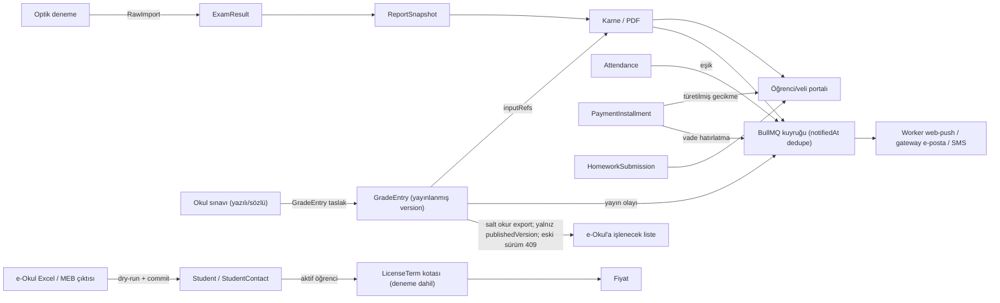

# O-Okul Özel K12 Strateji, Hedef Mimari ve Yol Haritası Planı

**Tarih:** 2026-10-03
**Kaynak:** 2026-10-03 F0–F6 strateji çalışması (pazar araştırması, kod envanteri, mimari denetim); ayrıntılar `docs/ozel-k12-strateji-ekleri.md`
**Baz SHA:** `d9b42f81a` (`origin/main`); plan PR'ı `origin/main` üzerinden açılır, `berrak/g10-karne` dalında yazım yapılmaz
**Belge durumu:** Onaylı plan; kapsam DEC ile değişir, bu doküman kapsam genişletmez
**Kanıt sınıfı:** Kod kanıtları LOCAL_STATIC (repo-göreli `dosya:satır`); hız, satış etkisi ve STAGING/PRODUCTION davranışı ayrıca belirtilmedikçe UNPROVEN
**İnceleme notu:** 2026-10-03 mimari incelemesi uygulandı; ek dosya inceleme öncesi arşivdir, çelişkide bu plan geçerlidir

---

## Context

**Neden:** Ürün bugüne kadar dershane ve optik deneme aracı olarak konumlandı. Optik → karne hattı en güçlü alan ve CI/STAGING kanıtlı. Ödeyen müşteri sayısı 0, tüm tenantlar demo. Ekip 1 geliştirici + yapay zekâ ajanları.

Ürün sahibinin "geride kaldım" hipotezi F1 (pazar/rakip) × F2 (kod envanteri) karşılaştırmasıyla ölçüldü. Sonuç: **genişlikte geride, derinlikte önde.**

- **Genişlik:** Özel K12 rakiplerinin masa bahsi kalemlerinde O-Okul eksik ya da kısmi. Okul yazılısı/not defteri yok, ödev teslim modeli yok, push gönderimi uygulanmamış, e-Okul içe aktarma yok, veli erişimi flag ile kısıtlı (bkz. docs/ozel-k12-strateji-ekleri.md §F2.0).
- **Derinlik:** Rakip sayfalarında kaynaklı olarak bulunmayan yetenekler kodda var: yeniden üretilebilir ve STALE kilitli rapor snapshot'ı (`packages/db/prisma/schema.prisma:1563`), farklı soru sayılı denemelerde Başarı % (`apps/worker/src/jobs/report-generation-job.ts:400`), tenant RLS + capability yetkisi + audit/KVKK temizliği (`apps/api/src/privacy/privacy.controller.ts:24`). Rakipte yokluk DOGRULANMADI.

Plan genişlik açığını parite dilimleriyle kapatır, derinliği satışa giriş tezine çevirir, takvimi kesim sırasıyla korur.

## Kullanıcı kararları (onaylı)

1. **Segment:** Birincil segment özel K12 okul. Dershane ikincil. Kurs/özel öğretim kursuna özgü modül yok.
2. **Veli modeli:** GUARDIAN rolü korunur. `StudentContact` iletişim ve rıza kaynağıdır (DEC-20261003-01; main'de, PR #123 merge edildi).
3. **e-Okul:** Yalnız içe aktarma ve "e-Okul'a işlenecek liste". Liste yalnız yayınlanmış not sürümünden üretilir (geçerli yayın = en yüksek `version`). e-Okul'a yazma ve tarayıcı otomasyonu yok.
4. **Okul sınavı ve not defteri (0–3 ay):** Ayrı gradebook bağlamı kurulur. Optik hat ve `ReportSnapshot.examId` dokunulmaz. Yayınlanan satır güncellenmez. Deneme ve yazılı ayrı seri olarak tutulur.
5. **Tez:** "İlk görüşmede kendi verinle sonuç; yayınlanan hiçbir sayı sessizce değişmez." Bu bir özellik hendeği değil, GTM ve uygulama hızı bahsidir.
6. **GTM:** Fiyat TL olarak yayınlanır. Deneme kartsızdır; kısa bir `LicenseTerm` olarak operatör açar. Fiyat rakamı ayrı DEC ile belirlenir, bu dokümanda rakam yok.
7. **Mimari:** EVRİM, dar hibrit. Strangler ile kurulacak üç yüzey: gradebook hattı, mevcut `announcement-delivery` kuyruğu üzerinden VAPID push ve veli overview read model. §4.2'deki 4 koşul bağlayıcıdır.
8. **Ödev teslimi:** Öğretmen durum satırı ve öğrencinin dosyasız "teslim ettim" işareti yapılır. Dosya eki SONRA.
9. **Mayıs 2027 = satış başlangıcı; Eylül 2027 = PRODUCTION go-live** (tanımlar aşağıda). PDF hattı ve kapasite: ölçüm, kod yalnız eşik aşılırsa.
10. **Kesim sıraları:**
    - H1: e-Okul import → not ekranı sürüm geçmişi
    - H2: ilk karne adım listesi → veli özetinde okul notu → hazır liste
    - H3: push yalnız duyuru → tetikleyici yalnız vade → tek senaryo yük testi
11. **Dış bütçe:** TR içinde S3 uyumlu off-host yedek için küçük bir aylık dış bütçe onaylandı (rakam yok). Bunun dışında dış harcama yok.
12. **Hız:** UNPROVEN. H1 sonunda (2027-01-03) gradebook zinciriyle ölçülür ve plan yeniden çizilir.

## Hedef sonuç

| Kilometre taşı | Tanım | Kanıt sınıfı |
|---|---|---|
| **Mayıs 2027: satış başlangıcı** | Deneme tenant'ı, yayınlanmış fiyat, kimlik/veli modeli, not defteri, e-Okul import ve e-Okul'a işlenecek liste, veli PWA özeti, finans UI | STAGING |
| **Eylül 2027: PRODUCTION go-live** | Production canlıya geçiş + push + otomatik bildirim + ödev teslimi; PDF hattı ve kapasite Eylül'de ölçülür, kod yalnız ölçüm eşiği (timeout/OOM) aşılırsa | PRODUCTION |

PDF hattı ve yük testi H3'te tek "kapasite ölçümü" dilimidir (PO-3). Ölçüm Nisan 2027 kontrol noktasında başlar, Eylül go-live öncesi kapanır. İlk adım: tarayıcıyı tek örnekte tutmak ve BullMQ concurrency. 50 okul rakamı DEC'te pilot sayısına bağlanır. Dilim §8 kayma kuralına açıktır.

## Korunacak sabitler

- **Optik hat:** `ExamResult`, `ReportSnapshot` (`examId` zorunlu), `RawImport` ve karne contract'ı (DEC-20260930-04) değişmez. Sentetik Exam üretilmez.
- **RLS/capability:** Her yeni tablo tenantId, bileşik FK ve `db:rls:check` ile gelir. Yetki capability tabanlı kalır.
- **Snapshot/STALE:** Yayınlanmış sayı yerinde güncellenmez. Düzeltme yeni sürüm olarak yazılır.
- **Kanıt zinciri:** Kanıt betikleri bütünüyle yeniden yazılmaz. `prod:evidence:templates:check` ve `ops:check` her adımda yeşil kalır.
- **AGENTS.md kapı kuralları:** §10.2.
- **4 koşul:** §4.2'de tam metin.

## Kanıt sınıfı ve etiket sözlüğü

| Sınıf | Anlamı |
|---|---|
| LOCAL_STATIC | Kod/doküman okundu; çalıştırılmadı |
| LOCAL_TEST | Yerelde test veya betik çalıştırıldı |
| CI | CI koşusunda geçti |
| STAGING | Staging ortamında doğrulandı |
| PRODUCTION | Production'da doğrulandı |
| EXTERNAL_NOT_RUN | Dış sağlayıcı/ortam gerektirir; çalıştırılmadı |
| UNPROVEN | Kanıt yok; varsayım veya hedef |

Pazar iddiaları: KAYNAKLI (sayfa okundu, alan adı/URL verilir, erişim 2026-10-03), DOGRULANMADI (kaynak bulunamadı), VARSAYIM (çıkarım, doğrulama planına bağlı).

## DEC referansları

Yeni taslaklar: Taslak; `docs/DECISIONS.md`'ye ayrı PR ile yazılır. 2026-10-03'te yazılırsa NN 02'den başlar. Numara verildiğinde D1–D9 çapraz referansları birlikte değiştirilir. Özetler Ek A'da, tam metinler bkz. docs/ozel-k12-strateji-ekleri.md §F6.4.

| Karar | DEC ID | Durum |
|---|---|---|
| Veli hesabı korunur; StudentContact iletişim ve rıza kaydı | DEC-20261003-01 | Onaylı (main, PR #123) |
| Kurum, hesap, lisans ve erişim modeli | DEC-20260801-01 | Onaylı; deneme lisans dönemi eki D7 ile |
| V1 ürün kapsam sınırı | DEC-20260613-01 | Onaylı; segment cümlesi D1 ile güncellenecek |
| Başarı yüzdesi rapor ana metriği | DEC-20260713-02 | Onaylı; Başarı % yalnız deneme serisi için (D4 notu) |
| Standart sapmasız LGS–YKS deneme puanı | DEC-20260727-01 | Onaylı; değişmez |
| D1 Hedef segment ve konumlama | DEC-20261003-NN | Taslak |
| D2 Farklılaşma tezi ve GTM | DEC-20261003-NN | Taslak |
| D3 e-Okul sınırı | DEC-20261003-NN | Taslak |
| D4 Okul sınavı ve not defteri modeli | DEC-20261003-NN | Taslak |
| D5 Mimari evrim ve 4 koşul | DEC-20261003-NN | Taslak |
| D6 Kilometre taşları: Mayıs/Eylül 2027 | DEC-20261003-NN | Taslak |
| D7 Kartsız deneme lisansı | DEC-20261003-NN | Taslak |
| D8 Off-host TR yedek için küçük aylık dış bütçe; gecelik şifreli dump, RPO 24 saat (ilk sözleşmeye kadar) | DEC-20261003-NN | Taslak |
| D9 Ödev teslimi kapsamı | DEC-20261003-NN | Taslak (blokluyor değil) |

ADR: tek yeni ADR var, ADR-0011 değişmez/sürümlü not yayını. ADR-0001, 0002 ve 0008'e kısa ekler yazılır; ADR-0004 ve 0007 yalnız koşullu revize edilir.

---

## 1. Pazar ve karar verici özeti

2026-10-03 web okumasına dayanır; rakip ürünleri denenmedi, erişim tarihi 2026-10-03. Onaylı segment: özel K12 okul birincil, dershane ikincil, kurs için ayrı modül yok.

### 1.1 Karar verici, kullanıcı ve pazar

JTBD tablosu ve kaynaklar: bkz. docs/ozel-k12-strateji-ekleri.md §F1.1.

- **Karar ve ödeme:** kurucu/temsilcisi (VARSAYIM; satın alma onayını kurucunun verdiğini açıkça söyleyen kaynak yok), müdür kısa listeyi yapar (VARSAYIM, bilsa.com.tr), zincirde merkez ofis (UNPROVEN), dershanede sahip (VARSAYIM).
- **Kullanıcılar:** müdür yardımcısı, bilgi işlem, muhasebe, öğretmen, rehber, öğrenci, veli (KAYNAKLI; k12net.com, gelisim.k12.tr, okulaile.com, kurspro.net). Veli yazılımı değil okulu öder.
- **Satın alma:** demo/ücretsiz deneme standart (Kurspro 7 gün kartsız, KursMAX 15 gün kartsız, Delta 15 öğrenciye kadar ücretsiz; KAYNAKLI); okulda kuruma özel teklif (KAYNAKLI, oktasis.com); yaz geçiş penceresi VARSAYIM (karşı kaynak egitimdio.com).

| Pazar rakamı | Etiket | Kaynak |
|---|---|---|
| 2024-25: 14.700 özel okul, 1.539.579 özel öğrenci, oran %9,1 (ortaöğretim %11,6) | KAYNAKLI | meb.gov.tr (haber 38473) |
| 2025-26: 15.094 özel okul, 1.485.021 özel öğrenci | KAYNAKLI | haberturk.com |
| 2026-27 özel okul tavan zam: ara sınıf %30,74, kademe başı %43,92 | KAYNAKLI | hurriyet.com.tr |

### 1.2 Rakip ve masa bahsi özeti

İncelenen 8 rakip: K12 dörtlüsü (K12NET, Bilsa Okulsis, Eyotek, OkulAile) ve kurs tarafında Kurspro, Delta, KursMAX, Sanaliz. Profiller ve mağaza puanları: bkz. docs/ozel-k12-strateji-ekleri.md §F1.2. Sayım yalnız KAYNAKLI iddialarla yapıldı (bkz. docs/ozel-k12-strateji-ekleri.md §F1.3).

- **Masa bahsi (≥5/8):** veli erişimi 8/8, duyuru/anlık bildirim 7/8, ödev 7/8, sınav/ölçme 7/8, devamsızlık 6/8, finans/ön muhasebe 6/8, çok kampüs 6/8, SMS 5/8, ön kayıt 5/8, ders programı 5/8, rehberlik 5/8.
- **Eşik altında, K12 dörtlüsünde standart (VARSAYIM: masa bahsi sayılmalı):** online veli ödemesi, optik okuma, e-fatura, online sınav (4/8); **e-Okul aktarımı 3/8, dörtlüde 3/4.**
- **Farklılaştırıcılar (1–2 rakipte):** kazanıma göre etüt, AI erken uyarı (Bilsa, "%92" firma beyanı), çift yönlü e-Okul (K12NET; yöntem belgesiz), WhatsApp, beyaz etiket; **şeffaf TL fiyat ve kartsız deneme (Kurspro, Delta; K12 dörtlüsünde yok).**
- **Boş alan (hiçbir rakipte kaynaklı değil):** soru sayısı farklı denemeleri Başarı % ile normalize eden konsolide rapor; bütüncül öğrenci profili; velinin KVKK rıza yönetimi; yayından sonra değişmeyen ve yeniden üretilebilen karne; kararlı veli uygulaması (dörtlüden üçünde puan 1,9–3,5; Eyotek 4,7/4,7).
- **e-Okul uyarısı:** MEB'in üçüncü taraflara resmî e-Okul web servisi sunduğuna dair kaynak yok (DOGRULANMADI). MEB Bilgi ve Sistem Güvenliği Yönergesi md. 6/2 ve 9/2-d hesap paylaşımını yasaklıyor (KAYNAKLI, memurlar.net/haber/761812). Onaylı kapsam: yalnız içe aktarma ve e-Okul'a işlenecek liste.

**Açık kalan F1 boşlukları:** ödeyen/karar veren ayrımı doğrulanmadı (5–10 görüşme gerekir); dörtlünün fiyatları için EKAP/bayi denenmedi.

---

## 2. Mevcut durum (kod kanıtıyla)

**Yöntem.** 2026-10-03 F0–F6 strateji çalışmasında 11 modül bulucu ve 1 test/UAT haritası ajanı kodu salt okunur taradı; test koşturulmadı. İkinci bir ajan dosya:satır düzeyinde doğruladı: 166 özellik, 14 modül, 28 akışlık test haritası. Kod okumasının sınıfı **LOCAL_STATIC**'tir. Kanıt `fd01a5c63`'te okundu; bu commit `d9b42f81a`'nın atasıdır ve atıf verilen kod yolları arada değişmedi (LOCAL_STATIC). CI ve STAGING sınıfları yalnız `status.md` ve ilgili kanıt dokümanlarındaki exact-SHA referanslarına dayanır. Güncel SHA için staging rol UAT'ı **UNPROVEN**.

### 2.1 Pazardaki temel beklentilere karşı durum

| F1 beklentisi | O-Okul durumu | Kanıt (LOCAL_STATIC) |
|---|---|---|
| Veli erişimi (8/8) | KISMI. GUARDIAN runtime'ı testli; `product.guardian-read-only` yazma ve daveti kapatıyor. DEC-20260801-01 emekliye ayırıyordu; DEC-20261003-01 (onaylı, main, PR #123) ile GUARDIAN korunur. Birebir mesaj yok | `apps/api/src/guardian/guardian-write-policy.ts:12`, `status.md:169` |
| Duyuru, push (7/8) | Duyuru, okundu ve alıcı raporu VAR (E2E). Push: cihaz kaydı var, gateway gönderimi uygulanmamış; sağlayıcı noop | `infra/notification-gateway/src/index.mjs:51`, `packages/notification-adapter/src/index.ts:81` |
| Ödev (7/8) | KISMI. Sınıf ödevinin API'si var, UI'ı yok; öğrenci başı teslim modeli yok (G1) | `packages/db/prisma/schema.prisma:1241`, `apps/api/src/homework/homework.controller.ts:138` |
| Sınav / ölçme (7/8) | Optik deneme hattı VAR ve en güçlü alan (CI/STAGING). **Yazılı/sözlü not ve manuel sonuç yok (G5)** | `apps/worker/src/jobs/postgres-exam-evaluation-adapter.ts:128` |
| Devamsızlık (6/8) | Günlük yoklama VAR (E2E); eşik uyarısı BACKEND_ONLY, profilde grafik yok (G2) | `apps/api/src/attendance/attendance.service.ts:428` |
| Finans (6/8) | Liste, taksit, tahsilat VAR (E2E). Ödeme planı oluşturma yalnız API'de (G7). Online ödeme/e-fatura kapsam dışı | `apps/api/src/payment/payment.controller.ts:83` |

Diğer satırlar: çok kampüs VAR, konsolide rapor yok; SMS `SMS_ENABLED` ile kapalı (EXTERNAL_NOT_RUN); ders programında öğrenci/veli görünümü yok; ön kayıt YOK, gelişim yazma ekranı yok (G8, `apps/api/src/development/development.controller.ts:41`); e-Okul YOK, genel öğrenci Excel import VAR (`apps/api/src/student/student.controller.ts:246`); PWA manifest var, çevrimdışı yok; açık API yok. Tam tablo: bkz. docs/ozel-k12-strateji-ekleri.md §F2.0.

**Muhasebe (FINANCE_STAFF) P1 adayları (runtime'da doğrulanmadı):** `/me/password`, `/kurum` panosu ve duyuru API'si 403; finans sayfası 403 alabilecek uçları çağırıyor (`apps/api/src/rbac/roles.ts:24`, `apps/web/app/(app)/kurum/finans/finance-page.tsx:713`).

### 2.2 Akışlar, yarım işler ve test altyapısı

Ayrıntı: bkz. docs/ozel-k12-strateji-ekleri.md §F2.2, §F2.3, §F2.4, §F2.5.

- **Uçtan uca:** 54 E2E akış; 11'i CI veya STAGING kanıtlı (7 STAGING, 4 CI), 43'ü LOCAL_STATIC. STAGING etiketleri eski Gate D SHA'larına dayanır.
- **Yarım:** 15 BACKEND_ONLY kalem (ödeme planı oluşturma, sınıf ödevi, gelişim yazma, duyurunun EMAIL/PUSH teslimi vb.), 7 SCREEN_ONLY kalem, flag/env ile kapalı yollar. Feature rollout kataloğunun tüm flag'leri 2026-11-07'de sona eriyor (`apps/api/src/feature-rollout/feature-rollout.service.ts:15`).
- **Kanıt dağılımı (166 özellik):** LOCAL_STATIC 138, CI 17, STAGING 10, UNPROVEN 1, LOCAL_TEST 0, PRODUCTION 0.
- **Son CI/staging:** `fd01a5c63` için tam `pnpm run ci` PASS; staging rol UAT'ı UNPROVEN; `raw-import:smoke` EXTERNAL_NOT_RUN. Notification provider smoke, Sentry/alerting ve off-host/WAL yedek FAIL veya eksik (`status.md:224-226`).

---

## 3. Tez seçimi ve doğrulama planı

On bir tezin ayrıntısı, yargıç puanları ve çürütmeler: bkz. docs/ozel-k12-strateji-ekleri.md §F3.2, §F3.3, §F3.4.

### 3.1 Seçilen tez (onaylı)

Aday üç tezin üçü de düşmanca incelemede "özellik hendeği" olarak çürüdü. Ayakta kalan fark iki katmandır ve bir **GTM ve uygulama hızı bahsidir** (onaylı).

| Katman | İçerik | Dayanak |
|---|---|---|
| Satış ve devreye alma hızı | Müdürün kendi deneme dosyası ilk görüşmede karneye dönüşür; kartsız deneme ve yayınlanmış TL fiyat | `apps/api/src/exam/raw-import.controller.ts:53`, `apps/worker/src/jobs/report-generation-job.ts:610`; fiyat şeffaflığı KAYNAKLI |
| Güven | Yayınlanan hiçbir sayı sessizce değişmez (snapshot, STALE, sürümlü cevap anahtarı, audit); KVKK güvenli veli kanalı | `packages/db/prisma/schema.prisma:1537,1563`; `apps/api/src/audit-log/audit-log.controller.ts:20`. Rakipte yokluk DOGRULANMADI |

**Tez:** "İlk görüşmede kendi verinle sonuç; yayınlanan hiçbir sayı sessizce değişmez." T9'un daraltılmış hâlidir; T4 (sürümlü not yayını), T6 (veli okuma kaydı), T8 (öğrenciye özel devamsızlık bildirimi) ve T10 (kimlik kararı) parçaları aşılandı. Rakiplerin aynı ekranı 6 ayda kopyalayabileceği VARSAYIM'dır; savunma, satış modeli farkına ve snapshot/RLS temeline dayanır.

### 3.2 Çürütmeden gelen zorunlu düzeltmeler

1. Deneme ve yazılı tek Başarı % çizgisinde birleştirilmez; iki ayrı seri, ölçek etiketli (onaylı).
2. Not defteri parite dilimidir; tezin kendi eforu 0,5–1 ay (UNPROVEN).
3. Demo anonim/sentetik dosyayla yapılır; VİS olmadan gerçek veri yüklenmez (temiz sıfırlama kapalı, `packages/db/src/tenant-fresh-reset.ts:26`).
4. Demo vaadinden önce dosya spike'ı; parser yalnız OPTIK_129 ve YANIT'ı tanıyor (`apps/api/src/exam/parser-config-suggestion.service.ts:48`).
5. Flag'ler 2026-11-07'de bitiyor; DEC-20261003-01 verildi, flag'lerin kaderi bu tarihten önce kapatılır.
6. Devamsızlık eşiği worker sabitidir (değer DEC'te, KV-8); kampüs kapsamlı personel için boş dönen öğrenci 360 verisi düzeltilir (`apps/api/src/student-overview/student-overview.service.ts:48-49`).

### 3.3 Parite özeti

Tam parite matrisi, farklılaştırıcı fırsatlar ve "bilinçli olarak yapılmayacaklar" tablosu: bkz. docs/ozel-k12-strateji-ekleri.md §F3.1.

- **P0 parite boşluğu:** okul sınavı/not defteri; e-Okul içe aktarma ve işlenecek liste; veli yazma/davet; veliye push; ödev arayüzü ve teslim; ödeme planı UI ve gecikme.
- **P1:** öğrenciye özel devamsızlık bildirimi, birebir mesaj, öğrenci/veli ders programı, rehberlik ekranı, SMS'in canlı açılması, ön kayıt, veli–öğretmen randevusu, kurulabilir PWA.
- **Bilinçli olarak yapılmayacak:** e-Okul'a yazma/otomasyon, online ödeme/POS, e-fatura, yemekhane/servis/GPS, LMS, kurs-özel modül, native uygulama, açık API, AI erken uyarı. Her birinin yeniden değerlendirme tetikleyicisi ektedir.

### 3.4 Doğrulama planı (30/60/90 gün)

Plan 2026-10-03'te başlar. Dış harcama yok. Eşikler ölçümden önce yazılmış karar kurallarıdır; sonuçlar ölçülene kadar UNPROVEN. Dosya testi ve görüşme satırları F6'da revize edilen P-03 kuralını taşır[^p03].

| Gün | Adım (maliyet) | Başarı eşiği | Başarısızlık ve tepki |
|---|---|---|---|
| 0–7 | **Dosya talebi:** ağa aynı yazılı talep (kimliksiz optik dosya, olmazsa form tipi, okuyucu yazılımı, ilk 3 satır); cevap GÖNDERDİ / SÖZ / RET ve itiraz türüyle kaydedilir; önce minimal anonimleştirme betiği (görüşme zamanı) | İlk sinyal 21. gün | Karar 31–60. gün sayı eşiğiyle |
| 7–21 | **Ön ayar spike'ı:** dosyalar yerel demo tenant'ında OPTIK_129/YANIT ve karantinadan geçer; süre, elle müdahale, "olduğu gibi / yalnız config / kod değişikliği" kaydedilir; LOCAL_TEST (2–4 geliştirici günü; tam KF-10 kiti eşik geçene kadar ertelenir) | Gelen dosyaların en az 2/3'ü kod değişikliği olmadan, yalnız config ile karneye; 30 dk ve ≤2 elle müdahale ayrıca kaydedilir | Yarıdan fazlası parser kodu isterse demo vaadi askıya; parser kapsamı DEC-20260613-01 açık sorusunda |
| 0–30 | **Kimlik kararı** (tamamlandı) ve **KVKK demo yolu:** sabit genişlikte kimlik ezme yapan anonimleştirme betiği (`--self-test`), CI'da 11 haneli sayı/telefon grep'i (izin listesiyle), VİS şablonu; hukuk görüşü K-1/K-4/K-6 ile sınırlı (3–5 geliştirici günü, UNPROVEN) | DEC-20261003-01 main'de (tamamlandı); demo kalıcı veri bırakmaz | Anonimleştirme olmazsa sentetik dosya, "kendi dosyan" vaadi kalkar |
| 31–60 | **Görüşmeler:** 6–8 müdür/ölçme sorumlusuna "son denemenizin dosyasını getirin"; en az yarısı ağ dışından; ağ içi/dışı ayrı raporlanır (2–3 hafta) | **Sayı eşiği:** en az 6 tekliften 7 gün içinde en az 3 dosya, en az 1'i ağ dışından | ≤1 dosya ya da ağ dışından 0 = başarısız; gri bölge (tam 2): ağ dışından 3 teklif daha. Başarısızlıkta "kendi dosyan" vaadi çıkar, tez T4/not defteri paritesine döner, kazanılan süre H1 kesim sırasına |
| 31–60 | **Ödeme isteği:** en az 3 kurucuya geçiş/ek modül sorusu; fiyat aralığı kaydedilir, rakam yazılmaz | En az 1 kurucu ücretsiz pilot + dönem sonu ücreti kabul eder | T9 yalnız onboarding aracı olur |
| 61–90 | **Not defteri prototipi:** 2 öğretmen yazılı girer; deneme ve yazılı ayrı seri (1–2 geliştirici haftası) | Sınıf girişi <15 dk, düzeltme ≤2 | Ölçek karışırsa yazılı Başarı % için DEC |
| 61–90 | **İlk pilot taahhüdü** (dış harcama yok) | 1 yazılı pilot niyeti | Mayıs referanssız kalır, T9 cilası durur |

[^p03]: **P-03 revizyonu (F6).** F3'ün ilk taslağındaki yüzde eşikleri küçük örneklemde gürültüydü. Geçerli kural: en az 6 tekliften 7 gün içinde en az 3 dosya, en az 1'i ağ dışından; söz geçmeye sayılmaz, ayrı sütunda tutulur; masa başı ölçütü "gelen dosyaların en az 2/3'ü kod değişikliği olmadan, yalnız config ile karneye"; 30 dk ve ≤2 elle müdahale ayrıca kaydedilir; takvim 0–7 / 7–21 / 31–60. gün; gri bölgede tek uzatma. Bu belgede P-03 ve KF-10 başarı metriği için geçerli tek kural budur.

**Açık riskler:** efor tahminleri ölçülmüş hıza dayanmıyor (UNPROVEN); kurucunun ödeyen kişi olduğu VARSAYIM; dosya ve görüşmelerin kişisel ağdan başlaması getirme oranını iyimser gösterebilir (ağ dışı kotası bu yüzden konuldu).

---

## 4. Hedef mimari (EVRİM, dar hibrit)

Efor aralıkları 1 geliştirici + ajan varsayımına dayanır (UNPROVEN). Ayrıntılı kanıt listeleri ve ER diyagramı: bkz. docs/ozel-k12-strateji-ekleri.md §F4.1, §F4.2.

### 4.1 Karar: EVRİM, dar hibrit izinli (onaylı)

| Seçenek | Maliyet | Risk | Süre | Müşteri etkisi | Kanıt yükü | Toplam |
|---|---|---|---|---|---|---|
| EVRİM | 5 | 4 | 4 | 5 | 4 | **22** |
| HİBRİT | 4 | 4 | 4 | 5 | 3 | 20 |
| YENİDEN_YAZIM | 1 | 1 | 1 | 3 | 1 | 7 |

UYGUN_DEGIL bulguları iki türdür. Birincisi eksik bileşenlerdir: not defteri, push gönderici, off-host yedek ve PWA kurulabilirliği. İkincisi dar hatalardır: 25'lik batch, sahte "sent" ve muhasebe 403. Hiçbiri yığın değişimi gerektirmiyor. Tam yeniden yazım reddedildi: 1459 izlenen dosya, 118 migration, yaklaşık 1 MB kanıt betiği (`scripts/check-prod-evidence-templates.mjs` 9248 satır). Toplam süre 5–7 ay (UNPROVEN); P0 eklemeleri yaklaşık 3–6 hafta ekler.

**Üç strangler yüzeyi.** Eskisi, yenisi aynı kanıt sınıfında yeşil olduktan sonra kaldırılır.

| Yüzey | Yeni bileşen | Neden |
|---|---|---|
| Okul notu sonuç hattı | `apps/api/src/gradebook` (yeni) + GradeAssessment / GradeEntry (2 tablo) | Sonuç modeli optik hatta kilitli (`schema.prisma:1488-1489`, `:1538`) |
| Bildirim teslimi | Mevcut `announcement-delivery` BullMQ kuyruğu + worker'da `web-push`; tablo yok | 25'ten fazla alıcıda gönderim düşüyor, PUSH koşulsuz başarısız (`infra/notification-gateway/src/index.mjs:3`, `:51`) |
| Veli portalı veri katmanı | Allow-list overview DTO + kurulabilir PWA | İstemci yaklaşık 18 istek atıyor; ADR-0007 ile çelişiyor |

Finans yeni yüzey değildir; gecikme okuma anında türetilir (`OVERDUE` bugün elle yazılıp ödeme kaydında `PENDING`'e dönüyor, `apps/api/src/payment/payment.service.ts:356`), durum yazan cron yok. ADR'ler dilimle yazılır; yoklama eşzamanlılığı ayrı DEC'tir.

**"ŞİMDİ" etiketi.** ŞİMDİ = Eylül 2027 PRODUCTION go-live öncesi ufuk; Mayıs/Eylül ayrımı §7.1'deki onaylı tanıma göredir. ŞİMDİ kalemleri 0–3 ay dilimine sığmaz; yol haritası onları H1/H2/H3'e böler.

### 4.2 4 koşul

1. DEC-20261003-01, 2026-11-07'den önce uygulanır; iki flag kodla ve aynı PR'da kaldırılır. Yapılmazsa seçim geçersizdir.
2. Optik hatta dokunulmaz: ExamResult, ReportSnapshot (`examId` zorunlu), RawImport ve karne sözleşmesi değişmez; sentetik Exam yok.
3. Yeni tenant tablosu kapısı. AK-2 başlamadan önce `packages/db/scripts/check-tenant-reset-catalog.ts` bütün migration'ları tarar; yöntem `check-rls.mjs:8` ile aynıdır. Bundan sonra her yeni tablo aynı PR'da şunlara girer: `tenantId` + bileşik FK, `db:rls:check`, `check-tenant-relation-fks.mjs`, reset kataloğu ve tenant-table-coverage testi (yeni). §4.5 kapıları olarak cihaz yedek politikası ve KVKK export kapsam testi de aynı PR'da güncellenir.
4. Mayıs 2027 öncesi tamamlanacaklar: 25'lik parçalama, hooks-worker "sent" kaldırma, muhasebe 403, audit partition (2026-12 öncesi), şifreli off-host TR yedek + restore tatbikatı.

Strangler kuralı: §4.1. "L işi planı 4 haftadan fazla aşarsa kapsam daraltılır" kuralı: §8.

### 4.3 Takvime bağlı iki sabit tarih

2026-11-07: flag kataloğu sona erer (§5.2). 2026-12-01: AuditLog'un son partition'ı 2026_12, bakım bu tarihten önce (`packages/db/prisma/migrations/20260530143000_partition_audit_log_by_created_at/migration.sql:44`).

### 4.4 Tezin mimariye karşılığı

Efor UNPROVEN.

- **e-Okul içe aktarma:** Mevcut import servisi ve alias'larla yapılır; örnek dosyadan sonra 0,5–1 hafta (KF-7).
- **Deneme `LicenseTerm`'ü:** `planCode` zod enum + OpenAPI, şema değişmez; 2–5 gün (`schema.prisma:330-349`, `tenant.service.ts:95-96`).
- **Demo ve deneme tenant'ı:** Demo tenant'lar ayrı kalır; deneme tenant'ı boş açılır (kod yok).
- **İlk karne adım listesi:** Yeni API yok; 2–4 gün.
- **"Yayınlanan sayı değişmez":** Sağlayan iki şey var. Birincisi `GradeEntry.version` ile yayınlanmış satırı reddeden trigger'dır. İkincisi listenin yalnız `publishedVersion`'dan üretilmesidir. `publishedVersion`, `max(version)` yayınının önbelleğidir; yayın transaction'ında birlikte yazılır, liste ve karne aynı değeri okur.

### 4.5 Rol ve alan modeli

Rol × modül tablosunun tamamı: bkz. docs/ozel-k12-strateji-ekleri.md §F4.1.

- Yeni tenant rolü eklenmez. Rehber ayrı rol değildir; `TeacherAssignment.role=GUIDANCE_COUNSELOR` (`apps/api/src/school/school-validation.ts:46`).
- Yeni uçlarda `@RequireCapability` kullanılır. Tüketilmeyen `note:write-assigned`, `homework:write-assigned`, `self:read` silinir (`role-capabilities.ts:69-70`). `homework:write-assigned` teslim uçlarına bağlanırsa kalır. `ward:read` silinmez, veli kapsamı uçlarına bağlanır (KV-4).

Alan modelinde eklenenler:

- **Not defteri (2 tablo):**
  - `GradeAssessment`: id, tenantId, classId, courseId, termId, kind (CHECK), title, heldOn, maxScore, publishedVersion, notifiedVersion, createdById.
  - `GradeEntry`: id, tenantId, assessmentId, studentId, version, score, absent, publishedAt, enteredById, createdAt. Tekillik `@@unique([tenantId, assessmentId, studentId, version])`.
  - Yazım `assertTeacherAssigned` ile korunur; `TeacherAssignmentScope.roles` BRANCH_TEACHER/CLASS_TEACHER ile filtrelenir ve `courseId` zorunludur (`apps/api/src/attendance/attendance.service.ts:79`).
- **`HomeworkSubmission`:** Zaman damgalıdır (`submittedAt`, `checkedAt`, `checkedById`). Satırlar tembel oluşur ve durum türetilir. Öğrenci işareti `INSERT ... ON CONFLICT DO UPDATE ... WHERE checkedAt IS NULL` ile yazılır; 0 satır dönerse 409 verilir.
- **Bildirim:** Tablo yok. Kalıcı dedupe kaynak satırdaki `notifiedAt`/`notifiedVersion` ile yapılır. jobId `sourceType:sourceId:channel:chunkIndex` biçimindedir, chunk 25'liktir. Sonuç mevcut `AnnouncementDeliveryReport`'a yazılır.
- **`StudentContact.guardianId String?`:** FK hedefi `GuardianStudent(tenantId, guardianId, studentId)`'dır; raw SQL ile, `ON DELETE SET NULL`. Ayrı dilimde gelir.

Kayıt, lisans ve finans modeli değişmez. Deneme bir `LicenseTerm` satırıdır. Veli overview, allow-list DTO ve tek bağ helper'ıyla kurulur (desen `apps/api/src/payment/payment.service.ts:75-82`). Öğretmen notu, iletişim ve diğer velinin alanları dönmez; bunu alan yokluğu testi doğrular.

**Değişmez kurallar:**

- Yayınlanmış `GradeEntry` güncellenmez ve silinmez. Bunu BEFORE trigger sağlar (desen `packages/db/prisma/migrations/20260907180000_delivery_provenance_and_retry_fence/migration.sql:12-26`, `protect_*`). App rolüne DELETE grant'ı verilmez.
- Düzeltme yeni `version` olarak yazılır; geçerli yayın `max(version)`'dır ve `publishedVersion` bunun aynı transaction'da yazılan önbelleğidir.
- Karne snapshot'ı `inputRefs`'te `{gradeAssessmentId, version}` taşır ve bu değer hash girdisine girer.
- e-Okul listesi yalnız `publishedVersion`'dan üretilir.
- Her yeni tablo koşul 3 kapılarından geçer (`packages/db/scripts/check-rls.mjs:45`, `packages/db/src/tenant-reset-catalog.ts:3`, `apps/api/src/operations/device-backup-impact.ts:31`, `apps/api/src/operations/tenant-data-export-store.ts:42`).
- KVKK export kapsam testi şu farkın boş olmasını ister: `getTenantScopedTables()` − exportTables − gerekçeli istisna listesi. Employee, Homework ve ScheduleLesson KVKK kararı olarak açık sorudur.
- Yayın, import ve export uçlarında idempotency zorunludur; anahtarsız istek 400 alır. Import yanıtı yalnız sayım ve id döner, böylece `IdempotencyKey.responseBody` PII saklamaz.

**Gecikme** tek yardımcıdan türetilir: `status IN ('PENDING','OVERDUE') AND deletedAt IS NULL AND dueDate < bugün (Europe/Istanbul)`. `OVERDUE` yazımı enum'dan çıkar; backfill onaylıdır.

### 4.6 Modüller arası veri akışı

Akış tablosu, platform yetenekleri, 48 konuluk uygunluk tablosu ve hedef bileşen diyagramı: bkz. docs/ozel-k12-strateji-ekleri.md §F4.1, §F4.2.

### 4.7 ADR başlıkları

ADR-0001..0010 var. ADR'ler dilimle birlikte yazılır. Bağlam metni: bkz. docs/ozel-k12-strateji-ekleri.md §F4.2.

| ADR | Tür | Özet (efor UNPROVEN) |
|---|---|---|
| ADR-0011 | Yeni | Değişmez/sürümlü not yayını: okul notu ayrı bağlam (L; efor §7.2 AK-1..AK-4, 4–7 hf) |
| ADR-0001, 0002, 0008 | Kısa ek | Kampüs kapsamı sınıf üzerinden; alt işleyenler veri yerleşimine; iki flag'in katalogdan çıkması |
| ADR-0004, 0007 | Koşullu revizyon | Yalnız KV-4 kararı değiştirirse |

DEC ile karara bağlanacaklar:

- yönetici MFA
- muhasebe 403
- e-Okul formatı ve import alias kuralı
- yoklama eşzamanlılığı
- gecikme/vade kuralları
- deneme `planCode`'u
- rehberlik privacy DEC'i
- bildirim kuyruğu ve web-push (payload PII taşımaz; 404/410'da `NotificationDeviceToken.disabledAt`)
- PWA kurulabilirliği
- yedek RPO/RTO

### 4.8 ŞİMDİ / SONRA / HİÇ

Tablonun tamamı ve gerekçeler: bkz. docs/ozel-k12-strateji-ekleri.md §F4.2. ŞİMDİ'nin anlamı §4.1'dedir. Efor aralıkları §7 dilim toplamlarıdır.

| Yetenek | Karar | Tetikleyici |
|---|---|---|
| Not defteri ve sürümlü yayın (4–7 hf) | ŞİMDİ | Koşul 3 kapısından sonra |
| e-Okul import (mevcut student-import alias'ları); e-Okul'a işlenecek liste (1,5–2,5 hf) | ŞİMDİ | Anonim örnek dosya; liste için gradebook yayını ve format |
| Türetilmiş gecikme ve ödeme planı UI (2–4 hf) | ŞİMDİ | Hemen; veli finans görünümü veli overview ile |
| Kartsız deneme (2–5 gün), ilk karne adım listesi (2–4 gün), PWA kurulabilirliği, cache yok (1–3 gün) | ŞİMDİ | Fiyat sayfasıyla; e-Okul import'tan sonra; hemen |
| Allow-list veli DTO'su; audit partition tek seferlik 24 ay apply; OWNER/ADMIN MFA rol genişletme | ŞİMDİ | Karşılandı; 2026-12-01 öncesi; en geç Mayıs 2027 |
| Ödev teslimi: durum satırı + dosyasız "teslim ettim" | ŞİMDİ — Eylül 2027 (H3) | H3, AK-2 sonrası |
| Web push uçtan uca | ŞİMDİ — Eylül 2027 (H3) | VAPID onayı; kuyruk parçalamasından sonra |
| Vade / gecikme hatırlatması (2–4 gün) | ŞİMDİ — Eylül 2027 (H3) | Kuyruk ve push canlıya çıktıktan sonra |
| Kapasite ölçümü (`report-generation:perf` 1500 öğrenci; k6 tek senaryo) | ŞİMDİ — Eylül 2027; kod yalnız eşik aşılırsa | timeout/OOM ya da imzalı okul sayısının ölçülen kapasiteyi aşması |
| Ödev dosya eki, self-serve kayıt, TWA, Capacitor, çevrimdışı veli okuma/yoklama, öğretmen/veli MFA, sağlayıcı webhook'ları, read replica, snapshot arşivi, PII'siz AI yardımcıları, WAL gönderimi, pgBackRest | SONRA | Ekteki tekil tetikleyiciler |
| Sanal POS, e-fatura, native, çevrimdışı not girişi, çoklu DB/bölge, açık API, LMS, kurs-özel modül, servis GPS, AI erken uyarı/ders programı/soru çözümü (bu faz), e-Okul'a yazma | HİÇ | Strateji değişikliği DEC'i |

---

## 5. Kimlik ve veli modeli

### 5.1 DEC-20261003-01 özeti (onaylı)

Karar main'de (PR #123); tek kaynak `docs/DECISIONS.md`.

1. `GUARDIAN` rolü, hesabı, session'ı ve veli portalı korunur; giriş kuralı DEC-20260801-01'deki gibidir; DEC-20260531-01 yeniden yürürlüğe girer.
2. `StudentContact` SMS ve duyuru rızasının tek kaynağıdır; portal görünürlüğü `GuardianStudent` bayraklarından gelir.
3. StudentContact–Guardian bağı ayrı additive dilimde gelir: `guardianId` nullable, RLS, ve FK hedefi `GuardianStudent(tenantId, guardianId, studentId)` (raw SQL, `ON DELETE SET NULL`). Bağı yalnız kurum yöneticisi kurar.
4. Öğrenci oluşturma ve import veli hesabı açmaz; davet ayrıca ve toplu tetiklenir.
5. İki flag 2026-11-07'den önce aynı PR'da kodla kaldırılır ve `ward:read` veli kapsamı uçlarına bağlanır. Merge ile kapanış ayrıdır:
   - Merge 2026-11-07'den önce yapılır; kanıtı LOCAL_TEST + CI'dır.
   - Kapanış için staging `/health` 200 dönmeli ve staging-role-uat güncel SHA'da koşmalıdır. UAT-GUARDIAN-01/02 kanıt metni genişletilir.

### 5.2 Flag bitişi ve KV-1

`product.guardian-read-only` ve `web.student-registry-v2`, `expiresAt: 2026-11-07` ile fail-closed çalışır (`apps/api/src/feature-rollout/feature-rollout.service.ts:15`, `:42`). Süre dolumuna bırakılırsa veli yazma yolları plansız açılır, StudentContact uçları ve öğrenci overview `FEATURE_ROLLOUT_DISABLED` (403) döner. Bu yüzden KV-1, 2026-11-07'den önce bitmek zorundadır (koşul 1). Kapsam: iki anahtarın tek PR'da silinmesi, `GuardianWritePolicy` ve `assertGuardianInvitationWritable`'ın kaldırılması, registry-v2'nin koşulsuz olması, `provisionAccounts=false`. Kapsam dışı: bağ ve toplu davet (KV-3), `ward:read` ve veli overview (KV-4). Kanıt bugün LOCAL_STATIC.

| İş | Efor (UNPROVEN) | Dış harcama |
|---|---|---|
| KV-1: flag kaldırma, testler, web dalları, doküman | 2–4 geliştirici günü | yok |
| KV-3 içinde: StudentContact–Guardian bağı (şema, migration, RLS, tipler, API, UI; FK hedefi `GuardianStudent`) | 3–6 geliştirici günü | yok |

KV-1 optik hatta dokunmaz; yasak yollar `apps/api/src/exam/`, `apps/api/src/report/`, `apps/worker/src/jobs/optical-*`, `exam-evaluation-*`, `packages/db/prisma/migrations/`. Etkilenen dosya listesi: bkz. docs/ozel-k12-strateji-ekleri.md §F4.3.

---

## 6. Riskli varsayımlar ve riskler

Yeni araştırma yapılmadı; sayılar ve eşikler değiştirilmedi. PR #123 merge edildi; DEC-20261003-01 `origin/main` üzerinde `docs/DECISIONS.md:712`'de.

### 6.1 Varsayım kaydı

F4.4'teki 25 varsayım F6'da 38'e genişledi; tamamı ve yargıç toplamları için bkz. docs/ozel-k12-strateji-ekleri.md §F4.4 ve §F6.3. Öne çıkan DOGRULANMADI kalemler: e-Okul kolon formatı, iOS PWA push, TR barındırma beyanı, audit'in domain transaction'ında yazılması, deneme süre dolumu davranışı, vade hatırlatmasının rıza dayanağı.

### 6.2 En kritik 5 varsayım ve en ucuz testi

Sıra yargıç toplamına göredir; çürütücü beşinin de özgün eşiğini geçersiz buldu, aşağıdakiler revize testlerdir. Tam test hücreleri: bkz. docs/ozel-k12-strateji-ekleri.md §F6.1.

| Sıra | Varsayım | Test ve maliyet | Geçme / başarısızlık | Başarısızlıkta |
|---|---|---|---|---|
| 1 C-1 (10) | KV-1+PO-1+KV-6 ≤3 geliştirici haftası (UNPROVEN) | §10.1 "plan gün / gerçek gün" kaydı, dilim başına; kontrol noktaları 2026-11-14 ve 2027-01-03; ek maliyet yok | Geçme: medyan ≤1,0, efor ≤3 hf, KV-1 2026-11-07 öncesi. Başarısız: medyan ≥1,5 ya da KV-1 birleşmemiş; 1,0–1,5 gri | Medyan ≥1,5 ise H1 kesim sırası; H2 ölçülmüş oranla yeniden takvim; Mayıs kapsamı yeniden onay |
| 2 K-2 (9,6) | Okullar tek standart VİS şablonunu müzakeresiz kabul eder (VARSAYIM) | VİS taslağı (1,5 geliştirici günü); hukukçu okuması K-1/K-4/K-6 ile tek görüşte, **dış harcama var, ONAYSIZ** (OPEN-20261003-01) | Geçme: hukukçu standart şablonun savunulabilir olduğunu söyler; onaysız sonuç UNPROVEN | Önce sentetik deneme, gerçek veri VİS imzasından sonra |
| 3 P-03 (8,48) | "Dosyanı getir" dosyayla sonuçlanır ve dosyalar karneye ulaşır (VARSAYIM) | §3.4 takvimi; 2–4 geliştirici günü | §3.4 sayı eşiği | "Kendi dosyan" vaadi çıkar; tez T4/G5 paritesine döner |
| 4 C-5 (8,16) | H1 dış girdileri zamanında gelir: e-Okul örneği 60. gün, S3 DEC 2026-12-15, fiyat/deneme DEC 2027-01-03 (VARSAYIM) | 0–7. günde 3 okuldan başlık satırı; 14/30/60. gün kontrol; 1–2 geliştirici günü | Geçme: 14. günde ≥1 başlık; 60. günde 2 okuldan kolon seti, 1 satırlı dosya, öğretmen teyidi | KF-7 H2'de sentetik fixture ile yapılır ya da kayar; teyit yoksa KF-8 kodlanmaz; S3 gecikirse PO-2 H2'de KF-1'den hemen sonra kalır |
| 5 T-9 (7,8) | 2027 partition uygulanırken `AuditLog_default`'ta 2027 satırı yok (VARSAYIM) | Masa başı + staging salt okunur SQL + grep; 0,75 geliştirici günü | Geçme: 2027 aralığında 0 satır, ileri tarih 0 | Onaylı taşıma mutasyonu; 2026-12-01 öncesi PO-1 tek apply |

**F3.5 ile tutarlılık:** P-03 için F3.5'in özgün eşiği bu planda kullanılmaz; §3.4 ve KF-10 aynı sayı eşiğini taşır. K-2'nin hukuk görüşü OPEN-20261003-01'e bağlıdır (§6.4).

### 6.3 Risk matrisi

Olasılık ve etki 1–5 arası yargıdır (VARSAYIM). Uzun azaltma metinleri ve kanıt satırları: bkz. docs/ozel-k12-strateji-ekleri.md §F6.2.

| Risk | O×E | Kısa azaltma | Sahip | Tetikleyici |
|---|---|---|---|---|
| RC-1 Hız F5 max'a yakın | 4×4 | C-1/C-2 ölçümü; 2027-01-03'te yeniden takvim | AK-4 | Erken sinyal >3 hf |
| RP-02 Görüşmeler 60. güne yetişmez | 4×4 | Haftada 2 sabit slot; 5'ten az görüşmeyle fiyat DEC'i yok | KF-10 | 2026-11-15'te planlı <3 |
| RP-01 "Dosyanı getir" kancası tutmaz | 3×5 | Sentetik demo yolu; spike görüşmeden önce | KF-10 | 21. gün spike ya da 60. gün P-03 sayı eşiği tutmaz |
| RP-03 Fiyat/deneme DEC'leri gecikir | 3×5 | Fiyat DEC'i 90. günde, veri yoksa UNPROVEN | KF-9 | 2027-02-01'de fiyat DEC'i yok |
| RK-1 Reşit olmayan gerçek verisi demo/repo'ya girer | 3×5 | Sabit genişlikte kimlik ezme, `--self-test`, CI'da 11 haneli sayı/telefon grep'i (izin listesiyle) | KF-10 | Self-test başarısız |
| RC-5 Tek gözden geçirici darboğazı | 3×5 | Yeni tablo PR'larında zorunlu CI kapıları | AK-2 | >2 açık PR ya da >5 iş günü bekleyen PR |
| RT-1 KV-1 2026-11-07'den önce birleşmez | 2×5 | 2026-11-08 saat testi; 2026-10-24'te PR yoksa diğer H1 dilimleri durur | KV-1 | 2026-10-24'te CI yeşil değil |
| RT-4 Off-host yedek yok | 2×5 | Gecelik şifreli dump + restore (RPO 24 saat); ilk deneme tenant'ından önce STAGING restore | PO-2 | KF-5 açılırken restore kanıtı yok |
| RT-5 Dönem sonu PDF timeout/OOM | 3×4 | Kapasite ölçümü H3; kod yalnız eşik aşılırsa; PO-3 ölçüm dilimi | PO-3 | Ölçümde timeout/OOM |
| RT-3 Staging 418 kök nedeni bilinmiyor | 3×4 | Yarım günlük salt okunur teşhis | KV-1 kapanışı (ops görevi) | 2 iş gününde kök neden yok |

Diğer O×E ≥12 riskler: RP-06, RK-2, RK-3, RC-3, RC-7, RK-7 (tek dış görüş; **dış harcama var, ONAYSIZ; OPEN-20261003-01**), RC-2. O×E 12'nin altındakiler: RT-6, RT-7, RT-2 (tetikleyici "2027 aralığında satır >0"), RP-04, RP-05, RP-07, RK-6, RK-5, RK-4, RK-8, RC-4, RC-6.

### 6.4 Hukuk görüşü gerektiren maddeler

Tek seferlik hukuk görüşü için dış harcama **onaysızdır** (OPEN-20261003-01; karar en geç 2027-01-03). D8'in tek dış bütçe istisnası yalnız TR off-host yedektir. Bloklayıcı maddeler tek soru listesinde toplanır (RK-7, KF-10):

- **K-1** operasyonel veli bildirimi açık rıza ister mi (DOGRULANMADI; KV-8 öncesi, onay yoksa KV-8 açılmaz).
- **K-4** e-Okul Excel'ini yüklemek MEB yönergesini ihlal eder mi (DOGRULANMADI; KF-7 öncesi masa başı okuma + 3 bilgi işlem cevabıyla sınırlı).
- **K-6** ve F4.4 #12 alt işleyenler, md.9 yükü ve TR barındırma beyanı (DOGRULANMADI; KF-9'daki "verin TR'de" iddiasından önce, onay yoksa bu iddia yok).

Not olarak (bloklamaz):

- **K-2** tek standart VİS şablonu savunulabilir mi (VARSAYIM; aynı görüşe sorulur, onay yoksa sonuç UNPROVEN, deneme yalnız sentetik veriyle).
- **K-5** 5580 sayılı Kanun yazılım için onay/bildirim ister mi (DOGRULANMADI; mevzuat.gov.tr taraması + 3 müdür).
- **K-8** 91. gün imha ve süresiz AuditLog yasal saklamayla çelişir mi (DOGRULANMADI; sonuç UNPROVEN).
- **F4.4 #24** vade hatırlatmasının rıza dayanağı (DOGRULANMADI; K-1 ile birlikte sorulur).

---

## 7. Yol haritası

**2026-10-04 güncellemesi (ürün sahibi):** KF-7 ve KF-8 yol haritasından çıkarıldı, e-Okul örnek dosyası kullanılmayacak (DEC-20261004-05). TR S3 sağlayıcı seçimi ertelendi; PO-2 sağlayıcı seçilene kadar başlamaz (DEC-20261004-09). Hukuk görüşü harcaması (OPEN-20261003-01) ertelendi; KV-8 ve KF-9'daki TR barındırma iddiası bu görüşü bekler. D1–D9 `docs/DECISIONS.md`'de DEC-20261004-02..10 olarak kayıtlıdır (D7 = DEC-20261004-02). Aşağıdaki KF-7/KF-8 satırları yalnız tarihçe içindir.

Kaynak: 2026-10-03 F0–F6 strateji çalışması, F5. 38 aday, 3 bağımsız sıralayıcı ve yargıçla 27 dilime indi; doğrulayıcı her yolu ve komutu kök `package.json` ile kontrol etti. 2026-10-03 mimari incelemesi ve ürün sahibi onayıyla dilimler 20 satıra indi (H1 6, H2 7, H3 7). Efor UNPROVEN (paralel ajan kazancı sıfır sayıldı). Dilim başı yollar, kabul kriterleri ve doğrulama komut blokları: bkz. docs/ozel-k12-strateji-ekleri.md §F5.1, §F5.2, §F5.3.

### 7.1 Kapasite gerçeği ve Mayıs/Eylül tanımı (onaylı)

| Ufuk | Satılabilir çıktı | Dilim | Hafta min–max | Kapasite |
|---|---|---|---|---|
| H1 2026-10-03 → 2027-01-03 (12 hf) | Operatör kartsız deneme açar; öğretmen not girer, yönetici yayınlar, düzeltme yeni sürüm; 25+ alıcılı duyuru düşmez; gecelik şifreli yedek ilk sürümü. LOCAL_TEST/STAGING | 6 | 7–13,5 | Yalnız min sığar |
| H2 2027-01-03 → 2027-04-03 (13 hf) | e-Okul import ve liste, toplu veli daveti, kurulabilir veli PWA'sı ve özet, ödeme planı ve gecikme, 403'süz muhasebe, TR off-host yedek ve restore (STAGING) | 7 | 10,5–18,5 | Min sığar (tampon 2,5); max sığmaz |
| H3 2027-04-03 → 2027-10-03 (26 hf; Mayıs = 4. hafta) | Mayıs: yayınlanmış TL fiyat (KF-9), OWNER/ADMIN MFA (KV-9; onaylı tanıma ek, §4.8). Eylül: PRODUCTION'da push, otomatik bildirim, ödev teslimi; PDF hattı ve kapasite için ölçüm | 7 | 12,5–23 | Min ve max sığar; Mayıs öncesine KF-9 ve KV-9 (2,5–5 hf) |

Toplamlar dilim eforlarının toplamıdır, UNPROVEN.

**Karar (onaylı, F5.3 seçenek A; 2026-10-03 güncellemesi).** Mayıs 2027 "satış başlangıcı"dır: deneme tenant'ı, fiyat, kimlik/veli, not defteri, e-Okul import ve liste, veli PWA özeti, finans UI; kanıt STAGING. Eylül 2027 PRODUCTION go-live'dır: production + push + otomatik bildirim + ödev teslimi. PDF hattı ve kapasite için ölçüm yapılır; kod yalnız ölçüm eşiği (timeout/OOM) aşılırsa yazılır. Ölçümdeki okul sayısı DEC'te pilot sayısına bağlanır. Muhasebe 403 ve TR off-host yedek onaylı tanımın dışında ek kalemdir; Mayıs öncesi kalemler koşulu (§4.2) gereği Mayıs öncesi biter. Satış takvimiyle uyum VARSAYIM: demo Şubat–Mayıs, sözleşme Mayıs–Haziran, geçiş yaz, canlı Eylül.

**Hız ölçümü.** Gradebook zinciri (AK-1+AK-2 ve AK-3+AK-4, 4–7 hf) ilk L iştir. H1 sonunda (2027-01-03) hız bununla ölçülür, §10.1'deki "plan gün / gerçek gün" kaydına yazılır ve plan yeniden çizilir.

**H1'de istenecek dış onaylar:** örnek e-Okul dosyası ve not liste formatı (KF-7, KF-8); TR S3 (PO-2; küçük aylık dış bütçe onaylı, rakam yok); VAPID secret (KV-7); staging/prod DB mutasyonu ve deploy (PO-1, PO-10, PO-3); hooks-worker deploy (KV-6); fiyat DEC'i (KF-9); deneme süresi/limit DEC'i (KF-5).

### 7.2 H1 dilimleri (0–3 ay)

Sıra: KV-1 → hijyen → AK-1+AK-2 → AK-3+AK-4 → KF-5+yedek → KF-10. KF-10, F3 görüşme takvimi ve 2026-12-01 tarihi için 2–3. sıraya alınabilir (§9.2).

| Dilim | Amaç / kabul özeti | Metrik | Bağımlılık | Efor | Sat. |
|---|---|---|---|---|---|
| 1. KV-1 Kimlik DEC uygulaması + staging | İki flag kodla kalkar, veli yazma/davet açılır; saat 2026-11-08 testi. PR 2026-11-07'den önce LOCAL_TEST ve CI ile merge edilir. 418 teşhisi paralel ops görevidir (yarım gün timebox). Kapanış: staging `/health` 200, ardından mevcut `staging-role-uat.yml` ve `uat:check` ile UAT-GUARDIAN-01/02; o zamana kadar EXTERNAL_NOT_RUN | 2026-11-07 sonrası FEATURE_ROLLOUT_DISABLED ve GUARDIAN_WRITE_READ_ONLY 0; her rol için güncel SHA'da ≥1 PASS (STAGING) | DEC-20261003-01 (karşılandı), deploy onayı | 1–2 hf | 4 |
| 2. Hijyen paketi (PO-1 + KV-6) | PO-1: mevcut `audit-log-partition:maintain` ile tek seferlik 24 ay apply (onaylı; önce staging, sonra prod). DEFAULT ön kontrolü ve CI tarih guard'ı var; kanıt `artifacts/staging/audit-log-partition.json`. KV-6: 60 mesaj 25+25+10; hooks-worker `/notification` kalkar | 2026-12-01'de STAGING'de 2028-12'ye kadar partition, DEFAULT 0; 300 alıcıda sahte "sent" 0 | DB mutasyonu ve hooks-worker deploy onayı | 0,5–1 hf | 3 |
| 3. AK-1 + AK-2 Tenant kapıları ve not şeması | Reset kataloğu tüm migration'ları tarar. `GradeAssessment` ve append-only `GradeEntry` gelir: `@@unique(tenantId, assessmentId, studentId, version)`. Yayınlanmış satırda UPDATE/DELETE'i BEFORE trigger reddeder (migration 20260907180000 deseni); app rolüne DELETE grant'ı verilmez. Tenant-table-coverage testi eklenir | `db:rls:check`, tenant-relation-fks, reset kataloğu ve kapsam testi yeşil; düzeltme sonrası 2 sürüm, yerinde güncelleme 0 | yok | 1–2 hf | 2 |
| 4. AK-3 + AK-4 Gradebook API ve not ekranı (PO-5 dahil) | Giriş, yayın ve düzeltme yapılır; düzeltme yeni version açar, geçerli yayın max(version)'dır ve `publishedVersion` aynı transaction'da yazılır. Idempotency zorunlu (anahtarsız 400). `assertTeacherAssigned` ve `TeacherAssignmentScope.roles` (BRANCH_TEACHER/CLASS_TEACHER) uygulanır, courseId zorunludur; atanmamış öğretmen 403 alır. AuditLog yazılır. Öğretmen ekranı ve yönetici yayını `apps/web/app/(app)/{ogretmen,kurum}/not-defteri/` (yeni) altındadır; sürüm geçmişi v1/v2 | 30 kişilik sınıf <5 dk; 30 giriş, yayın, 1 düzeltme hatasız | AK-2 | 3–5 hf | 5 |
| 5. KF-5 Kartsız deneme + gecelik yedek | `planCode` zod enum + OpenAPI, şema değişmez. Tanımsız planCode 400 döner, TRIAL bitince READ_ONLY olur. Kurulum kartına 2 koşullu link (KF-6). Gecelik şifreli pg_dump ilk sürümü ve staging restore (decrypt dahil). Bu dilim geçmeden gerçek veri içeren deneme tenant'ı açılmaz | Deneme <10 dk açılır; staging restore PASS | Deneme DEC'i, TR S3 ve secret onayı | 0,5–1,5 hf | 4 |
| 6. KF-10 F3 doğrulama kiti | Sabit genişlikte kimlik ezme betiği `scripts/anonymize-sample-file.mjs` (yeni); `--self-test` var, ağ erişimi yok. CI'da 11 haneli sayı ve telefon grep'i izin listesiyle koşar. Protokol ve görüşme kaydı `docs/validation.md` (yeni) | En az 6 tekliften 7 gün içinde en az 3 dosya, en az 1'i ağ dışından. Gelen dosyaların en az 2/3'ü kod değişikliği olmadan, yalnız config ile karneye ulaşır (30 dk ve ≤2 elle müdahale ayrıca kaydedilir). Söz sayılmaz. 90. gün 1 yazılı pilot niyeti | Anonim dosyalar | 1–2 hf | 3 |

### 7.3 H2 dilimleri (3–6 ay)

Sıra: KF-1 → KV-4 → KV-3 → KF-2; PO-2 sağlayıcı seçimine kadar ertelendi, KF-7 ve KF-8 çıkarıldı (2026-10-04).

| Dilim | Amaç ve kabul | Efor |
|---|---|---|
| KF-1 Muhasebe 403 | Parola değişimi 200 döner, `/kurum/finans` 403'süz açılır; tahsilat hata ekranı 0 (LOCAL_TEST). | 1–2 hf |
| PO-2 Off-host TR yedek + restore (PO-8 dahil) | Gecelik şifreli pg_dump (AES-256-GCM, `node:crypto`) mevcut `@aws-sdk/client-s3` ile TR S3'e yazılır; restore tatbikatı `restore:drill:check` ile PASS verir; RPO 24 saat, D8'e yazılır. | ~1 hf |
| ~~KF-7 e-Okul import~~ (çıkarıldı, DEC-20261004-05) | Mevcut student-import alias'ları kullanılır, örnek dosya gelince ve K-4 masa başı okumasından sonra yapılır; audit'e sha256 + satır sayısı yazılır, yanıt yalnız sayım/id döner. | 0,5–1 hf |
| ~~KF-8 e-Okul'a işlenecek liste~~ (çıkarıldı, DEC-20261004-05) | Yalnız geçerli yayın listelenir: `publishedVersion` (max(version) önbelleği, yayın transaction'ında yazılır; karne aynı değeri okur). Aynı istek aynı sha256'yı verir. | 1–1,5 hf |
| KV-4 Veli özeti + okul notu ayrı seri (AK-5, KV-5 dahil) | Allow-list DTO ve tek bağ helper'ı (`apps/api/src/payment/payment.service.ts:75-82` deseni) kullanılır; öğretmen notu, iletişim ve diğer veli alanı yoktur (alan yokluğu testi). PWA kurulabilirliği: manifest id/start_url, PNG/maskable ikon; cache yok. | 3,5–6 hf |
| KV-3 guardianId bağı + toplu davet (KV-2 dahil) | `StudentContact.guardianId` FK'sı raw SQL ile `GuardianStudent(tenantId, guardianId, studentId)`'a bağlanır, ON DELETE SET NULL; tekrar gönderimde ikinci davet yok, TC/telefon kullanıcı adı olmaz. | 1,5–3 hf |
| KF-2 Ödeme planı UI + türetilmiş gecikme (KF-3 dahil) | Ödeme planı UI eklenir. Gecikme tek yardımcıdan türetilir; OVERDUE yazma enum'dan çıkar, backfill onaylıdır. Aynı anahtarla ikinci plan oluşmaz. | 2–4 hf |

### 7.4 H3 dilimleri (6–12 ay)

Sıra: KF-9 → KV-9 (Mayıs öncesi, ~2,5–5 hf) → KV-7 → PO-10 → AK-6 → KV-8 → PO-3. KF-9 ve KV-9 satış başlangıcına, kalanı Eylül 2027 go-live'ına yazılır (onaylı).

| Dilim | Amaç ve kabul | Efor |
|---|---|---|
| KF-9 Fiyat sayfası ve landing | `apps/web/app/fiyatlar/` (yeni) eklenir. Her iddia DEC/UAT'a bağlıdır, "e-Okul entegrasyonu" ifadesi yoktur. TR barındırma iddiası yalnız K-6 sonrasında yazılır. | 1,5–3 hf |
| KV-9 OWNER/ADMIN TOTP MFA | Rol listesi `isAdminMfaRole`'a OWNER/ADMIN eklenerek genişler. SYSTEM_ADMIN destekli sıfırlama gelir. Mevcut `scripts/check-admin-mfa-evidence.mjs` requiredRoles güncellenir. Step-up sistem tenant'ına bağlı kalır (negatif test). | 1–2 hf |
| KV-7 Push (VAPID) | Gönderim mevcut `announcement-delivery` kuyruğuyla worker'a taşınır: 25'lik chunk, jobId = sourceType:sourceId:channel:chunkIndex, `web-push`. 404/410'da `disabledAt` set edilir, payload PII taşımaz. | 2–3 hf |
| PO-10 Prod go-live kanıt zinciri (PO-7 dahil) | Mevcut `go-live:check` ve `prod:evidence:summary:check` PRODUCTION'da PASS verir; yeni kanıt betiği yok. Prod bootstrap'ı trafik açılmadan AuditLog 24 ay partition apply'ını koşar (PO-1 runbook; staging 2026-10-03'te uygulandı). Bağımlılık: staging 200 + KV-1 UAT. | 3–6 hf |
| AK-6 Ödev teslimi | `HomeworkSubmission` zaman damgalıdır (submittedAt, checkedAt, checkedById), satırlar tembel oluşur, durum türetilir. Öğrenci işareti `ON CONFLICT ... WHERE checkedAt IS NULL` ile yazılır, 0 satırda 409 döner; dosyasız. | 1,5–3 hf |
| KV-8 Tetikleyiciler: vade, devamsızlık, not yayını (KF-4, AK-7 dahil) | `notifiedAt`/`notifiedVersion` taraması yapılır, eşik worker sabitidir (değer DEC'te). Rıza ve `disabledAt` gönderim anında kontrol edilir; K-1 önce. | 3–5 hf |
| PO-3 Kapasite ölçümü (PO-4 dahil) | Ölçüm Nisan 2027 kontrol noktasında başlar, Eylül go-live öncesi kapanır: `report-generation:perf` ile 1500 öğrenci ve `scripts/k6-report-listing.js`'e eklenen tek not girişi senaryosu. Kod yalnız eşik (timeout/OOM) aşılırsa yazılır; ilk adım tarayıcının tek örnekte tutulması + BullMQ concurrency. | 0,5–1 hf (eşik aşılırsa +2–4 hf) |

### 7.5 Düşürülen ve birleştirilen dilimler

Birleşenler: PO-5 → AK-3; KV-2 → KV-3; AK-5 → KV-4; KF-3 → KF-2; KF-4, AK-7 → KV-8; PO-8 → PO-2; PO-7 → PO-10; AK-1 → AK-2; KF-6 → KF-5; KV-5 → KV-4; PO-4 → PO-3. Düşenler: PO-6 (kanıt yönetimi darboğaz olursa açılır), AK-8 (yoklama PUT p95 sorun gösterirse), AK-9 (çok kampüslü pilot çıkarsa). Gerekçeler: bkz. docs/ozel-k12-strateji-ekleri.md §F5.4.

---

## 8. Kesim sıraları

Kesim sıraları onaylıdır. Ufuk kapasiteyi aşarsa kalemler bu sırayla kesilir veya sonraki ufka kayar. Onaylı sıra otomatik işler; sıra dışı her kesim DEC ister.

| Ufuk | Onaylı kesim sırası |
|---|---|
| H1 | e-Okul import (KF-7) → not ekranı sürüm geçmişi (AK-4) |
| H2 | İlk karne adım listesi (KF-6, KF-5 içinde) → veli özetinde okul notu (KV-4'ün okul notu kısmı) → hazır liste (KF-8) |
| H3 | Push yalnız duyuru (KV-7) → tetikleyici yalnız vade (KV-8) → tek senaryo yük testi (PO-4, PO-3 içinde) |

**Not (onaylı sıraya ek değildir; sıra dışı kesim DEC ister):**
- KF-7 H2'ye kaydığı için onaylı H1 sırasının 1. kalemi uygulanmış sayılır; H1'de kesilecek ilk kalem AK-4 sürüm geçmişidir. Ek kesim gerekirse DEC'e gider.
- KF-7 H2'de de örnek dosya gelmezse kod yazılmaz.
- KF-5'in kurulum kartı linkleri H1'de kesilmezse H2 sırası veli özetinde okul notundan başlar.
- KV-1, PO-1, KV-6 ve KF-10 kaydırılmaz; KF-1 ve PO-2 Mayıs öncesi kalemler koşulu gereği kesilmez.
- KF-8 onaylı H2 sırasının 3. kalemidir; "yalnız format doğrulanmadıysa" gibi ek koşul uygulanmaz.
- PO-3 H3 ŞİMDİ ölçüm kalemidir; kod yalnız ölçüm eşiği aşılırsa yazılır.

**4 hafta kayma kuralı**

| L iş | 4 haftayı aşarsa |
|---|---|
| Gradebook zinciri AK-1+AK-2 ve AK-3+AK-4 (4–7 hf) | Onaylı H1 sırasıyla AK-4'ün sürüm geçmişi görünümü daralır |
| KV-7 | Onaylı H3 sırasıyla yalnız duyuru push'una daralır |
| PO-3 | Ölçüm eşiği aşılırsa kod yazılır; işin bölünmesi DEC ile |
| PO-10 | Kapsam daralır; daralma DEC ve ürün sahibi onayıyla |

---

## 9. Kapasite ve tarih riskleri

### 9.1 Kapasite yalnız min senaryoda sığıyor (UNPROVEN)

| Ufuk | Min toplam | Max toplam |
|---|---|---|
| H1 | 7/12 hf | 13,5/12 hf |
| H2 | 10,5/13 hf (tampon 2,5) | 18,5/13 hf |
| H3 | 12,5/26 hf | 23/26 hf |

2026-10-03 ile 2027-05-01 arası yaklaşık 30 hafta; H1+H2 toplamı min 17,5, max 32 hafta. Mayıs'ta gerçekçi çıktı H1+H2 kapsamının STAGING/LOCAL_TEST kanıtlı demosudur. Staging 418 teşhisi KV-1'e paralel bir ops görevidir ve tahmin edilmedi. Uzarsa KV-1 kapanışı EXTERNAL_NOT_RUN kalır, H1 toplamı değişmez. Dış harcama yalnız PO-2'nin TR S3 depolaması (onaylı).

### 9.2 Tutmayan tarihler

PO-10 (2027-04-30) bu sıralamada tutmuyor. Mayıs = satış başlangıcı, Eylül 2027 = PRODUCTION go-live onaylı olduğundan bu tarih geçersizdir. PO-3'ün eski tarihi düşer; kapasite ölçümü Nisan 2027 kontrol noktasında başlar, Eylül go-live öncesi kapanır (§10.3). PO-10'un yeni son tarihi H1 sonu yeniden planlamasında (2027-01-03) yazılır ve Eylül go-live'ından önce kalır. Tarih DEC-20261003-NN (D6; taslak, docs/DECISIONS.md'ye ayrı PR ile) kaydına bağlanır. Bu dokümanda yeni tarih verilmez. PO-2 (2027-04-30) ve KF-1 (Mayıs öncesi) değişmez.

Mayıs öncesi kalemler koşulunun ihlali düzeltildi: PO-2 H2'de 6. sıradan 2. sıraya alındı (max bitiş ~2027-05-24 → ~2027-01-24), KF-1 4. sıradan 1. sıraya.

| H1 sabit tarihi | Max bitiş | Son tarih |
|---|---|---|
| KV-1 | ~2026-10-17 | 2026-11-07 |
| PO-1 | ~2026-10-24 | 2026-12-01 |
| KV-6 | ~2026-10-24 | 2026-12-01 |
| KF-10 | ~2026-11-07 (3. sırada); 6. sırada ~2027-01-05, tarihi kaçırır | 2026-12-01 |

KF-10 tarihi tutturmak için 3. sıraya alınır; bu, §7.2'deki 2–3. sıra notunun uygulamasıdır.

### 9.3 Yazar çakışması

Paylaşılan dosyalar sıralı yürür:

- `schema.prisma`, reset kataloğu, yedek ve export listeleri: AK-2 → KV-3 → KF-2 → KV-7 → AK-6 → KV-8
- `apps/api/src/gradebook/`: AK-3 → KF-8 → KV-4 (okuma) → KV-8 (tek çağrı)
- `app-shell.tsx`: AK-4 → KF-1
- `students-page.tsx` ve student-import: KV-1 → KF-7 → KV-3
- `docker-compose.yml` ve yedek betiği: H1 dilim 5 (yedek ilk sürümü) → PO-2 → PO-3 (yalnız eşik aşılırsa)

### 9.4 F3 doğrulama planıyla eşleme

| F3 adımı | Tarih | Çakışan dilim | Not |
|---|---|---|---|
| Dosya talebi 0–7 / ön ayar spike'ı 7–21. gün | İlk sinyal 21. gün (2026-10-24) | KF-10, mevcut optik hat | Spike mevcut optik import ile elle protokol; tam KF-10 kiti eşik geçene kadar ertelenir |
| 6–8 müdür görüşmesi ("dosyanı getir") | 31–60. gün (→ 2026-12-02) | KF-10 şablonu, KV-1 | Not defteri henüz yok; demo optik karne, veli ve duyuru üzerinden |
| Ödeme isteği sorusu (3 kurucu) | 31–60. gün | KF-10 soru seti | Fiyat DEC'i bu cevaplara dayanır |
| G5 prototipi (not defteri) | 61–90. gün | AK-2 → AK-3 → AK-4 | KF-10 3. sıradayken AK-4 min eforla ~2026-11-18'de, max eforla ~2026-12-26'da biter; prototip 90. güne yetişir (UNPROVEN) |
| İlk pilot niyeti | 90. gün (2027-01-01) | KF-5 | Kabul eden okul 48 saatte deneme tenant'ına alınır |

---

## 10. İlerleme kaydı ve sahiplik kuralları

### 10.1 İlerleme kaydı

Planın tek ilerleme kaynağı `status.md` "## Açık İşler" bölümüdür. Her dilim kapanışında bir satır eklenir: tarih, dilim, kanıt sınıfı, SHA/PR ve plan gün / gerçek gün; C-1 hız ölçümü bu sütunlardan okunur. DEC-20261003-01 2026-10-03'te main'dedir (PR #123, d9b42f81).

### 10.2 Sahiplik kuralları

Kurallar `AGENTS.md` "Subagent Orchestration" bölümünden gelir; bu plan onları değiştirmez: kapı başına tek yazma yetkili katılımcı; en fazla üç alt ajan, derinlik 1; her kapıdan önce hedef, sahip olunan ve yasak yollar, kabul ve doğrulama komutları yazılır, kapı bitince rapor verilir ve durulur; kanıt sınıfları ayrı raporlanır; deploy, sağlayıcı eylemi, secret/config (D8 `BACKUP_OFFSITE_TARGET` dahil), DB/veri mutasyonu ve mutasyonlu smoke açık ürün sahibi onayı ister; ilgisiz değişiklikler geri alınmaz ve commit edilmez. Her dilim kapanışında `status.md` "## Açık İşler" güncellenir; kayıt 2 haftadan uzun güncellenmezse RC-7 tetiklenir. Onaylı kesim sırası otomatik işler, sıra dışı kesim DEC olarak yazılır.

### 10.3 H1 kontrol noktaları

- **H1 ortası, 6. hafta sonu (2026-11-14 civarı):** plan/gerçek süre, KV-1'in 2026-11-07'ye yetişmesi, AK-1+AK-2 ilerlemesi. Eşik aşılırsa onaylı H1 kesim sırası işler; KV-1, PO-1, KV-6, KF-10 kaydırılmaz.
- **H1 sonu, 2027-01-03:** gradebook zincirinin gerçek süresi ve F3 60./90. gün sonuçları. Plan ölçülmüş hızla yeniden çizilir; değişen kilometre taşı DEC ile yazılır.
- **Nisan 2027:** kapasite ölçümü (PO-3) başlar; Eylül go-live öncesi kapanır.

---

## 11. 2026-10-10 yeniden planlama (DEC-20261010-01, önerildi)

§10.3'teki "H1 sonunda yeniden çiz" kuralı erken tetiklendi: H1'in 6 dilimi, H2'nin KF-1/KV-4/KV-3/KF-2 dilimleri ve H3'ün KF-9/KV-9/KV-7/AK-6/KV-8 dilimleri 2026-10-03 ile 2026-10-05 arasında main'e girdi (CI PASS, staging'e otomatik deploy). Ölçülen şey **kodun main'e girme hızıdır**; dilimlerin kabul metrikleri (ör. "30 kişilik sınıf <5 dk") STAGING'de ölçülmedi ve UNPROVEN'dır. C-1 sütunları `status.md` "Dilim kapanış kaydı"ndadır.

### 11.1 Değişmeyenler

- Mayıs 2027 satış başlangıcı (STAGING kanıtı) ve Eylül 2027 PRODUCTION go-live (DEC-20261004-08).
- §4.2'deki 4 koşul, kesim sıraları ve onaylı DEC'ler.

### 11.2 Kalan iş (kod dışı ağırlıklı)

| Sıra | İş | Kabul | Onay / girdi |
|---|---|---|---|
| S1 | **Staging rol UAT'ı** (§11.3 senaryoları) | Her senaryo STAGING'de bir kez uçtan uca PASS; süre metrikleri ölçülüp yazılır; bulgu varsa dilim olarak açılır | Staging'de veri değişikliği ve test kullanıcıları ürün sahibi onayıyla |
| S2 | #153 lisans sonu imhası merge | CI PASS; export kapsamı 2026-10-10 kararıyla (rıza, AuditLog, dosya içerikleri dahil) | Merge onayı |
| S3 | PO-2 off-host TR yedek | Sağlayıcı seçilir, `restore:drill:check` STAGING'de PASS | Sağlayıcı ve aylık bütçe; aday karşılaştırması `docs/po-2-tr-s3-karsilastirma.md` |
| S4 | F3 doğrulama planı (§3.4: dosya talebi, görüşmeler, ödeme isteği, pilot taahhüdü) | §3.4 eşikleri | Ürün sahibi işi; kod yalnız bulgu çıkarsa |
| S5 | PO-3 kapasite ölçümü | §7.4 PO-3 kabulü | Nisan 2027 yerine S1'den sonra başlayabilir |
| S6 | PO-10 production kanıt zinciri | §7.4 PO-10 kabulü | Tarih kararı: pilot kurum gerçek veriyle çalışacaksa production Eylül'den önce gerekir (staging'e gerçek kişisel veri girmez) |

Yeni özellik dilimi yalnız S1 veya S4 bulgusundan açılır; açılan her dilim DEC veya ürün sahibi onayıyla yazılır.

### 11.3 Staging UAT senaryoları

Her satır ilgili dilimin plan metriğini taşır. Test verisi kuralı geçerlidir (TC 1000000xxxx, telefon 555/500).

| Senaryo | Rol | Ölçüt |
|---|---|---|
| Kartsız deneme açma, 7 gün / 100 öğrenci sınırı, süre sonunda salt okunur (KF-5) | SYSTEM_ADMIN, OWNER | Akış hatasız; sınır aşımı reddedilir |
| Öğrenci içe aktarma: `veli_*` → StudentContact, TC okunmaz, çakışmada `CONTACT_COLUMNS_CONFLICT` (KV-1) | ADMIN | Satır sayıları dosyayla eşleşir |
| Not girişi, yayın, düzeltme v2; veli yalnız yayınlanmış sürümü görür (AK-3/AK-4, KV-4) | Öğretmen, ADMIN, veli | 30 kişilik sınıf girişi <5 dk; düzeltme yeni sürüm |
| Toplu veli daveti ve elle bağlama (KV-3, KV-3b–e) | ADMIN, veli | E-postasız veli atlanır; ikinci davet oluşmaz |
| Veli PWA kurulumu ve özet ekranı (KV-4) | Veli (gerçek telefon) | Kurulur, özet açılır |
| Duyuru push'u gerçek cihazda (KV-7) ve 300 alıcılı duyuru (KV-6) | ADMIN, veli | Push ulaşır; sahte "sent" 0 |
| Otomatik bildirimler: devamsızlık, vade, not yayını (KV-8) | Öğretmen, muhasebe, veli | Tetikleyici başına bir bildirim |
| Muhasebe parola değişimi ve `/kurum/finans` (KF-1), ödeme planı ve gecikme (KF-2) | Muhasebe | 403 yok; gecikme doğru türetilir |
| OWNER/ADMIN MFA kurulumu ve SYSTEM_ADMIN destekli sıfırlama (KV-9) | OWNER, SYSTEM_ADMIN | Akış hatasız |
| Ödev teslimi ve kontrol (AK-6) | Öğrenci, öğretmen | Teslimsiz kontrol 409 |
| Fiyat sayfası kademeli hesap (KF-9) | Ziyaretçi | Sınır değerlerde (250/251, 500/501) fiyat düşmez |
| Kendi dosyanla doğrulama kiti (KF-10) | Operatör | Anonimleştirilmiş dosya karneye ulaşır |

### 11.4 Kontrol noktaları

- **2026-11-14:** S1 kapanışı ve bulgu listesi. 2026-11-07 flag bitişi artık risk değildir: rollout mekanizması #130 ile kaldırıldı ve kod `FEATURE_ROLLOUTS_JSON` okumuyor.
- **2027-01-03:** F3 60./90. gün sonuçları ve S6 (PO-10) tarihi.
- PO-3 S1'den sonra başlar; Eylül go-live öncesi kapanır.

---

## Ek A. DEC taslakları (özet)

Dokuz kayıt 2026-10-03 F0–F6 strateji çalışmasında hazırlandı; hiçbiri henüz `docs/DECISIONS.md`'de değildir. Tam metinler (`docs/DECISIONS.md` satır 6-12 biçimi: Durum, Karar, Kaynak, Kanıt, Etkilenen ADR, Açık soru, Son kontrol): bkz. docs/ozel-k12-strateji-ekleri.md §F6.4. Çelişkide bu özet ve onaylı kararlar geçerlidir. Bütün kayıtların Kaynak satırı: ürün sahibi kararı (2026-10-03 F0–F6 strateji çalışması). ID'ler yer tutucudur: Taslak; docs/DECISIONS.md'ye ayrı PR ile; aynı gün yazılırsa D1 → 02 … D9 → 10. `docs/DECISIONS.md`'de "Durum: Taslak" kullanan kayıt yoktur; kayıtlar ya "Onaylı" ile yazılır ya da D9 gibi "Faz Öncesi Onay Gerektirenler" tablosuna OPEN satırı olarak girer (seçim ayrı PR'da).

| D | Başlık | Karar özeti | Açık soru |
|---|---|---|---|
| D1 | Hedef segment özel K12; konum bütüncül öğrenci takibi | Özel K12 birincil, dershane ikincil, optik hat korunur, kurs-özel modül yok; DEC-20260613-01'in yalnız hedef cümlesinin yerine geçer; "e-Okul entegrasyonu" denmez | F3 eşikleri tutmazsa segment önceliği yeniden değerlendirilir; landing metni KF-9'da onaylanır |
| D2 | Farklılaşma tezi ve GTM | Tez cümlesi; özellik hendeği değil; TL fiyat yayınlanır (aktif öğrenci kotası); deneme kartsız, operatör açar (D7); fiyat rakamı ayrı DEC | "Kendi dosyan" vaadi masa başı spike (7–21. gün) ve P-03 sayı eşiği geçmeden landing'e girmez |
| D3 | e-Okul sınırı | Yalnız dosya düzeyinde import (TC şifreli + hash olarak mevcut desen: `nationalIdEncrypted`/`nationalIdHash`; sha256 audit; veli hesabı açmaz; yanıt yalnız sayım/id) ve yalnız geçerli yayından (max `version`) liste; yazma, şifre, RPA yok | Örnek dosya gelmeden KF-7/KF-8 kodlanmaz |
| D4 | Okul notu ayrı gradebook bağlamı | 2 tablo additive (`GradeAssessment` + append-only `GradeEntry`), yayınlanmış satırda trigger, DELETE grant yok, düzeltme yeni `version`; optik hat değişmez; deneme ve yazılı ayrı seri; Başarı % yalnız deneme | Not ölçeği ve ağırlıklar UNPROVEN; audit transaction'ı DOGRULANMADI |
| D5 | Mimari evrim ve 4 koşul | Evrim; yalnız üç strangler yüzeyi, liste genişletilmez; 4 koşul §4.2 + §8 kayma kuralı | Worker'da `web-push` ile gönderim DOGRULANMADI |
| D6 | Mayıs 2027 satış başlangıcı, Eylül 2027 go-live | §7.1 onaylı tanım; onaylı kesim sıraları; PDF hattı ve kapasite için Eylül: ölçüm; kod yalnız eşik (timeout/OOM) aşılırsa; hız H1 sonunda ölçülür | 50 okul rakamı DEC'te pilot sayısına bağlanır |
| D7 | Kartsız deneme lisansı | Kısa `LicenseTerm`, yalnız SYSTEM_ADMIN açar; `planCode` zod enum, şema yok; süre dolumunda READ_ONLY/FROZEN mevcut `resolveLicenseState`; rakam KF-5 ekinde | Kapalı `planCode` kümesinde SYSTEM kalır mı |
| D8 | Off-host TR yedek için küçük aylık bütçe | TR içinde S3 uyumlu, gecelik şifreli dump; RPO 24 saat ilk sözleşmeye kadar, RTO ve S3 lifecycle süresi yazılır; WAL SONRA; tek dış bütçe istisnası; tutar PO-2'de; restore en geç 2027-04-30 STAGING | Sağlayıcı ve `BACKUP_OFFSITE_TARGET` onayı; TR beyanı hukuk görüşüne kalır (K-6) |
| D9 | Ödev teslimi kapsamı | `HomeworkSubmission` zaman damgalı satır (`submittedAt`, `checkedAt`, `checkedById`), durum türetilir; öğrenci yalnız dosyasız teslim işareti; dosya eki SONRA, ayrı DEC | Geç teslim durumu pilot geri bildirimine kalır |

### Ek A.1 Mevcut DEC'lerde Durum güncellemeleri

Karar metinleri değişmez; yalnız Durum ve Son kontrol satırları güncellenir.

| DEC | Değişiklik | Ne zaman |
| --- | --- | --- |
| DEC-20260613-01 | "Onaylı; hedef segment cümlesi DEC-20261003-NN (D1) ile güncellendi; optik, rapor/karne, ödeme takibi ve fatura dışlaması geçerli" | D1 ile aynı PR |
| DEC-20260713-02 | "...Başarı % tanımı yalnız deneme (optik) serisi içindir, okul notu DEC-20261003-NN (D4) ile ayrı seridir" | D4 ile aynı PR |
| DEC-20260801-01 | Sona "; deneme lisans dönemi DEC-20261003-NN (D7) ile tanımlanır" eklenir | D7 ile aynı PR |
| DEC-20260531-01, DEC-20260627-01, DEC-20260823-01, DEC-20260930-04 | Değişiklik yok (main'de güncel; D4/D5/D8/D9 bunlarla uyumlu) | — |

Her DEC PR'ından sonra `pnpm ops:check` ve `pnpm prod:plan:check` çalıştırılır.

---

## Ek B. Güncellenecek mevcut dokümanlar

Güncellemeler origin/main üzerinden açılan PR'larda yapılır (DEC-20261003-01'in durumu için bkz. §10.1).

### Ek B.1 Doküman güncellemeleri

- `docs/marketing-claims.md` "## Ana Mesaj": segment metni özel K12 birincil (D1 sonrası); GUARDIAN cümlesi DEC-20261003-01 ile uyumlu (KV-1); deneme/fiyat CTA yalnız STAGING kanıtıyla (KF-5, KF-9).
- `docs/product-journeys-v1.md` "## Kapsam Karari": hedef kurum tipi, not defteri ve e-Okul döngüsü, kapsam dışına "e-Okul'a yazma" ve "kurs-özel modül", veli hedef persona; yeni UAT ID'leri checker ve template ile (D1 sonrası; AK-2/AK-4; KF-7/KF-8).
- `status.md` "## Açık İşler": sıralama bu plana taşınır, H1 dilimleri kanıt sınıfıyla, hız UNPROVEN notu; zorunlu başlıklar korunur (plan PR'ı, sonra her dilim kapanışı).
- `docs/llm-wiki/README.md`: §2 segment, §4 GUARDIAN/StudentContact, §11 okuma listesine bu plan (okuma listesi plan PR'ında; diğerleri D1 ve KV-1 ile).
- `docs/DECISIONS.md`: D1–D9 ve Ek A.1 (D1, D2, D5, D6 plan PR'ında; D3 KF-7, D4 AK-2, D7 KF-5, D8 H1, D9 AK-6 öncesi).
- `docs/account-management-architecture-plan.md`: veli kaldırma maddelerine DEC-20261003-01 supersede notu; §6 sıralamasının bu plana devri (plan PR'ı).

### Ek B.2 Dokümanlara dokunan kontroller

`pnpm prod:plan:check`, `pnpm product-journeys:check`, `pnpm ops:check` ve `scripts/check-pii-contact-policy.mjs` yeni plan dosyasını okumaz, ama `status.md`, `docs/DECISIONS.md`, `docs/product-journeys-v1.md` ve `docs/llm-wiki/README.md` içinde aradıkları zorunlu ifadeler DEC ve doküman güncellemelerinde silinmez; yeni UAT ID'si `scripts/check-uat-evidence.mjs` ve `docs/evidence-templates/uat.example.json` ile birlikte eklenir. Yeni `docs/*.md` CI'ı tetiklemez ve markdown link kontrolü yoktur; kırık linkler ve ek dosyadaki `§F` başlıkları elle (grep) kontrol edilir. Ayrıntı: bkz. docs/ozel-k12-strateji-ekleri.md §F6.4.