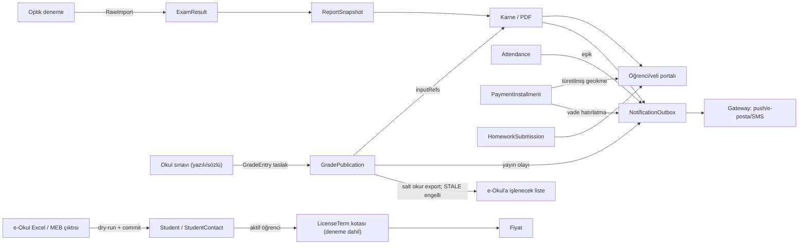

# O-Okul Özel K12 Strateji, Hedef Mimari ve Yol Haritası Planı

**Tarih:** 2026-10-03
**Kaynak:** 2026-10-03 F0–F6 strateji çalışması (pazar araştırması, kod envanteri, mimari denetim); ayrıntılar `docs/ozel-k12-strateji-ekleri.md`
**Baz SHA:** `d9b42f81a` (`origin/main`); plan PR'ı `origin/main` üzerinden açılır, `berrak/g10-karne` dalında yazım yapılmaz
**Belge durumu:** Onaylı plan; kapsam DEC ile değişir, bu doküman kapsam genişletmez
**Kanıt sınıfı:** Kod kanıtları LOCAL_STATIC (repo-göreli `dosya:satır`); hız, satış etkisi ve STAGING/PRODUCTION davranışı ayrıca belirtilmedikçe UNPROVEN

---

## Context

**Neden:** Ürün bugüne kadar dershane ve optik deneme aracı olarak konumlandı. Optik → karne hattı en güçlü alan ve CI/STAGING kanıtlı. Ödeyen müşteri sayısı 0, tüm tenantlar demo. Ekip 1 geliştirici + yapay zekâ ajanları.

Ürün sahibinin "geride kaldım" hipotezi F1 (pazar/rakip) × F2 (kod envanteri) karşılaştırmasıyla ölçüldü. Sonuç: **genişlikte geride, derinlikte önde.**

- **Genişlik:** Özel K12 rakiplerinin masa bahsi kalemlerinde O-Okul eksik ya da kısmi. Okul yazılısı/not defteri yok, ödev teslim modeli yok, push gönderimi uygulanmamış, e-Okul içe aktarma yok, veli erişimi flag ile kısıtlı (bkz. docs/ozel-k12-strateji-ekleri.md §F2.0).
- **Derinlik:** Rakip sayfalarında kaynaklı olarak bulunmayan yetenekler kodda var: yeniden üretilebilir ve STALE kilitli rapor snapshot'ı (`packages/db/prisma/schema.prisma:1563`), farklı soru sayılı denemelerde Başarı % (`apps/worker/src/jobs/report-generation-job.ts:400`), tenant RLS + capability yetkisi + audit/KVKK temizliği (`apps/api/src/privacy/privacy.controller.ts:24`). Rakipte yokluk DOGRULANMADI.

Plan genişlik açığını parite dilimleriyle kapatır, derinliği satışa giriş tezine çevirir, takvimi kesim sırasıyla korur.

## Kullanıcı kararları (onaylı)

1. **Segment:** Birincil segment özel K12 okul. Dershane ikincil. Kurs/özel öğretim kursuna özgü modül yok.
2. **Veli modeli:** GUARDIAN rolü korunur. `StudentContact` iletişim ve rıza kaynağıdır (DEC-20261003-01; main'de, PR #123 merge edildi).
3. **e-Okul:** Yalnız içe aktarma ve "e-Okul'a işlenecek liste". Liste yalnız yayınlanmış `GradePublication` kaydından üretilir. e-Okul'a yazma ve tarayıcı otomasyonu yok.
4. **Okul sınavı ve not defteri (0–3 ay):** Ayrı gradebook bağlamı kurulur. Optik hat ve `ReportSnapshot.examId` dokunulmaz. Yayınlanan satır güncellenmez. Deneme ve yazılı ayrı seri olarak tutulur.
5. **Tez:** "İlk görüşmede kendi verinle sonuç; yayınlanan hiçbir sayı sessizce değişmez." Bu bir özellik hendeği değil, GTM ve uygulama hızı bahsidir.
6. **GTM:** Fiyat TL olarak yayınlanır. Deneme kartsızdır; kısa bir `LicenseTerm` olarak operatör açar. Fiyat rakamı ayrı DEC ile belirlenir, bu dokümanda rakam yok.
7. **Mimari:** EVRİM, dar hibrit. Strangler ile kurulacak üç yüzey: gradebook hattı, NotificationOutbox + VAPID push ve veli overview read model. Yargıcın 8 koşulu bağlayıcıdır.
8. **Ödev teslimi:** Öğretmen durum satırı ve öğrencinin dosyasız "teslim ettim" işareti yapılır. Dosya eki SONRA.
9. **Mayıs 2027 = satış başlangıcı; Eylül 2027 = PRODUCTION go-live** (tanımlar aşağıda).
10. **Kesim sıraları:**
    - H1: e-Okul import → not ekranı sürüm geçmişi
    - H2: ilk karne adım listesi → veli özetinde okul notu → hazır liste
    - H3: push yalnız duyuru → tetikleyici yalnız vade → tek senaryo yük testi
11. **Dış bütçe:** TR içinde S3 uyumlu off-host yedek için küçük bir aylık dış bütçe onaylandı (rakam yok). Bunun dışında dış harcama yok.
12. **Hız:** UNPROVEN. H1 sonunda (2027-01-03) gradebook zinciriyle ölçülür ve plan yeniden çizilir.

## Hedef sonuç

| Kilometre taşı | Tanım | Kanıt sınıfı |
|---|---|---|
| **Mayıs 2027: satış başlangıcı** | Deneme tenant'ı, yayınlanmış fiyat, kimlik/veli modeli, not defteri, e-Okul import ve e-Okul'a işlenecek liste, veli PWA özeti, finans UI | STAGING |
| **Eylül 2027: PRODUCTION go-live** | Production canlıya geçiş + push + otomatik bildirim + ödev teslimi | PRODUCTION |

PDF hattı ölçeklenmesi ve yük testi H3'ün ŞİMDİ kalemleridir ve koşul 8 kesimine açıktır.

## Korunacak sabitler

- **Optik hat:** `ExamResult`, `ReportSnapshot` (`examId` zorunlu), `RawImport` ve karne contract'ı (DEC-20260930-04) değişmez. Sentetik Exam üretilmez.
- **RLS/capability:** Her yeni tablo tenantId, bileşik FK ve `db:rls:check` ile gelir. Yetki capability tabanlı kalır.
- **Snapshot/STALE:** Yayınlanmış sayı yerinde güncellenmez. Düzeltme yeni sürüm olarak yazılır.
- **Kanıt zinciri:** Kanıt betikleri bütünüyle yeniden yazılmaz. `prod:evidence:templates:check` ve `ops:check` her adımda yeşil kalır.
- **AGENTS.md kapı kuralları:** §10.2.
- **Yargıcın 8 koşulu:** §4.2'de tam metin.

## Kanıt sınıfı ve etiket sözlüğü

| Sınıf | Anlamı |
|---|---|
| LOCAL_STATIC | Kod/doküman okundu; çalıştırılmadı |
| LOCAL_TEST | Yerelde test veya betik çalıştırıldı |
| CI | CI koşusunda geçti |
| STAGING | Staging ortamında doğrulandı |
| PRODUCTION | Production'da doğrulandı |
| EXTERNAL_NOT_RUN | Dış sağlayıcı/ortam gerektirir; çalıştırılmadı |
| UNPROVEN | Kanıt yok; varsayım veya hedef |

Pazar iddiaları: KAYNAKLI (sayfa okundu, alan adı/URL verilir, erişim 2026-10-03), DOGRULANMADI (kaynak bulunamadı), VARSAYIM (çıkarım, doğrulama planına bağlı).

## DEC referansları

Yeni taslaklar: Taslak; `docs/DECISIONS.md`'ye ayrı PR ile yazılır. 2026-10-03'te yazılırsa NN 02'den başlar. Numara verildiğinde D1–D9 çapraz referansları birlikte değiştirilir. Özetler Ek A'da, tam metinler bkz. docs/ozel-k12-strateji-ekleri.md §F6.4.

| Karar | DEC ID | Durum |
|---|---|---|
| Veli hesabı korunur; StudentContact iletişim ve rıza kaydı | DEC-20261003-01 | Onaylı (main, PR #123) |
| Kurum, hesap, lisans ve erişim modeli | DEC-20260801-01 | Onaylı; deneme lisans dönemi eki D7 ile |
| V1 ürün kapsam sınırı | DEC-20260613-01 | Onaylı; segment cümlesi D1 ile güncellenecek |
| Başarı yüzdesi rapor ana metriği | DEC-20260713-02 | Onaylı; Başarı % yalnız deneme serisi için (D4 notu) |
| Standart sapmasız LGS–YKS deneme puanı | DEC-20260727-01 | Onaylı; değişmez |
| D1 Hedef segment ve konumlama | DEC-20261003-NN | Taslak |
| D2 Farklılaşma tezi ve GTM | DEC-20261003-NN | Taslak |
| D3 e-Okul sınırı | DEC-20261003-NN | Taslak |
| D4 Okul sınavı ve not defteri modeli | DEC-20261003-NN | Taslak |
| D5 Mimari evrim ve yargıcın 8 koşulu | DEC-20261003-NN | Taslak |
| D6 Kilometre taşları: Mayıs/Eylül 2027 | DEC-20261003-NN | Taslak |
| D7 Kartsız deneme lisansı | DEC-20261003-NN | Taslak |
| D8 Off-host TR yedek için küçük aylık dış bütçe | DEC-20261003-NN | Taslak |
| D9 Ödev teslimi kapsamı | DEC-20261003-NN | Taslak (blokluyor değil) |

---

## 1. Pazar ve karar verici özeti

2026-10-03 web okumasına dayanır; rakip ürünleri denenmedi, erişim tarihi 2026-10-03. Onaylı segment: özel K12 okul birincil, dershane ikincil, kurs için ayrı modül yok.

### 1.1 Karar verici, kullanıcı ve pazar

JTBD tablosu ve kaynaklar: bkz. docs/ozel-k12-strateji-ekleri.md §F1.1.

- **Karar ve ödeme:** kurucu/temsilcisi (VARSAYIM; satın alma onayını kurucunun verdiğini açıkça söyleyen kaynak yok), müdür kısa listeyi yapar (VARSAYIM, bilsa.com.tr), zincirde merkez ofis (UNPROVEN), dershanede sahip (VARSAYIM).
- **Kullanıcılar:** müdür yardımcısı, bilgi işlem, muhasebe, öğretmen, rehber, öğrenci, veli (KAYNAKLI; k12net.com, gelisim.k12.tr, okulaile.com, kurspro.net). Veli yazılımı değil okulu öder.
- **Satın alma:** demo/ücretsiz deneme standart (Kurspro 7 gün kartsız, KursMAX 15 gün kartsız, Delta 15 öğrenciye kadar ücretsiz; KAYNAKLI); okulda kuruma özel teklif (KAYNAKLI, oktasis.com); yaz geçiş penceresi VARSAYIM (karşı kaynak egitimdio.com).

| Pazar rakamı | Etiket | Kaynak |
|---|---|---|
| 2024-25: 14.700 özel okul, 1.539.579 özel öğrenci, oran %9,1 (ortaöğretim %11,6) | KAYNAKLI | meb.gov.tr (haber 38473) |
| 2025-26: 15.094 özel okul, 1.485.021 özel öğrenci | KAYNAKLI | haberturk.com |
| 2026-27 özel okul tavan zam: ara sınıf %30,74, kademe başı %43,92 | KAYNAKLI | hurriyet.com.tr |

### 1.2 Rakip ve masa bahsi özeti

İncelenen 8 rakip: K12 dörtlüsü (K12NET, Bilsa Okulsis, Eyotek, OkulAile) ve kurs tarafında Kurspro, Delta, KursMAX, Sanaliz. Profiller ve mağaza puanları: bkz. docs/ozel-k12-strateji-ekleri.md §F1.2. Sayım yalnız KAYNAKLI iddialarla yapıldı (bkz. docs/ozel-k12-strateji-ekleri.md §F1.3).

- **Masa bahsi (≥5/8):** veli erişimi 8/8, duyuru/anlık bildirim 7/8, ödev 7/8, sınav/ölçme 7/8, devamsızlık 6/8, finans/ön muhasebe 6/8, çok kampüs 6/8, SMS 5/8, ön kayıt 5/8, ders programı 5/8, rehberlik 5/8.
- **Eşik altında, K12 dörtlüsünde standart (VARSAYIM: masa bahsi sayılmalı):** online veli ödemesi, optik okuma, e-fatura, online sınav (4/8); **e-Okul aktarımı 3/8, dörtlüde 3/4.**
- **Farklılaştırıcılar (1–2 rakipte):** kazanıma göre etüt, AI erken uyarı (Bilsa, "%92" firma beyanı), çift yönlü e-Okul (K12NET; yöntem belgesiz), WhatsApp, beyaz etiket; **şeffaf TL fiyat ve kartsız deneme (Kurspro, Delta; K12 dörtlüsünde yok).**
- **Boş alan (hiçbir rakipte kaynaklı değil):** soru sayısı farklı denemeleri Başarı % ile normalize eden konsolide rapor; bütüncül öğrenci profili; velinin KVKK rıza yönetimi; yayından sonra değişmeyen ve yeniden üretilebilen karne; kararlı veli uygulaması (dörtlüden üçünde puan 1,9–3,5; Eyotek 4,7/4,7).
- **e-Okul uyarısı:** MEB'in üçüncü taraflara resmî e-Okul web servisi sunduğuna dair kaynak yok (DOGRULANMADI). MEB Bilgi ve Sistem Güvenliği Yönergesi md. 6/2 ve 9/2-d hesap paylaşımını yasaklıyor (KAYNAKLI, memurlar.net/haber/761812). Onaylı kapsam: yalnız içe aktarma ve e-Okul'a işlenecek liste.

**Açık kalan F1 boşlukları:** ödeyen/karar veren ayrımı doğrulanmadı (5–10 görüşme gerekir); dörtlünün fiyatları için EKAP/bayi denenmedi.

---

## 2. Mevcut durum (kod kanıtıyla)

**Yöntem.** 2026-10-03 F0–F6 strateji çalışmasında 11 modül bulucu ve 1 test/UAT haritası ajanı kodu salt okunur taradı; test koşturulmadı. İkinci bir ajan dosya:satır düzeyinde doğruladı: 166 özellik, 14 modül, 28 akışlık test haritası. Kod okumasının sınıfı **LOCAL_STATIC**'tir. Kanıt `fd01a5c63`'te okundu; bu commit `d9b42f81a`'nın atasıdır ve atıf verilen kod yolları arada değişmedi (LOCAL_STATIC). CI ve STAGING sınıfları yalnız `status.md` ve ilgili kanıt dokümanlarındaki exact-SHA referanslarına dayanır. Güncel SHA için staging rol UAT'ı **UNPROVEN**.

### 2.1 Pazardaki temel beklentilere karşı durum

| F1 beklentisi | O-Okul durumu | Kanıt (LOCAL_STATIC) |
|---|---|---|
| Veli erişimi (8/8) | KISMI. GUARDIAN runtime'ı testli; `product.guardian-read-only` yazma ve daveti kapatıyor. DEC-20260801-01 emekliye ayırıyordu; DEC-20261003-01 (onaylı, main, PR #123) ile GUARDIAN korunur. Birebir mesaj yok | `apps/api/src/guardian/guardian-write-policy.ts:12`, `status.md:169` |
| Duyuru, push (7/8) | Duyuru, okundu ve alıcı raporu VAR (E2E). Push: cihaz kaydı var, gateway gönderimi uygulanmamış; sağlayıcı noop | `infra/notification-gateway/src/index.mjs:51`, `packages/notification-adapter/src/index.ts:81` |
| Ödev (7/8) | KISMI. Sınıf ödevinin API'si var, UI'ı yok; öğrenci başı teslim modeli yok (G1) | `packages/db/prisma/schema.prisma:1241`, `apps/api/src/homework/homework.controller.ts:138` |
| Sınav / ölçme (7/8) | Optik deneme hattı VAR ve en güçlü alan (CI/STAGING). **Yazılı/sözlü not ve manuel sonuç yok (G5)** | `apps/worker/src/jobs/postgres-exam-evaluation-adapter.ts:128` |
| Devamsızlık (6/8) | Günlük yoklama VAR (E2E); eşik uyarısı BACKEND_ONLY, profilde grafik yok (G2) | `apps/api/src/attendance/attendance.service.ts:428` |
| Finans (6/8) | Liste, taksit, tahsilat VAR (E2E). Ödeme planı oluşturma yalnız API'de (G7). Online ödeme/e-fatura kapsam dışı | `apps/api/src/payment/payment.controller.ts:83` |

Diğer satırlar: çok kampüs VAR, konsolide rapor yok; SMS `SMS_ENABLED` ile kapalı (EXTERNAL_NOT_RUN); ders programında öğrenci/veli görünümü yok; ön kayıt YOK, gelişim yazma ekranı yok (G8, `apps/api/src/development/development.controller.ts:41`); e-Okul YOK, genel öğrenci Excel import VAR (`apps/api/src/student/student.controller.ts:246`); PWA manifest var, çevrimdışı yok; açık API yok. Tam tablo: bkz. docs/ozel-k12-strateji-ekleri.md §F2.0.

**Muhasebe (FINANCE_STAFF) P1 adayları (runtime'da doğrulanmadı):** `/me/password`, `/kurum` panosu ve duyuru API'si 403; finans sayfası 403 alabilecek uçları çağırıyor (`apps/api/src/rbac/roles.ts:24`, `apps/web/app/(app)/kurum/finans/finance-page.tsx:713`).

### 2.2 Akışlar, yarım işler ve test altyapısı

Ayrıntı: bkz. docs/ozel-k12-strateji-ekleri.md §F2.2, §F2.3, §F2.4, §F2.5.

- **Uçtan uca:** 54 E2E akış; 11'i CI veya STAGING kanıtlı (7 STAGING, 4 CI), 43'ü LOCAL_STATIC. STAGING etiketleri eski Gate D SHA'larına dayanır.
- **Yarım:** 15 BACKEND_ONLY kalem (ödeme planı oluşturma, sınıf ödevi, gelişim yazma, duyurunun EMAIL/PUSH teslimi vb.), 7 SCREEN_ONLY kalem, flag/env ile kapalı yollar. Feature rollout kataloğunun tüm flag'leri 2026-11-07'de sona eriyor (`apps/api/src/feature-rollout/feature-rollout.service.ts:15`).
- **Kanıt dağılımı (166 özellik):** LOCAL_STATIC 138, CI 17, STAGING 10, UNPROVEN 1, LOCAL_TEST 0, PRODUCTION 0.
- **Son CI/staging:** `fd01a5c63` için tam `pnpm run ci` PASS; staging rol UAT'ı UNPROVEN; `raw-import:smoke` EXTERNAL_NOT_RUN. Notification provider smoke, Sentry/alerting ve off-host/WAL yedek FAIL veya eksik (`status.md:224-226`).

---

## 3. Tez seçimi ve doğrulama planı

On bir tezin ayrıntısı, yargıç puanları ve çürütmeler: bkz. docs/ozel-k12-strateji-ekleri.md §F3.2, §F3.3, §F3.4.

### 3.1 Seçilen tez (onaylı)

Aday üç tezin üçü de düşmanca incelemede "özellik hendeği" olarak çürüdü. Ayakta kalan fark iki katmandır ve bir **GTM ve uygulama hızı bahsidir** (onaylı).

| Katman | İçerik | Dayanak |
|---|---|---|
| Satış ve devreye alma hızı | Müdürün kendi deneme dosyası ilk görüşmede karneye dönüşür; kartsız deneme ve yayınlanmış TL fiyat | `apps/api/src/exam/raw-import.controller.ts:53`, `apps/worker/src/jobs/report-generation-job.ts:610`; fiyat şeffaflığı KAYNAKLI |
| Güven | Yayınlanan hiçbir sayı sessizce değişmez (snapshot, STALE, sürümlü cevap anahtarı, audit); KVKK güvenli veli kanalı | `packages/db/prisma/schema.prisma:1537,1563`; `apps/api/src/audit-log/audit-log.controller.ts:20`. Rakipte yokluk DOGRULANMADI |

**Tez:** "İlk görüşmede kendi verinle sonuç; yayınlanan hiçbir sayı sessizce değişmez." T9'un daraltılmış hâlidir; T4 (sürümlü not yayını), T6 (veli okuma kaydı), T8 (öğrenciye özel devamsızlık bildirimi) ve T10 (kimlik kararı) parçaları aşılandı. Rakiplerin aynı ekranı 6 ayda kopyalayabileceği VARSAYIM'dır; savunma, satış modeli farkına ve snapshot/RLS temeline dayanır.

### 3.2 Çürütmeden gelen zorunlu düzeltmeler

1. Deneme ve yazılı tek Başarı % çizgisinde birleştirilmez; iki ayrı seri, ölçek etiketli (onaylı).
2. Not defteri parite dilimidir; tezin kendi eforu 0,5–1 ay (UNPROVEN).
3. Demo anonim/sentetik dosyayla yapılır; VİS olmadan gerçek veri yüklenmez (temiz sıfırlama kapalı, `packages/db/src/tenant-fresh-reset.ts:26`).
4. Demo vaadinden önce dosya spike'ı; parser yalnız OPTIK_129 ve YANIT'ı tanıyor (`apps/api/src/exam/parser-config-suggestion.service.ts:48`).
5. Flag'ler 2026-11-07'de bitiyor; DEC-20261003-01 verildi, flag'lerin kaderi bu tarihten önce kapatılır.
6. Devamsızlık eşiği kurum ayarına taşınır; kampüs kapsamlı personel için boş dönen öğrenci 360 verisi düzeltilir (`apps/api/src/student-overview/student-overview.service.ts:48-49`).

### 3.3 Parite özeti

Tam parite matrisi, farklılaştırıcı fırsatlar ve "bilinçli olarak yapılmayacaklar" tablosu: bkz. docs/ozel-k12-strateji-ekleri.md §F3.1.

- **P0 parite boşluğu:** okul sınavı/not defteri; e-Okul içe aktarma ve işlenecek liste; veli yazma/davet; veliye push; ödev arayüzü ve teslim; ödeme planı UI ve gecikme.
- **P1:** öğrenciye özel devamsızlık bildirimi, birebir mesaj, öğrenci/veli ders programı, rehberlik ekranı, SMS'in canlı açılması, ön kayıt, veli–öğretmen randevusu, kurulabilir PWA.
- **Bilinçli olarak yapılmayacak:** e-Okul'a yazma/otomasyon, online ödeme/POS, e-fatura, yemekhane/servis/GPS, LMS, kurs-özel modül, native uygulama, açık API, AI erken uyarı. Her birinin yeniden değerlendirme tetikleyicisi ektedir.

### 3.4 Doğrulama planı (30/60/90 gün)

Plan 2026-10-03'te başlar. Dış harcama yok. Eşikler ölçümden önce yazılmış karar kurallarıdır; sonuçlar ölçülene kadar UNPROVEN. Dosya testi ve görüşme satırları F6'da revize edilen P-03 kuralını taşır[^p03].

| Gün | Adım (maliyet) | Başarı eşiği | Başarısızlık ve tepki |
|---|---|---|---|
| 0–7 | **Dosya talebi:** ağa aynı yazılı talep (kimliksiz optik dosya, olmazsa form tipi, okuyucu yazılımı, ilk 3 satır); cevap GÖNDERDİ / SÖZ / RET ve itiraz türüyle kaydedilir; önce minimal anonimleştirme betiği (görüşme zamanı) | İlk sinyal 21. gün | Karar 31–60. gün sayı eşiğiyle |
| 7–21 | **Ön ayar spike'ı:** dosyalar yerel demo tenant'ında OPTIK_129/YANIT ve karantinadan geçer; süre, elle müdahale, "olduğu gibi / yalnız config / kod değişikliği" kaydedilir; LOCAL_TEST (2–4 geliştirici günü; tam KF-10 kiti eşik geçene kadar ertelenir) | Gelen dosyaların en az 2/3'ü kod değişikliği olmadan, yalnız config ile karneye; 30 dk ve ≤2 elle müdahale ayrıca kaydedilir | Yarıdan fazlası parser kodu isterse demo vaadi askıya; parser kapsamı DEC-20260613-01 açık sorusunda |
| 0–30 | **Kimlik kararı** (1–2 geliştirici günü) ve **KVKK demo yolu:** anonimleştirme betiği, VİS şablonu (3–5 geliştirici günü) | DEC-20261003-01 main'de (onaylı); demo kalıcı veri bırakmaz | Anonimleştirme olmazsa sentetik dosya, "kendi dosyan" vaadi kalkar |
| 31–60 | **Görüşmeler:** 6–8 müdür/ölçme sorumlusuna "son denemenizin dosyasını getirin"; en az yarısı ağ dışından; ağ içi/dışı ayrı raporlanır (2–3 hafta) | **Sayı eşiği:** en az 6 tekliften 7 gün içinde en az 3 dosya, en az 1'i ağ dışından | ≤1 dosya ya da ağ dışından 0 = başarısız; gri bölge (tam 2): ağ dışından 3 teklif daha. Başarısızlıkta "kendi dosyan" vaadi çıkar, tez T4/not defteri paritesine döner, kazanılan süre H1 kesim sırasına |
| 31–60 | **Ödeme isteği:** en az 3 kurucuya geçiş/ek modül sorusu; fiyat aralığı kaydedilir, rakam yazılmaz | En az 1 kurucu ücretsiz pilot + dönem sonu ücreti kabul eder | T9 yalnız onboarding aracı olur |
| 61–90 | **Not defteri prototipi:** 2 öğretmen yazılı girer; deneme ve yazılı ayrı seri (1–2 geliştirici haftası) | Sınıf girişi <15 dk, düzeltme ≤2 | Ölçek karışırsa yazılı Başarı % için DEC |
| 61–90 | **İlk pilot taahhüdü** (dış harcama yok) | 1 yazılı pilot niyeti | Mayıs referanssız kalır, T9 cilası durur |

[^p03]: **P-03 revizyonu (F6).** F3'ün ilk taslağındaki yüzde eşikleri küçük örneklemde gürültüydü. Geçerli kural: en az 6 tekliften 7 gün içinde en az 3 dosya, en az 1'i ağ dışından; söz geçmeye sayılmaz, ayrı sütunda tutulur; masa başı ölçütü "gelen dosyaların en az 2/3'ü kod değişikliği olmadan, yalnız config ile karneye"; 30 dk ve ≤2 elle müdahale ayrıca kaydedilir; takvim 0–7 / 7–21 / 31–60. gün; gri bölgede tek uzatma. Bu belgede P-03 ve KF-10 başarı metriği için geçerli tek kural budur.

**Açık riskler:** efor tahminleri ölçülmüş hıza dayanmıyor (UNPROVEN); kurucunun ödeyen kişi olduğu VARSAYIM; dosya ve görüşmelerin kişisel ağdan başlaması getirme oranını iyimser gösterebilir (ağ dışı kotası bu yüzden konuldu).

---

## 4. Hedef mimari (EVRİM, dar hibrit)

Efor aralıkları 1 geliştirici + ajan varsayımına dayanır (UNPROVEN). Ayrıntılı kanıt listeleri ve ER diyagramı: bkz. docs/ozel-k12-strateji-ekleri.md §F4.1, §F4.2.

### 4.1 Karar: EVRİM, dar hibrit izinli (onaylı)

| Seçenek | Maliyet | Risk | Süre | Müşteri etkisi | Kanıt yükü | Toplam |
|---|---|---|---|---|---|---|
| EVRİM | 5 | 4 | 4 | 5 | 4 | **22** |
| HİBRİT | 4 | 4 | 4 | 5 | 3 | 20 |
| YENİDEN_YAZIM | 1 | 1 | 1 | 3 | 1 | 7 |

UYGUN_DEGIL bulgular eksik bileşen (not defteri, push gönderici, off-host yedek, çevrimdışı kabuk) ya da dar hatadır (25'lik batch, sahte "sent", muhasebe 403); yığın değişimi gerekmiyor. Tam yeniden yazım reddedildi: 1459 izlenen dosya, 118 migration, yaklaşık 1 MB kanıt betiği (`scripts/check-prod-evidence-templates.mjs` 9248 satır). Toplam süre 5–7 ay (UNPROVEN); P0 eklemeleri yaklaşık 3–6 hafta ekler.

**Üç strangler yüzeyi.** Eskisi, yenisi aynı kanıt sınıfında yeşil olduktan sonra kaldırılır.

| Yüzey | Yeni bileşen | Neden |
|---|---|---|
| Okul notu sonuç hattı | `apps/api/src/gradebook` + GradeAssessment / GradeEntry / GradePublication | Sonuç modeli optik hatta kilitli (`schema.prisma:1488-1489`, `:1538`) |
| Bildirim teslimi | NotificationOutbox + worker + gateway VAPID web push | 25'ten fazla alıcıda gönderim düşüyor, PUSH koşulsuz başarısız (`infra/notification-gateway/src/index.mjs:3`, `:51`) |
| Veli portalı veri katmanı | Tek overview read model + PWA kabuğu | İstemci yaklaşık 18 istek atıyor; ADR-0007 ile çelişiyor |

Finans yeni yüzey değildir; gecikme okuma anında türetilir (`OVERDUE` bugün elle yazılıp ödeme kaydında `PENDING`'e dönüyor, `apps/api/src/payment/payment.service.ts:356`), durum yazan cron yok. ADR'ler dilimle yazılır; yoklama eşzamanlılığı ayrı DEC'tir.

**"ŞİMDİ" etiketi.** ŞİMDİ = Eylül 2027 PRODUCTION go-live öncesi ufuk; Mayıs/Eylül ayrımı §7.1'deki onaylı tanıma göredir. ŞİMDİ kalemleri 0–3 ay dilimine sığmaz; yol haritası onları H1/H2/H3'e böler.

### 4.2 Yargıcın 8 koşulu

1. DEC-20261003-01, 2026-11-07'den önce uygulanır; iki flag kodla ve aynı PR'da kaldırılır. Yapılmazsa seçim geçersizdir.
2. Yeni tablo ekleyen ilk dilimden önce `check-tenant-reset-catalog.ts` bütün migration'ları tarar (yöntem `check-rls.mjs:8` ile aynı).
3. Optik hatta dokunulmaz: ExamResult, ReportSnapshot (`examId` zorunlu), RawImport ve karne sözleşmesi değişmez; sentetik Exam yok; yayınlanmış satır güncellenmez.
4. Her yeni tablo aynı dilimde `tenantId` + bileşik FK, `db:rls:check`, reset kataloğu, cihaz yedek politikası ve KVKK export'a girer.
5. Strangler: eski yüzey, yenisi aynı kanıt sınıfında (LOCAL_TEST ve CI; varsa STAGING) yeşil olmadan kaldırılmaz; route ve OpenAPI geriye uyumlu kalır.
6. Kanıt betikleri bütünüyle yeniden yazılmaz; yeni modüller manifest'ten okunur.
7. Mayıs 2027 öncesi: 25'lik parçalama, hooks-worker "sent" kaldırma, muhasebe 403, audit partition (2026-12 öncesi), off-host TR yedek + restore tatbikatı.
8. Bir L işi planı 4 haftadan fazla aşarsa kapsam daraltılır; yeniden yazım genişletilmez.

### 4.3 Takvime bağlı iki sabit tarih

2026-11-07: flag kataloğu sona erer (§5.2). 2026-12-01: AuditLog'un son partition'ı 2026_12, bakım bu tarihten önce (`packages/db/prisma/migrations/20260530143000_partition_audit_log_by_created_at/migration.sql:44`).

### 4.4 Tezin mimariye karşılığı

Efor UNPROVEN: e-Okul kolon profili, dry-run ve idempotent commit (ADR-0015; örnek dosyadan sonra) 1–3 hafta; deneme `LicenseTerm`'ü (`schema.prisma:330-349`, `tenant.service.ts:95-96`) 2–5 gün; demo tenant'lar ayrı kalır, deneme tenant'ı boş açılır (kod yok); ilk karne adım listesi (yeni API yok) 2–4 gün; "yayınlanan sayı değişmez" GradePublication sürümlü yayınıyla (ADR-0012) ve listenin yalnız yayından üretilmesiyle (ADR-0015) sağlanır.

### 4.5 Rol ve alan modeli

Rol × modül tablosunun tamamı: bkz. docs/ozel-k12-strateji-ekleri.md §F4.1.

- Yeni tenant rolü eklenmez. Rehber ayrı rol değildir; `TeacherAssignment.role=GUIDANCE_COUNSELOR` (`apps/api/src/school/school-validation.ts:46`).
- Yeni uçlarda `@RequireCapability` kullanılır. Tüketilmeyen `note:write-assigned`, `homework:write-assigned`, `self:read` silinir (`role-capabilities.ts:69-70`); `homework:write-assigned` ADR-0013'te teslim uçlarına bağlanırsa kalır. `ward:read` silinmez, veli kapsamı uçlarına bağlanır (KV-4).

Alan modelinde eklenenler: `StudentContact.guardianId String?` (bileşik FK, ayrı dilim); `HomeworkSubmission` (ek yok); `GradeAssessment`, `GradeEntry`, `GradePublication` (sınav ve not alanı UYGUN_DEGIL → yeni bağlam); `NotificationOutbox` (yeni kod `GuardianStudent.canReceiveSms` okumaz). Kayıt, lisans ve finans modeli değişmez; deneme bir `LicenseTerm` satırı, gecikme `PENDING` ve `dueDate < bugün (Europe/Istanbul)` ile türetilir.

**Değişmez kurallar:** `GradePublication` satırı güncellenmez, düzeltme yeni `version`, eskisine `supersededAt` (desen `apps/worker/src/jobs/postgres-report-generation-adapter.ts:306`); karne snapshot'ı `inputRefs`'te yayın id ve version taşır; e-Okul listesi yalnız supersede edilmemiş yayından üretilir; her yeni tablo koşul 4 kayıtlarına girer (`packages/db/scripts/check-rls.mjs:45`, `packages/db/src/tenant-reset-catalog.ts:3`, `apps/api/src/operations/device-backup-impact.ts:31`, `apps/api/src/operations/tenant-data-export-store.ts:42`).

### 4.6 Modüller arası veri akışı

Akış tablosu, platform yetenekleri, 48 konuluk uygunluk tablosu ve hedef bileşen diyagramı: bkz. docs/ozel-k12-strateji-ekleri.md §F4.1, §F4.2.

### 4.7 ADR başlıkları

ADR-0001..0010 var; 0011..0019 boş. ADR'ler dilimle birlikte yazılır. Bağlam metni: bkz. docs/ozel-k12-strateji-ekleri.md §F4.2.

| ADR | Tür | Özet (efor UNPROVEN) |
|---|---|---|
| ADR-0001, 0002, 0004, 0007, 0008 | Ek / revizyon | Kampüs kapsamı sınıf üzerinden; alt işleyenler veri yerleşimine; WF-01 outbox kapsamı; veli overview ve `me.controller` bölmesi; iki flag'in katalogdan çıkması |
| ADR-0011 | Yeni | Yeni tenant tablosu kontrol listesi (S) |
| ADR-0012 | Yeni | Okul notu ayrı bağlam, sürümlü değişmez yayın (L, 2–6 hf) |
| ADR-0013 | Yeni | Ödev teslimi: ASSIGNED / SUBMITTED / CHECKED / MISSING; öğrenci yalnız ASSIGNED → SUBMITTED, dosyasız (M: 1–2 hf + 2–4 gün) |
| ADR-0014 | Yeni | Veli giriş kimliği, StudentContact rıza kaynağı (M, 3–6 gün) |
| ADR-0015 | Yeni | Import hattı, e-Okul sınırı, işlenecek liste; örnek dosya gelmeden kod yok (M: 1–3 hf + 3–7 gün) |
| ADR-0016 | Yeni | Outbox ve VAPID push; payload PII içermez; 404/410 cihaz pasif (M: 1–2 hf + 1–2 hf) |
| ADR-0017 | Yeni | PWA-önce; yalnız veli overview cache'lenir; native HİÇ |
| ADR-0018 | Yeni | TR içinde S3 uyumlu off-host şifreli yedek + WAL, RPO/RTO, restore tatbikatı (M) |
| ADR-0019 | Yeni | Modül kanıt manifest'i; önce yalnız not defteri (L) |

DEC ile karara bağlanacaklar: yönetici MFA, muhasebe 403, e-Okul formatı, yoklama eşzamanlılığı, gecikme/vade kuralları, deneme `planCode`'u, rehberlik privacy DEC'i.

### 4.8 ŞİMDİ / SONRA / HİÇ

Tablonun tamamı ve gerekçeler: bkz. docs/ozel-k12-strateji-ekleri.md §F4.2. ŞİMDİ'nin anlamı §4.1'dedir.

| Yetenek | Karar | Tetikleyici |
|---|---|---|
| Not defteri ve sürümlü yayın (2–6 hf) | ŞİMDİ | ADR-0011 kontrol listesinden sonra |
| e-Okul import profili; e-Okul'a işlenecek liste (3–7 gün) | ŞİMDİ | Anonim örnek dosya; liste için gradebook yayını ve format |
| Türetilmiş gecikme ve veli finans görünümü (3–8 gün) | ŞİMDİ | Hemen; veli overview ile aynı dilim |
| Kartsız deneme (2–5 gün), ilk karne adım listesi (2–4 gün), PWA kurulabilirliği (1–3 gün) | ŞİMDİ | Fiyat sayfasıyla; e-Okul import'tan sonra; hemen |
| Portal read model; audit partition 2027; OWNER/ADMIN MFA | ŞİMDİ | Karşılandı; 2026-12-01 öncesi; en geç Mayıs 2027 |
| Ödev teslimi: durum satırı + dosyasız "teslim ettim" | ŞİMDİ — Eylül 2027 (H3) | H3, AK-1 sonrası |
| Web push uçtan uca | ŞİMDİ — Eylül 2027 (H3) | VAPID onayı; outbox'tan sonra |
| Vade / gecikme hatırlatması (2–4 gün) | ŞİMDİ — Eylül 2027 (H3) | Outbox ve push canlıya çıktıktan sonra |
| PDF hattı ölçeklenmesi; 50 okul yük testi | ŞİMDİ — Eylül 2027 (H3), koşul 8 kesimine açık | İlk dönem sonu karnesinden önce |
| Ödev dosya eki, self-serve kayıt, TWA, Capacitor, çevrimdışı veli okuma/yoklama, öğretmen/veli MFA, sağlayıcı webhook'ları, read replica, snapshot arşivi, PII'siz AI yardımcıları | SONRA | Ekteki tekil tetikleyiciler |
| Sanal POS, e-fatura, native, çevrimdışı not girişi, çoklu DB/bölge, açık API, LMS, kurs-özel modül, servis GPS, AI erken uyarı/ders programı/soru çözümü (bu faz), e-Okul'a yazma | HİÇ | Strateji değişikliği DEC'i |

---

## 5. Kimlik ve veli modeli

### 5.1 DEC-20261003-01 özeti (onaylı)

Karar main'de (PR #123); tek kaynak `docs/DECISIONS.md`.

1. `GUARDIAN` rolü, hesabı, session'ı ve veli portalı korunur; giriş kuralı DEC-20260801-01'deki gibidir; DEC-20260531-01 yeniden yürürlüğe girer.
2. `StudentContact` SMS ve duyuru rızasının tek kaynağıdır; portal görünürlüğü `GuardianStudent` bayraklarından gelir.
3. StudentContact–Guardian bağı ayrı additive dilimde gelir (`guardianId` nullable, bileşik FK, RLS); bağı yalnız kurum yöneticisi kurar.
4. Öğrenci oluşturma ve import veli hesabı açmaz; davet ayrıca ve toplu tetiklenir.
5. İki flag 2026-11-07'den önce aynı PR'da kodla kaldırılır; `ward:read` veli kapsamı uçlarına bağlanır; kapanış kapısı UAT-GUARDIAN-01/02/03'ün staging'de yeniden koşulmasıdır.

### 5.2 Flag bitişi ve KV-1

`product.guardian-read-only` ve `web.student-registry-v2`, `expiresAt: 2026-11-07` ile fail-closed çalışır (`apps/api/src/feature-rollout/feature-rollout.service.ts:15`, `:42`). Süre dolumuna bırakılırsa veli yazma yolları plansız açılır, StudentContact uçları ve öğrenci overview `FEATURE_ROLLOUT_DISABLED` (403) döner. Bu yüzden KV-1, 2026-11-07'den önce bitmek zorundadır (koşul 1). Kapsam: iki anahtarın tek PR'da silinmesi, `GuardianWritePolicy` ve `assertGuardianInvitationWritable`'ın kaldırılması, registry-v2'nin koşulsuz olması, `provisionAccounts=false`. Kapsam dışı: bağ ve toplu davet (KV-3), `ward:read` ve veli overview (KV-4). Kanıt bugün LOCAL_STATIC.

| İş | Efor (UNPROVEN) | Dış harcama |
|---|---|---|
| KV-1: flag kaldırma, testler, web dalları, doküman | 2–4 geliştirici günü | yok |
| KV-3 içinde: StudentContact–Guardian bağı (şema, migration, RLS, tipler, API, UI) | 3–6 geliştirici günü | yok |

KV-1 optik hatta dokunmaz; yasak yollar `apps/api/src/exam/`, `apps/api/src/report/`, `apps/worker/src/jobs/optical-*`, `exam-evaluation-*`, `packages/db/prisma/migrations/`. Etkilenen dosya listesi: bkz. docs/ozel-k12-strateji-ekleri.md §F4.3.

---

## 6. Riskli varsayımlar ve riskler

Yeni araştırma yapılmadı; sayılar ve eşikler değiştirilmedi. PR #123 merge edildi; DEC-20261003-01 `origin/main` üzerinde `docs/DECISIONS.md:712`'de.

### 6.1 Varsayım kaydı

F4.4'teki 25 varsayım F6'da 38'e genişledi; tamamı ve yargıç toplamları için bkz. docs/ozel-k12-strateji-ekleri.md §F4.4 ve §F6.3. Öne çıkan DOGRULANMADI kalemler: e-Okul kolon formatı, Worker'da Web Push şifrelemesi, iOS PWA push, TR barındırma beyanı, audit'in domain transaction'ında yazılması, deneme süre dolumu davranışı, vade hatırlatmasının rıza dayanağı.

### 6.2 En kritik 5 varsayım ve en ucuz testi

Sıra yargıç toplamına göredir; çürütücü beşinin de özgün eşiğini geçersiz buldu, aşağıdakiler revize testlerdir. Tam test hücreleri: bkz. docs/ozel-k12-strateji-ekleri.md §F6.1.

| Sıra | Varsayım | Test ve maliyet | Geçme / başarısızlık | Başarısızlıkta |
|---|---|---|---|---|
| 1 C-1 (10) | KV-1+PO-1+KV-6 ≤3 geliştirici haftası (UNPROVEN) | Berrak G1–G10 ve PR #101–#108 için kör tahmin vs git süresi (≤1 gün), sonra dilim başı kayıt; son okuma 2026-12-01 | Geçme: medyan ≤1,0, efor ≤3 hf, KV-1 2026-11-07 öncesi. Başarısız: medyan ≥1,5 ya da KV-1 birleşmemiş; 1,0–1,5 gri | H1 kesim sırası; H2 ölçülmüş oranla yeniden takvim; Mayıs kapsamı yeniden onay |
| 2 K-2 (9,6) | Okullar tek standart VİS şablonunu müzakeresiz kabul eder (VARSAYIM) | VİS taslağı (1,5 geliştirici günü); hukukçu okuması **dış harcama var, ONAYSIZ** (OPEN-20261003-01); 5–8 okulda 14 gün takip | Geçme: hukukçu onayı ve ≥3 okul 14 günde değişiklik istemeden imza/yazılı söz; onaysız sonuç UNPROVEN | Önce sentetik deneme, gerçek veri VİS imzasından sonra |
| 3 P-03 (8,48) | "Dosyanı getir" dosyayla sonuçlanır ve dosyalar karneye ulaşır (VARSAYIM) | §3.4 takvimi; 2–4 geliştirici günü | §3.4 sayı eşiği | "Kendi dosyan" vaadi çıkar; tez T4/G5 paritesine döner |
| 4 C-5 (8,16) | H1 dış girdileri zamanında gelir: e-Okul örneği 60. gün, S3 DEC 2026-12-15, fiyat/deneme DEC 2027-01-03 (VARSAYIM) | 0–7. günde 3 okuldan başlık satırı; 14/30/60. gün kontrol; 1–2 geliştirici günü | Geçme: 14. günde ≥1 başlık; 60. günde 2 okuldan kolon seti, 1 satırlı dosya, öğretmen teyidi | KF-7 sentetik fixture veya H2; teyit yoksa KF-8 kodlanmaz; S3 gecikirse PO-2 H2'nin ilk kalemi |
| 5 T-9 (7,8) | 2027 partition uygulanırken `AuditLog_default`'ta 2027 satırı yok (VARSAYIM) | Masa başı + staging salt okunur SQL + grep; 0,75 geliştirici günü | Geçme: 2027 aralığında 0 satır, ileri tarih 0 | Onaylı taşıma mutasyonu; 2026-12-01 öncesi onaylı staging apply |

**F3.5 ile tutarlılık:** P-03 için F3.5'in özgün eşiği bu planda kullanılmaz; §3.4 ve KF-10 aynı sayı eşiğini taşır. K-2'nin hukuk görüşü OPEN-20261003-01'e bağlıdır (§6.4).

### 6.3 Risk matrisi

Olasılık ve etki 1–5 arası yargıdır (VARSAYIM). Uzun azaltma metinleri ve kanıt satırları: bkz. docs/ozel-k12-strateji-ekleri.md §F6.2.

| Risk | O×E | Kısa azaltma | Sahip | Tetikleyici |
|---|---|---|---|---|
| RC-1 Hız F5 max'a yakın | 4×4 | C-1/C-2 ölçümü; 2027-01-03'te yeniden takvim | AK-4 | Erken sinyal >3 hf |
| RP-02 Görüşmeler 60. güne yetişmez | 4×4 | Haftada 2 sabit slot; 5'ten az görüşmeyle fiyat DEC'i yok | KF-10 | 2026-11-15'te planlı <3 |
| RP-01 "Dosyanı getir" kancası tutmaz | 3×5 | Sentetik demo yolu; spike görüşmeden önce | KF-10 | 21. gün spike ya da 60. gün P-03 sayı eşiği tutmaz |
| RP-03 Fiyat/deneme DEC'leri gecikir | 3×5 | Fiyat DEC'i 90. günde, veri yoksa UNPROVEN | KF-9 | 2027-02-01'de fiyat DEC'i yok |
| RK-1 Reşit olmayan gerçek verisi demo/repo'ya girer | 3×5 | Ağsız betik, self-test, k-anonimlik, CI'da TC/telefon taraması | KF-10 | Self-test başarısız |
| RC-5 Tek gözden geçirici darboğazı | 3×5 | Yeni tablo PR'larında zorunlu CI kapıları | AK-2 | >2 açık PR ya da >5 iş günü bekleyen PR |
| RT-1 KV-1 2026-11-07'den önce birleşmez | 2×5 | 2026-11-08 saat testi; 2026-10-24'te PR yoksa diğer H1 dilimleri durur | KV-1 | 2026-10-24'te CI yeşil değil |
| RT-4 Off-host yedek yok | 2×5 | PO-2 H2 2. sıra; ilk deneme tenant'ından önce STAGING restore | PO-2 | KF-5 açılırken restore kanıtı yok |
| RT-5 Dönem sonu PDF timeout/OOM | 3×4 | T-6 spike'ı H2'de; PO-3'ün asenkron toplu iş bölmesi **sıra dışı kesimdir, DEC ile yazılır** | PO-3 | T-6'da timeout/OOM |
| RT-3 Staging 418 kök nedeni bilinmiyor | 3×4 | Yarım günlük salt okunur teşhis | PO-9 | 2 iş gününde kök neden yok |

Diğer O×E ≥12 riskler: RP-06, RK-2, RK-3, RC-3, RC-7, RK-7 (**dış harcama var, ONAYSIZ; OPEN-20261003-01**), RC-2. O×E 12'nin altındakiler: RT-6, RT-7, RT-2 (tetikleyici "2027 aralığında satır >0"), RP-04, RP-05, RP-07, RK-6, RK-5, RK-4, RK-8, RC-4, RC-6.

### 6.4 Hukuk görüşü gerektiren maddeler

Tek seferlik hukuk görüşü için dış harcama **onaysızdır** (OPEN-20261003-01; karar en geç 2027-01-03). D8'in tek dış bütçe istisnası yalnız TR off-host yedektir. Maddeler tek soru listesinde toplanır (RK-7, KF-10):

- **K-1** operasyonel veli bildirimi açık rıza ister mi (DOGRULANMADI; onay yoksa KV-8 açılmaz).
- **K-2** tek standart VİS şablonu savunulabilir mi (VARSAYIM; onay yoksa sonuç UNPROVEN, deneme yalnız sentetik veriyle).
- **K-4** e-Okul Excel'ini yüklemek MEB yönergesini ihlal eder mi (DOGRULANMADI; masa başı okuma + 3 bilgi işlem cevabıyla sınırlı).
- **K-5** 5580 sayılı Kanun yazılım için onay/bildirim ister mi (DOGRULANMADI; mevzuat.gov.tr taraması + 3 müdür).
- **K-6** ve F4.4 #12 alt işleyenler, md.9 yükü ve TR barındırma beyanı (DOGRULANMADI; onay yoksa KF-9'da "verin TR'de" yok).
- **K-8** 91. gün imha ve süresiz AuditLog yasal saklamayla çelişir mi (DOGRULANMADI; sonuç UNPROVEN).
- **F4.4 #24** vade hatırlatmasının rıza dayanağı (DOGRULANMADI; onay yoksa KV-8 açılmaz).

---

## 7. Yol haritası

Kaynak: 2026-10-03 F0–F6 strateji çalışması, F5. 38 aday, 3 bağımsız sıralayıcı ve yargıçla 27 dilime indi; doğrulayıcı her yolu ve komutu kök `package.json` ile kontrol etti. Efor UNPROVEN (paralel ajan kazancı sıfır sayıldı). Dilim başı yollar, kabul kriterleri ve doğrulama komut blokları: bkz. docs/ozel-k12-strateji-ekleri.md §F5.1, §F5.2, §F5.3.

### 7.1 Kapasite gerçeği ve Mayıs/Eylül tanımı (onaylı)

| Ufuk | Satılabilir çıktı | Dilim | Hafta min–max | Kapasite |
|---|---|---|---|---|
| H1 2026-10-03 → 2027-01-03 (12 hf) | Operatör kartsız deneme açar; e-Okul listesi yüklenir (örnek gelirse); öğretmen not girer, yönetici yayınlar, düzeltme yeni sürüm; 25+ alıcılı duyuru düşmez. LOCAL_TEST/STAGING | 11 | 10,8–23 | Yalnız min sığar |
| H2 2027-01-03 → 2027-04-03 (13 hf) | e-Okul listesi, toplu veli daveti, kurulabilir veli PWA'sı ve özet, ödeme planı ve gecikme, 403'süz muhasebe, TR off-host yedek ve restore (STAGING) | 8 | 13–24 | Min 13/13, tampon 0 |
| H3 2027-04-03 → 2027-10-03 (26 hf; Mayıs = 4. hafta) | Mayıs: yayınlanmış TL fiyat (KF-9), OWNER/ADMIN MFA (KV-9; onaylı tanıma ek, §4.8). Eylül: PRODUCTION'da push, otomatik bildirim, ödev teslimi, ölçülmüş PDF hattı, 50 okul kapasitesi | 8 | 17,5–31 | Mayıs öncesine yalnız KF-9 ve KV-9 sığar |

**Karar (onaylı, F5.3 seçenek A).** Mayıs 2027 "satış başlangıcı"dır: deneme tenant'ı, fiyat, kimlik/veli, not defteri, e-Okul import ve liste, veli PWA özeti, finans UI; kanıt STAGING. Eylül 2027 PRODUCTION go-live'dır: production + push + otomatik bildirim + ödev teslimi; PDF hattı ölçeklenmesi ve yük testi koşul 8 kesimine açık H3 ŞİMDİ kalemleridir. Muhasebe 403 ve TR off-host yedek onaylı tanımın dışında ek kalemdir; koşul 7 gereği Mayıs öncesi biter. Satış takvimiyle uyum VARSAYIM: demo Şubat–Mayıs, sözleşme Mayıs–Haziran, geçiş yaz, canlı Eylül.

**Hız ölçümü.** Gradebook zinciri (AK-2+AK-3+AK-4, 4,5–8,5 hf) ilk L iştir; H1 sonunda (2027-01-03) hız bununla ölçülür ve plan yeniden çizilir.

**H1'de istenecek dış onaylar:** örnek e-Okul dosyası ve not liste formatı (KF-7, KF-8); TR S3 (PO-2; küçük aylık dış bütçe onaylı, rakam yok); VAPID secret (KV-7); staging/prod DB mutasyonu ve deploy (PO-1, PO-9, PO-10, PO-4); hooks-worker deploy (KV-6); fiyat DEC'i (KF-9); deneme süresi/limit DEC'i (KF-5).

### 7.2 H1 dilimleri (0–3 ay)

Sıra: KV-1 → PO-1 → KV-6 → AK-1 → KF-10 → PO-9 → AK-2 → AK-3 → KF-5 → AK-4 → KF-7

| Dilim | Amaç / kabul özeti | Metrik | Bağımlılık | Efor | Sat. |
|---|---|---|---|---|---|
| KV-1 Kimlik DEC uygulaması | İki flag kalkar; veli yazma/davet açılır; saat 2026-11-08 testi | 2026-11-07 sonrası FEATURE_ROLLOUT_DISABLED ve GUARDIAN_WRITE_READ_ONLY 0 | DEC-20261003-01 (karşılandı) | 1–2 hf | 4 |
| PO-1 AuditLog 2027 partition + bakım | 12 ay ileri plan; kanıt `artifacts/staging/audit-log-partition.json` | 2026-12-01'de STAGING'de 2027_06'ya kadar partition, DEFAULT 0 | DB mutasyonu onayı | 0,5–1,5 hf | 2 |
| KV-6 25'lik parçalama, `/notification` kalkar | 60 mesaj 25+25+10 | 300 alıcıda sahte "sent" 0 | hooks-worker deploy onayı | 0,5–1 hf | 3 |
| AK-1 Reset kataloğu tüm migration'lar | Eksik reset_boundary hata verir | Yeni tablolar eski migration'a dokunmadan geçer | yok | 0,3–1 hf | 1 |
| KF-10 F3 doğrulama kiti | Anonimleştirme betiği (`scripts/anonymize-sample-file.mjs` (yeni)), protokol, görüşme kaydı | En az 6 tekliften 7 gün içinde en az 3 dosya, en az 1'i ağ dışından; gelen dosyaların en az 2/3'ü kod değişikliği olmadan, yalnız config ile karneye ulaşır (30 dk ve ≤2 elle müdahale ayrıca kaydedilir); söz sayılmaz; 90. gün 1 yazılı pilot niyeti | Anonim dosyalar, hukuk görüşü | 1–2 hf | 3 |
| PO-9 Staging onarımı + rol UAT | `/health` 200; UAT `commitSha` = güncel main | Her rol için güncel SHA'da ≥1 PASS (STAGING) | KV-1, deploy onayı | UAT 1–2 hf, 418 tahminsiz | 3 |
| AK-2 Gradebook veri modeli | Üç tablo RLS + bileşik FK; yayınlanmış satırda UPDATE reddi | Düzeltme sonrası 2 sürüm, yerinde güncelleme 0 | AK-1 | 1–1,5 hf | 2 |
| AK-3 Gradebook API + idempotency (PO-5 dahil) | Atanmamış öğretmen 403; anahtarsız yayın 400 | 30 giriş, yayın, 1 düzeltme hatasız | AK-2 | 2–4 hf | 4 |
| KF-5 Kartsız deneme | Tanımsız planCode 400; TRIAL bitince READ_ONLY; ücretli term ile ACTIVE | Deneme <10 dk açılır | Deneme DEC'i | 1–2 hf | 4 |
| AK-4 Not giriş ve yayın ekranı | `apps/web/app/(app)/{ogretmen,kurum}/not-defteri/` (yeni); sürüm geçmişi v1/v2 | 30 kişilik sınıf <5 dk | AK-3 | 1,5–3 hf | 5 |
| KF-7 e-Okul import profili | `apps/api/src/student/eokul-import-profile.ts` (yeni); aynı dosya iki kez commit'te yeni öğrenci yok; audit'te ham TC yok | Dry-run → commit <15 dk; dosya getirme KF-10 sayı eşiğine bağlı | Anonim örnek, KV-1, KF-10 | 1–3 hf | 5 |

### 7.3 H2 dilimleri (3–6 ay)

Sıra: KF-1 → PO-2 → KF-8 → KV-4 → KV-3 → KF-2 → KV-5 → KF-6 (koşul 7 kapıları başa alındı).

| Dilim | Amaç / kabul özeti | Metrik | Bağımlılık | Efor | Sat. |
|---|---|---|---|---|---|
| KF-1 Muhasebe 403 | Parola değişimi 200, `/kurum/finans` 403'süz | Tahsilat hata ekranı 0 (LOCAL_TEST) | yok | 1–2 hf | 3 |
| PO-2 Off-host TR yedek + restore + veri yerleşimi (PO-8 dahil) | WAL TR hedefe şifreli; restore hash/satır PASS; RPO/RTO yazılı | STAGING kanıtı; RPO ≤15 dk UNPROVEN | TR S3 (onaylı küçük bütçe), secret onayı | 2,5–5 hf | 4 |
| KF-8 e-Okul'a işlenecek liste | Yalnız geçerli GradePublication; supersede 409/400; aynı istek aynı sha256 | Çift giriş süresi azalır (öğretmen beyanı) | AK-3, AK-4, liste formatı | 1–1,5 hf | 5 |
| KV-4 Veli overview + okul notu ayrı seri (AK-5 dahil) | Bağlı olmayan öğrenci 404/403; `canViewFinance=false` iken finans yok | İstek 17'den 1'e | KV-1, AK-3; finans KF-2 sonrası | 3–5 hf | 5 |
| KV-3 guardianId bağı + toplu davet (KV-2 dahil) | Tekrar gönderimde ikinci davet yok; TC/telefon kullanıcı adı olmaz | Kuyruğa geçiş süresi ve kabul oranı | KV-1, AK-1 | 1,5–3 hf | 4 |
| KF-2 Ödeme planı UI + türetilmiş gecikme (KF-3 dahil) | `kurum/finans/finance-page.tsx`, `payment-plan-form.tsx (yeni)`; aynı anahtarla ikinci plan yok | 9 taksitli plan <2 dk | KF-1 | 2–4 hf | 4 |
| KV-5 PWA kurulabilirlik | Kurulabilirlik ölçütleri; 375px'te 5 öğe taşmaz | Kurulum / davet kabul oranı | KV-4 | 1–2 hf | 4 |
| KF-6 İlk karne adım listesi | Boş tenantta 4 adım | 7 günde karne üreten deneme okulu ≥%50 (UNPROVEN) | KF-5, KF-7 | 1–1,5 hf | 4 |

### 7.4 H3 dilimleri (6–12 ay)

Sıra: KF-9 → KV-9 (Mayıs öncesi, ~3,5–6 hf) → KV-7 → PO-10 → AK-6 → KV-8 → PO-3 → PO-4. KF-9 ve KV-9 satış başlangıcına, kalanı Eylül 2027 go-live'ına yazılır (onaylı).

| Dilim | Amaç / kabul özeti | Metrik | Bağımlılık | Efor | Sat. |
|---|---|---|---|---|---|
| KF-9 Fiyat sayfası ve landing | `apps/web/app/fiyatlar/` (yeni); her iddia DEC/UAT bağlı; "e-Okul entegrasyonu" yok | "Fiyat belli değil" itirazı 0 | Fiyat DEC'i, KF-5 | 1,5–3 hf | 4 |
| KV-9 OWNER/ADMIN TOTP MFA | Ayrı kanıt yolu `tenant-admin-mfa:check` (yeni) | MFA etkin oranı | yok | 2–3 hf | 3 |
| KV-7 Outbox + VAPID push | İki worker aynı satırı bir kez gönderir; 410'da cihaz pasif | Delivered/failed/uncertain oranları | KV-6, KV-5, AK-1, VAPID | 3–4 hf (L) | 5 |
| PO-10 Prod go-live kanıt zinciri (PO-7 dahil) | `go-live:check`, `prod:evidence:summary:check` PRODUCTION PASS | Açık P0 kanıt 0 | PO-1, PO-2, PO-9, KV-9; deploy onayı | 3–6 hf | 5 |
| AK-6 Ödev teslimi | Öğrenci başkasının satırını değiştiremez; CHECKED'de 409; dosyasız | Teslim oranı | AK-1 | 1,5–3 hf | 4 |
| KV-8 Tetikleyiciler: vade, devamsızlık, not yayını (KF-4, AK-7 dahil) | Rıza yoksa satır yok; job iki kez koşsa yeni satır yok | Gecikmiş taksit oranı öncesi/sonrası | KV-7, AK-3, KF-2, AK-1 | 3–5 hf | 4 |
| PO-3 PDF/karne ölçeklenmesi | N iş için 1 launch; PDF Redis'te taşınmaz | 1500 öğrenci süresi, p95 | yok | 2–4 hf | 4 |
| PO-4 50 okul k6 yük testi | `http_req_failed` < %1; sonuç tarih ve SHA ile | Not girişi p95 < 1 sn (UNPROVEN) | PO-3, AK-3, staging DB onayı | 1,5–3 hf | 3 |

### 7.5 Düşürülen ve birleştirilen dilimler

Birleşenler: PO-5 → AK-3; KV-2 → KV-3; AK-5 → KV-4; KF-3 → KF-2; KF-4, AK-7 → KV-8; PO-8 → PO-2; PO-7 → PO-10. Düşenler: PO-6 (kanıt yönetimi darboğaz olursa açılır), AK-8 (yoklama PUT p95 sorun gösterirse), AK-9 (çok kampüslü pilot çıkarsa). Gerekçeler: bkz. docs/ozel-k12-strateji-ekleri.md §F5.4.

---

## 8. Kesim sıraları

Kesim sıraları onaylıdır. Ufuk kapasiteyi aşarsa kalemler bu sırayla kesilir veya sonraki ufka kayar. Onaylı sıra otomatik işler; sıra dışı her kesim DEC ister.

| Ufuk | Onaylı kesim sırası |
|---|---|
| H1 | e-Okul import (KF-7) → not ekranı sürüm geçmişi (AK-4) |
| H2 | İlk karne adım listesi (KF-6) → veli özetinde okul notu (KV-4'ün okul notu kısmı) → hazır liste (KF-8) |
| H3 (koşul 8) | Push yalnız duyuru (KV-7) → tetikleyici yalnız vade (KV-8) → tek senaryo yük testi (PO-4) |

**Not (onaylı sıraya ek değildir; sıra dışı kesim DEC ister):**
- KF-7 örnek dosya gelmezse kod yazılmaz; bu kayma onaylı H1 sırasının 1. kalemidir. PO-9 onarımının 1–2 haftayı aşması hâlinde PO-9'un kaydırılması sıra dışı kesimdir.
- KV-1, PO-1, KV-6 ve KF-10 kaydırılmaz; KF-1 ve PO-2 koşul 7 gereği kesilmez.
- KF-8 onaylı H2 sırasının 3. kalemidir; "yalnız format doğrulanmadıysa" gibi ek koşul uygulanmaz.
- PO-3 ve PO-4 H3 ŞİMDİ kalemleridir. PO-3'ün asenkron toplu işinin ayrı dilime bölünmesi sıra dışı kesimdir, DEC ile yazılır (RT-5).

**4 hafta kayma kuralı (koşul 8)**

| L iş | 4 haftayı aşarsa |
|---|---|
| Gradebook zinciri AK-2+AK-3+AK-4 (4,5–8,5 hf) | Onaylı H1 sırasıyla AK-4'ün sürüm geçmişi görünümü daralır |
| KV-7 | Onaylı H3 sırasıyla yalnız duyuru push'una daralır |
| PO-3 | Asenkron toplu işin ayrı dilime bölünmesi sıra dışı kesimdir, DEC ile yazılır (RT-5) |
| PO-10 | Kapsam daralır; daralma DEC ve ürün sahibi onayıyla |

---

## 9. Kapasite ve tarih riskleri

### 9.1 Kapasite yalnız min senaryoda sığıyor (UNPROVEN)

| Ufuk | Min toplam | Max toplam |
|---|---|---|
| H1 | 10,8/12 hf | 23/12 hf |
| H2 | 13/13 hf (tampon 0) | 24/13 hf |
| H3 | 17,5/26 hf | 31/26 hf |

2026-10-03 ile 2027-05-01 arası yaklaşık 30 hafta; H1+H2 min 23,8, max 47 hafta. Mayıs'ta gerçekçi çıktı H1+H2 kapsamının STAGING/LOCAL_TEST kanıtlı demosudur. Staging 418 onarımı tahmin edilmedi; 1–2 haftayı aşarsa H1 min toplamı 12 haftayı geçer. Dış harcama yalnız PO-2'nin TR S3 depolaması (onaylı).

### 9.2 Tutmayan tarihler

PO-10 (2027-04-30), PO-3 (2027-03-31) ve PO-4 (2027-04-15) bu sıralamada tutmuyor. Mayıs = satış başlangıcı, Eylül 2027 = PRODUCTION go-live onaylı olduğundan bu üç tarih geçersizdir. Yeni son tarihler H1 sonu yeniden planlamasında (2027-01-03) Eylül go-live'ından önce kalacak biçimde yazılır ve DEC-20261003-NN (D6; taslak, docs/DECISIONS.md'ye ayrı PR ile) kaydına bağlanır. Bu dokümanda yeni tarih verilmez. PO-2 (2027-04-30) ve KF-1 (Mayıs öncesi) değişmez.

Koşul 7 ihlali düzeltildi: PO-2 H2 6. sıradan 2. sıraya (max bitiş ~2027-05-24 → ~2027-02-21), KF-1 4. sıradan 1. sıraya.

| H1 sabit tarihi | Max bitiş | Son tarih |
|---|---|---|
| KV-1 | ~2026-10-17 | 2026-11-07 |
| PO-1 | ~2026-10-27 | 2026-12-01 |
| KV-6 | ~2026-11-03 | 2026-12-01 |
| KF-10 | ~2026-11-24 | 2026-12-01 (1 hafta tampon) |

### 9.3 Yazar çakışması

Paylaşılan dosyalar sıralı yürür: `schema.prisma`, reset kataloğu, yedek ve export listeleri AK-2 → KV-3 → KV-7 → AK-6 → KV-8; `apps/api/src/gradebook/` AK-3 → KF-8 → KV-4 (okuma) → KV-8 (tek çağrı); `app-shell.tsx` AK-4 → KF-1; `students-page.tsx` KV-1 → KF-7 → KV-3; `docker-compose.yml` PO-2 → PO-3 → PO-4.

### 9.4 F3 doğrulama planıyla eşleme

| F3 adımı | Tarih | Çakışan dilim | Not |
|---|---|---|---|
| Dosya talebi 0–7 / ön ayar spike'ı 7–21. gün | İlk sinyal 21. gün (2026-10-24) | KF-10, mevcut optik hat | Spike mevcut optik import ile elle protokol; tam KF-10 kiti eşik geçene kadar ertelenir |
| 6–8 müdür görüşmesi ("dosyanı getir") | 31–60. gün (→ 2026-12-02) | KF-10 şablonu, KV-1, PO-9 | Not defteri henüz yok; demo optik karne, veli ve duyuru üzerinden |
| Ödeme isteği sorusu (3 kurucu) | 31–60. gün | KF-10 soru seti | Fiyat DEC'i bu cevaplara dayanır |
| G5 prototipi (not defteri) | 61–90. gün | AK-2 → AK-3 → AK-4 | Min eforla AK-4 ~2026-12-11'de biter; max'ta 90. günü kaçırır, prototip API ve LOCAL_TEST demosu olur |
| İlk pilot niyeti | 90. gün (2027-01-01) | KF-5, KF-7 | Kabul eden okul 48 saatte deneme tenant'ına alınır |

---

## 10. İlerleme kaydı ve sahiplik kuralları

### 10.1 İlerleme tablosu

Planın tek ilerleme kaydıdır; her dilim kapanışında bir satır eklenir. Kanıt sınıfları tek tek yazılır; LOCAL_TEST, CI ve STAGING aynı hücrede birleştirilmez. "Kapandı" yalnız kabul kriterinin istediği kanıt sınıfı üretildiğinde yazılır.

| Tarih | Dilim | Kanıt sınıfı | SHA/PR | Not |
| --- | --- | --- | --- | --- |
| 2026-10-03 | DEC-20261003-01 | main (PR #123 merge) | d9b42f81 | veli hesabı korunur |

Tarih ISO kapanış günüdür; SHA/PR merge SHA'sının ilk 8 karakteri ve PR numarasıdır; çalıştırılmayan kontrol EXTERNAL_NOT_RUN yazılır ve PASS sayılmaz; Not tek cümledir (plan/gerçek farkı geliştirici günü olarak ve uygulanan kesim).

### 10.2 Sahiplik kuralları

Kurallar `AGENTS.md` "Subagent Orchestration" bölümünden gelir; bu plan onları değiştirmez: kapı başına tek yazma yetkili katılımcı; en fazla üç alt ajan, derinlik 1; her kapıdan önce hedef, sahip olunan ve yasak yollar, kabul ve doğrulama komutları yazılır, kapı bitince rapor verilir ve durulur; kanıt sınıfları ayrı raporlanır; deploy, sağlayıcı eylemi, secret/config (D8 `BACKUP_OFFSITE_TARGET` dahil), DB/veri mutasyonu ve mutasyonlu smoke açık ürün sahibi onayı ister; ilgisiz değişiklikler geri alınmaz ve commit edilmez. Her dilim kapanışında §10.1 ve `status.md` "## Açık İşler" aynı PR'da güncellenir; tablo 2 haftadan uzun güncellenmezse RC-7 tetiklenir. Onaylı kesim sırası otomatik işler, sıra dışı kesim DEC olarak yazılır.

### 10.3 H1 kontrol noktaları

- **H1 ortası, 6. hafta sonu (2026-11-14 civarı):** plan/gerçek süre, KV-1'in 2026-11-07'ye yetişmesi, AK-1 → AK-2 ilerlemesi. Eşik aşılırsa onaylı H1 kesim sırası işler; KV-1, PO-1, KV-6, KF-10 kaydırılmaz.
- **H1 sonu, 2027-01-03:** gradebook zincirinin gerçek süresi ve F3 60./90. gün sonuçları. Plan ölçülmüş hızla yeniden çizilir; değişen kilometre taşı DEC ile yazılır.

---

## Ek A. DEC taslakları (özet)

Dokuz kayıt 2026-10-03 F0–F6 strateji çalışmasında hazırlandı; hiçbiri henüz `docs/DECISIONS.md`'de değildir. Tam metinler (`docs/DECISIONS.md` satır 6-12 biçimi: Durum, Karar, Kaynak, Kanıt, Etkilenen ADR, Açık soru, Son kontrol): bkz. docs/ozel-k12-strateji-ekleri.md §F6.4. Çelişkide bu özet ve onaylı kararlar geçerlidir. Bütün kayıtların Kaynak satırı: ürün sahibi kararı (2026-10-03 F0–F6 strateji çalışması). ID'ler yer tutucudur: Taslak; docs/DECISIONS.md'ye ayrı PR ile; aynı gün yazılırsa D1 → 02 … D9 → 10. `docs/DECISIONS.md`'de "Durum: Taslak" kullanan kayıt yoktur; kayıtlar ya "Onaylı" ile yazılır ya da D9 gibi "Faz Öncesi Onay Gerektirenler" tablosuna OPEN satırı olarak girer (seçim ayrı PR'da).

| D | Başlık | Karar özeti | Açık soru |
|---|---|---|---|
| D1 | Hedef segment özel K12; konum bütüncül öğrenci takibi | Özel K12 birincil, dershane ikincil, optik hat korunur, kurs-özel modül yok; DEC-20260613-01'in yalnız hedef cümlesinin yerine geçer; "e-Okul entegrasyonu" denmez | F3 eşikleri tutmazsa segment önceliği yeniden değerlendirilir; landing metni KF-9'da onaylanır |
| D2 | Farklılaşma tezi ve GTM | Tez cümlesi; özellik hendeği değil; TL fiyat yayınlanır (aktif öğrenci kotası); deneme kartsız, operatör açar (D7); fiyat rakamı ayrı DEC | "Kendi dosyan" vaadi masa başı spike (7–21. gün) ve P-03 sayı eşiği geçmeden landing'e girmez |
| D3 | e-Okul sınırı | Yalnız dosya düzeyinde import (`nationalIdHash`, sha256 audit, veli hesabı açmaz) ve yalnız geçerli `GradePublication`'dan liste; yazma, şifre, RPA yok | Örnek dosya gelmeden KF-7/KF-8 kodlanmaz |
| D4 | Okul notu ayrı gradebook bağlamı | Üç tablo additive; optik hat değişmez; yayınlanan satır güncellenmez, düzeltme yeni `version`; deneme ve yazılı ayrı seri; Başarı % yalnız deneme | Not ölçeği ve ağırlıklar UNPROVEN; audit transaction'ı DOGRULANMADI |
| D5 | Mimari evrim ve 8 koşul | Evrim; yalnız üç strangler yüzeyi, liste genişletilmez; §4.2 koşulları | Worker'da Web Push şifrelemesi DOGRULANMADI |
| D6 | Mayıs 2027 satış başlangıcı, Eylül 2027 go-live | §7.1 onaylı tanım; onaylı kesim sıraları; PDF hattı ve yük testi koşul 8 kesimine açık H3 kalemi; hız H1 sonunda ölçülür | PO-3/PO-4/PO-10 tarihleri Eylül'e göre yeniden yazılır |
| D7 | Kartsız deneme lisansı | Kısa `LicenseTerm`, yalnız SYSTEM_ADMIN açar; `planCode` kapalı küme; rakam KF-5 ekinde | Süre dolumunda READ_ONLY/FROZEN döngüsü mü, denemeye özgü saklama mı |
| D8 | Off-host TR yedek için küçük aylık bütçe | TR içinde S3 uyumlu, şifreli base backup + WAL; tek dış bütçe istisnası; tutar PO-2'de; restore en geç 2027-04-30 STAGING | Sağlayıcı ve `BACKUP_OFFSITE_TARGET` onayı; TR beyanı hukuk görüşüne kalır |
| D9 | Ödev teslimi kapsamı | `HomeworkSubmission` durum satırı; öğrenci yalnız dosyasız ASSIGNED → SUBMITTED; dosya eki SONRA, ayrı DEC | Geç teslim durumu pilot geri bildirimine kalır |

### Ek A.1 Mevcut DEC'lerde Durum güncellemeleri

Karar metinleri değişmez; yalnız Durum ve Son kontrol satırları güncellenir.

| DEC | Değişiklik | Ne zaman |
| --- | --- | --- |
| DEC-20260613-01 | "Onaylı; hedef segment cümlesi DEC-20261003-NN (D1) ile güncellendi; optik, rapor/karne, ödeme takibi ve fatura dışlaması geçerli" | D1 ile aynı PR |
| DEC-20260713-02 | "...Başarı % tanımı yalnız deneme (optik) serisi içindir, okul notu DEC-20261003-NN (D4) ile ayrı seridir" | D4 ile aynı PR |
| DEC-20260801-01 | Sona "; deneme lisans dönemi DEC-20261003-NN (D7) ile tanımlanır" eklenir | D7 ile aynı PR |
| DEC-20260531-01, DEC-20260627-01, DEC-20260823-01, DEC-20260930-04 | Değişiklik yok (main'de güncel; D4/D5/D8/D9 bunlarla uyumlu) | — |

Her DEC PR'ından sonra `pnpm ops:check` ve `pnpm prod:plan:check` çalıştırılır.

---

## Ek B. Güncellenecek mevcut dokümanlar

DEC-20261003-01 main'dedir (PR #123, d9b42f81). Güncellemeler origin/main üzerinden açılan PR'larda yapılır.

### Ek B.1 Doküman güncellemeleri

- `docs/marketing-claims.md` "## Ana Mesaj": segment metni özel K12 birincil (D1 sonrası); GUARDIAN cümlesi DEC-20261003-01 ile uyumlu (KV-1); deneme/fiyat CTA yalnız STAGING kanıtıyla (KF-5, KF-9).
- `docs/product-journeys-v1.md` "## Kapsam Karari": hedef kurum tipi, not defteri ve e-Okul döngüsü, kapsam dışına "e-Okul'a yazma" ve "kurs-özel modül", veli hedef persona; yeni UAT ID'leri checker ve template ile (D1 sonrası; AK-2/AK-4; KF-7/KF-8).
- `status.md` "## Açık İşler": sıralama bu plana taşınır, H1 dilimleri kanıt sınıfıyla, hız UNPROVEN notu; zorunlu başlıklar korunur (plan PR'ı, sonra her dilim kapanışı).
- `docs/llm-wiki/README.md`: §2 segment, §4 GUARDIAN/StudentContact, §11 okuma listesine bu plan (okuma listesi plan PR'ında; diğerleri D1 ve KV-1 ile).
- `docs/DECISIONS.md`: D1–D9 ve Ek A.1 (D1, D2, D5, D6 plan PR'ında; D3 KF-7, D4 AK-2, D7 KF-5, D8 H1, D9 AK-6 öncesi).
- `docs/account-management-architecture-plan.md`: veli kaldırma maddelerine DEC-20261003-01 supersede notu; §6 sıralamasının bu plana devri (plan PR'ı).

### Ek B.2 Dokümanlara dokunan kontroller

`pnpm prod:plan:check`, `pnpm product-journeys:check`, `pnpm ops:check` ve `scripts/check-pii-contact-policy.mjs` yeni plan dosyasını okumaz, ama `status.md`, `docs/DECISIONS.md`, `docs/product-journeys-v1.md` ve `docs/llm-wiki/README.md` içinde aradıkları zorunlu ifadeler DEC ve doküman güncellemelerinde silinmez; yeni UAT ID'si `scripts/check-uat-evidence.mjs` ve `docs/evidence-templates/uat.example.json` ile birlikte eklenir. Yeni `docs/*.md` CI'ı tetiklemez ve markdown link kontrolü yoktur; kırık linkler ve ek dosyadaki `§F` başlıkları elle (grep) kontrol edilir. Ayrıntı: bkz. docs/ozel-k12-strateji-ekleri.md §F6.4.